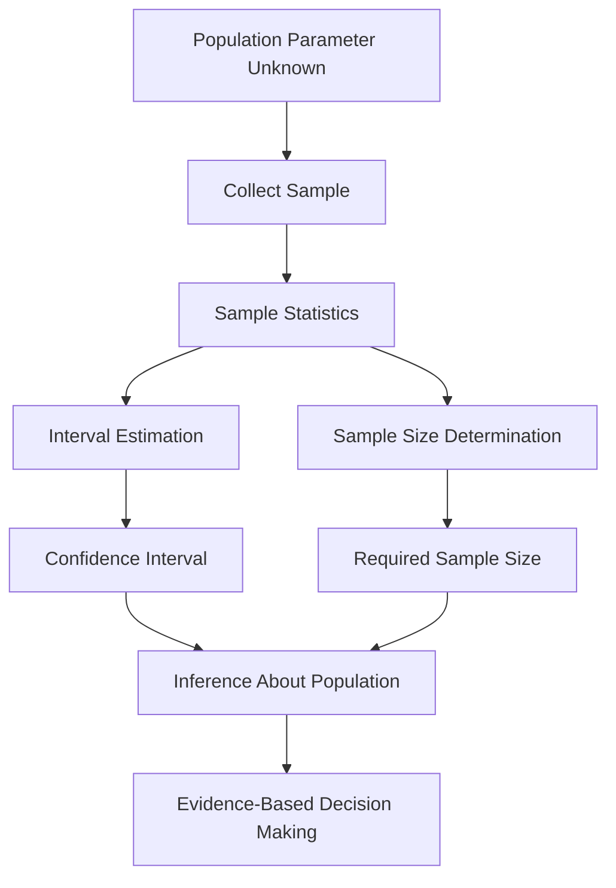

# Lesson 1: Estimation and Sample Size Determination

## Overview

One of the primary objectives of statistical inference is to estimate unknown population parameters using information obtained from a sample. Since population parameters are usually unknown, statisticians use sample statistics to make informed estimates while explicitly accounting for uncertainty.

Estimation techniques provide a systematic framework for approximating unknown quantities such as population means, proportions, and variances. Among these techniques, interval estimation plays a central role by providing a range of plausible values for a parameter rather than a single estimate.

Another critical aspect of inferential statistics is determining an appropriate sample size. Selecting too small a sample may lead to unreliable conclusions, while excessively large samples can increase cost, time, and resource requirements unnecessarily.

This lesson introduces interval estimation for population means and explores the principles involved in determining adequate sample sizes for statistical studies.

## Learning Objectives

After completing this lesson, you should be able to:

- Explain the concept of statistical estimation.
- Distinguish between point estimates and interval estimates.
- Construct and interpret confidence intervals for population means.
- Understand the relationship between confidence level, margin of error, and interval width.
- Determine appropriate sample sizes for statistical investigations.
- Explain factors that influence required sample size.
- Interpret confidence intervals in practical contexts.

## Topics Covered

### 1. [Interval Estimation of the Mean](3.1.%20Interval%20Estimation%20of%20the%20Mean.md)

Interval estimation provides a range of values that is likely to contain an unknown population parameter.

Unlike point estimation, which produces a single estimate, interval estimation explicitly quantifies uncertainty.

A confidence interval for the population mean is generally expressed as:

$$
\text{Point Estimate} \pm \text{Margin of Error}
$$

or

$$
\bar{x} \pm z_{\alpha/2}\frac{\sigma}{\sqrt{n}}
$$

when the population standard deviation is known.

When the population standard deviation is unknown, the Student's t-distribution is commonly used:

$$
\bar{x} \pm t_{\alpha/2,n-1}\frac{s}{\sqrt{n}}
$$

Important concepts include:

- Point Estimate
- Confidence Interval
- Confidence Level
- Margin of Error
- Critical Value
- Standard Error

Common confidence levels include:

- 90%
- 95%
- 99%

Confidence intervals provide a practical measure of estimation uncertainty and are widely used in scientific research, business analytics, healthcare, and public policy.

### 2. [Determining Sample Sizes](3.2.%20Determining%20Sample%20Size.md)

Determining an appropriate sample size is a crucial component of statistical study design.

Sample size directly influences:

- Estimation precision
- Statistical power
- Reliability of conclusions
- Cost of data collection

The required sample size for estimating a population mean is commonly determined using:

$$
n = \left(\frac{z_{\alpha/2}\sigma}{E}\right)^2
$$

where:

- \(n\) = required sample size
- \(z_{\alpha/2}\) = critical value
- \(\sigma\) = population standard deviation
- \(E\) = desired margin of error

Factors influencing sample size include:

#### Confidence Level

Higher confidence levels require larger samples.

#### Margin of Error

Smaller margins of error require larger sample sizes.

#### Population Variability

Greater variability increases required sample size.

#### Resource Constraints

Time, budget, and operational limitations may restrict sample size.

Proper sample size determination ensures that statistical studies achieve the desired level of precision while efficiently utilizing available resources.

## Conceptual Relationship

## Lesson Navigation

| Resource | Description |
|-----------|-------------|
| 📄 [Interval Estimation of the Mean](3.1.%20Interval%20Estimation%20of%20the%20Mean.md) | Construction and interpretation of confidence intervals for population means |
| 📄 [Determining Sample Sizes](3.2.%20Determining%20Sample%20Size.md) | Principles and formulas used to determine appropriate sample sizes |

## Real-World Applications

| Domain | Application |
|---------|-------------|
| Healthcare | Estimating average treatment effectiveness |
| Manufacturing | Estimating average product quality characteristics |
| Market Research | Determining survey sample sizes |
| Finance | Estimating average investment returns |
| Public Policy | Estimating population opinions from survey samples |
| Data Science | Designing experiments and collecting representative datasets |

## Key Takeaways

- Estimation allows statisticians to infer unknown population parameters using sample data.
- Confidence intervals provide ranges of plausible values rather than single estimates.
- Confidence intervals explicitly quantify estimation uncertainty.
- Sample size significantly affects precision and reliability.
- Larger samples generally produce narrower confidence intervals.
- Higher confidence levels and smaller margins of error require larger sample sizes.
- Proper sample size determination balances statistical precision with practical constraints.

## Prerequisites for Future Topics

The concepts introduced in this lesson provide the foundation for:

- Hypothesis Testing
- Statistical Decision Making
- Experimental Design
- Analysis of Variance (ANOVA)
- Regression Analysis
- Bayesian Inference
- Machine Learning Evaluation
- Advanced Statistical Modeling
