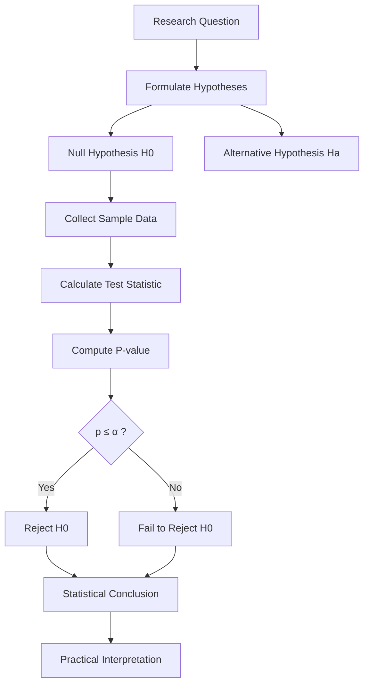

# Lesson 2: Hypothesis Testing, Errors, and Statistical Significance

## Overview

Statistical inference not only involves estimating unknown population parameters but also making decisions regarding claims, assumptions, and research questions based on sample evidence. Hypothesis testing provides a systematic framework for evaluating competing claims about population parameters.

Every statistical decision involves uncertainty. Since conclusions are drawn from samples rather than complete populations, there is always a possibility of making incorrect decisions. Understanding statistical errors, p-values, significance levels, and the hypothesis testing framework is therefore essential for sound statistical reasoning.

This lesson introduces the fundamental concepts underlying hypothesis testing, explains the different types of inferential errors, and describes how statistical evidence is evaluated using p-values and significance levels.

Mastering these concepts is crucial because hypothesis testing forms the foundation of scientific experimentation, business analytics, healthcare research, machine learning evaluation, and evidence-based decision making.

## Learning Objectives

After completing this lesson, you should be able to:

- Define statistical hypotheses and explain their purpose.
- Formulate null and alternative hypotheses.
- Understand the complete hypothesis testing framework.
- Explain Type I and Type II errors.
- Interpret p-values correctly.
- Understand statistical significance and significance levels.
- Make inferential decisions based on statistical evidence.
- Critically evaluate hypothesis testing results.

## Topics Covered

### 1. [Errors, P-Values, and Significance](3.3.%20Errors%2C%20P-values%2C%20and%20Significance.md)

Statistical decisions are made under uncertainty, making errors inevitable in hypothesis testing.

This topic introduces the major sources of inferential error and explains how statistical evidence is quantified.

#### Type I Error

A Type I error occurs when the null hypothesis is rejected even though it is actually true.

$$
\text{Type I Error} = P(\text{Reject } H_0 \mid H_0 \text{ is true})
$$

This error is often called a **false positive**.

Example:

Concluding that a new drug is effective when it is not.

The probability of committing a Type I error is denoted by:

$$
\alpha
$$

and is commonly set to:

- 0.05
- 0.01
- 0.10

#### Type II Error

A Type II error occurs when the null hypothesis is not rejected even though it is false.

$$
\text{Type II Error} = P(\text{Fail to Reject } H_0 \mid H_0 \text{ is false})
$$

This error is often called a **false negative**.

Example:

Concluding that a treatment has no effect when it actually does.

The probability of committing a Type II error is denoted by:

$$
\beta
$$

#### Statistical Power

Statistical power measures the probability of correctly rejecting a false null hypothesis.

$$
\text{Power} = 1 - \beta
$$

Higher statistical power increases the likelihood of detecting real effects.

#### P-Value

The p-value quantifies the strength of evidence against the null hypothesis.

Formally, it represents:

> The probability of observing results at least as extreme as those obtained, assuming the null hypothesis is true.

Interpretation:

- Small p-values indicate strong evidence against \(H_0\).
- Large p-values indicate insufficient evidence against \(H_0\).

Common decision rule:

$$
\text{If } p \leq \alpha,\ \text{reject } H_0
$$

#### Statistical Significance

A result is considered statistically significant when the observed evidence is sufficiently inconsistent with the null hypothesis.

Statistical significance does not necessarily imply:

- Practical significance
- Clinical significance
- Business significance

Careful interpretation is therefore essential.

### 2. [The Hypothesis Testing Framework](3.4.%20The%20Hypothesis%20Testing%20Framework.md)

Hypothesis testing provides a structured procedure for evaluating claims about population parameters.

The general framework consists of the following steps:

#### Step 1: State the Hypotheses

Define:

- Null Hypothesis (\(H_0\))
- Alternative Hypothesis (\(H_a\))

Example:

$$
H_0: \mu = 50
$$

$$
H_a: \mu \neq 50
$$

#### Step 2: Select the Significance Level

Choose the probability of committing a Type I error.

Typical choices include:

$$
\alpha = 0.05
$$

or

$$
\alpha = 0.01
$$

#### Step 3: Select an Appropriate Test Statistic

Common test statistics include:

- Z-test
- t-test
- Chi-Square Test
- F-test

Selection depends on:

- Sample size
- Data type
- Distribution assumptions

#### Step 4: Compute the Test Statistic

Use sample data to calculate the observed statistic.

Example:

$$
z = \frac{\bar{x}-\mu_0}{\sigma/\sqrt{n}}
$$

#### Step 5: Determine the P-Value or Critical Region

Compare the observed statistic against the sampling distribution.

#### Step 6: Make a Decision

Decision rules:

- Reject \(H_0\)
- Fail to reject \(H_0\)

#### Step 7: Interpret the Results

Translate statistical findings into practical conclusions.

Proper interpretation should always consider:

- Context
- Assumptions
- Limitations
- Practical implications

## Conceptual Relationship

## Lesson Navigation

| Resource | Description |
|-----------|-------------|
| 📄 [Errors, P-Values, and Significance](3.3.%20Errors%2C%20P-values%2C%20and%20Significance.md) | Understanding inferential errors, p-values, significance, and statistical power |
| 📄 [The Hypothesis Testing Framework](3.4.%20The%20Hypothesis%20Testing%20Framework.md) | Step-by-step framework for conducting hypothesis tests |

## Real-World Applications

| Domain | Application |
|---------|-------------|
| Healthcare | Evaluating treatment effectiveness in clinical trials |
| Manufacturing | Determining whether process improvements are effective |
| Marketing | Assessing campaign effectiveness through A/B testing |
| Finance | Testing investment strategies and market hypotheses |
| Public Policy | Evaluating social intervention programs |
| Data Science | Comparing machine learning model performance |

## Key Takeaways

- Hypothesis testing provides a systematic framework for evaluating claims using sample data.
- Every inferential decision carries the risk of error.
- Type I errors correspond to false positives, whereas Type II errors correspond to false negatives.
- P-values quantify evidence against the null hypothesis.
- Statistical significance depends on both the p-value and the chosen significance level.
- Statistical significance does not necessarily imply practical importance.
- Proper interpretation requires considering assumptions, limitations, and domain context.

## Prerequisites for Future Topics

The concepts introduced in this lesson provide the foundation for:

- Z-Tests
- t-Tests
- Chi-Square Tests
- Analysis of Variance (ANOVA)
- Regression Analysis
- Experimental Design
- Bayesian Inference
- Machine Learning Model Evaluation
