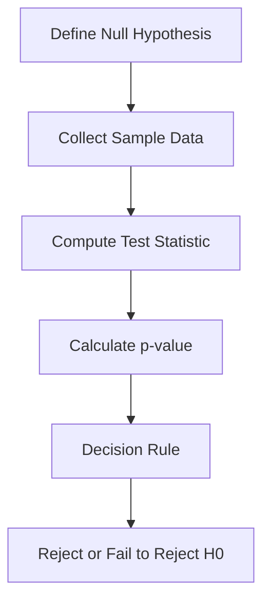
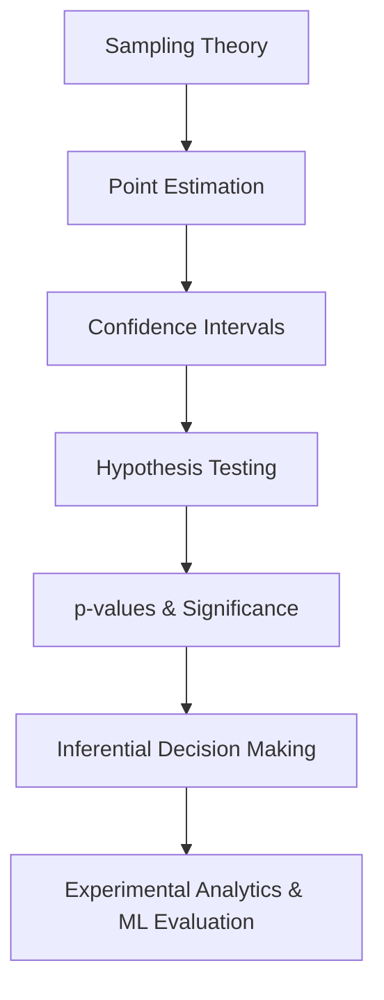

# W03 - Estimation And Hypothesis Testing

This module operationalizes statistical inference.

W02 established how we infer population-level behavior from samples.

W03 asks the next critical question:
>[!Info]
> Once we estimate something, how do we know whether it is statistically meaningful?

This is where inferential statistics becomes decision machinery.

The module introduces:

* interval estimation
* uncertainty quantification
* hypothesis testing
* statistical significance
* inferential error analysis

These ideas later become foundational for:

* A/B testing
* ML model evaluation
* experimentation systems
* scientific research
* causal analysis
* production analytics

Repository:

[MSC Data Science AI - W03 Repository](https://github.com/Balasubramanian-pg/MSC.-Data-Science-AI/tree/main/Trimester%201/Statistical%20Modelling%20%26%20Inferencing/W03%20-%20Estimation%20And%20Hypothesis%20Testing)

---

# Why This Module Matters

Most real-world analytics problems reduce to one of these questions:

| Business Question                       | Statistical Form          |
| --------------------------------------- | ------------------------- |
| Did the new feature improve engagement? | Hypothesis test           |
| Is the model improvement real or noise? | Significance testing      |
| How accurate is our estimate?           | Confidence interval       |
| How much data do we need?               | Sample size determination |
| Is this variation random?               | Inferential testing       |

Without statistical testing:

* dashboards become storytelling
* ML metrics become misleading
* experiments become unreliable
* decisions become intuition disguised as evidence

This module introduces the mathematics used to separate:

* signal from noise
* random fluctuation from genuine effect
* statistical evidence from coincidence

---

# Module Structure

```text
W03 - Estimation And Hypothesis Testing
│
├── L0 → Statistical Inference Foundations
├── L1 → Interval Estimation & Sample Size
├── L2 → Hypothesis Testing Framework
├── Lab → Computational Statistical Testing
└── Assets → Mathematical & Practical References
```

---

# L0 · Statistical Inference in Modelling

This section revisits inference from a modelling perspective.

The important shift here is subtle:

> Statistical inference is not merely mathematical.
> It is model-dependent.

Every inferential conclusion depends on:

* assumptions
* distributional structure
* sampling behavior
* estimator properties

Most statistical misuse happens because people forget this.

---

# Core Themes

## Statistical Models as Approximation Engines

A model is not reality.

It is a compressed approximation of reality.

Inference works only if:

* the approximation is reasonable
* assumptions are not catastrophically violated
* uncertainty is properly quantified

This idea later becomes extremely important in:

* regression diagnostics
* Bayesian modelling
* probabilistic ML
* causal inference
* deep learning calibration

---

## Resources

### [Module Introduction3](https://github.com/Balasubramanian-pg/MSC.-Data-Science-AI/blob/main/Trimester%201/Statistical%20Modelling%20%26%20Inferencing/W03%20-%20Estimation%20And%20Hypothesis%20Testing/L0/Module%20Introduction3.pdf)

High-level orientation to estimation theory and hypothesis testing workflows.

### [Statistical Inference in Modelling](https://github.com/Balasubramanian-pg/MSC.-Data-Science-AI/blob/main/Trimester%201/Statistical%20Modelling%20%26%20Inferencing/W03%20-%20Estimation%20And%20Hypothesis%20Testing/L0/Statistical%20Inference%20in%20Modelling.md)

Explores how inferential reasoning interacts with modelling assumptions and statistical structure.

---

# L1 · Interval Estimation & Sample Size

This section introduces one of the most misunderstood concepts in statistics:

> Every estimate contains uncertainty.

A point estimate alone is incomplete.

Confidence intervals exist because:

* data is noisy
* samples vary
* estimators fluctuate
* populations are hidden

---

# Core Themes

## Interval Estimation

Instead of estimating a single value:
we estimate a plausible range.

Examples:

* confidence intervals for means
* confidence intervals for proportions
* uncertainty around model performance

This is critical because:

* uncertainty matters more than raw estimates
* decision-making depends on risk tolerance
* narrow intervals imply stability
* wide intervals imply uncertainty

---

## Known σ vs Unknown σ

One of the foundational splits in classical inference.

### Known Population Standard Deviation

Uses the Z-distribution.

Rare in practice.

### Unknown Population Standard Deviation

Uses the t-distribution.

Far more realistic.

The t-distribution effectively introduces a penalty for uncertainty in variance estimation.

That penalty:

* shrinks as sample size increases
* disappears asymptotically
* reflects inferential caution

This idea is deeply tied to:

* estimator uncertainty
* finite sample corrections
* Bayesian uncertainty intuition

---

## Sample Size Determination

One of the highest leverage topics in practical statistics.

Too little data:

* unstable estimates
* noisy inference
* weak statistical power

Too much data:

* unnecessary cost
* operational inefficiency
* statistically significant but practically meaningless results

Good sample size design balances:

* precision
* confidence
* variance
* cost
* power

This becomes essential in:

* A/B testing
* experimentation systems
* survey design
* healthcare trials
* ML evaluation pipelines

---

## Resources

### [Determining Sample Size (PDF)](https://github.com/Balasubramanian-pg/MSC.-Data-Science-AI/blob/main/Trimester%201/Statistical%20Modelling%20%26%20Inferencing/W03%20-%20Estimation%20And%20Hypothesis%20Testing/L1/Determining%20Sample%20Size.pdf)

Mathematical treatment of sample size calculation and inferential precision.

### [Interval Estimation of Mean (σ Known & Unknown)](https://github.com/Balasubramanian-pg/MSC.-Data-Science-AI/blob/main/Trimester%201/Statistical%20Modelling%20%26%20Inferencing/W03%20-%20Estimation%20And%20Hypothesis%20Testing/L1/Interval%20Estimation%20of%20Mean%20%28%CF%83%20Known%20%26%20Unknown%29.pdf)

Detailed explanation of confidence interval construction under different variance assumptions.

### [3.1 Interval Estimation of the Mean](https://github.com/Balasubramanian-pg/MSC.-Data-Science-AI/blob/main/Trimester%201/Statistical%20Modelling%20%26%20Inferencing/W03%20-%20Estimation%20And%20Hypothesis%20Testing/L1/3.1%20Interval%20Estimation%20of%20the%20Mean.md)

Markdown notes focused on inferential interpretation and interval estimation procedures.

### [Determining Sample Size](https://github.com/Balasubramanian-pg/MSC.-Data-Science-AI/blob/main/Trimester%201/Statistical%20Modelling%20%26%20Inferencing/W03%20-%20Estimation%20And%20Hypothesis%20Testing/L1/Determining%20Sample%20Size.md)

Companion notes exploring practical tradeoffs in statistical sampling design.

---

# L2 · Hypothesis Testing Framework

This section introduces one of the most influential frameworks in modern analytics:

> Controlled statistical decision-making under uncertainty.

Hypothesis testing is essentially a structured skepticism engine.

You begin with:

* a default assumption
* evidence from data
* a decision rule
* quantified uncertainty

Then determine whether the observed evidence is strong enough to reject the default assumption.

---

# Core Themes

## The Hypothesis Testing Pipeline



---

## Null vs Alternative Hypothesis

### Null Hypothesis H₀

Represents:

* no effect
* no difference
* baseline assumption

### Alternative Hypothesis H₁

Represents:

* meaningful effect
* difference exists
* deviation from baseline

---

## One-Sample Tests

This module introduces:

* Z-tests
* t-tests

These tests compare:

* observed sample behavior
* expected population behavior

while accounting for:

* variability
* uncertainty
* sample size

---

## p-values

One of the most abused concepts in statistics.

A p-value is NOT:

* probability the null hypothesis is true
* probability the result occurred "by chance"
* proof of significance

A p-value measures:

> How surprising the observed data would be if the null hypothesis were true.

Small p-values indicate:

* observed results are difficult to explain under H₀
* evidence against the null strengthens

But:

* significance does not imply practical importance
* large datasets can manufacture tiny p-values
* poor experimental design invalidates interpretation

---

## Type I and Type II Errors

Statistical testing is fundamentally a tradeoff system.

| Reality    | Decision          | Result        |
| ---------- | ----------------- | ------------- |
| Null true  | Reject H₀         | Type I Error  |
| Null false | Fail to reject H₀ | Type II Error |

This becomes directly connected later to:

* fraud detection
* medical diagnostics
* anomaly detection
* spam filtering
* ML classification tradeoffs

False positives and false negatives are not just statistical abstractions.
They are operational costs.

---

## Resources

### [Errors, p-values, and Significance (PDF)](https://github.com/Balasubramanian-pg/MSC.-Data-Science-AI/blob/main/Trimester%201/Statistical%20Modelling%20%26%20Inferencing/W03%20-%20Estimation%20And%20Hypothesis%20Testing/L2/Errors%2C%20p-values%2C%20and%20Significance.pdf)

Formal lecture material explaining inferential errors, significance levels, and p-value interpretation.

### [One-Sample Tests (Z & T)](https://github.com/Balasubramanian-pg/MSC.-Data-Science-AI/blob/main/Trimester%201/Statistical%20Modelling%20%26%20Inferencing/W03%20-%20Estimation%20And%20Hypothesis%20Testing/L2/One-Sample%20Tests%20%28Z%20%26%20T%29.pdf)

Detailed treatment of classical one-sample inferential testing procedures.

### [The Hypothesis Testing Framework (PDF)](https://github.com/Balasubramanian-pg/MSC.-Data-Science-AI/blob/main/Trimester%201/Statistical%20Modelling%20%26%20Inferencing/W03%20-%20Estimation%20And%20Hypothesis%20Testing/L2/The%20Hypothesis%20Testing%20Framework.pdf)

Step-by-step framework for formal statistical testing workflows.

### [Errors, P-values, and Significance](https://github.com/Balasubramanian-pg/MSC.-Data-Science-AI/blob/main/Trimester%201/Statistical%20Modelling%20%26%20Inferencing/W03%20-%20Estimation%20And%20Hypothesis%20Testing/Lab/Errors%2C%20P-values%2C%20and%20Significance.md)

Markdown notes emphasizing practical interpretation of inferential significance.

### [The Hypothesis Testing Framework](https://github.com/Balasubramanian-pg/MSC.-Data-Science-AI/blob/main/Trimester%201/Statistical%20Modelling%20%26%20Inferencing/W03%20-%20Estimation%20And%20Hypothesis%20Testing/Lab/The%20Hypothesis%20Testing%20Framework.md)

Structured conceptual walkthrough of hypothesis testing logic and workflow design.

---

# Lab · Computational Statistical Inference

The notebooks in this module are critical.

Hypothesis testing becomes intuitive only when repeatedly simulated.

Without simulation:
students memorize formulas mechanically.

With simulation:
students finally see:

* estimator variability
* significance instability
* sampling noise
* confidence interval behavior
* inferential randomness

---

## Lab Resources

### [Estimation_and_Hypothesis_Testing.ipynb](https://github.com/Balasubramanian-pg/MSC.-Data-Science-AI/blob/main/Trimester%201/Statistical%20Modelling%20%26%20Inferencing/W03%20-%20Estimation%20And%20Hypothesis%20Testing/Lab/Estimation_and_Hypothesis_Testing.ipynb)

Integrated notebook combining interval estimation and inferential testing workflows.

### [Interval_Estimation.ipynb](https://github.com/Balasubramanian-pg/MSC.-Data-Science-AI/blob/main/Trimester%201/Statistical%20Modelling%20%26%20Inferencing/W03%20-%20Estimation%20And%20Hypothesis%20Testing/Lab/Interval_Estimation.ipynb)

Hands-on notebook for confidence interval simulation and estimator experimentation.

### [Week_3_Tutorial__Estimation_and_Hypothesis_Testing_with_Examples.ipynb](https://github.com/Balasubramanian-pg/MSC.-Data-Science-AI/blob/main/Trimester%201/Statistical%20Modelling%20%26%20Inferencing/W03%20-%20Estimation%20And%20Hypothesis%20Testing/Lab/Week_3_Tutorial__Estimation_and_Hypothesis_Testing_with_Examples.ipynb)

Worked inferential examples connecting theory with practical statistical workflows.

---

# Recommended Learning Flow



---

# Hidden Insight Behind This Module

Most people think hypothesis testing is about:

> "proving something statistically."

That framing is misleading.

Hypothesis testing is actually about:

> controlling decision risk under uncertainty.

You are building a framework that limits:

* false conclusions
* random overreaction
* inferential hallucinations

That exact logic later powers:

* ML evaluation pipelines
* experimentation platforms
* scientific reproducibility
* AI reliability systems
* production monitoring
* probabilistic decision systems

This module therefore teaches far more than classical statistics.

It teaches disciplined uncertainty management.

