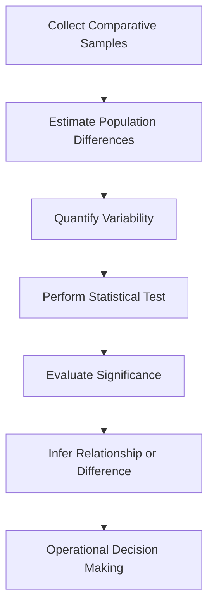

# W04 - Estimation And Hypothesis Testing Cont

This module extends classical inference beyond single-population analysis into comparative statistical reasoning.

W03 introduced:

* estimation
* confidence intervals
* hypothesis testing
* inferential decision frameworks

W04 scales those ideas into:

* two-population inference
* variance comparison
* population proportion testing
* categorical dependence analysis

This is where inferential statistics starts resembling real analytical systems.

Most real-world problems are comparative.

Examples:

* Did treatment A outperform treatment B?
* Is one manufacturing process more stable?
* Are two customer groups behaviorally different?
* Are two variables statistically associated?
* Did the new feature increase conversion rates?

This module provides the statistical machinery for answering those questions rigorously.

Repository:

[MSC Data Science AI - W04 Repository](https://github.com/Balasubramanian-pg/MSC.-Data-Science-AI/tree/main/Trimester%201/Statistical%20Modelling%20%26%20Inferencing/W04%20-%20Estimation%20And%20Hypothesis%20Testing%20Cont)

# Why This Module Matters

Single-sample inference is foundational.

But modern analytics rarely stops at:

> "What is the value?"

Most analytical systems instead ask:

> "Compared to what?"

Comparative inference drives:

* experimentation systems
* product analytics
* scientific studies
* recommendation systems
* healthcare analysis
* industrial quality control
* ML model benchmarking

Without comparative inference:

* improvements cannot be validated
* effects cannot be isolated
* causality becomes speculative
* optimization becomes unreliable

This module therefore introduces statistical comparison as a formal discipline.

# Module Structure

```text
W04 - Estimation And Hypothesis Testing Cont
│
├── L0 → Statistical Inference Continuation
├── L1 → Two Population Inference
├── L2 → Proportion Testing & Chi-Square Analysis
└── Tutorials → Practical Comparative Inference
```

# L0 · Statistical Inference Continuation

This section transitions the learner from:

* single population reasoning
* into multi-population comparative inference

The conceptual shift matters.

Inference now becomes relational.

You are no longer estimating isolated parameters.
You are estimating differences between systems.

That introduces:

* dependency structures
* comparative uncertainty
* variance interaction
* sampling asymmetry
* inferential sensitivity

These ideas later become foundational in:

* A/B testing infrastructure
* uplift modelling
* causal inference
* treatment effect estimation
* model benchmarking

## Resources

### [Module Introduction 4](https://github.com/Balasubramanian-pg/MSC.-Data-Science-AI/blob/main/Trimester%201/Statistical%20Modelling%20%26%20Inferencing/W04%20-%20Estimation%20And%20Hypothesis%20Testing%20Cont/L0/Module%20Introduction%204.pdf)

High-level overview of comparative inference workflows and multi-population analysis.

### [Module 4 Introduction Statistical Inference and Modelling](https://github.com/Balasubramanian-pg/MSC.-Data-Science-AI/blob/main/Trimester%201/Statistical%20Modelling%20%26%20Inferencing/W04%20-%20Estimation%20And%20Hypothesis%20Testing%20Cont/L0/Module%204%20Introduction%20Statistical%20Inference%20and%20Modelling.md)

Conceptual continuation of inferential reasoning with emphasis on comparative statistical modelling.

# L1 · Inference for Two Populations

This section introduces formal statistical comparison between populations.

This is one of the most practically important transitions in applied statistics.

Most organizations care less about absolute numbers and more about:

* change
* difference
* improvement
* degradation
* stability shifts

That makes comparative inference central to operational analytics.

# Core Themes

## Comparing Population Means

One of the most common inferential tasks.

Examples:

* comparing customer retention between two cohorts
* evaluating treatment vs control groups
* testing model performance differences
* comparing manufacturing yields

The challenge:
sample means fluctuate naturally.

Inference determines whether:

* observed differences are meaningful
* or merely random sampling noise

This becomes the basis for:

* experimental analytics
* product experimentation
* ML evaluation
* scientific testing


## Comparing Population Variances

Variance comparison is often underestimated.

But many real systems care more about stability than averages.

Examples:

* manufacturing consistency
* financial volatility
* latency stability
* model reliability
* risk dispersion

Two systems may have identical means but radically different variance structures.

Variance inference therefore becomes essential in:

* risk analysis
* anomaly detection
* quality engineering
* reliability systems


## Hidden Statistical Complexity

Two-population inference introduces complications absent in single-sample testing:

* unequal variances
* unequal sample sizes
* dependence assumptions
* pooled variance estimation
* distribution sensitivity

This is where inferential statistics becomes significantly more fragile.

Bad assumptions can invalidate:

* p-values
* confidence intervals
* significance conclusions

This directly parallels real-world ML problems where:

* training distributions shift
* cohorts drift
* variance explodes
* assumptions silently fail

# Resources

### [Inferences for Two Population Means (PDF)](https://github.com/Balasubramanian-pg/MSC.-Data-Science-AI/blob/main/Trimester%201/Statistical%20Modelling%20%26%20Inferencing/W04%20-%20Estimation%20And%20Hypothesis%20Testing%20Cont/L1/Inferences%20for%20Two%20Population%20Means.pdf)

Formal treatment of comparative mean estimation and hypothesis testing procedures.

### [Inferences for Two Population Variances (PDF)](https://github.com/Balasubramanian-pg/MSC.-Data-Science-AI/blob/main/Trimester%201/Statistical%20Modelling%20%26%20Inferencing/W04%20-%20Estimation%20And%20Hypothesis%20Testing%20Cont/L1/Inferences%20for%20Two%20Population%20Variances.pdf)

Mathematical framework for variance comparison and inferential stability analysis.

### [Inferences for Two Population Means](https://github.com/Balasubramanian-pg/MSC.-Data-Science-AI/blob/main/Trimester%201/Statistical%20Modelling%20%26%20Inferencing/W04%20-%20Estimation%20And%20Hypothesis%20Testing%20Cont/L1/Inferences%20for%20Two%20Population%20Means.md)

Markdown notes focused on comparative mean inference workflows and interpretation.

### [Inferences for Two Population Variances](https://github.com/Balasubramanian-pg/MSC.-Data-Science-AI/blob/main/Trimester%201/Statistical%20Modelling%20%26%20Inferencing/W04%20-%20Estimation%20And%20Hypothesis%20Testing%20Cont/L1/Inferences%20for%20Two%20Population%20Variances.md)

Conceptual notes emphasizing variance analysis and inferential robustness.

# L2 · Population Proportions & Chi-Square Testing

This section expands inference into categorical and proportional data analysis.

Many real-world systems produce categorical outcomes rather than continuous measurements.

Examples:

* clicked vs not clicked
* churned vs retained
* fraud vs legitimate
* purchased vs abandoned
* passed vs failed

This section introduces the statistical frameworks used to analyze those systems.

# Core Themes

## Testing Population Proportions

Used when evaluating probabilities or rates across populations.

Examples:

* conversion rate comparison
* approval rate analysis
* classification success rates
* defect rate estimation

This becomes foundational in:

* digital experimentation
* product analytics
* healthcare statistics
* ML classification evaluation


## Chi-Square Test of Independence

One of the most important categorical inference tools.

The core question:

> Are two categorical variables statistically associated?

Examples:

* Is churn associated with subscription type?
* Is fraud associated with region?
* Is purchase behavior linked to campaign exposure?
* Is customer satisfaction associated with support channel?

The Chi-Square framework measures:

* observed categorical structure
* versus expected random structure

This becomes extremely important later in:

* feature selection
* exploratory data analysis
* contingency analysis
* interpretable ML pipelines


## Statistical Independence

Independence is one of the deepest concepts in probability and statistics.

Many models silently assume independence:

* Naive Bayes
* regression residual assumptions
* classical statistical inference
* probabilistic graphical models

Violations of independence can catastrophically distort inference.

That is why Chi-Square testing matters beyond textbook statistics.

# Resources

### [Test of Independence (Chi-Square Test)](https://github.com/Balasubramanian-pg/MSC.-Data-Science-AI/blob/main/Trimester%201/Statistical%20Modelling%20%26%20Inferencing/W04%20-%20Estimation%20And%20Hypothesis%20Testing%20Cont/L2/Test%20of%20Independence%20%28Chi-Square%20Test%29.pdf)

Formal lecture material explaining categorical independence testing and contingency analysis.

### [Testing Population Proportions (PDF)](https://github.com/Balasubramanian-pg/MSC.-Data-Science-AI/blob/main/Trimester%201/Statistical%20Modelling%20%26%20Inferencing/W04%20-%20Estimation%20And%20Hypothesis%20Testing%20Cont/L2/Testing%20Population%20Proportions.pdf)

Detailed treatment of inferential testing for categorical population proportions.

### [Reading Material The Chi-Square Test of Independence](https://github.com/Balasubramanian-pg/MSC.-Data-Science-AI/blob/main/Trimester%201/Statistical%20Modelling%20%26%20Inferencing/W04%20-%20Estimation%20And%20Hypothesis%20Testing%20Cont/L2/Reading%20Material%20The%20Chi-Square%20Test%20of%20Independence.md)

Supplementary conceptual reading focused on categorical dependence analysis and inferential interpretation.

### [Testing Population Proportions](https://github.com/Balasubramanian-pg/MSC.-Data-Science-AI/blob/main/Trimester%201/Statistical%20Modelling%20%26%20Inferencing/W04%20-%20Estimation%20And%20Hypothesis%20Testing%20Cont/L2/Testing%20Population%20Proportions.md)

Markdown notes emphasizing practical proportion testing workflows.

### [Week_4_Tutorial_Statistical_Inference_Two_Populati](https://github.com/Balasubramanian-pg/MSC.-Data-Science-AI/blob/main/Trimester%201/Statistical%20Modelling%20%26%20Inferencing/W04%20-%20Estimation%20And%20Hypothesis%20Testing%20Cont/L2/Week_4_Tutorial_Statistical_Inference_Two_Populati)

Hands-on tutorial covering comparative inferential workflows with worked examples.

# Comparative Inference Pipeline



# Hidden Insight Behind This Module

Most people think hypothesis testing is primarily about:

> proving whether differences exist.

That framing is incomplete.

The deeper idea is:

> Comparative inference is controlled uncertainty comparison.

You are building systems that determine whether observed differences:

* are real
* are stable
* generalize beyond samples
* justify operational action

That exact framework later powers:

* experimentation platforms
* recommendation systems
* ML benchmarking
* online learning systems
* healthcare decision engines
* causal AI pipelines

This module therefore extends statistics from isolated inference into comparative reasoning systems.

