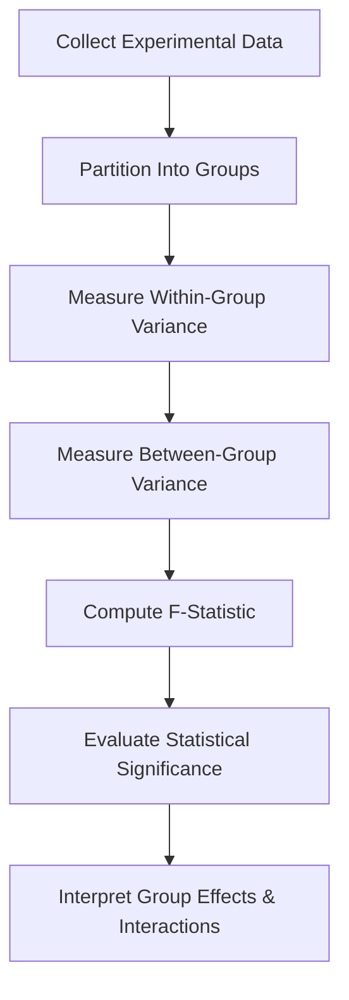

# W05 - Analysis Of Variance ANOVA

This module introduces one of the most important frameworks in statistical modelling:

> Analysis of Variance (ANOVA)

At first glance, ANOVA appears to be:

> "a method for comparing multiple means."

That description is technically correct.

But conceptually incomplete.

ANOVA is actually a framework for decomposing variability inside systems.

This matters because:

* real-world systems contain multiple interacting sources of variation
* not all variability is meaningful
* some variability comes from signal
* some comes from noise
* statistical modelling depends on separating the two

This module therefore marks an important transition:

from:

* isolated inferential tests

to:

* structured experimental reasoning

Repository:

[MSC Data Science AI - W05 Repository](https://github.com/Balasubramanian-pg/MSC.-Data-Science-AI/tree/main/Trimester%201/Statistical%20Modelling%20%26%20Inferencing/W05%20-%20Analysis%20Of%20Variance%20ANOVA)

# Why This Module Matters

Suppose you compare:

* 2 marketing campaigns
* 3 machine learning models
* 5 manufacturing processes
* multiple treatment groups
* several pricing strategies

Running repeated pairwise t-tests creates serious problems:

* inflated false positive rates
* inferential instability
* contradictory conclusions
* multiple comparison issues

ANOVA solves this elegantly.

Instead of asking:

> "Are these two groups different?"

ANOVA asks:

> "Does group membership explain meaningful variance in the system?"

That shift is profound.

This framework later becomes foundational in:

* experimental design
* feature importance analysis
* regression modelling
* factorial experimentation
* causal analysis
* industrial optimization
* ML model comparison

# Module Structure

```text id="8qlm3q"
W05 - Analysis Of Variance ANOVA
│
├── L0 → Experimental Design Foundations
├── L1 → One-Way & Two-Way ANOVA
├── Jupyter Notebooks → Computational Variance Analysis
└── Tutorials → Applied Experimental Statistics
```

# L0 · Experimental Design Foundations

Before ANOVA can work, experiments must be designed properly.

This section introduces the logic behind controlled experimentation.

A badly designed experiment cannot be rescued statistically.

That is one of the most important lessons in applied statistics.

# Core Themes

## Experimental Design

Experimental design exists to isolate causal structure from noise.

Good experimental systems attempt to:

* reduce confounding
* control variance
* isolate treatment effects
* improve inferential clarity

Without proper design:

* inference collapses
* significance becomes misleading
* causal claims become weak

This becomes extremely important later in:

* A/B testing systems
* causal inference
* ML evaluation pipelines
* healthcare trials
* recommendation experimentation

## Variability as Information

One of ANOVA’s deepest ideas:

> Variance is not merely noise.
> Variance contains structure.

ANOVA partitions total variability into:

* explained variability
* unexplained variability

That decomposition later appears everywhere:

* regression
* PCA
* probabilistic modelling
* signal processing
* Bayesian inference
* deep learning optimization

## Resources

### [Module 5](https://github.com/Balasubramanian-pg/MSC.-Data-Science-AI/blob/main/Trimester%201/Statistical%20Modelling%20%26%20Inferencing/W05%20-%20Analysis%20Of%20Variance%20ANOVA/L0/Module%205.md)

Introduces the conceptual foundations of variance analysis and experimental reasoning.

### [Module Introduction Transcript](https://github.com/Balasubramanian-pg/MSC.-Data-Science-AI/blob/main/Trimester%201/Statistical%20Modelling%20%26%20Inferencing/W05%20-%20Analysis%20Of%20Variance%20ANOVA/L0/Module%20Introduction%20Transcript.pdf)

Orientation material outlining the structure and goals of the ANOVA module.

# L1 · Experimental Design & ANOVA

This section introduces the formal machinery behind variance decomposition and multi-group inference.

# Core Themes

## One-Way ANOVA

One-Way ANOVA evaluates whether:

* multiple group means
* differ beyond expected random variation

Core question:

> Does the grouping variable explain meaningful system variability?

Examples:

* comparing student performance across teaching methods
* evaluating multiple recommendation algorithms
* testing pricing strategies
* comparing manufacturing configurations

## The ANOVA Logic

ANOVA works by comparing:

### Between-Group Variance

How much groups differ from each other.

### Within-Group Variance

How much variability exists inside each group naturally.

If:

* between-group variance is large
* relative to within-group variance

then:

* the grouping factor likely matters statistically.

This leads to the F-statistic framework.

## The F-Statistic

The ANOVA engine is fundamentally a variance ratio.

F = \frac{\text{Between-Group Variance}}{\text{Within-Group Variance}}

Large F-values indicate:

* structured group differences
* non-random variability
* evidence against equal means

Small F-values indicate:

* observed differences are likely sampling noise

## Hidden Insight

ANOVA does not directly test:

> "Which groups differ?"

It first tests:

> "Is there evidence that any structured difference exists at all?"

This is a systems-level inferential perspective.

Post-hoc tests are then used for pairwise interpretation.

## Two-Way ANOVA

Two-Way ANOVA introduces interaction analysis.

This is where statistics becomes substantially more powerful.

Instead of analyzing:

* one factor

we analyze:

* multiple factors simultaneously
* plus their interactions

Examples:

* model architecture × dataset type
* medication × dosage
* marketing channel × region
* UI design × device category

## Interaction Effects

One of the most important concepts in statistical modelling.

An interaction means:

> the effect of one variable depends on another variable.

This idea later becomes foundational in:

* regression interaction terms
* feature engineering
* generalized linear models
* deep learning feature interactions
* causal modelling

Many real-world systems are interaction-dominated.

Ignoring interactions often creates:

* misleading averages
* weak models
* incorrect conclusions

## ANOVA Assumptions

ANOVA relies on several assumptions:

| Assumption      | Why It Matters                  |
| --------------- | ------------------------------- |
| Independence    | Prevents correlated errors      |
| Normality       | Stabilizes inferential validity |
| Equal variances | Ensures F-statistic reliability |

Violation of assumptions can:

* distort p-values
* inflate false positives
* weaken inferential reliability

This directly parallels ML systems where:

* distribution shift
* heteroskedasticity
* correlated samples
* hidden dependencies

can silently break evaluation pipelines.

# Resources

### [Course Video Introduction to Experimental Design & ANOVA Transcript](https://github.com/Balasubramanian-pg/MSC.-Data-Science-AI/blob/main/Trimester%201/Statistical%20Modelling%20%26%20Inferencing/W05%20-%20Analysis%20Of%20Variance%20ANOVA/L1/Course%20Video%20Introduction%20to%20Experimental%20Design%20%26%20ANOVA%20Transcript.pdf)

Lecture transcript introducing the logic of controlled experimentation and variance analysis.

### [Course Video One-Way ANOVA Transcript2](https://github.com/Balasubramanian-pg/MSC.-Data-Science-AI/blob/main/Trimester%201/Statistical%20Modelling%20%26%20Inferencing/W05%20-%20Analysis%20Of%20Variance%20ANOVA/L1/Course%20Video%20One-Way%20ANOVA%20Transcript2.pdf)

Detailed walkthrough of One-Way ANOVA reasoning and statistical interpretation.

### [Introduction to Experimental Design & ANOVA](https://github.com/Balasubramanian-pg/MSC.-Data-Science-AI/blob/main/Trimester%201/Statistical%20Modelling%20%26%20Inferencing/W05%20-%20Analysis%20Of%20Variance%20ANOVA/L1/Introduction%20to%20Experimental%20Design%20%26%20ANOVA.md)

Markdown notes connecting experimental structure with inferential methodology.

### [One-Way and Two-Way Analysis of Variance (ANOVA)](https://github.com/Balasubramanian-pg/MSC.-Data-Science-AI/blob/main/Trimester%201/Statistical%20Modelling%20%26%20Inferencing/W05%20-%20Analysis%20Of%20Variance%20ANOVA/L1/One-Way%20and%20Two-Way%20Analysis%20of%20Variance%20%28ANOVA%29.md)

Comprehensive notes covering variance decomposition, F-testing, and interaction modelling.

# Computational ANOVA

The notebooks in this module are particularly important because ANOVA becomes far easier to understand visually.

When simulated computationally, students can observe:

* variance partitioning
* group separation
* interaction effects
* sampling fluctuations
* inferential instability

Without visualization:
ANOVA often feels abstract.

With simulation:
variance decomposition becomes intuitive.

# Notebook Resources

### [Analysis_of_Variance_(ANOVA).ipynb](https://github.com/Balasubramanian-pg/MSC.-Data-Science-AI/blob/main/Trimester%201/Statistical%20Modelling%20%26%20Inferencing/W05%20-%20Analysis%20Of%20Variance%20ANOVA/L1/Analysis_of_Variance_%28ANOVA%29.ipynb)

Hands-on computational notebook implementing ANOVA workflows and variance decomposition analysis.

### [Week_5_ANOVA_Tutorial.ipynb](https://github.com/Balasubramanian-pg/MSC.-Data-Science-AI/blob/main/Trimester%201/Statistical%20Modelling%20%26%20Inferencing/W05%20-%20Analysis%20Of%20Variance%20ANOVA/L1/Week_5_ANOVA_Tutorial.ipynb)

Applied tutorial notebook with worked ANOVA examples and inferential interpretation.

# Variance Decomposition Workflow



# Hidden Insight Behind This Module

Most people think ANOVA is:

> "a statistical test for comparing many means."

That is only the surface layer.

The deeper idea is:

> ANOVA is structured variance attribution.

You are trying to determine:

* where variability originates
* whether structure exists inside the system
* whether observed effects exceed random fluctuation

That exact logic later powers:

* regression modelling
* feature importance methods
* probabilistic AI systems
* causal inference
* latent variable modelling
* representation learning

This module therefore teaches more than hypothesis testing.

It teaches how to decompose complex systems into interpretable sources of variation.
