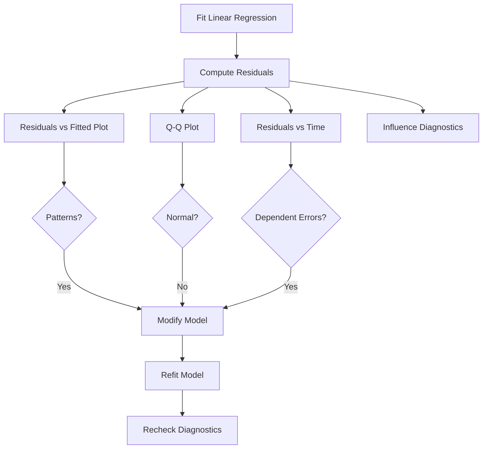

---

## Reading Material: Residual Analysis


# Model Diagnostics in Linear Regression

## 1. Why Model Diagnostics Matter

A regression analysis is not complete after computing coefficients, p-values, and (R^2).

A statistically significant regression model can still be:

- fundamentally misspecified
    
- misleading
    
- mathematically invalid for inference
    

The core issue is this:

> Linear regression inference depends heavily on assumptions about the error terms.

If those assumptions fail:

- confidence intervals become unreliable
    
- hypothesis tests become misleading
    
- standard errors become biased
    
- predictions degrade
    
- coefficient interpretation becomes dangerous
    

This is why **model diagnostics** exist.

Model diagnostics answer the question:

> “Can we trust this regression model?”

The primary diagnostic tool is the analysis of **residuals**.


# 2. Residuals: The Foundation of Diagnostics

The residual for observation (i) is:

[  
e_i = y_i - \hat{y}_i  
]

Where:

- (y_i) = actual observed value
    
- (\hat{y}_i) = predicted value from the regression line
    
- (e_i) = residual
    

Residuals estimate the true but unobservable random errors:

[  
\epsilon_i  
]

Since we cannot directly observe the true error terms, residuals act as their practical substitute.

## Intuition

Residuals measure:

> “How wrong was the model for this observation?”

Good regression models produce residuals that look:

- random
    
- structureless
    
- pattern-free
    

If residuals contain patterns, the model has failed to capture something important.


# 3. The LINE Assumptions

Linear regression relies on four major assumptions.

## The LINE Framework

|Letter|Assumption|Meaning|
|---|---|---|
|L|Linearity|Relationship between (X) and (Y) is linear|
|I|Independence|Errors are independent|
|N|Normality|Errors are normally distributed|
|E|Equal Variance|Errors have constant variance|


# 4. Assumption 1: Linearity

## Definition

The expected response must be a linear function of predictors.

For simple linear regression:

[  
E(Y|X) = \beta_0 + \beta_1 X  
]

This does **not** mean the data points lie perfectly on a line.

It means:

> The average relationship follows a straight-line structure.


## Intuition

A linear model assumes:

- each unit increase in (X)
    
- changes (Y)
    
- by a constant amount
    

Example:

|Hours Studied|Predicted Score|
|---|---|
|1|55|
|2|60|
|3|65|

The increase is constant:

[  
+5 \text{ points per hour}  
]


## When Linearity Fails

Suppose the true relationship is curved:

[  
Y = X^2 + \epsilon  
]

A straight-line regression cannot capture this curvature.

The model systematically underpredicts and overpredicts in different regions.


## Diagnostic Tool: Residuals vs Fitted Plot

This is the most important regression diagnostic plot.

### Axes

- X-axis: fitted values (\hat{y})
    
- Y-axis: residuals (e_i)
    


## Healthy Pattern

What we want:

- random scatter
    
- horizontal cloud
    
- centered around zero
    
- no visible structure
    

This indicates:

- linearity assumption is reasonable
    
- equal variance assumption is reasonable
    


## Non-Linearity Pattern

If residuals show:

- curves
    
- waves
    
- U-shapes
    
- inverted U-shapes
    

then the linear model is inappropriate.

Example pattern:

```text
Residuals

  ^
  |        *
  |     *     *
  |   *         *
  | *             *
  +--------------------> Fitted Values
```

This indicates:

[  
E(Y|X)  
]

is not linear.


## Common Fixes for Non-Linearity

### 1. Transform Variables

Examples:

[  
\log(X)  
]

[  
\sqrt{X}  
]

[  
\log(Y)  
]


### 2. Polynomial Regression

Add nonlinear terms:

[  
Y = \beta_0 + \beta_1 X + \beta_2 X^2 + \epsilon  
]


### 3. Use Nonlinear Models

Examples:

- splines
    
- GAMs
    
- tree models
    
- neural networks
    


# 5. Assumption 2: Independence

## Definition

Residuals should not depend on each other.

Formally:

[  
Cov(\epsilon_i, \epsilon_j) = 0  
]

for:

[  
i \neq j  
]


## Intuition

One error should not help predict another error.

Violation often occurs in:

- time series
    
- sequential data
    
- repeated measurements
    
- spatial data
    


## Example of Dependence

Suppose stock price prediction errors behave like:

|Day|Residual|
|---|---|
|1|+2|
|2|+1.8|
|3|+2.1|

Residuals cluster together.

This suggests autocorrelation.


## Why This Is Dangerous

Dependent errors cause:

- underestimated standard errors
    
- inflated t-statistics
    
- false significance
    

The regression appears stronger than it actually is.


## Diagnostic Methods

### Residuals vs Time Plot

Patterns over time suggest dependence.

### Durbin-Watson Test

Checks autocorrelation.

Interpretation:

|Value|Meaning|
|---|---|
|~2|No autocorrelation|
|<2|Positive autocorrelation|
|>2|Negative autocorrelation|


# 6. Assumption 3: Normality

## Definition

Errors are assumed normally distributed:

[  
\epsilon_i \sim N(0, \sigma^2)  
]


## Important Clarification

Normality is mainly needed for:

- hypothesis testing
    
- confidence intervals
    
- p-values
    

It is **not required** for unbiased coefficient estimation.


## Why Normality Matters

Many inference formulas rely on normal distributions.

Without normality:

- p-values become unreliable
    
- confidence intervals become inaccurate
    

Especially in small samples.


# 7. Q-Q Plot

The standard tool for checking normality is the:

## Normal Quantile-Quantile Plot

A Q-Q plot compares:

- observed residual quantiles
    
- theoretical normal quantiles
    


## Healthy Q-Q Plot

Points should approximately follow a straight diagonal line.

Meaning:

- residual distribution resembles a normal distribution
    


## Problematic Patterns

### Heavy Tails

Ends bend away from line.

Indicates:

- outliers
    
- fat-tailed errors
    


### Skewness

One side bends strongly.

Indicates asymmetric residual distribution.


## Interpretation Rule

Perfect normality is unnecessary.

Small deviations are usually acceptable.

Large systematic deviations are problematic.


# 8. Assumption 4: Equal Variance (Homoscedasticity)

## Definition

Residual variance should remain constant across all fitted values.

Formally:

[  
Var(\epsilon_i) = \sigma^2  
]

for all (i).


## Intuition

Prediction uncertainty should remain stable.

The spread of residuals should not systematically widen or shrink.


# 9. Heteroscedasticity

When variance changes across fitted values:

[  
Var(\epsilon_i) \neq \sigma^2  
]

This is called:

## Heteroscedasticity


## Funnel Pattern

Classic residual plot pattern:

```text
Residuals

  ^
  |      *
  |     * *
  |    *   *
  |   *     *
  |  *       *
  +-----------------> Fitted Values
```

Residual spread increases with fitted values.


## Why It Matters

Heteroscedasticity causes:

- biased standard errors
    
- unreliable p-values
    
- misleading confidence intervals
    

The coefficient estimates themselves remain unbiased.

But inference becomes unreliable.


# 10. Common Causes of Heteroscedasticity

## Real-World Scale Effects

Higher values naturally have larger variability.

Example:

|Income|Spending Variability|
|---|---|
|Low income|Small variance|
|High income|Large variance|


## Missing Variables

Omitted predictors create uneven residual spread.


## Incorrect Functional Form

Using a linear model for nonlinear relationships can induce heteroscedasticity.


# 11. Fixes for Heteroscedasticity

## 1. Transform the Response

Common:

[  
\log(Y)  
]


## 2. Weighted Least Squares

Assign lower weights to noisier observations.


## 3. Robust Standard Errors

Very common in econometrics.

Keeps coefficients same but adjusts inference.


# 12. Summary of Diagnostic Patterns

|Plot Pattern|Likely Problem|
|---|---|
|Random cloud|Model assumptions reasonable|
|Curved pattern|Non-linearity|
|Funnel shape|Heteroscedasticity|
|Clusters over time|Dependence|
|Extreme outliers in Q-Q plot|Non-normality|


# 13. Visual Mental Model

Think of residuals as:

> “Information left unexplained by the model.”

Good models leave behind:

- random noise
    

Bad models leave behind:

- structure
    
- trends
    
- patterns
    
- geometry
    

Residual diagnostics are fundamentally:

> pattern detection in model mistakes.


# 14. Practical Workflow for Regression Diagnostics




# 15. Advanced Notes

## Residuals Are Not Independent by Construction

Ordinary residuals have subtle dependence structures mathematically.

Strict independence applies to the true errors, not raw residuals.

This distinction matters in advanced regression theory.


## Large Samples Reduce Normality Concerns

Due to the Central Limit Theorem:

- large datasets often tolerate moderate non-normality
    

Small datasets are much more sensitive.


## Diagnostics Are Iterative

Regression modeling is rarely:

1. fit once
    
2. interpret once
    
3. done
    

Real modeling is iterative:

- fit
    
- diagnose
    
- modify
    
- refit
    
- validate
    


# 16. Python Example

```python
import numpy as np
import pandas as pd
import matplotlib.pyplot as plt

from sklearn.linear_model import LinearRegression
from scipy.stats import probplot

# Generate nonlinear data
np.random.seed(42)

X = np.linspace(0, 10, 100)
y = X**2 + np.random.normal(0, 5, 100)

# Fit incorrect linear model
model = LinearRegression()
model.fit(X.reshape(-1, 1), y)

y_pred = model.predict(X.reshape(-1, 1))

# Residuals
residuals = y - y_pred

# Residual plot
plt.scatter(y_pred, residuals)
plt.axhline(0)
plt.xlabel("Fitted Values")
plt.ylabel("Residuals")
plt.title("Residuals vs Fitted")
plt.show()

# Q-Q plot
probplot(residuals, dist="norm", plot=plt)
plt.title("Normal Q-Q Plot")
plt.show()
```


# 17. Common Mistakes

## Mistake 1

Assuming high (R^2) means the model is valid.

It does not.


## Mistake 2

Ignoring residual plots entirely.

This is extremely common in beginner analysis.


## Mistake 3

Treating p-values as trustworthy even when assumptions fail.


## Mistake 4

Assuming linear regression automatically means causation.

Diagnostics cannot solve causal identification problems.


# 18. Interview-Style Insights

## Question

Why do we analyze residuals instead of raw data?

### Answer

Because residuals isolate the model’s unexplained behavior.

Patterns in residuals reveal assumption violations.


## Question

Can coefficients remain unbiased under heteroscedasticity?

### Answer

Yes.

OLS coefficients remain unbiased.

But standard errors become unreliable.


## Question

Why is normality less important in large datasets?

### Answer

The Central Limit Theorem stabilizes sampling distributions.


# 19. Final Takeaways

[!IMPORTANT]

Linear regression is not validated by:

- significant p-values
    
- high (R^2)
    
- visually good fit alone
    

It is validated by whether its assumptions reasonably hold.

Key ideas:

- residuals are the core diagnostic tool
    
- patterns in residuals indicate model failure
    
- diagnostics determine whether inference is trustworthy
    
- regression modeling is iterative, not one-shot
    

The most important regression habit is:

> Never interpret coefficients before checking residuals.
![[Pasted image 20260523103404.png]]
- **Problem 1: Non-Linearity.** If the plot shows a distinct curve (like a U-shape), it means the underlying relationship is not linear. A straight-line model is inappro priate.
- **Problem 2: Heteroscedasticity.** If the plot shows a funnel or cone shape (the spread of residuals changes as ŷ changes), the equal variance assumption is violated. This makes our p-values and confidence intervals unreliable.

**3.2 Checking Normality**  
To check if the residuals are normally distributed, we use a Normal Q-Q Plot. If the residuals are normal, the points on this plot should fall close to the straight diagonal line.

![[Pasted image 20260523103415.png]]