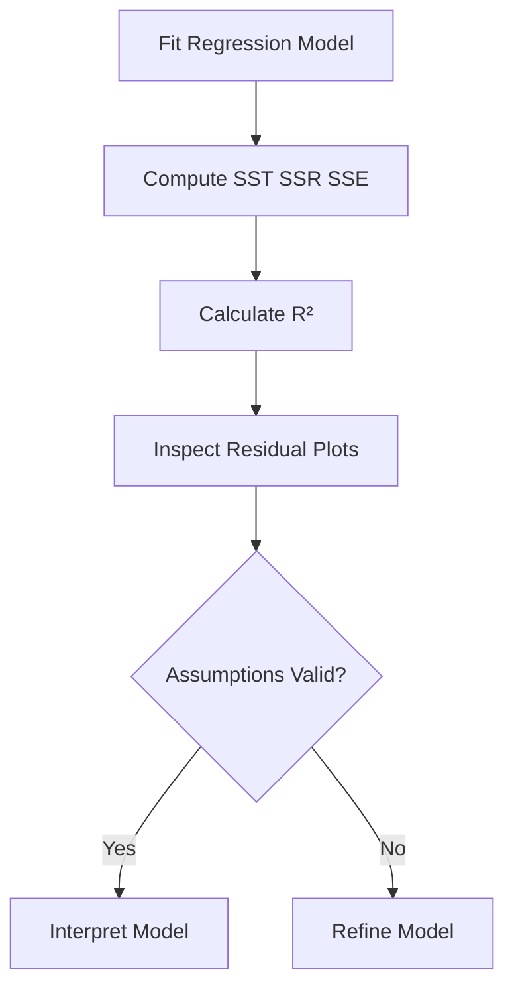

---

## Reading Material: The Coefficient of Determination (R²)

# The Coefficient of Determination ((R^2))

# 1. Why We Need a Measure of Fit

After fitting a regression line using least squares, we immediately face a deeper question:

> How good is this regression model?

Finding the “best” line among all possible lines does **not** mean the line is actually good.

It only means:

> It is the least bad linear fit available.

We therefore need a quantitative measure of model quality.

That measure is:

# The Coefficient of Determination

[  
R^2  
]

pronounced:

> “R-squared”

# 2. The Core Intuition Behind (R^2)

At its heart, (R^2) compares two competing prediction strategies.

## Model 1: The Regression Model

Uses information from (X).

Prediction:

[  
\hat{y}_i  
]

Prediction error:

[  
e_i = y_i - \hat{y}_i  
]

## Model 2: The Baseline Mean Model

Ignores (X) completely.

If we know nothing about (X), our best prediction for every observation is simply:

[  
\bar{y}  
]

the sample mean.

Prediction error:

[  
y_i - \bar{y}  
]

# 3. The Central Question of (R^2)

(R^2) asks:

> “How much better is the regression model compared to just predicting the mean?”

This is fundamentally a:

# Error Reduction Metric

# 4. Residual Perspective

Suppose we predict house prices.

Without regression:

- every house predicted as average price
    

With regression:

- predictions adapt using square footage
    

If regression substantially reduces prediction errors:

[  
R^2  
]

becomes large.

If regression barely improves predictions:

[  
R^2  
]

stays small.

# 5. Decomposition of Variation

Regression works by partitioning variability.

For each observation:

# [  
(y_i - \bar{y})

(\hat{y}_i - \bar{y})  
+  
(y_i - \hat{y}_i)  
]

This is one of the deepest identities in regression.

# 6. Interpretation of Each Component

## Total Deviation

[  
y_i - \bar{y}  
]

Distance from observation to the mean.

Represents total variability.

## Explained Deviation

[  
\hat{y}_i - \bar{y}  
]

Part captured by the regression model.

Represents explained structure.

## Residual Deviation

[  
y_i - \hat{y}_i  
]

Part the model failed to explain.

Represents remaining noise.

# 7. Visual Interpretation

```text
Actual Point (yi)
       *
       |
       | Residual
       |
Regression Line (ŷi)
       *
       |
       | Explained
       |
Mean Line (ȳ)
--------------------
```

Total deviation equals:

- explained part
    
- plus unexplained part
    

# 8. Sum of Squares Decomposition

Squaring and summing across all observations gives:

# [  
\sum (y_i - \bar{y})^2

\sum (\hat{y}_i - \bar{y})^2  
+  
\sum (y_i - \hat{y}_i)^2  
]

This becomes:

[  
SST = SSR + SSE  
]

This equation is the foundation of regression analysis.

# 9. Understanding the Three Sums of Squares

## SST: Total Sum of Squares

[  
SST = \sum (y_i - \bar{y})^2  
]

Measures:

# Total variability in (Y)

This is the total uncertainty before modeling.

## SSR: Regression Sum of Squares

[  
SSR = \sum (\hat{y}_i - \bar{y})^2  
]

Measures:

# Variability explained by the model

This is captured structure.

## SSE: Error Sum of Squares

[  
SSE = \sum (y_i - \hat{y}_i)^2  
]

Measures:

# Unexplained variability

This is residual noise.

# 10. Intuition Behind the Identity

[  
SST = SSR + SSE  
]

means:

# Total variability

=  
Explained variability  
+  
Unexplained variability

Regression is fundamentally:

> variance decomposition.

# 11. The Definition of (R^2)

The coefficient of determination is:

[  
R^2 = \frac{SSR}{SST}  
]

Meaning:

# Proportion of total variation explained by the model

# 12. Alternative Formula

Using:

[  
SST = SSR + SSE  
]

we get:

[  
R^2 = 1 - \frac{SSE}{SST}  
]

This is often the more intuitive form.

# 13. Deep Interpretation of the Formula

[  
\frac{SSE}{SST}  
]

represents:

# Fraction of variation left unexplained

Thus:

# [  
R^2

## 1

\text{unexplained proportion}  
]

# 14. Range of (R^2)

For ordinary linear regression with intercept:

[  
0 \le R^2 \le 1  
]

## (R^2 = 0)

Regression explains nothing.

Predictions no better than using the mean.

[  
SSR = 0  
]

## (R^2 = 1)

Perfect fit.

All points lie exactly on regression line.

[  
SSE = 0  
]

No residual error exists.

# 15. Example Interpretation

Suppose:

[  
R^2 = 0.75  
]

Interpretation:

> 75% of the variability in (Y) is explained by its linear relationship with (X).

Remaining:

[  
25%  
]

is unexplained noise.

# 16. Important Clarification

(R^2) measures:

# Explained variance

NOT:

- prediction accuracy directly
    
- causality
    
- correctness of assumptions
    
- practical importance
    

# 17. Geometric Interpretation

In linear algebra form:

Regression projects data onto a lower-dimensional subspace.

(R^2) measures:

> how much of the total vector variance survives projection.

This connects regression directly to:

- projections
    
- orthogonality
    
- PCA
    
- eigenspaces
    

# 18. Correlation Connection

In simple linear regression:

[  
R^2 = r^2  
]

Where:

[  
r  
]

is the Pearson correlation coefficient.

# 19. Why Squaring Matters

Correlation can be:

[  
-1 \le r \le 1  
]

But explained variance must be nonnegative.

Squaring converts directional association into magnitude of explained variability.

# 20. Example

If:

[  
r = -0.8  
]

then:

[  
R^2 = 0.64  
]

Meaning:

64% of variability is explained despite negative relationship.

# 21. Why High (R^2) Can Be Misleading

A high (R^2) does NOT guarantee a good model.

This is one of the most abused statistics in data science.

# 22. Case 1: Nonlinear Relationships

Suppose the true relationship is quadratic:

[  
Y = X^2 + \epsilon  
]

A linear model may still achieve moderate or high (R^2).

But residual plots reveal systematic failure.

# 23. Case 2: Spurious Correlation

Two unrelated variables may produce high (R^2).

Example:

- ice cream sales
    
- shark attacks
    

Both driven by temperature.

High (R^2) does not imply causation.

# 24. Case 3: Overfitting

In multiple regression:

adding predictors always increases (R^2).

Even useless variables improve fit slightly.

This creates a dangerous illusion of improvement.

# 25. Adjusted (R^2)

To penalize unnecessary predictors:

# [  
R^2_{adj}

1 -  
\left(  
\frac{SSE/(n-k-1)}  
{SST/(n-1)}  
\right)  
]

Where:

- (n) = sample size
    
- (k) = number of predictors
    

# 26. Why Adjusted (R^2) Matters

Adjusted (R^2):

- increases only when predictors genuinely help
    
- penalizes model complexity
    
- combats overfitting
    

# 27. Context Matters

A “good” (R^2) depends heavily on domain.

## Physics

Relationships often highly deterministic.

Expected:

[  
R^2 > 0.95  
]

## Social Sciences

Human behavior highly noisy.

Even:

[  
R^2 = 0.30  
]

may be meaningful.

## Finance

Markets contain enormous randomness.

Very low (R^2) can still produce valuable models.

# 28. Residual Diagnostics Still Matter

A model with high (R^2) can still violate assumptions.

Always inspect:

- residual plots
    
- Q-Q plots
    
- heteroscedasticity
    
- leverage points
    

# 29. Mental Model

Think of (R^2) as:

# Compression Efficiency

How much uncertainty about (Y) gets compressed after learning (X).

# 30. Information-Theoretic Perspective

Before regression:

[  
Y  
]

contains large uncertainty.

After conditioning on (X):

[  
Y|X  
]

has reduced uncertainty.

(R^2) quantifies this reduction.

This connects regression to:

- entropy reduction
    
- mutual information
    
- Bayesian updating
    

# 31. Python Example

```python
import numpy as np
import matplotlib.pyplot as plt
from sklearn.linear_model import LinearRegression
from sklearn.metrics import r2_score

# Generate synthetic data
np.random.seed(42)

X = np.random.rand(100, 1) * 10
y = 5 + 3 * X.flatten() + np.random.normal(0, 3, 100)

# Fit model
model = LinearRegression()
model.fit(X, y)

# Predictions
y_pred = model.predict(X)

# Compute R²
r2 = r2_score(y, y_pred)

print("R²:", r2)

# Visualization
plt.scatter(X, y)
plt.plot(X, y_pred)
plt.title(f"Linear Regression (R² = {r2:.3f})")
plt.xlabel("X")
plt.ylabel("Y")
plt.show()
```

# 32. Common Misconceptions

## Misconception 1

“High (R^2) means causation.”

False.

## Misconception 2

“Low (R^2) means useless model.”

False.

Depends on domain.

## Misconception 3

“High (R^2) guarantees good predictions.”

False.

Overfitting can inflate (R^2).

## Misconception 4

“(R^2) alone evaluates model quality.”

False.

Diagnostics matter equally.

# 33. Workflow for Evaluating Regression Fit



# 34. Advanced Insight: Why Least Squares Maximizes (R^2)

Ordinary Least Squares minimizes:

[  
SSE  
]

Since:

[  
R^2 = 1 - \frac{SSE}{SST}  
]

and (SST) is fixed for the dataset:

minimizing (SSE) automatically maximizes (R^2).

Thus:

> Least squares fitting and maximizing explained variance are mathematically identical objectives.

# 35. Final Takeaways

[!IMPORTANT]

(R^2) measures:

> how much variability in (Y) is explained by the regression model.

Core identities:

## Variance decomposition

[  
SST = SSR + SSE  
]

## R-squared definition

[  
R^2 = \frac{SSR}{SST}  
]

## Alternative form

[  
R^2 = 1 - \frac{SSE}{SST}  
]

Critical conceptual insight:

> Regression is fundamentally a variance-explanation framework.

But remember:

- high (R^2) does not imply causation
    
- high (R^2) does not validate assumptions
    
- high (R^2) does not guarantee predictive usefulness
    

Always combine:

- (R^2)
    
- residual diagnostics
    
- domain knowledge
    
- statistical inference
    
- practical reasoning
