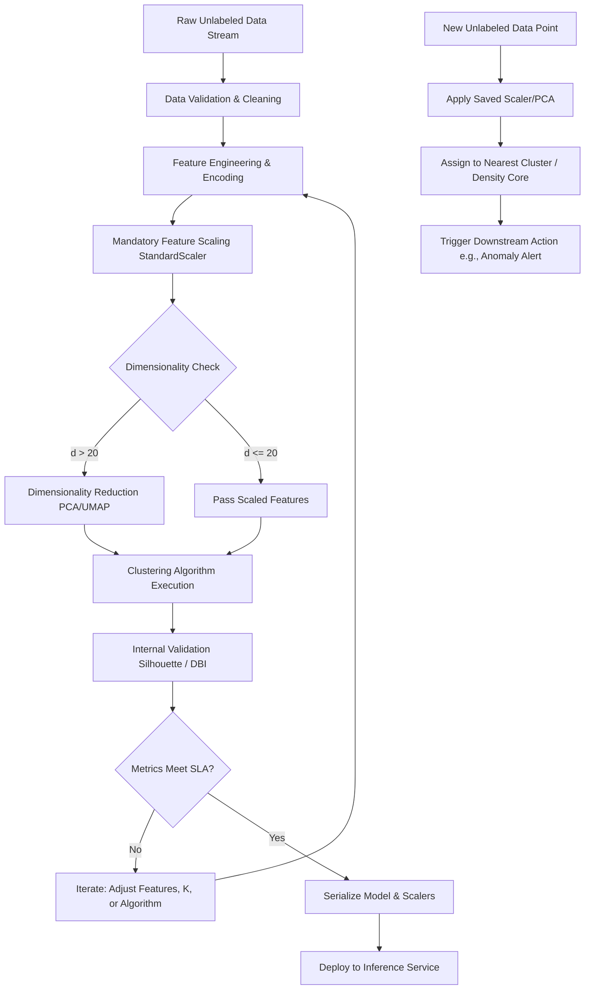

# Cluster Analysis: Foundations of Unsupervised Learning and Data Partitioning

This document provides a rigorous technical analysis of Cluster Analysis. It establishes the mathematical foundations, algorithmic paradigms, and engineering constraints required to implement unsupervised learning systems in production environments. 

> [!IMPORTANT]
> Cluster Analysis is a core methodology within Unsupervised Learning. Unlike supervised learning, which optimizes a mapping function $f: X \rightarrow Y$ given labeled data, cluster analysis seeks to discover latent structure, inherent groupings, or density distributions within unlabeled data $X$ based solely on feature similarity.

## 1. Concept Introduction

Cluster analysis is the task of grouping a set of objects in such a way that objects in the same group (called a cluster) are more similar to each other than to those in other groups. It is a primary exploratory data analysis (EDA) technique and a foundational step in many machine learning pipelines. 

The fundamental premise is that the data generation process is not uniform; rather, it consists of distinct subpopulations or manifolds. The algorithmic objective is to recover these subpopulations without prior knowledge of their existence or boundaries.

## 2. Intuition: Latent Structure Discovery

Consider a high-dimensional dataset of customer transactions. There are no predefined labels indicating "high-value," "churn-risk," or "occasional" customers. However, the data points naturally aggregate in the feature space. Cluster analysis acts as an automated lens, identifying regions of high data point density (clusters) separated by regions of low density (boundaries). Points residing in low-density regions far from any cluster centroid or core are mathematically identified as anomalies or outliers.

## 3. Mathematical Explanation

The general objective of partitional clustering can be formalized as an optimization problem. Let $X = \{x_1, x_2, \dots, x_N\}$ be a dataset of $N$ points in $\mathbb{R}^d$. We seek a partition of $X$ into $K$ disjoint subsets $C = \{C_1, C_2, \dots, C_K\}$ such that $\bigcup_{k=1}^K C_k = X$ and $C_i \cap C_j = \emptyset$ for $i \neq j$.

The optimization goal is twofold:
1. **Maximize Intra-cluster Similarity (Cohesion)**: Minimize the distance between points within the same cluster.
2. **Maximize Inter-cluster Dissimilarity (Separation)**: Maximize the distance between the centroids or boundaries of different clusters.

## 4. Formula Breakdowns

### Distance Metrics
Similarity is quantified via distance metrics $d(x_i, x_j)$. The choice of metric dictates the geometric shape of the resulting clusters.

*   **Euclidean Distance** (L2 Norm): Assumes isotropic, spherical clusters.
    $$d(x_i, x_j) = \sqrt{\sum_{m=1}^{d} (x_{i,m} - x_{j,m})^2}$$
*   **Cosine Distance**: Measures the angle between vectors, invariant to magnitude. Ideal for high-dimensional sparse data (e.g., text embeddings).
    $$d_{cosine}(x_i, x_j) = 1 - \frac{x_i \cdot x_j}{||x_i||_2 ||x_j||_2}$$

### Cluster Validity Indices
To evaluate the quality of a clustering result without ground truth labels, internal validation metrics are used.

*   **Silhouette Coefficient ($s$)**: Measures how similar an object is to its own cluster compared to other clusters.
    $$ s(i) = \frac{b(i) - a(i)}{\max(a(i), b(i))} $$
    Where $a(i)$ is the mean intra-cluster distance, and $b(i)$ is the mean nearest-cluster distance.
*   **Davies-Bouldin Index (DBI)**: The average similarity measure of each cluster with its most similar cluster. Lower values indicate better clustering.
    $$ DBI = \frac{1}{K} \sum_{i=1}^{K} \max_{j \neq i} \left( \frac{\sigma_i + \sigma_j}{d(c_i, c_j)} \right) $$
    Where $\sigma_i$ is the average distance of points in cluster $i$ to its centroid $c_i$.

## 5. Step-by-Step Derivations (General Clustering Objective)

For a generic partitional clustering algorithm, the loss function $J$ to be minimized is often a weighted sum of intra-cluster variances:

$$ J = \sum_{k=1}^{K} \sum_{x_i \in C_k} w_i \cdot d(x_i, \mu_k)^2 $$

Where $\mu_k$ is the representative point (e.g., centroid or medoid) of cluster $C_k$, and $w_i$ is an optional weight for data point $x_i$. 
1. Initialize representatives $\mu_1, \dots, \mu_K$.
2. Assign each $x_i$ to the cluster $C_k$ that minimizes $d(x_i, \mu_k)^2$.
3. Update $\mu_k$ based on the new assignments (e.g., compute the arithmetic mean).
4. Iterate until $J$ converges (i.e., $\Delta J < \epsilon$).

## 6. Real-World Analogies

**Enterprise Data Routing**: Imagine a global logistics company receiving millions of unclassified shipping manifests. Instead of manually defining rules for "fragile," "hazardous," or "perishable," a clustering algorithm analyzes weight, dimensions, origin, destination, and declared contents. It naturally groups manifests into distinct operational categories. The algorithm does not know the names of these categories; it only knows that manifests within a group share high dimensional similarity, allowing the company to route them to specialized handling facilities.

## 7 & 8. Python Implementations & Simulations

The following code demonstrates the transition from raw, unlabeled data to a validated clustering pipeline, including a simulation comparing supervised vs. unsupervised paradigms.

```python
import numpy as np
import pandas as pd
import matplotlib.pyplot as plt
import seaborn as sns
from sklearn.datasets import make_blobs, make_classification
from sklearn.cluster import KMeans, DBSCAN
from sklearn.preprocessing import StandardScaler
from sklearn.metrics import silhouette_score, davies_bouldin_score
from sklearn.decomposition import PCA
import warnings

warnings.filterwarnings('ignore')

# ---------------------------------------------------------
# SIMULATION: Supervised vs. Unsupervised Data Handling
# ---------------------------------------------------------
def simulate_learning_paradigms():
    # Generate data with inherent structure
    X, y_true = make_blobs(n_samples=500, centers=4, cluster_std=0.8, random_state=42)
    
    # Supervised: We have y_true. We train a classifier.
    # Unsupervised: We discard y_true. We only have X.
    X_unlabeled = X.copy()
    
    # Apply clustering to unlabeled data
    scaler = StandardScaler()
    X_scaled = scaler.fit_transform(X_unlabeled)
    
    kmeans = KMeans(n_clusters=4, init='k-means++', n_init=10, random_state=42)
    y_pred = kmeans.fit_predict(X_scaled)
    
    # Evaluate unsupervised performance against ground truth (for simulation purposes only)
    # In production, y_true is unavailable; we rely on Silhouette Score.
    print(f"Silhouette Score (Unsupervised Metric): {silhouette_score(X_scaled, y_pred):.4f}")
    print(f"Davies-Bouldin Index: {davies_bouldin_score(X_scaled, y_pred):.4f}")

simulate_learning_paradigms()

# ---------------------------------------------------------
# PRODUCTION PIPELINE: Clustering with Validation
# ---------------------------------------------------------
def production_clustering_pipeline(X_raw, k_range=range(2, 8)):
    """
    Executes a robust clustering pipeline with internal validation.
    """
    # 1. Preprocessing
    scaler = StandardScaler()
    X_scaled = scaler.fit_transform(X_raw)
    
    # 2. Dimensionality Reduction for Visualization (if d > 2)
    pca = PCA(n_components=2, random_state=42)
    X_2d = pca.fit_transform(X_scaled)
    
    results = []
    
    # 3. Hyperparameter Search
    for k in k_range:
        model = KMeans(n_clusters=k, init='k-means++', n_init=10, random_state=42)
        labels = model.fit_predict(X_scaled)
        
        # Calculate metrics
        sil_score = silhouette_score(X_scaled, labels)
        db_index = davies_bouldin_score(X_scaled, labels)
        
        results.append({
            'K': k,
            'Silhouette': sil_score,
            'Davies_Bouldin': db_index,
            'Inertia': model.inertia_
        })
        
    df_results = pd.DataFrame(results)
    
    # 4. Visualization of Results
    fig, ax1 = plt.subplots(figsize=(10, 5))
    
    color = 'tab:blue'
    ax1.set_xlabel('Number of Clusters (K)')
    ax1.set_ylabel('Silhouette Score', color=color)
    ax1.plot(df_results['K'], df_results['Silhouette'], marker='o', color=color)
    ax1.tick_params(axis='y', labelcolor=color)
    
    ax2 = ax1.twinx()
    color = 'tab:red'
    ax2.set_ylabel('Davies-Bouldin Index (Lower is better)', color=color)
    ax2.plot(df_results['K'], df_results['Davies_Bouldin'], marker='s', color=color)
    ax2.tick_params(axis='y', labelcolor=color)
    
    plt.title('Cluster Validation Metrics vs. K')
    plt.xticks(k_range)
    plt.grid(True, alpha=0.3)
    plt.show()
    
    return df_results

# Execute pipeline
X_sample, _ = make_blobs(n_samples=1000, centers=5, cluster_std=1.0, random_state=42)
metrics_df = production_clustering_pipeline(X_sample)
```

## 9. Practical Engineering Examples

*   **Customer Segmentation (Banking/NBFC)**: Grouping clients based on RFM (Recency, Frequency, Monetary) metrics. Clusters identify distinct behavioral cohorts (e.g., "high-value, low-frequency" vs. "low-value, high-frequency"), enabling targeted upselling of credit cards or loans without manual rule definition.
*   **Genomics**: Clustering genes based on expression patterns across thousands of samples to identify co-regulated gene networks and infer functional relationships.
*   **Document Clustering (NLP)**: Grouping text documents by converting them to TF-IDF or dense embedding vectors (e.g., BERT), then clustering to discover latent topics (e.g., politics, sports, finance) in an unlabeled corpus.

## 10. Common Mistakes & Traps

> [!WARNING]
> **Trap 1: Equating Clusters with Ground Truth.**
> Clustering finds *mathematical* groupings based on the chosen distance metric, not necessarily *semantically* meaningful groups. A cluster of "red, round objects" might mix apples and red balls if color and shape are the only features.

> [!WARNING]
> **Trap 2: Ignoring Feature Scaling.**
> Distance metrics are highly sensitive to feature magnitude. A feature measured in millions will dominate a feature measured in decimals, rendering the clustering meaningless. Standardization is mandatory.

> [!WARNING]
> **Trap 3: Misinterpreting Outliers.**
> Points assigned to a "noise" cluster or forming a cluster of size 1 are not always errors. In fraud detection or anomaly detection pipelines, these points are the primary targets of interest.

## 11. Visual Intuition

In a 2D projection, clustering partitions the feature space. Partitional algorithms like K-Means draw straight-line boundaries (Voronoi tessellations), creating convex, polygonal regions. Density-based algorithms like DBSCAN draw irregular, winding boundaries that wrap tightly around high-density regions, naturally excluding low-density outliers.

## 12. System Architecture: Unsupervised Learning Pipeline



## 13. Real-World Applications

As highlighted in foundational literature, cluster analysis is ubiquitous:
1.  **Financial Services**: Risk profiling and algorithmic trading pattern recognition.
2.  **Bioinformatics**: Taxonomic classification and protein structure grouping.
3.  **Information Retrieval**: Search result grouping and duplicate detection.
4.  **Cybersecurity**: Network traffic clustering to identify novel, zero-day attack patterns that deviate from baseline clusters.

## 14. Machine Learning Connections

Cluster analysis is rarely an endpoint; it is a feature engineering or preprocessing step.
*   **Pseudo-Labeling**: Clusters can be treated as artificial labels to train a supervised classifier (e.g., Random Forest) when true labels are expensive to acquire (Semi-Supervised Learning).
*   **Anomaly Detection**: Points with low silhouette scores or those classified as "noise" by DBSCAN are fed into specialized isolation models.
*   **Data Compression**: Vector quantization (e.g., in image processing) replaces thousands of unique pixel values with a small set of cluster centroids.

## 15. Interview-Style Insights

**Interviewer:** "How do you evaluate a clustering model when you have no ground truth labels?"
**Candidate:** "I rely on internal validation metrics. The Silhouette Score is the primary metric, as it evaluates both cohesion (mean intra-cluster distance) and separation (mean nearest-cluster distance). I also compute the Davies-Bouldin Index, where a lower score indicates better separation. Additionally, I perform qualitative analysis by projecting the clusters into 2D space using PCA or UMAP to visually inspect for logical separation."

**Interviewer:** "Why might K-Means fail on a dataset, and how do you diagnose it?"
**Candidate:** "K-Means assumes clusters are spherical, of similar size, and have similar density. It will fail on non-convex shapes (like concentric circles) or datasets with severe class imbalance. I diagnose this by checking the Silhouette Score; if it is low despite a clear visual grouping in a UMAP plot, it indicates the distance metric or algorithm is mismatched to the data geometry. I would then switch to DBSCAN or Spectral Clustering."

## 16. Edge Cases & Failure Modes

*   **The Curse of Dimensionality**: As dimensionality $d$ increases, the ratio of the nearest neighbor distance to the farthest neighbor distance approaches 1. All points become equidistant, and distance-based clustering fails. *Mitigation*: Aggressive feature selection or non-linear dimensionality reduction.
*   **Categorical Data**: Euclidean distance is mathematically invalid for categorical variables. *Mitigation*: Use Gower distance, K-Modes, or target encoding prior to clustering.
*   **Varying Densities**: Algorithms like K-Means and Hierarchical Clustering struggle when one cluster is dense and compact, while another is sparse and elongated. *Mitigation*: Density-based algorithms (HDBSCAN).

## 17. Mental Models

*   **The Manifold Hypothesis**: High-dimensional data often lies on or near a lower-dimensional non-linear manifold. Clustering should ideally be performed on this latent manifold (via UMAP/t-SNE) rather than the raw high-dimensional space.
*   **Voronoi Tessellation**: Visualize partitional clustering as dropping pins on a map and drawing borders such that every location belongs to the territory of the closest pin.

## 18. Performance & Computational Insights

*   **K-Means**: $O(I \cdot K \cdot N \cdot d)$. Highly scalable, linear with respect to $N$.
*   **Hierarchical Clustering**: $O(N^2)$ space and $O(N^3)$ time (naive). Prohibitive for $N > 10,000$.
*   **DBSCAN**: $O(N \log N)$ with spatial indexing (e.g., KD-Trees), but degrades to $O(N^2)$ in high dimensions due to the failure of spatial indexes.

## 19. Advanced Notes

*   **Soft Clustering (Gaussian Mixture Models)**: Instead of hard assignments (a point belongs to exactly one cluster), GMMs assign probabilities. A point can belong 70% to Cluster A and 30% to Cluster B. This is critical for overlapping populations.
*   **Subspace Clustering**: In high dimensions, clusters may only exist in specific subspaces of features (e.g., genes A, B, and C cluster together, but only when ignoring genes D-Z). Algorithms like CLIQUE or PROCLUS are designed for this.

## 20. Final Takeaways & Roadmap

### Key Takeaways
*   Cluster analysis discovers latent structure in unlabeled data by optimizing intra-cluster cohesion and inter-cluster separation.
*   Feature scaling is a non-negotiable prerequisite for any distance-based clustering algorithm.
*   Internal validation metrics (Silhouette, Davies-Bouldin) are required to evaluate model quality in the absence of ground truth.
*   Algorithm selection must align with data geometry: K-Means for spherical, DBSCAN for arbitrary shapes and noise, GMM for overlapping probabilistic clusters.

### Common Traps to Avoid
*   Assuming the algorithm's output represents semantic truth rather than mathematical proximity.
*   Applying Euclidean-distance algorithms to high-dimensional sparse data without prior dimensionality reduction.
*   Failing to handle categorical variables appropriately before clustering.

### Interview Questions to Drill
1. Derive the mathematical difference between Euclidean and Cosine distance, and specify a use case for each.
2. Explain how the Silhouette Score is calculated for a single data point.
3. Why does the Curse of Dimensionality render distance metrics ineffective, and how does PCA mitigate this?
4. Contrast the computational complexity of K-Means and Agglomerative Hierarchical Clustering.

### Advanced Learning Roadmap
1. **Next Step**: Master **Gaussian Mixture Models (GMM)** and the Expectation-Maximization (EM) algorithm to understand soft, probabilistic clustering.
2. **Next Step**: Implement **HDBSCAN** to handle datasets with varying densities and automatic outlier detection.
3. **Next Step**: Study **Spectral Clustering** to understand how graph Laplacians and eigenvectors can cluster non-convex manifolds.

### Recommended Python Libraries
*   `scikit-learn`: The standard for K-Means, DBSCAN, Agglomerative Clustering, and validation metrics.
*   `hdbscan`: Superior to `sklearn`'s DBSCAN for varying densities and hierarchical cluster extraction.
*   `scipy.cluster`: For specialized linkage methods and distance matrix computations.
*   `umap-learn` / `openTSNE`: For non-linear dimensionality reduction to visualize high-dimensional clusters effectively.