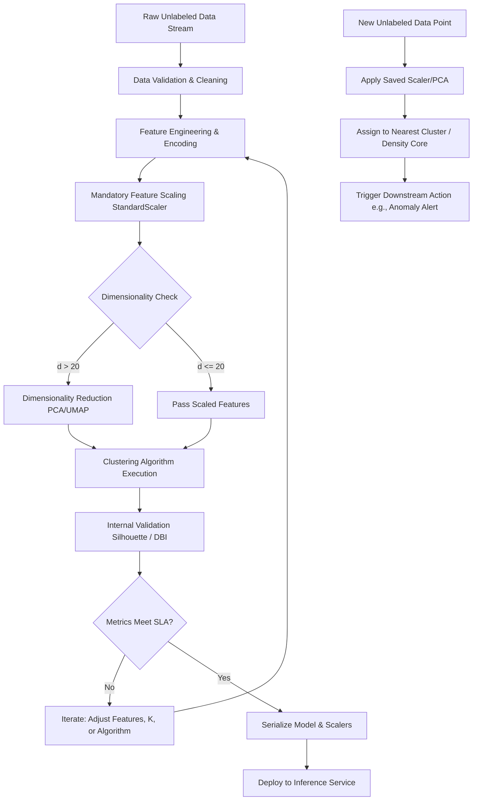

# 12. System Architecture: Unsupervised Learning Pipeline

```mermaid
flowchart TD
    A[Raw Unlabeled Data Stream] --> B[Data Validation & Cleaning]
    B --> C[Feature Engineering & Encoding]
    C --> D[Mandatory Feature Scaling StandardScaler]
    D --> E{Dimensionality Check}
    E -->|d > 20| F[Dimensionality Reduction PCA/UMAP]
    E -->|d <= 20| G[Pass Scaled Features]
    F --> H[Clustering Algorithm Execution]
    G --> H
    H --> I[Internal Validation Silhouette / DBI]
    I --> J{Metrics Meet SLA?}
    J -->|No| K[Iterate: Adjust Features, K, or Algorithm]
    K --> C
    J -->|Yes| L[Serialize Model & Scalers]
    L --> M[Deploy to Inference Service]
    
    N[New Unlabeled Data Point] --> O[Apply Saved Scaler/PCA]
    O --> P[Assign to Nearest Cluster / Density Core]
    P --> Q[Trigger Downstream Action e.g., Anomaly Alert]
```
