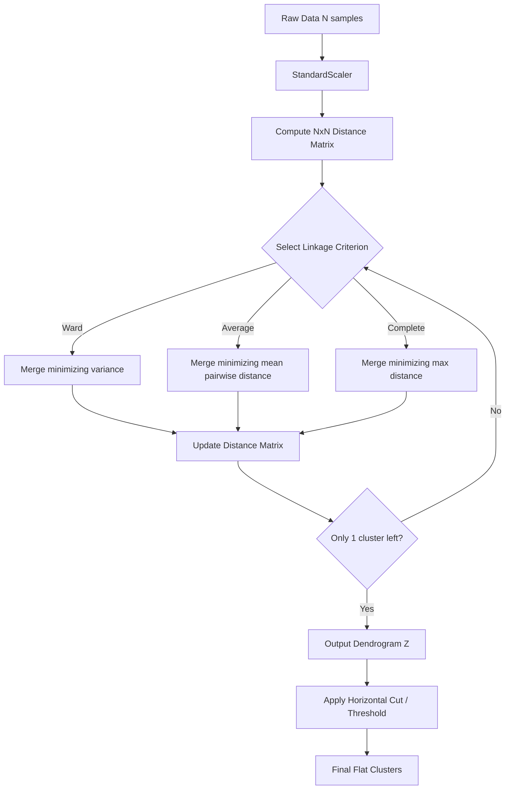

# Hierarchical Clustering: Agglomerative Methods & Linkage Criteria

The transcript you provided is mostly accurate, but it glosses over a critical technical distinction: it conflates **Average Linkage** with **Centroid Linkage**. Average linkage (specifically UPGMA) calculates the mean distance between *all* pairs of points across two clusters. Centroid linkage calculates the distance between the *centroids* (means) of the two clusters. In high-dimensional or irregularly shaped data, these behave very differently. We will clarify this and build a rigorous, production-grade understanding of Hierarchical Clustering.

> [!IMPORTANT]
> Hierarchical Clustering does not require you to specify the number of clusters ($K$) upfront. Instead, it builds a hierarchy (a tree) of clusters. You decide where to "cut" the tree to get your final flat clusters based on business logic or a distance threshold.

## 1. Concept Introduction

Hierarchical clustering comes in two flavors:
1. **Agglomerative (Bottom-Up)**: Starts with $N$ data points as $N$ individual clusters. Iteratively merges the two closest clusters until only one giant cluster remains. (This is the industry standard and the focus of the transcript).
2. **Divisive (Top-Down)**: Starts with all data points in one cluster. Iteratively splits the most heterogeneous cluster until each point is isolated. (Computationally expensive, rarely used in practice).

The core of agglomerative clustering is the **Linkage Criterion**, which defines how we measure the distance between two *clusters* (which contain multiple points), not just two individual points.

## 2. Intuition: The Corporate Merger

Imagine 100 small startups. 
- Day 1: 100 independent companies.
- Day 100: The two most similar startups merge based on shared technology (Single Linkage) or shared market fit (Complete Linkage). 
- Day 500: You now have 50 larger companies. You repeat the process, merging the two most similar entities.
- Day 10,000: One massive monopoly. 

A **Dendrogram** is simply the organizational chart of this merger history. The height at which two branches merge represents the "cost" or "distance" of that merger.

## 3 & 4. Mathematical Explanation & Formula Breakdowns

Let $A$ and $B$ be two clusters. Let $d(x, y)$ be the distance (usually Euclidean) between point $x \in A$ and point $y \in B$.

### Single Linkage (Minimum Distance)
Merges clusters based on the closest pair of points between them.
$$
D_{\text{single}}(A, B) = \min_{x \in A, y \in B} d(x, y)
$$
*Behavior*: Prone to the "chaining" effect, where clusters are merged just because a single outlier bridges them, resulting in long, stringy clusters.

### Complete Linkage (Maximum Distance)
Merges clusters based on the farthest pair of points between them.
$$
D_{\text{complete}}(A, B) = \max_{x \in A, y \in B} d(x, y)
$$
*Behavior*: Tends to produce compact, spherical clusters of roughly equal diameter. Highly sensitive to outliers.

### Average Linkage (UPGMA - Unweighted Pair Group Method with Arithmetic Mean)
Merges clusters based on the average distance between *all* pairs of points across the two clusters.
$$
D_{\text{average}}(A, B) = \frac{1}{|A| \cdot |B|} \sum_{x \in A} \sum_{y \in B} d(x, y)
$$
*Behavior*: A robust compromise between single and complete linkage. Less sensitive to outliers than complete linkage, less prone to chaining than single linkage.

### Centroid Linkage (Clarifying the Transcript)
Merges clusters based on the distance between their geometric centers (centroids).
$$
D_{\text{centroid}}(A, B) = d(\mu_A, \mu_B) \quad \text{where} \quad \mu_A = \frac{1}{|A|}\sum_{x \in A} x
$$
*Behavior*: Computationally efficient, but can suffer from "inversions" in the dendrogram (a merge happens at a lower distance than a previous merge), which violates the ultrametric property of trees.

### Ward’s Linkage (The Industry Standard)
Minimizes the total within-cluster variance. It merges the pair of clusters that results in the minimum increase in total within-cluster sum of squares (WCSS).
$$
D_{\text{ward}}(A, B) = \frac{|A| \cdot |B|}{|A| + |B|} ||\mu_A - \mu_B||^2
$$
*Behavior*: Produces highly compact, spherical clusters. Mathematically closely related to the K-Means objective function.

## 5. Step-by-Step Derivations (Agglomerative Process)

Given a dataset of 4 points: $P_1, P_2, P_3, P_4$.
1. **Initialization**: Compute the $4 \times 4$ pairwise distance matrix $D$. Each point is its own cluster: $\{P_1\}, \{P_2\}, \{P_3\}, \{P_4\}$.
2. **Find Minimum**: Scan $D$ to find the smallest distance. Suppose $d(P_2, P_3)$ is the minimum.
3. **Merge**: Create a new cluster $C_1 = \{P_2, P_3\}$. Record this merge at height $h = d(P_2, P_3)$ in the dendrogram.
4. **Update Distance Matrix**: Remove rows/cols for $P_2$ and $P_3$. Add a new row/col for $C_1$. Calculate distances from $C_1$ to $P_1$ and $P_4$ using the chosen linkage formula (e.g., Average Linkage).
5. **Repeat**: Find the new minimum in the updated $3 \times 3$ matrix. Merge. Update. Repeat until $1 \times 1$ matrix remains.

## 6. Real-World Analogies

**Phylogenetic Trees**: Biologists use hierarchical clustering to group species based on DNA sequence similarity. Single linkage might group a bat and a bird because they both fly (one shared trait), while complete or average linkage correctly groups the bat with mammals based on overall genetic distance.

## 7 & 8. Python Implementations & Simulations

We will use `scipy` for the dendrogram visualization (it is far superior to `sklearn` for plotting trees) and `sklearn` for extracting the actual cluster labels.

```python
import numpy as np
import matplotlib.pyplot as plt
from sklearn.datasets import make_blobs
from sklearn.cluster import AgglomerativeClustering
from scipy.cluster.hierarchy import dendrogram, linkage, fcluster
import warnings
warnings.filterwarnings('ignore')

# 1. Generate Synthetic Data (3 natural clusters)
X, y_true = make_blobs(n_samples=50, centers=3, cluster_std=0.8, random_state=42)

# 2. Compute the Linkage Matrix using SciPy
# 'ward' minimizes variance, 'average' is UPGMA, 'complete' is max distance
Z = linkage(X, method='ward', metric='euclidean')

# 3. Visualize the Dendrogram
plt.figure(figsize=(10, 6))
dendrogram(
    Z,
    truncate_mode='level',  # Show only the last p levels of the tree
    p=10,
    leaf_rotation=90.,
    leaf_font_size=8.,
    color_threshold=15  # Color branches based on distance threshold
)
plt.title('Hierarchical Clustering Dendrogram (Ward Linkage)')
plt.xlabel('Sample Index')
plt.ylabel('Distance (Merge Height)')
plt.axhline(y=15, color='r', linestyle='--', label='Cut-off Threshold')
plt.legend()
plt.show()

# 4. Extract Flat Clusters from the Dendrogram
# Method A: Specify the number of clusters (n_clusters)
agglo_sklearn = AgglomerativeClustering(n_clusters=3, linkage='ward')
labels_n = agglo_sklearn.fit_predict(X)

# Method B: Specify a distance threshold (height on the dendrogram)
# fcluster returns cluster labels based on the linkage matrix Z
labels_dist = fcluster(Z, t=15, criterion='distance')

print(f"Clusters by n_clusters=3: {np.unique(labels_n)}")
print(f"Clusters by distance threshold=15: {np.unique(labels_dist)}")

# 5. Visualize the resulting clusters
plt.figure(figsize=(8, 6))
plt.scatter(X[:, 0], X[:, 1], c=labels_n, cmap='viridis', s=50)
plt.title('Final Clusters Extracted from Hierarchical Clustering')
plt.xlabel('Feature 1')
plt.ylabel('Feature 2')
plt.show()
```

## 9. Practical Engineering Examples

* **Document Clustering / NLP**: Grouping thousands of support tickets. You compute TF-IDF vectors, calculate cosine distance, and use Average Linkage. The dendrogram allows product managers to visually inspect the tree and choose a cut-off that yields, say, 12 meaningful topic groups, rather than forcing a rigid $K=12$ with K-MMeans.
* **Supply Chain Optimization**: Grouping retail stores based on geographic distance and sales volume similarity to optimize regional warehouse placement.

## 10. Common Mistakes & Traps

> [!WARNING]
> **Trap 1: Forgetting to scale the data.** 
> Just like K-Means, hierarchical clustering relies on distance metrics. If Feature A is in thousands and Feature B is in decimals, Feature A will entirely dictate the linkage. Always `StandardScaler` first.

> [!WARNING]
> **Trap 2: Using Single Linkage on noisy data.**
> Single linkage will create a "chaining" effect, merging distinct clusters because of a single noisy bridge point. Your dendrogram will look like a long, flat comb, and your clusters will be meaningless.

> [!WARNING]
> **Trap 3: Applying it to large datasets.**
> Hierarchical clustering has $O(N^2)$ space complexity (to store the distance matrix) and $O(N^3)$ time complexity naively. If $N > 10,000$, your code will likely crash with an Out-Of-Memory (OOM) error.

## 11 & 12. Visual Intuition & System Architecture

Reading a dendrogram is a specific skill. 
- **X-axis**: Individual data points (leaves). Their order is permuted by the plotting algorithm to prevent branches from crossing; the order itself has no inherent meaning.
- **Y-axis**: The distance (or variance increase) at which two clusters were merged. 
- **The Cut**: Drawing a horizontal line across the dendrogram. Every vertical line it intersects represents a final cluster.



## 13 & 14. Real-World Applications & ML Connections

* **K-Means Initialization**: Running K-Means on a massive dataset can get stuck in poor local minima. A common advanced tactic is to run Hierarchical Clustering on a *random subsample* of the data, find the centroids of those hierarchical clusters, and use those centroids as the initial `init` points for K-Means on the full dataset.
* **Anomaly Detection**: Points that merge at the very top of the dendrogram (at a very high distance threshold) are fundamentally different from the rest of the data. They are prime candidates for anomaly detection.

## 15. Interview-Style Insights

**Interviewer:** "What is the time and space complexity of Agglomerative Clustering?"
**You:** "Naively, it is $O(N^3)$ time and $O(N^2)$ space. The space complexity comes from storing the $N \times N$ distance matrix. The time complexity comes from scanning the matrix to find the minimum distance at each of the $N-1$ merge steps. However, with optimized algorithms like SLINK (for single linkage) or using priority queues (heaps), the time complexity can be reduced to $O(N^2 \log N)$."

**Interviewer:** "When would you choose Hierarchical Clustering over K-Means?"
**You:** "When the dataset is small to medium-sized, when I don't know the number of clusters $K$ and need the interpretability of a dendrogram to let stakeholders choose a cut-off, or when the clusters are expected to have a nested, hierarchical structure (like biological taxonomies). I would avoid it for large-scale, high-dimensional data where K-Means or DBSCAN is more appropriate."

## 16. Edge Cases & Failure Modes

* **The Chaining Phenomenon**: Exclusive to Single Linkage. Two large, distinct spherical clusters will be merged prematurely if a single line of points connects them.
* **Inversions**: Exclusive to Centroid and Median linkage. A merge might appear *lower* on the dendrogram than a previous merge, breaking the visual intuition of the tree. Ward and Complete linkage guarantee no inversions (they are ultrametric).

## 17 & 18. Mental Models & Performance/Computational Insights

**Mental Model: The Distance Matrix Shrinkage**
Think of the algorithm not as moving points in space, but as iteratively shrinking a matrix. You start with an $N \times N$ matrix. At each step, you delete two rows/columns and insert one new row/column, making it $(N-1) \times (N-1)$. The "cost" of the algorithm is entirely dominated by how fast you can update this matrix.

**Computational Reality Check**:
If $N = 100,000$:
- Distance matrix size: $100,000 \times 100,000 \times 8$ bytes (float64) $\approx 80$ GB of RAM. 
- This is why `sklearn.cluster.AgglomerativeClustering` has a `memory` parameter (to cache computations to disk) and why you should almost never run this on raw data with $N > 10,000$ without dimensionality reduction or subsampling.

## 19. Advanced Notes

If you need hierarchical clustering on millions of rows, standard agglomerative clustering is impossible. You must use approximations:
1. **BIRCH (Balanced Iterative Reducing and Clustering using Hierarchies)**: Builds a Clustering Feature (CF) Tree. It compresses the data into sub-clusters on the fly, requiring only a single scan of the dataset. Time complexity is $O(N)$.
2. **HDBSCAN**: While technically a density-based algorithm, it builds a hierarchy of clusters based on density reachability and then extracts flat clusters. It scales much better than naive agglomerative clustering and doesn't require specifying $K$ or a global distance threshold.

## 20. Final Takeaways & Roadmap

### Key Takeaways
* Agglomerative clustering is bottom-up: $N$ clusters $\rightarrow$ 1 cluster.
* **Linkage matters**: Use **Ward** for compact, K-Means-like clusters. Use **Average** for a robust middle ground. Avoid **Single** linkage due to chaining.
* The **Dendrogram** is your primary debugging and communication tool. Use the height of the merge to determine cluster distinctness.
* Space complexity is $O(N^2)$. Do not run this on massive datasets without subsampling or using BIRCH.

### Common Traps to Avoid
* Feeding unscaled data into the distance metric.
* Misinterpreting the x-axis of a dendrogram (the left-to-right order of leaves is arbitrary and optimized for non-crossing lines).
* Using Centroid linkage and getting confused by dendrogram inversions.

### Interview Questions to Drill
1. Explain the "chaining effect" and which linkage criterion causes it.
2. Derive the space complexity of Agglomerative Clustering.
3. How does Ward's linkage mathematically relate to the K-Means objective function?
4. How would you extract exactly 5 clusters from a SciPy linkage matrix?

### Advanced Learning Roadmap
1. **Next Step**: Implement the `kneed` or `scipy.cluster.hierarchy.inconsistent` methods to *programmatically* find the optimal cut-off height on a dendrogram, removing human subjectivity.
2. **Next Step**: Study the **BIRCH** algorithm to understand how to scale hierarchical concepts to big data.
3. **Next Step**: Explore **HDBSCAN** to see how modern libraries combine hierarchical tree-building with density-based cluster extraction.

### Recommended Python Libraries
* `scipy.cluster.hierarchy`: The absolute gold standard for computing linkage matrices and plotting dendrograms.
* `sklearn.cluster.AgglomerativeClustering`: Best for extracting the final flat cluster labels efficiently.
* `fastcluster`: A drop-in C++ accelerated replacement for `scipy.cluster.hierarchy.linkage`. If you are hitting the $N=10,000$ wall, `import fastcluster as hc` will give you a massive speedup with zero code changes.
