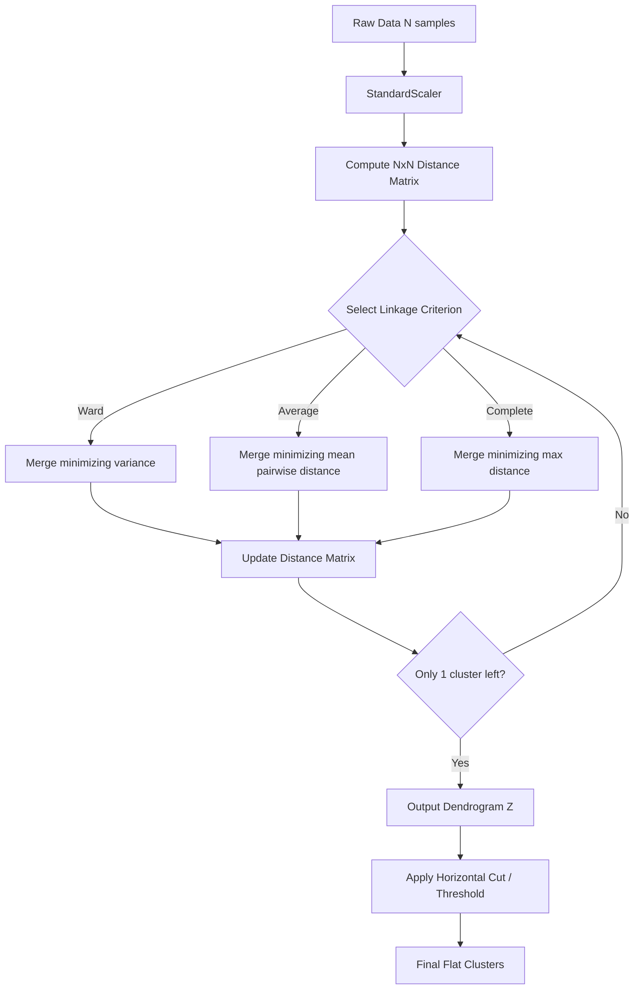

# 11 & 12. Visual Intuition & System Architecture

Reading a dendrogram is a specific skill. 
- **X-axis**: Individual data points (leaves). Their order is permuted by the plotting algorithm to prevent branches from crossing; the order itself has no inherent meaning.
- **Y-axis**: The distance (or variance increase) at which two clusters were merged. 
- **The Cut**: Drawing a horizontal line across the dendrogram. Every vertical line it intersects represents a final cluster.

