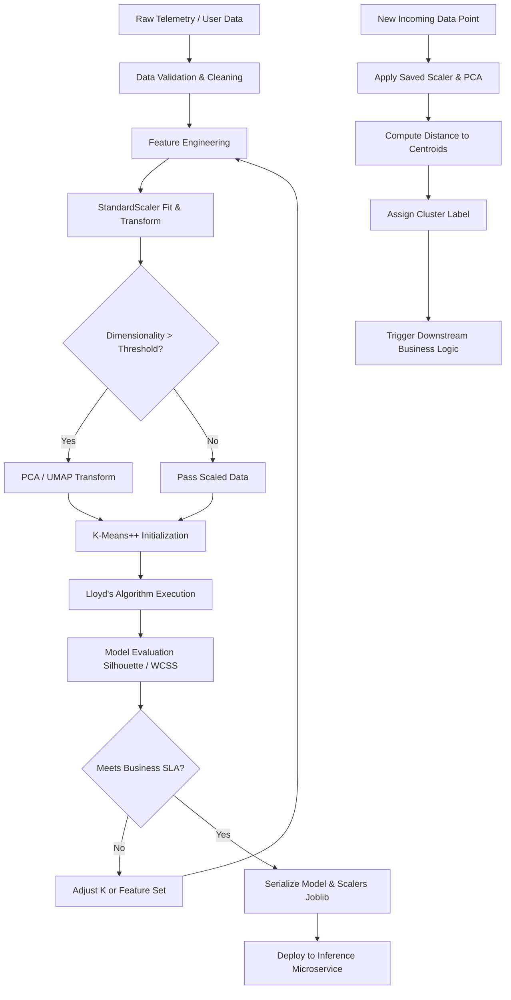

# K-Means Clustering: Algorithmic Foundations, Optimization, and Production Constraints

This document provides a rigorous technical analysis of the K-Means clustering algorithm. It details the mathematical formulation, algorithmic execution, computational complexity, and critical engineering constraints required for production deployment. 

> [!IMPORTANT]
> K-Means is a centroid-based, hard-assignment partitioning algorithm. It optimizes the Within-Cluster Sum of Squares (WCSS) objective function. It is fundamentally constrained to identifying convex, isotropic cluster geometries and requires explicit definition of the cluster count ($K$).

## 1. Mathematical Formulation

The objective of K-Means is to partition a dataset $X = \{x_1, x_2, \dots, x_N\}$, where $x_i \in \mathbb{R}^d$, into $K$ disjoint clusters $C = \{C_1, C_2, \dots, C_K\}$ such that the within-cluster variance is minimized.

The objective function (often referred to as inertia or WCSS) is defined as:

$$
J(C, \mu) = \sum_{k=1}^{K} \sum_{x_i \in C_k} ||x_i - \mu_k||_2^2
$$

Where:
*   $K$ is the predefined number of clusters.
*   $\mu_k \in \mathbb{R}^d$ is the centroid (mean vector) of cluster $C_k$.
*   $||x_i - \mu_k||_2^2$ is the squared Euclidean distance between a data point and its assigned centroid.

Minimizing $J$ is an NP-hard problem in the general case. Therefore, production implementations rely on heuristic iterative optimization algorithms to find a local minimum.

## 2. Algorithmic Execution: Lloyd's Algorithm

The standard approach to optimizing the objective function is Lloyd's Algorithm, which operates as an Expectation-Maximization (EM) procedure. The algorithm alternates between two steps until convergence.

### Step 1: Expectation (Assignment Step)
Given a set of current centroids $\mu = \{\mu_1, \dots, \mu_K\}$, assign each data point to the cluster with the nearest centroid. This partitions the feature space into a Voronoi tessellation.

$$
C_k^{(t)} = \{ x_i : ||x_i - \mu_k^{(t)}||_2^2 \le ||x_i - \mu_j^{(t)}||_2^2 \text{ for all } j \neq k \}
$$

### Step 2: Maximization (Update Step)
Given the current cluster assignments $C^{(t)}$, recalculate the centroids as the empirical mean of all data points assigned to each cluster.

$$
\mu_k^{(t+1)} = \frac{1}{|C_k^{(t)}|} \sum_{x_i \in C_k^{(t)}} x_i
$$

### Convergence Criteria
The algorithm iterates until one of the following conditions is met:
1.  Centroid movement falls below a predefined threshold: $||\mu^{(t+1)} - \mu^{(t)}||_2 < \epsilon$.
2.  Cluster assignments remain unchanged between iterations.
3.  A maximum iteration limit (`max_iter`) is reached.

> [!NOTE]
> Because the objective function $J$ is non-increasing at each iteration and bounded below by zero, Lloyd's Algorithm is mathematically guaranteed to converge to a local minimum. It does not guarantee convergence to the global minimum.

## 3. Initialization Strategies

The convergence point and the quality of the local minimum are highly sensitive to the initial placement of centroids. 

### Random Initialization (Forgy Method)
Selecting $K$ data points uniformly at random from the dataset. This approach is computationally cheap but frequently results in poor local minima, empty clusters, and slow convergence. It is deprecated in modern production pipelines.

### K-Means++ Initialization
K-Means++ mitigates the sensitivity to initialization by spreading the initial centroids. The algorithm proceeds as follows:
1.  Select the first centroid $\mu_1$ uniformly at random from the data points.
2.  For each data point $x_i$, compute $D(x_i)$, the shortest distance to any already chosen centroid.
3.  Select the next centroid $\mu_j$ from the remaining data points with a probability proportional to the squared distance:

$$
P(x_i \text{ is chosen}) = \frac{D(x_i)^2}{\sum_{x' \in X} D(x')^2}
$$

4.  Repeat steps 2 and 3 until $K$ centroids are initialized.

> [!TIP]
> Production implementations must default to `init='k-means++'`. Furthermore, executing the algorithm multiple times with different random seeds (`n_init=10` or higher) and retaining the run with the lowest final inertia is required to ensure stability.

## 4. Computational Complexity

Let $N$ be the number of samples, $d$ be the number of dimensions, $K$ be the number of clusters, and $I$ be the number of iterations.

*   **Time Complexity**: $O(I \cdot K \cdot N \cdot d)$. 
    *   The assignment step requires computing the distance between $N$ points and $K$ centroids in $d$ dimensions. 
    *   The update step requires computing the mean of $N$ points in $d$ dimensions.
    *   The algorithm scales linearly with respect to $N$, making it suitable for large datasets.
*   **Space Complexity**: $O(N \cdot d + K \cdot d)$.
    *   Requires storing the dataset and the centroids. Unlike hierarchical clustering, it does not require an $O(N^2)$ pairwise distance matrix.

## 5. Production Constraints and Failure Modes

### 5.1. The Convexity Constraint (Voronoi Limitations)
K-Means partitions space using linear decision boundaries (hyperplanes). Consequently, it can only identify clusters that are convex and isotropic (spherical in Euclidean space). 
*   **Failure Mode**: If the underlying data distribution consists of non-convex manifolds (e.g., concentric rings, interleaving moons), K-Means will artificially bisect the structures to satisfy its geometric constraints. 
*   **Mitigation**: For non-convex data, utilize Density-Based Spatial Clustering (DBSCAN) or Spectral Clustering.

### 5.2. Feature Scaling Imperative
The objective function relies on Euclidean distance. Features with larger numerical ranges will disproportionately dominate the distance calculations.
*   **Requirement**: All continuous features must be standardized (e.g., $z$-score normalization) or min-max scaled prior to algorithm execution.

### 5.3. The Curse of Dimensionality
In high-dimensional spaces, the contrast between the nearest and farthest data points diminishes. The ratio of the distance to the nearest neighbor to the distance to the farthest neighbor approaches 1.0.
*   **Consequence**: Euclidean distance loses its discriminative power, rendering K-Means assignments effectively random.
*   **Mitigation**: Apply dimensionality reduction techniques (e.g., PCA, UMAP) or feature selection to reduce $d$ before clustering, particularly when $d > 20$.

### 5.4. Categorical Data Incompatibility
The arithmetic mean is undefined for categorical variables. 
*   **Mitigation**: For datasets containing categorical features, utilize K-Modes (which uses the mode and Hamming distance) or K-Prototypes (a hybrid of K-Means and K-Modes).

## 6. Production-Grade Python Implementation

The following implementation demonstrates a robust, enterprise-ready pipeline for K-Means clustering, incorporating scaling, K-Means++ initialization, multiple restarts, and programmatic evaluation.

```python
import numpy as np
import pandas as pd
import logging
from typing import Tuple, List, Dict
from sklearn.cluster import KMeans
from sklearn.preprocessing import StandardScaler
from sklearn.metrics import silhouette_score, silhouette_samples
from sklearn.decomposition import PCA

# Configure logging for production environments
logging.basicConfig(level=logging.INFO, format='%(asctime)s - %(levelname)s - %(message)s')
logger = logging.getLogger(__name__)

class ProductionKMeansPipeline:
    """
    A robust, production-grade pipeline for K-Means clustering.
    Handles scaling, dimensionality reduction, initialization, and evaluation.
    """
    
    def __init__(self, k_range: Tuple[int, int] = (2, 10), n_init: int = 10, random_state: int = 42):
        self.k_range = k_range
        self.n_init = n_init
        self.random_state = random_state
        self.scaler = StandardScaler()
        self.pca = None
        self.optimal_k = None
        self.best_model = None
        
    def _preprocess(self, X: np.ndarray, apply_pca: bool = True, variance_threshold: float = 0.95) -> np.ndarray:
        """Scales data and optionally applies PCA to mitigate the curse of dimensionality."""
        logger.info("Applying StandardScaler...")
        X_scaled = self.scaler.fit_transform(X)
        
        if apply_pca and X_scaled.shape[1] > 10:
            logger.info(f"High dimensionality detected (d={X_scaled.shape[1]}). Applying PCA...")
            self.pca = PCA(n_components=variance_threshold, random_state=self.random_state)
            X_processed = self.pca.fit_transform(X_scaled)
            logger.info(f"PCA reduced dimensions to {X_processed.shape[1]} (retaining {variance_threshold*100}% variance).")
        else:
            X_processed = X_scaled
            
        return X_processed

    def evaluate_k(self, X: np.ndarray) -> pd.DataFrame:
        """Evaluates WCSS and Silhouette Score across a range of K values."""
        X_processed = self._preprocess(X)
        metrics = []
        
        logger.info(f"Evaluating K in range {self.k_range}...")
        for k in range(self.k_range[0], self.k_range[1] + 1):
            # Enforce K-Means++ and multiple initializations for stability
            model = KMeans(
                n_clusters=k, 
                init='k-means++', 
                n_init=self.n_init, 
                max_iter=300, 
                random_state=self.random_state
            )
            labels = model.fit_predict(X_processed)
            
            wcss = model.inertia_
            # Silhouette score requires at least 2 clusters
            sil_score = silhouette_score(X_processed, labels) if k > 1 else -1.0 
            
            metrics.append({
                'K': k,
                'WCSS': wcss,
                'Silhouette_Score': sil_score
            })
            logger.info(f"K={k}: WCSS={wcss:.2f}, Silhouette={sil_score:.4f}")
            
        return pd.DataFrame(metrics)

    def fit_optimal(self, X: np.ndarray, target_k: int = None) -> KMeans:
        """Fits the final model using the specified or optimal K."""
        X_processed = self._preprocess(X)
        
        if target_k is None:
            raise ValueError("Target K must be specified based on prior evaluation.")
            
        self.optimal_k = target_k
        logger.info(f"Fitting final K-Means model with K={self.optimal_k}...")
        
        self.best_model = KMeans(
            n_clusters=self.optimal_k,
            init='k-means++',
            n_init=self.n_init,
            max_iter=300,
            random_state=self.random_state
        )
        self.best_model.fit(X_processed)
        return self.best_model

# Example Execution Block
if __name__ == "__main__":
    # Simulated enterprise dataset
    from sklearn.datasets import make_blobs
    X_data, _ = make_blobs(n_samples=5000, centers=5, cluster_std=1.5, random_state=42)
    
    pipeline = ProductionKMeansPipeline(k_range=(2, 8), n_init=10)
    
    # 1. Evaluate to find optimal K
    metrics_df = pipeline.evaluate_k(X_data)
    
    # 2. Select K (In production, this logic might use the KneeLocator or max Silhouette)
    optimal_k = metrics_df.loc[metrics_df['Silhouette_Score'].idxmax(), 'K']
    
    # 3. Fit final model
    final_model = pipeline.fit_optimal(X_data, target_k=optimal_k)
    logger.info(f"Pipeline complete. Optimal K selected: {optimal_k}")
```

## 7. Advanced Variants and Scaling

For datasets that exceed the memory or computational limits of standard Lloyd's Algorithm, the following variants are required.

### Mini-Batch K-Means
Instead of computing distances against the entire dataset, Mini-Batch K-Means uses small, random subsets (batches) of the data to update the centroids.
*   **Advantage**: Reduces time complexity by a factor of 10 to 100. Highly suitable for streaming data or datasets where $N > 1,000,000$.
*   **Trade-off**: The final inertia is typically slightly higher (worse) than standard K-Means, but the computational savings usually justify the marginal loss in optimization quality.

### Kernel K-Means
To address the convexity constraint, the data can be implicitly mapped to a higher-dimensional feature space using a kernel function (e.g., Radial Basis Function).
*   **Mechanism**: The dot product in the assignment step is replaced by a kernel evaluation $K(x_i, \mu_k)$.
*   **Result**: Allows the algorithm to identify non-linear, non-convex cluster boundaries in the original feature space.

## 8. System Architecture: Clustering Pipeline

A robust deployment architecture for clustering in an enterprise environment requires decoupling the training pipeline from the inference pipeline.



## 9. Summary of Engineering Directives

1.  **Never use random initialization.** Mandate `init='k-means++'` and `n_init >= 10` in all codebases.
2.  **Mandatory Preprocessing.** Euclidean distance requires standardized features. Omission of `StandardScaler` invalidates the mathematical premise of the algorithm.
3.  **Beware the Dimensionality Threshold.** If $d$ is large, apply PCA. Distance metrics degrade in high-dimensional spaces.
4.  **Verify Geometric Assumptions.** K-Means is strictly for convex, isotropic clusters. If domain knowledge suggests complex manifolds, transition to DBSCAN or HDBSCAN.
5.  **Programmatic Evaluation.** Do not rely on visual inspection of the Elbow method. Implement automated selection using Silhouette maximization or the `kneed` algorithm for the WCSS curve.
