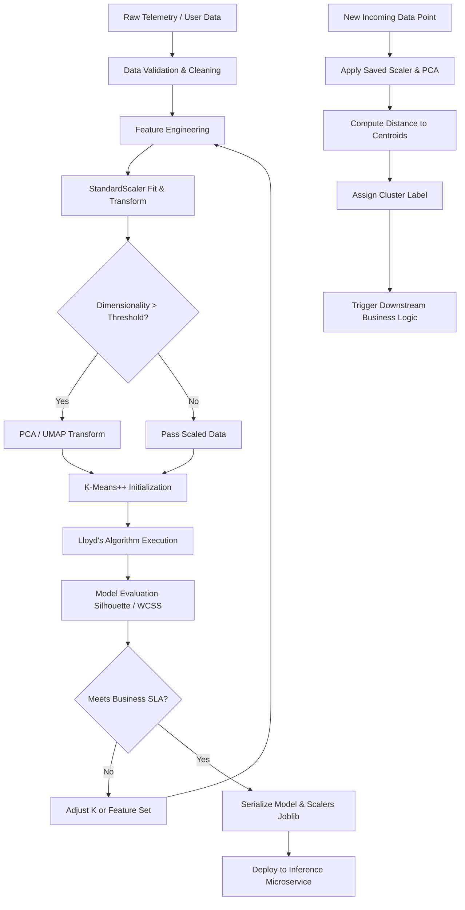

# 8. System Architecture: Clustering Pipeline

A robust deployment architecture for clustering in an enterprise environment requires decoupling the training pipeline from the inference pipeline.

```mermaid
flowchart TD
    A[Raw Telemetry / User Data] --> B[Data Validation & Cleaning]
    B --> C[Feature Engineering]
    C --> D[StandardScaler Fit & Transform]
    D --> E{Dimensionality > Threshold?}
    E -->|Yes| F[PCA / UMAP Transform]
    E -->|No| G[Pass Scaled Data]
    F --> H[K-Means++ Initialization]
    G --> H
    H --> I[Lloyd's Algorithm Execution]
    I --> J[Model Evaluation Silhouette / WCSS]
    J --> K{Meets Business SLA?}
    K -->|No| L[Adjust K or Feature Set]
    L --> C
    K -->|Yes| M[Serialize Model & Scalers Joblib]
    M --> N[Deploy to Inference Microservice]
    
    O[New Incoming Data Point] --> P[Apply Saved Scaler & PCA]
    P --> Q[Compute Distance to Centroids]
    Q --> R[Assign Cluster Label]
    R --> S[Trigger Downstream Business Logic]
```
