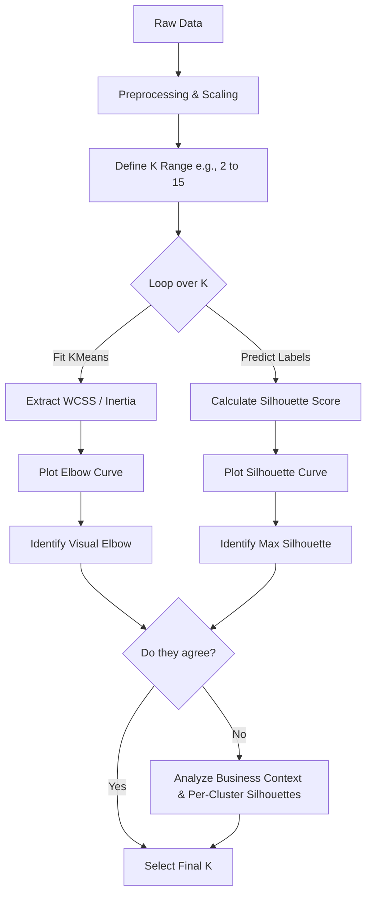

# Choosing the Optimal Number of Clusters (K) in K-Means

Before we dive into the math and code, we need to clear up a massive terminology gap in your transcript. The transcript refers to the "ELBO curve." That is incorrect in this context. ELBO stands for Evidence Lower Bound, which is used in Variational Inference and VAEs. What the transcript is actually describing is the **Elbow Method**, which plots the Within-Cluster Sum of Squares (WCSS). 

If you use "ELBO" in a machine learning interview when talking about K-Means, you will fail that question. We are talking about the Elbow Method and the Silhouette Score. Let's fix that mental model right now and get into the actual engineering.

> [!IMPORTANT]
> K is a hyperparameter in K-Means. The algorithm does not learn K; you must define it. Choosing K is an optimization problem balancing model complexity (number of clusters) against error (variance within clusters).

## 1. Concept Introduction

K-Means partitions $N$ data points into $K$ distinct, non-overlapping clusters. The core objective of K-Means is to minimize the variance within each cluster. But how do you know if $K=3$ is better than $K=5$? 

You cannot just look at the training error, because as $K \to N$, the error goes to zero (every point is its own cluster). That is pure overfitting. We need heuristic and statistical methods to find the "sweet spot" where adding more clusters no longer yields a meaningful reduction in information loss. The two industry standards for this are the Elbow Method and the Silhouette Score.

## 2. Intuition: The Goldilocks Problem

Think of clustering like organizing a massive networking event. 
* If you have too few rooms (small K), the rooms are chaotic, and people with completely different interests are forced together. The internal variance is high.
* If you have too many rooms (large K), each room has only two people. The internal variance is zero, but you haven't actually grouped anyone; you've just isolated them.
* The "elbow" is the exact number of rooms where adding one more room suddenly stops making the parties inside significantly more cohesive. 

## 3 & 4. Mathematical Explanation & Formula Breakdowns

### The Elbow Method (WCSS / Inertia)

The Elbow Method relies on Within-Cluster Sum of Squares (WCSS), also called Inertia in Scikit-Learn. We want to minimize the squared distance between every point in a cluster and the centroid of that cluster.

$$
WCSS = \sum_{k=1}^{K} \sum_{x_i \in C_k} ||x_i - \mu_k||^2
$$

Where:
* $K$ is the total number of clusters.
* $C_k$ is the set of data points in the $k$-th cluster.
* $x_i$ is a specific data point.
* $\mu_k$ is the centroid (mean) of the $k$-th cluster.
* $||x_i - \mu_k||^2$ is the squared Euclidean distance.

### The Silhouette Score

The Silhouette Score measures both **cohesion** (how close a point is to its own cluster) and **separation** (how far a point is from the nearest neighboring cluster). 

For a single data point $i$:
1. Calculate $a(i)$: The mean distance between $i$ and all other points in the same cluster. (Lower is better).
2. Calculate $b(i)$: The mean distance between $i$ and all points in the *nearest* neighboring cluster. (Higher is better).

The Silhouette coefficient $s(i)$ for a single point is:

$$
s(i) = \frac{b(i) - a(i)}{\max(a(i), b(i))}
$$

The overall Silhouette Score is the mean of $s(i)$ for all points. The value is bounded between -1 and 1.
* **Close to 1:** The point is well-matched to its own cluster and far from other clusters.
* **Close to 0:** The point is on the decision boundary between two clusters.
* **Close to -1:** The point has been assigned to the wrong cluster.

## 5. Step-by-Step Derivations & Geometric Intuition

Let's break down why the Elbow curve bends. 
When $K=1$, WCSS is just the total variance of the dataset. It is at its maximum.
When you move to $K=2$, K-Means splits the data along the axis of highest variance. WCSS drops drastically.
As you increment $K$, the algorithm splits smaller and smaller sub-groups. The absolute drop in WCSS ($\Delta WCSS$) shrinks with every step. 

Geometrically, you are looking for the point of maximum curvature on the WCSS vs. K plot. Mathematically, this is where the second derivative of the WCSS curve with respect to K is maximized, though in practice, we just look for the visual "bend."

For Silhouette, the geometry is about Voronoi cells. $a(i)$ measures the radius of the point's local neighborhood within its cell. $b(i)$ measures the distance to the boundary of the adjacent cell. If $a(i) \ll b(i)$, the point is deep inside its cluster.

## 6. Real-World Analogies

**Elbow Method Analogy:** Packing for a trip. 
1 bag: You throw everything in. Hard to find things (high WCSS).
2 bags: Clothes in one, toiletries in another. Massive improvement in organization.
3 bags: Clothes, toiletries, and electronics. Noticeable improvement.
4 bags: Clothes, toiletries, electronics, and... just your chargers. The improvement from 3 to 4 bags is tiny compared to 1 to 2. The "elbow" is at 3 bags.

**Silhouette Analogy:** Evaluating your friend group.
$a(i)$ is how well you vibe with your current friends.
$b(i)$ is how well you would vibe with the closest alternative friend group.
If you vibe way better with your current group ($a \ll b$), your silhouette score is high. If you actually prefer the alternative group ($a > b$), your score is negative. You are in the wrong group.

## 7 & 8. Python Implementations & Simulations

Here is the pragmatic, production-ready code. We will generate synthetic data, implement the Elbow method, and calculate the Silhouette score.

```python
import numpy as np
import matplotlib.pyplot as plt
from sklearn.datasets import make_blobs
from sklearn.cluster import KMeans
from sklearn.metrics import silhouette_score, silhouette_samples
import warnings
warnings.filterwarnings('ignore')

# 1. Generate Synthetic Data
# We create 4 distinct clusters to see if our methods can find K=4
X, y_true = make_blobs(n_samples=1000, centers=4, cluster_std=0.60, random_state=42)

# 2. The Elbow Method Implementation
k_range = range(1, 11)
wcss = []

for k in k_range:
    kmeans = KMeans(n_clusters=k, n_init=10, random_state=42)
    kmeans.fit(X)
    wcss.append(kmeans.inertia_) # inertia_ is Scikit-Learn's WCSS

# Plotting the Elbow Curve
plt.figure(figsize=(10, 5))
plt.subplot(1, 2, 1)
plt.plot(k_range, wcss, marker='o', linestyle='--', color='b')
plt.title('The Elbow Method')
plt.xlabel('Number of Clusters (K)')
plt.ylabel('WCSS (Inertia)')
plt.xticks(k_range)
plt.grid(True, alpha=0.3)

# 3. The Silhouette Score Implementation
silhouette_avg = []

# Start from K=2 because Silhouette is undefined for K=1
for k in range(2, 11):
    kmeans = KMeans(n_clusters=k, n_init=10, random_state=42)
    cluster_labels = kmeans.fit_predict(X)
    score = silhouette_score(X, cluster_labels)
    silhouette_avg.append(score)

# Plotting the Silhouette Curve
plt.subplot(1, 2, 2)
plt.plot(range(2, 11), silhouette_avg, marker='s', linestyle='--', color='g')
plt.title('Silhouette Score Analysis')
plt.xlabel('Number of Clusters (K)')
plt.ylabel('Silhouette Score')
plt.xticks(range(2, 11))
plt.grid(True, alpha=0.3)

plt.tight_layout()
plt.show()
```

### Advanced Silhouette Visualization
In production, just looking at the average score isn't enough. You need to look at the distribution of silhouette scores per cluster to ensure no cluster is internally fragmented.

```python
# Deep dive: Silhouette Plot for a specific K
k_optimal = 4
kmeans = KMeans(n_clusters=k_optimal, n_init=10, random_state=42)
cluster_labels = kmeans.fit_predict(X)
silhouette_avg = silhouette_score(X, cluster_labels)

fig, ax1 = plt.subplots(1, 1, figsize=(8, 6))

# Compute silhouette scores for each sample
sample_silhouette_values = silhouette_samples(X, cluster_labels)

y_lower = 10
for i in range(k_optimal):
    # Aggregate the silhouette scores for samples belonging to cluster i
    ith_cluster_silhouette_values = sample_silhouette_values[cluster_labels == i]
    ith_cluster_silhouette_values.sort()
    
    size_cluster_i = ith_cluster_silhouette_values.shape[0]
    y_upper = y_lower + size_cluster_i
    
    ax1.fill_betweenx(np.arange(y_lower, y_upper), 0, ith_cluster_silhouette_values, alpha=0.7)
    ax1.text(-0.05, y_lower + 0.5 * size_cluster_i, str(i))
    y_lower = y_upper + 10

ax1.axvline(x=silhouette_avg, color="red", linestyle="--", label=f'Mean: {silhouette_avg:.2f}')
ax1.set_title("Silhouette Plot for K = 4")
ax1.set_xlabel("Silhouette Coefficient")
ax1.set_ylabel("Cluster Label")
plt.legend()
plt.show()
```

> [!TIP]
> Always plot the per-cluster silhouette distribution (the code above). If the average score is 0.5, but one cluster has a massive negative tail, your K-Means is splitting a natural cluster in half. The average hides the failure.

## 9. Practical Engineering Examples

When do you use which method in a real ML pipeline?

**Use the Elbow Method when:**
* You are doing exploratory data analysis (EDA).
* Your dataset is massive (millions of rows). WCSS is computationally cheap because it is a byproduct of the K-Means training loop.
* You need a quick upper bound on K.

**Use the Silhouette Score when:**
* You need an objective, automated metric for a CI/CD pipeline or hyperparameter tuning grid.
* Your dataset is small to medium (under 100k rows).
* You need to validate that the clusters are actually well-separated, not just compact.

## 10. Common Mistakes & Traps

> [!WARNING]
> **Trap 1: Assuming the elbow always exists.** 
> If your data is uniformly distributed or has no natural clustering structure, the WCSS curve will be smooth and convex. There will be no elbow. Forcing an elbow here is a rookie mistake.

> [!WARNING]
> **Trap 2: Ignoring feature scaling.**
> K-Means uses Euclidean distance. If Feature A is in millions and Feature B is in decimals, Feature A will dominate the WCSS. Always use `StandardScaler` or `MinMaxScaler` before calculating K-selection metrics.

> [!WARNING]
> **Trap 3: Using Silhouette on high-dimensional data.**
> In high dimensions, the curse of dimensionality makes all Euclidean distances roughly equal. Silhouette scores will collapse to near zero, making the metric useless. Reduce dimensions with PCA or UMAP first.

## 11 & 12. Visual Intuition & System Architecture

Here is the exact pipeline you should build in your head (and in your codebase) when tuning K.



## 13 & 14. Real-World Applications & ML Connections

**Customer Segmentation:** E-commerce companies use K-Means on RFM (Recency, Frequency, Monetary) data. The Elbow method helps decide if they should target 3 broad personas or 5 highly specific niches.

**Image Compression:** K-Means is used for color quantization. An image with 16 million colors is clustered into K=16 or K=64 colors. The Elbow method finds the K where the visual degradation (WCSS) stops dropping significantly, saving massive amounts of memory.

**Anomaly Detection:** Points with a negative Silhouette score are technically closer to a different cluster than their own. In fraud detection, these misfit points are often the anomalies.

## 15. Interview-Style Insights

**Interviewer:** "The Elbow method is subjective. How do you automate it?"
**You:** "I automate it by calculating the point of maximum curvature. Geometrically, I draw a line from the first point (K=1) to the last point (K=max) on the WCSS curve. The optimal K is the point on the curve that has the maximum perpendicular distance to that line. Alternatively, I look for the K that maximizes the Silhouette score."

**Interviewer:** "What is the time complexity of calculating the Silhouette score?"
**You:** "It is $O(N^2 \cdot d)$, where N is the number of samples and d is the dimensions. Because you have to calculate the pairwise distance from every point to every other point to find $a(i)$ and $b(i)$. This is why it fails on large datasets. If N is 100,000, $N^2$ is 10 billion operations. In production, I would subsample the data to 10,000 points just to calculate the Silhouette score."

## 16. Edge Cases & Failure Modes

* **Non-Convex Clusters:** K-Means assumes clusters are spherical (convex). If your data is shaped like two concentric circles, K-Means will fail to separate them. Consequently, both the Elbow and Silhouette methods will give you garbage K values. Use DBSCAN or Spectral Clustering instead.
* **Imbalanced Cluster Sizes:** Silhouette score heavily penalizes clusters that are large and elongated. If your true data has one massive cluster and two tiny ones, Silhouette will often suggest a lower K than reality because it views the large cluster as "poorly separated."

## 17 & 18. Mental Models & Performance/Computational Insights

**Mental Model: The Pareto Frontier**
Think of the Elbow method as finding the Pareto frontier between model complexity (K) and error (WCSS). You want to move along the curve until the marginal cost of adding a new cluster (complexity) outweighs the marginal benefit (error reduction).

**Computational Complexity Breakdown:**
Let $N$ = samples, $d$ = dimensions, $K$ = clusters, $I$ = iterations.
* **K-Means Training:** $O(I \cdot K \cdot N \cdot d)$. Linear with respect to N.
* **WCSS Calculation:** $O(K \cdot N \cdot d)$. Negligible. It's calculated during the training step.
* **Silhouette Score:** $O(N^2 \cdot d)$. Quadratic with respect to N. 

> [!NOTE]
> This computational difference is the primary engineering tradeoff. Elbow is $O(N)$, Silhouette is $O(N^2)$. If you are building a real-time clustering microservice, you use Elbow. If you are doing offline batch analytics on a million rows, you subsample for Silhouette.

## 19. Advanced Notes: Beyond the Basics

If you want to sound like a principal engineer, bring up these alternatives when Elbow and Silhouette fail:

1. **The Gap Statistic:** Compares the WCSS of your data to the expected WCSS of a uniform random distribution. The optimal K is the smallest K where $Gap(K) \ge Gap(K+1) - s_{K+1}$. It is statistically rigorous but computationally heavy because it requires Monte Carlo simulations.
2. **BIC / AIC with Gaussian Mixture Models (GMM):** K-Means is actually a hard-assignment, restricted version of a GMM. If you switch to GMM (which allows for elliptical clusters), you can use the Bayesian Information Criterion (BIC) or Akaike Information Criterion (AIC) to select K. These metrics penalize model complexity mathematically, removing the "visual" subjectivity of the Elbow method entirely.

## 20. Final Takeaways & Roadmap

### Key Takeaways
* The transcript called it ELBO. It is the **Elbow Method**. Do not mix up variational inference with K-Means heuristics.
* **Elbow Method** minimizes WCSS. It is fast, $O(N)$, but subjective. Look for the bend in the curve.
* **Silhouette Score** maximizes cohesion and separation. It is objective, but slow $O(N^2)$. Look for the peak score.
* Always scale your data. Always check per-cluster Silhouette distributions, not just the global average.

### Common Traps to Avoid
* Trusting the Elbow when the curve is completely smooth (data has no structure).
* Running Silhouette on millions of rows without subsampling (your code will hang).
* Using Euclidean-based K-Means and its K-selection metrics on categorical or high-dimensional sparse data.

### Interview Questions to Drill
1. How does the curse of dimensionality affect the Silhouette score?
2. Derive the time complexity of K-Means and Silhouette.
3. How would you programmatically find the "elbow" without human visual inspection?
4. When would you choose BIC over the Elbow method?

### Advanced Learning Roadmap
1. **Next Step:** Learn Gaussian Mixture Models (GMM) and Expectation-Maximization (EM). Understand how K-Means is just a special case of GMM.
2. **Next Step:** Study Density-Based clustering (DBSCAN, HDBSCAN) to understand how to find K (or rather, density reachability) when clusters are non-convex.
3. **Next Step:** Look into the Gap Statistic implementation in Python (`kneed` library for elbows, `scikit-learn` for Silhouette).

### Recommended Python Libraries
* `scikit-learn`: The absolute standard for KMeans, silhouette_score.
* `kneed`: A great library that programmatically detects the "knee" or "elbow" point in a curve using the maximum distance to a line algorithm.
* `yellowbrick`: A visualization library that wraps Scikit-Learn and has a built-in `KElbowVisualizer` that plots both WCSS and Silhouette in one shot.

```python
# Quick example of automating the elbow with kneed
from kneed import KneeLocator

kl = KneeLocator(k_range, wcss, curve='convex', direction='decreasing')
print(f"Programmatically detected elbow at K = {kl.knee}")
```

You have the theory, the math, the code, and the engineering context. Now go build the pipeline.
