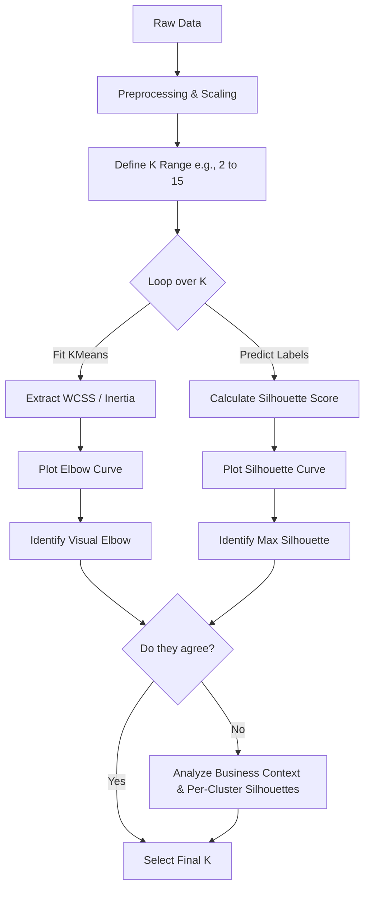

# 11 & 12. Visual Intuition & System Architecture

Here is the exact pipeline you should build in your head (and in your codebase) when tuning K.

```mermaid
flowchart TD
    A[Raw Data] --> B[Preprocessing & Scaling]
    B --> C[Define K Range e.g., 2 to 15]
    C --> D{Loop over K}
    D -->|Fit KMeans| E[Extract WCSS / Inertia]
    D -->|Predict Labels| F[Calculate Silhouette Score]
    E --> G[Plot Elbow Curve]
    F --> H[Plot Silhouette Curve]
    G --> I[Identify Visual Elbow]
    H --> J[Identify Max Silhouette]
    I --> K{Do they agree?}
    J --> K
    K -->|Yes| L[Select Final K]
    K -->|No| M[Analyze Business Context & Per-Cluster Silhouettes]
    M --> L
```
