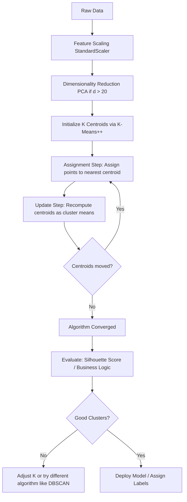

Balu, let us examine this transcript critically. It gives you a functional, surface-level map of K-Means, but it leaves the most dangerous pitfalls unexplored. It correctly identifies that K-Means partitions space and minimizes Within-Cluster Sum of Squares (WCSS), and it rightly warns you about random initialization and the assumption of spherical clusters. However, it treats these as mere "weaknesses" rather than fundamental mathematical boundaries. 

If you apply K-Means blindly to high-dimensional, non-convex data, you will not just get suboptimal results; you will generate confidently wrong conclusions. Let us strip this algorithm down to its first principles, understand exactly why it behaves the way it does, and then build the pragmatic, production-ready code to wield it correctly.

## 1. Concept Introduction

K-Means is a centroid-based, iterative algorithm that partitions a dataset into $K$ distinct, non-overlapping subsets (clusters). It is fundamentally an optimization problem. Unlike hierarchical clustering, which builds a nested taxonomy, K-Means flattens the world into $K$ distinct regions. It operates on a simple, brutal premise: every point in space belongs to the cluster whose center (centroid) is closest to it, and the center of a cluster is the arithmetic mean of all points assigned to it.

## 2. Intuition: The Illusion of the "Average"

Consider the nature of a centroid. It is a mathematical phantom. In a cluster of people, the "average" person might have 2.4 children and 1.7 cars. This average does not exist in reality, yet K-Means uses this phantom to dictate the boundaries of the entire group. 

The algorithm seeks harmony by minimizing internal conflict (variance). It pulls points toward the center, and the center toward the points, in a dance of mutual adjustment. But beware: this harmony is an illusion if the underlying reality is not harmonious. If your data forms two interlocking crescents, K-Means will violently slice them in half to force them into spherical shapes. We must not mistake the algorithm's output for the truth of the data.

## 3 & 4. Mathematical Explanation & Formula Breakdowns

The objective of K-Means is to minimize the Within-Cluster Sum of Squares (WCSS), also known as inertia. 

$$
J = \sum_{k=1}^{K} \sum_{x_i \in C_k} ||x_i - \mu_k||^2
$$

Where:
* $J$ is the objective function (WCSS) we want to minimize.
* $K$ is the number of clusters.
* $C_k$ is the set of data points assigned to the $k$-th cluster.
* $x_i$ is a specific data point.
* $\mu_k$ is the centroid of the $k$-th cluster, defined as $\mu_k = \frac{1}{|C_k|} \sum_{x_i \in C_k} x_i$.
* $||x_i - \mu_k||^2$ is the squared Euclidean distance.

This objective function reveals the core assumption: by using squared Euclidean distance, K-Means implicitly assumes that clusters are isotropic (equal variance in all directions) and Gaussian. It is blind to elongated or irregular shapes.

## 5. Step-by-Step Derivations (Lloyd's Algorithm)

The standard method for solving this is Lloyd's Algorithm, which alternates between two steps until convergence:

1. **Initialization**: Choose $K$ initial centroids $\mu_1, \mu_2, ..., \mu_K$. (The transcript mentions random choice; we will address why this is flawed shortly).
2. **Assignment Step (Expectation)**: Assign each data point $x_i$ to the cluster $C_k$ whose centroid $\mu_k$ is closest in Euclidean distance.
   $$ C_k = \{ x_i : ||x_i - \mu_k||^2 \le ||x_i - \mu_j||^2 \text{ for all } j \neq k \} $$
3. **Update Step (Maximization)**: Recalculate the centroid of each cluster as the mean of all points currently assigned to it.
   $$ \mu_k = \frac{1}{|C_k|} \sum_{x_i \in C_k} x_i $$
4. **Convergence Check**: Repeat steps 2 and 3 until the centroids no longer move (or the change in WCSS is below a tiny threshold $\epsilon$). Because the objective function $J$ is bounded below by 0 and strictly decreases at each step, the algorithm is guaranteed to converge to a *local* minimum.

## 6. Real-World Analogies

Think of K-Means as drawing voting districts (gerrymandering). You have a map of voters (data points). You must draw $K$ districts. You place a polling station (centroid) in each. Every voter goes to their nearest polling station. Then, you move the polling station to the exact geographic center of the voters who showed up. You repeat this until the polling stations stop moving. If the voters naturally live in a long, winding river valley, your districts will still be drawn as rough circles, splitting the valley awkwardly. The algorithm forces its geometry onto the world.

## 7 & 8. Python Implementations & Simulations

Let us shift to execution. The transcript warns about random initialization. In modern engineering, we do not accept this weakness. We use **K-Means++**, which intelligently spreads out the initial centroids to avoid poor local minima. Furthermore, we must prove the transcript's warning about spherical assumptions by showing K-Means failing on non-convex data.

```python
import numpy as np
import matplotlib.pyplot as plt
from sklearn.cluster import KMeans
from sklearn.datasets import make_blobs, make_moons
from sklearn.metrics import silhouette_score
import warnings
warnings.filterwarnings('ignore')

# ---------------------------------------------------------
# SCENARIO 1: K-Means succeeding on spherical data
# ---------------------------------------------------------
X_spherical, _ = make_blobs(n_samples=300, centers=4, cluster_std=0.60, random_state=42)

# Pragmatic rule: Always use init='k-means++' and set n_init >= 10 
# to run the algorithm multiple times with different seeds and keep the best.
kmeans_spherical = KMeans(n_clusters=4, init='k-means++', n_init=10, random_state=42)
labels_spherical = kmeans_spherical.fit_predict(X_spherical)

plt.figure(figsize=(12, 5))
plt.subplot(1, 2, 1)
plt.scatter(X_spherical[:, 0], X_spherical[:, 1], c=labels_spherical, cmap='viridis', s=15)
plt.scatter(kmeans_spherical.cluster_centers_[:, 0], kmeans_spherical.cluster_centers_[:, 1], 
            c='red', marker='X', s=200, label='Centroids')
plt.title('K-Means on Spherical Data (Works Well)')
plt.legend()

# ---------------------------------------------------------
# SCENARIO 2: K-Means failing on non-convex data (The Transcript's Warning)
# ---------------------------------------------------------
X_moons, _ = make_moons(n_samples=300, noise=0.05, random_state=42)

kmeans_moons = KMeans(n_clusters=2, init='k-means++', n_init=10, random_state=42)
labels_moons = kmeans_moons.fit_predict(X_moons)

plt.subplot(1, 2, 2)
plt.scatter(X_moons[:, 0], X_moons[:, 1], c=labels_moons, cmap='viridis', s=15)
plt.scatter(kmeans_moons.cluster_centers_[:, 0], kmeans_moons.cluster_centers_[:, 1], 
            c='red', marker='X', s=200, label='Centroids')
plt.title('K-Means on Moon Data (Fails: Assumes Spherical)')
plt.legend()

plt.tight_layout()
plt.show()

# ---------------------------------------------------------
# SCENARIO 3: The Curse of Dimensionality Simulation
# ---------------------------------------------------------
# As dimensions increase, the distance to the nearest and farthest points converges.
dims = [2, 10, 50, 100, 500]
ratio_nearest_to_farthest = []

for d in dims:
    X_high_dim = np.random.rand(1000, d)
    # Pick a random query point
    query = np.random.rand(d)
    distances = np.linalg.norm(X_high_dim - query, axis=1)
    nearest = np.min(distances)
    farthest = np.max(distances)
    ratio_nearest_to_farthest.append(nearest / farthest)

print("Dimensionality vs Distance Ratio (Nearest / Farthest):")
for d, ratio in zip(dims, ratio_nearest_to_farthest):
    print(f"Dim {d:3d}: {ratio:.4f} (As this approaches 1.0, distance loses meaning)")
```

## 9. Practical Engineering Examples

* **Image Compression (Vector Quantization)**: An image has millions of pixels, each with an RGB value. K-Means can cluster these into $K=64$ representative colors. You replace every pixel with the index of its nearest centroid. The image size shrinks dramatically, and the visual degradation is minimal if $K$ is chosen well.
ا* **Customer Segmentation**: Grouping users by RFM (Recency, Frequency, Monetary) metrics. K-Means is fast enough to run nightly on millions of users to update marketing cohorts.

## 10. Common Mistakes & Traps

> [!WARNING]
> **Trap 1: Forgetting to scale features.** 
> Euclidean distance is dominated by features with larger magnitudes. If "Salary" is in the 100,000s and "Age" is in the 10s, "Salary" will entirely dictate the clusters. Always apply `StandardScaler` or `MinMaxScaler` first.

> [!WARNING]
> **Trap 2: Blindly trusting random initialization.**
> The transcript notes this as a weakness. The engineering solution is to *always* use `init='k-means++'` and `n_init=10` (or higher). K-Means++ selects the first centroid randomly, but subsequent centroids are chosen with a probability proportional to their squared distance from the nearest existing centroid, forcing them apart.

> [!WARNING]
> **Trap 3: Applying it to categorical data.**
> K-Means computes a "mean". The mean of "Red", "Blue", and "Green" is mathematically undefined. For categorical data, use **K-Modes** clustering, which uses modes (most frequent values) and Hamming distance instead of means and Euclidean distance.

## 11 & 12. Visual Intuition & System Architecture

The algorithm is a loop of expectation and maximization. Here is the exact pipeline for a robust implementation.



## 13 & 14. Real-World Applications & ML Connections

K-Means is not just a standalone tool; it is a foundational building block.
* **Initialization for GMMs**: Gaussian Mixture Models are powerful but prone to bad local minima. A standard engineering practice is to run K-Means first, and use its resulting centroids and covariances to initialize the Expectation-Maximization (EM) algorithm for the GMM.
* **Feature Engineering**: The distance from a data point to each of the $K$ centroids can be used as $K$ new, highly informative features for a downstream supervised model (like a Random Forest or Neural Network).

## 15. Interview-Style Insights

**Interviewer:** "Why does K-Means assume spherical clusters?"
**You:** "Because the objective function minimizes the squared Euclidean distance to the centroid. Geometrically, the set of points equidistant from a center forms a sphere (or circle in 2D). The decision boundaries between clusters are linear hyperplanes (Voronoi tessellations), which can only carve space into convex, spherical-like regions."

**Interviewer:** "What is the time complexity of K-Means?"
**You:** "It is $O(I \cdot K \cdot N \cdot d)$, where $I$ is the number of iterations, $K$ is clusters, $N$ is samples, and $d$ is dimensions. It scales linearly with the number of samples, which is why it is considered highly scalable for large datasets compared to the $O(N^2)$ or $O(N^3)$ complexity of hierarchical clustering."

## 16. Edge Cases & Failure Modes

* **Empty Clusters**: Occasionally, a centroid may be assigned zero points during the assignment step. Scikit-learn handles this by reinitializing that centroid to a random data point, but it is a sign that $K$ is too high or initialization was poor.
* **The Curse of Dimensionality**: As the transcript hints, you cannot visualize 10 dimensions. But the deeper issue is that in high dimensions, the ratio of the distance to the nearest neighbor to the distance to the farthest neighbor approaches 1. All points become roughly equidistant. Euclidean distance loses its discriminative power. You must reduce dimensions (e.g., via PCA or UMAP) before applying K-Means.

## 17 & 18. Mental Models & Performance/Computational Insights

**Mental Model: Voronoi Tessellation**
Do not think of K-Means as "grouping similar things." Think of it as dropping $K$ pins on a map and drawing borders such that every location belongs to the territory of the closest pin. The algorithm is simply moving the pins to the center of mass of their territories until the borders stop shifting.

**Computational Reality Check:**
For massive datasets (e.g., $N > 1,000,000$), even $O(N)$ per iteration becomes slow. The pragmatic solution is **Mini-Batch K-Means**. Instead of using the entire dataset to update centroids, it uses small, random subsets (batches). It converges slightly slower to a slightly worse local minimum, but the speedup is often 10x to 100x, making it viable for big data pipelines.

## 19. Advanced Notes

* **Kernel K-Means**: To solve the non-spherical problem, you can map the data into a higher-dimensional space using a kernel trick (like the RBF kernel), where the non-convex shapes become linearly separable, and then run K-Means. This is mathematically equivalent to Spectral Clustering.
* **Deterministic Annealing**: A method to avoid local minima by starting with a high "temperature" (allowing soft, probabilistic assignments) and gradually cooling it down to hard assignments, mimicking the physical process of annealing.

## 20. Final Takeaways & Roadmap

### Key Takeaways
* K-Means minimizes Within-Cluster Sum of Squares (WCSS) via Lloyd's Algorithm (Assignment and Update steps).
* It implicitly assumes clusters are spherical, of similar size, and have similar density.
* **Never** use purely random initialization. Always use `init='k-means++'`.
* Always scale your data. Euclidean distance is meaningless on unscaled, heterogeneous features.

### Common Traps to Avoid
* Using K-Means on categorical data (use K-Modes).
* Running K-Means on high-dimensional data without prior dimensionality reduction (Curse of Dimensionality).
* Assuming the algorithm finds the *global* optimum. It only guarantees a *local* optimum.

### Interview Questions to Drill
1. Derive the time and space complexity of Lloyd's Algorithm.
2. Explain mathematically why K-Means fails on the "two moons" dataset.
3. How does K-Means++ initialization improve upon random initialization?
4. What happens to the distance metric in K-Means as dimensionality approaches infinity?

### Advanced Learning Roadmap
1. **Next Step**: Study **Gaussian Mixture Models (GMM)**. Understand how replacing "hard" assignments with "soft" probabilistic assignments and allowing elliptical covariances solves K-Means' rigid spherical assumption.
2. **Next Step**: Implement **Mini-Batch K-Means** on a dataset of 1,000,000+ rows to feel the computational difference firsthand.
3. **Next Step**: Explore **Spectral Clustering** to understand how graph theory and eigenvectors can cluster non-convex shapes that K-Means will butcher.

### Recommended Python Libraries
* `scikit-learn`: For `KMeans`, `MiniBatchKMeans`, and `make_blobs`/`make_moons`.
* `scipy.cluster.vq`: For low-level vector quantization tasks (like image compression).
* `yellowbrick`: For the `KElbowVisualizer`, which elegantly combines K-Means fitting with the Elbow method we discussed previously.

You now possess not just the transcript's summary, but the mathematical rigor, the engineering safeguards, and the philosophical understanding of where this tool succeeds and where it deceives. Use it wisely.
