# Maximum Likelihood Estimation (MLE)

> [!IMPORTANT]
> Maximum Likelihood Estimation (MLE) is the foundational mathematical framework for estimating the parameters of a statistical model. While probability asks, "Given these parameters, what data will we see?", MLE asks the inverse: "Given the data we have observed, what parameter values make this exact data most probable?"

## 1. Concept Introduction

In machine learning and statistics, we almost always deal with data generated by some unknown process. We assume this process can be approximated by a mathematical model with parameters $\theta$. 

MLE provides a rigorous, systematic method to find the optimal $\theta$. It is not just a statistical tool; it is the theoretical engine behind almost all modern machine learning optimization, including the training of Deep Neural Networks (where minimizing Cross-Entropy Loss is mathematically equivalent to Maximum Likelihood Estimation).

## 2. Intuition and Real-World Analogy

Imagine you walk into a room and find a wet umbrella on the floor. 

You have two competing hypotheses (parameters) about the weather outside:
1.  $\theta_1$: It is raining.
2.  $\theta_2$: It is sunny.

You ask yourself: *If it is raining, what is the probability of seeing a wet umbrella?* (High). *If it is sunny, what is the probability of seeing a wet umbrella?* (Low).

Because the observed data (wet umbrella) is highly probable under $\theta_1$ and highly improbable under $\theta_2$, the **Maximum Likelihood Estimate** for the weather is that it is raining. MLE systematically applies this exact logic to complex, continuous parameter spaces.

## 3. The Great Divide: Probability vs. Likelihood

Before looking at equations, we must separate probability from likelihood. Let $X$ be the data and $\theta$ be the model parameters. The function $f(X | \theta)$ can be viewed in two entirely different ways:

> [!NOTE]
> **Probability Function: $P(X | \theta)$**
> *   The parameter $\theta$ is **fixed** and known.
> *   The data $X$ is **variable** and unobserved.
> *   The function evaluates the chance of different future outcomes.
> *   The area under the curve (integral over $X$) must exactly equal $1$.

> [!TIP]
> **Likelihood Function: $\mathcal{L}(\theta | X)$**
> *   The data $X$ is **fixed** (already observed).
> *   The parameter $\theta$ is **variable** (we are searching for it).
> *   The function evaluates the plausibility of different parameters.
> *   The area under the curve (integral over $\theta$) does **not** have to equal $1$. It is not a valid probability distribution.

## 4. Mathematical Explanation and Formula Breakdowns

If we assume our dataset consists of $n$ independent and identically distributed (i.i.d.) observations, $X = \{x_1, x_2, \dots, x_n\}$, the joint probability of observing this exact dataset is the product of their individual probabilities.

This defines the **Likelihood Function**:

$$
\mathcal{L}(\theta | X) = \prod_{i=1}^{n} f(x_i | \theta)
$$

### The Log-Likelihood Transformation

> [!WARNING]
> Multiplying thousands of probabilities (values between $0$ and $1$) will immediately cause **numerical underflow** in computers, yielding $0.0$. 

To solve this, we take the natural logarithm of the Likelihood function. Because the logarithm is a strictly monotonically increasing function, the value of $\theta$ that maximizes $\mathcal{L}(\theta)$ will perfectly maximize $\ln(\mathcal{L}(\theta))$.

By taking the log, the product of probabilities transforms into a sum of log-probabilities, which computers can handle effortlessly:

$$
\ell(\theta | X) = \ln \mathcal{L}(\theta | X) = \sum_{i=1}^{n} \ln f(x_i | \theta)
$$

### The Score Function and Optimization

To find the peak of this function (the maximum), we take the first derivative with respect to the parameter $\theta$, set it to zero, and solve for $\theta$. The derivative of the log-likelihood is called the **Score Function**.

$$
\text{Score}(\theta) = \frac{\partial}{\partial \theta} \ell(\theta | X) = 0
$$

The value $\hat{\theta}$ that solves this equation is the Maximum Likelihood Estimate.

## 5. Step-by-Step Derivation: MLE for a Coin Toss (Bernoulli)

Let's derive the MLE for the probability of getting heads ($p$) in a biased coin toss.

**Step 1: Define the Data and Distribution**
We toss the coin $n$ times. We observe $k$ heads. The data follows a Bernoulli distribution.
$$f(x_i | p) = p^{x_i} (1 - p)^{1 - x_i}$$

**Step 2: Construct the Likelihood Function**
For $n$ tosses with $k$ heads (where $\sum x_i = k$):
$$\mathcal{L}(p) = \prod_{i=1}^{n} p^{x_i} (1 - p)^{1 - x_i} = p^k (1 - p)^{n - k}$$

**Step 3: Transform to Log-Likelihood**
$$\ell(p) = \ln(p^k (1 - p)^{n - k}) = k \ln(p) + (n - k) \ln(1 - p)$$

**Step 4: Take the Derivative (Score Function)**
$$\frac{\partial \ell}{\partial p} = \frac{k}{p} - \frac{n - k}{1 - p}$$

**Step 5: Set to Zero and Solve for $p$**
$$\frac{k}{p} = \frac{n - k}{1 - p}$$
$$k(1 - p) = p(n - k)$$
$$k - kp = np - kp$$
$$ k = np \implies \hat{p} = \frac{k}{n} $$

*Conclusion:* The MLE for $p$ is exactly the observed ratio of heads to total tosses. The math perfectly aligns with human intuition.

## 6. Visual Intuition and System Architecture

The pipeline of computing MLE maps physical observations to theoretical parameter spaces.

```mermaid
flowchart TD
    A[Raw Data Observations: X] --> B[Assume a Distribution Family]
    B --> C[Construct Likelihood Function: Product of P]
    C -->|Log Transform| D[Log-Likelihood Function: Sum of Log P]
    D --> E{Calculus / Optimization}
    
    subgraph Optimization Strategies
    E -->|Analytic| F[Set Derivative to 0]
    E -->|Numerical| G[Gradient Ascent]
    end
    
    F --> H[Argmax &theta;]
    G --> H
    H --> I[Maximum Likelihood Estimate: &theta;&#770;]
```



## 7. Python Implementations

### A. Beginner: Visualizing the Likelihood Curve

Let's write a script to compute and visualize the likelihood curve for our coin toss derivation. We will observe $7$ heads out of $10$ tosses.

```python
import numpy as np
import matplotlib.pyplot as plt

# 1. Observed Data
n_tosses = 10
k_heads = 7

# 2. Parameter Space (Testing all possible values of p from 0 to 1)
p_values = np.linspace(0.01, 0.99, 100)

# 3. Calculate Log-Likelihood for each possible p
# formula: k*ln(p) + (n-k)*ln(1-p)
log_likelihoods = k_heads * np.log(p_values) + (n_tosses - k_heads) * np.log(1 - p_values)

# 4. Find the maximum programmatically
mle_index = np.argmax(log_likelihoods)
p_mle = p_values[mle_index]

# 5. Visualization
plt.figure(figsize=(10, 6))
plt.plot(p_values, log_likelihoods, label='Log-Likelihood Curve', color='#1f77b4', linewidth=2.5)
plt.axvline(p_mle, color='red', linestyle='--', label=f'MLE (Maximum at p={p_mle:.2f})')

plt.title("Log-Likelihood of Parameter p (Given 7 Heads in 10 Tosses)")
plt.xlabel("Candidate Parameter p")
plt.ylabel("Log-Likelihood")
plt.legend()
plt.grid(alpha=0.3)
plt.show()
```

### B. Intermediate: Numerical MLE with SciPy (Normal Distribution)

When the calculus is too difficult to solve analytically, we use numerical optimization. By convention, optimizers *minimize* functions. Therefore, we minimize the **Negative Log-Likelihood (NLL)**.

```python
import numpy as np
from scipy.optimize import minimize
import scipy.stats as stats

# 1. Generate synthetic data from a Normal Distribution
# True parameters: mean = 5.0, standard deviation = 2.0
np.random.seed(42)
true_mu, true_sigma = 5.0, 2.0
data = np.random.normal(true_mu, true_sigma, 1000)

# 2. Define the Negative Log-Likelihood function
def negative_log_likelihood(params, data):
    mu, sigma = params
    # Constraint: Standard deviation must be positive
    if sigma <= 0:
        return np.inf 
    
    # Calculate log-probabilities for all data points
    log_probs = stats.norm.logpdf(data, loc=mu, scale=sigma)
    
    # Return the NEGATIVE sum of log-probabilities
    return -np.sum(log_probs)

# 3. Initial Guesses for the optimizer
initial_guess = [0.0, 1.0]

# 4. Run Optimization (Minimize the NLL)
result = minimize(negative_log_likelihood, initial_guess, args=(data,), method='Nelder-Mead')

estimated_mu, estimated_sigma = result.x
print(f"True mu: {true_mu} | Estimated MLE mu: {estimated_mu:.4f}")
print(f"True sigma: {true_sigma} | Estimated MLE sigma: {estimated_sigma:.4f}")

# Expected output will be very close to 5.0 and 2.0
```

### C. Advanced: Machine Learning Equivalent (Logistic Regression)

In machine learning, we don't usually call it MLE, but that is exactly what is happening under the hood. Binary Cross-Entropy loss is mathematically identical to the Negative Log-Likelihood of a Bernoulli distribution.

```python
import numpy as np
from sklearn.linear_model import LogisticRegression
from sklearn.metrics import log_loss

# 1. Simulate dataset (100 samples, 2 features)
np.random.seed(42)
X = np.random.randn(100, 2)
true_weights = np.array([1.5, -2.0])
z = X @ true_weights
# Sigmoid function to generate probabilities
p_true = 1 / (1 + np.exp(-z))
y = np.random.binomial(1, p_true)

# 2. Fit Scikit-Learn Logistic Regression
# penalty=None forces raw MLE without regularization bias
model = LogisticRegression(penalty=None, fit_intercept=False)
model.fit(X, y)

# 3. Calculate the optimized probabilities
y_pred_probs = model.predict_proba(X)

# 4. Compare Scikit-Learn's Log-Loss with our custom NLL formulation
sklearn_loss = log_loss(y, y_pred_probs)

# Manual Negative Log-Likelihood calculation
# NLL = -sum(y*log(p) + (1-y)*log(1-p))
p_pred = y_pred_probs[:, 1]
manual_nll = -np.sum(y * np.log(p_pred) + (1 - y) * np.log(1 - p_pred))
# Average it to match sklearn's default behavior
manual_avg_nll = manual_nll / len(y)

print(f"Estimated Weights via MLE: {model.coef_[0]}")
print(f"Scikit-Learn Log Loss: {sklearn_loss:.4f}")
print(f"Manual Avg Negative Log-Likelihood: {manual_avg_nll:.4f}")
```

## 8. Common Mistakes and Traps

1.  **Assuming the Likelihood is a Probability Distribution:** 
    Likelihood is a function of $\theta$. It does not integrate to $1$. You cannot say "The probability that $\theta = 0.5$ is 80%." You can only say "$\theta = 0.5$ is the most likely parameter to have generated this data."
2.  **Using Probability instead of Log-Probability:** 
    Writing MLE code using simple multiplication `np.prod(probs)` instead of `np.sum(np.log(probs))` will inevitably return `0.0` for any moderately sized dataset due to floating-point limits.
3.  **Ignoring Local Minima:**
    Setting the derivative to zero finds *extrema*. You must ensure the log-likelihood function is strictly concave (its second derivative, the Hessian, is negative definite) to guarantee that the point you found is a global maximum, not a local minimum or saddle point.

## 9. The Edge Case: When Calculus Fails

> [!WARNING]
> You cannot always use derivatives to find the MLE.

**The Uniform Distribution Problem:**
Suppose you observe data drawn from a Continuous Uniform Distribution $\mathcal{U}(0, \theta)$. You observe values: `[2.1, 4.5, 3.2, 5.9, 1.1]`. What is the MLE for $\theta$?

The probability density function is $f(x) = \frac{1}{\theta}$ for $0 \le x \le \theta$, and $0$ otherwise.
The Likelihood function is $\mathcal{L}(\theta) = \frac{1}{\theta^n}$. 

If you take the derivative of this, you get a strictly negative function. It never equals zero! Calculus fails.

**The Solution:** 
We must rely on logic. The likelihood $\frac{1}{\theta^n}$ gets larger as $\theta$ gets smaller. So we want the smallest possible $\theta$. However, $\theta$ cannot be smaller than our largest observed data point (otherwise the probability of observing that point would be zero). 
Therefore, the MLE is simply the maximum observed value in the dataset: $\hat{\theta} = \max(X)$. In our example, $\hat{\theta} = 5.9$.

## 10. Real-World Engineering Applications

*   **Deep Learning Optimization:** When training a neural network for classification, you minimize categorical cross-entropy. This is mathematically identical to performing Gradient Ascent on the Log-Likelihood of a Multinomial distribution.
*   **Sensor Noise Modeling (Kalman Filters):** In aerospace engineering, engineers use MLE to estimate the true variance of noise generated by GPS and gyroscopic sensors to calibrate navigation systems.
*   **A/B Testing & Econometrics:** MLE is the mathematical workhorse under `statsmodels` used to calculate standard errors, z-scores, and p-values for logistic and Poisson regressions used in pricing elasticity models.

## 11. Final Summary and Interview Guide

### Key Takeaways
*   MLE finds the parameters that maximize the probability of observing the given data.
*   We use the **Log-Likelihood** because it prevents numerical underflow and converts products to sums, making derivatives easier to compute.
*   In computational systems, maximizing Log-Likelihood is implemented as minimizing **Negative Log-Likelihood (NLL)**.
*   Machine Learning loss functions (like Mean Squared Error and Log-Loss) are directly derived from the Negative Log-Likelihood of Normal and Bernoulli distributions, respectively.

### Interview Questions

**Q: Explain the difference between Maximum Likelihood Estimation (MLE) and Maximum A Posteriori (MAP).**
*A: MLE purely relies on the data to find the optimal parameters. MAP is the Bayesian equivalent, which adds a Prior distribution to the objective function. MAP mathematically acts as a regularizer. As sample size grows to infinity, the Prior gets overwhelmed by the data, and MAP converges to MLE.*

**Q: Why does minimizing Mean Squared Error (MSE) in Linear Regression give the exact same coefficients as MLE?**
*A: If you assume the residual errors of a linear model follow a Gaussian (Normal) distribution with constant variance, writing out the Negative Log-Likelihood equation results in the constants dropping out, leaving exactly the sum of squared differences. Minimizing MSE is literally performing MLE under Gaussian noise assumptions.*

**Q: Is the Maximum Likelihood Estimate always an unbiased estimator?**
*A: No. A classic example is the MLE for the variance of a Normal distribution. The MLE estimator divides the sum of squared deviations by $n$. We know from statistics that an unbiased estimator for population variance must divide by $n - 1$ (Bessel's correction). Therefore, MLE can be biased in small samples, though it is "asymptotically unbiased" as $n \to \infty$.*

### Advanced Learning Roadmap
1.  **Fisher Information Matrix:** Understanding the second derivative of the log-likelihood and how it relates to the confidence/variance of your MLE estimates.
2.  **Cramér-Rao Lower Bound:** Proving mathematically that no unbiased estimator can have a lower variance than the MLE.
3.  **Expectation-Maximization (EM) Algorithm:** Learning how to perform MLE when some of your data variables are hidden or unobserved (Latent Variables), foundational for Gaussian Mixture Models.