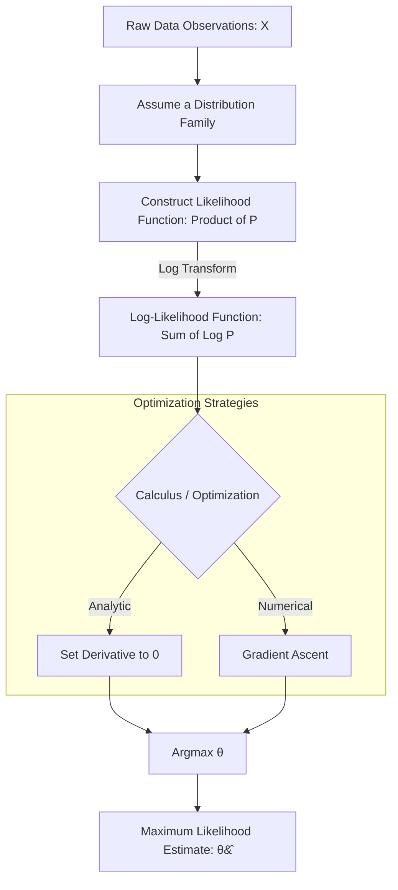

# 6. Visual Intuition and System Architecture

The pipeline of computing MLE maps physical observations to theoretical parameter spaces.

```mermaid
flowchart TD
    A[Raw Data Observations: X] --> B[Assume a Distribution Family]
    B --> C[Construct Likelihood Function: Product of P]
    C -->|Log Transform| D[Log-Likelihood Function: Sum of Log P]
    D --> E{Calculus / Optimization}
    
    subgraph Optimization Strategies
    E -->|Analytic| F[Set Derivative to 0]
    E -->|Numerical| G[Gradient Ascent]
    end
    
    F --> H[Argmax &theta;]
    G --> H
    H --> I[Maximum Likelihood Estimate: &theta;&#770;]
```
