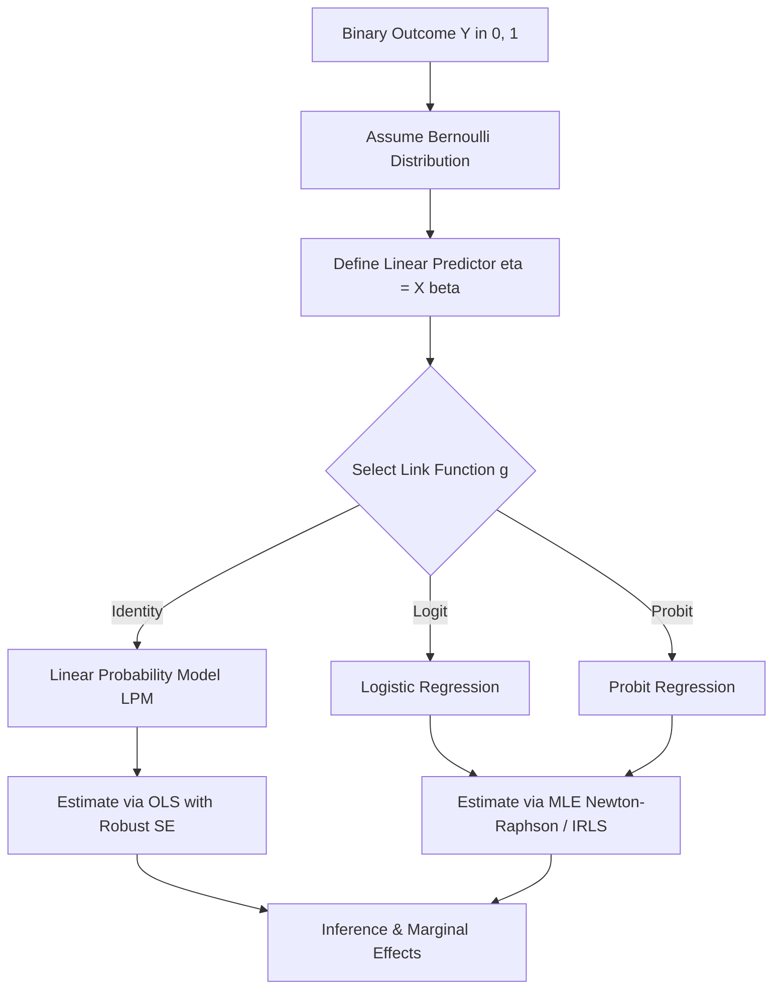

# Binary Response Models: Linear Probability, Logit, and Probit Frameworks

This document provides a rigorous technical analysis of binary response models. It details the transition from continuous Ordinary Least Squares (OLS) regression to discrete Maximum Likelihood Estimation (MLE) frameworks, specifically the Linear Probability Model (LPM), Logit, and Probit models. 

> [!IMPORTANT]
> Binary response models are a specialized class of Generalized Linear Models (GLMs). They model the conditional probability $P(Y=1|X)$ of a dichotomous outcome. Unlike OLS, which assumes a continuous, unbounded dependent variable with constant variance, binary models require non-linear link functions to bound predictions between 0 and 1 and account for heteroskedasticity inherent in Bernoulli distributions.

## 1. Concept Introduction

In many enterprise applications, the outcome of interest is not a continuous magnitude but a discrete state: a customer churns or does not churn, a loan defaults or is repaid, a patient has a disease or is healthy. 

Applying standard linear regression to a binary dependent variable $Y \in \{0, 1\}$ violates the core assumptions of the Gauss-Markov theorem. The errors cannot be normally distributed (they can only take two values), and the variance of the errors is strictly dependent on the mean (heteroskedasticity). Furthermore, a linear model will inevitably produce predictions outside the valid probability range $[0, 1]$. Binary response models resolve these structural failures by mapping the linear predictor $X\beta$ through a non-linear Cumulative Distribution Function (CDF).

## 2. Intuition Section

The foundational intuition for binary models is the **Latent Variable Framework**. 

Assume there is an unobservable, continuous "propensity" or "utility" variable $Y^*$ that determines the outcome. 
$$Y^* = X\beta + \epsilon$$
We do not observe $Y^*$; we only observe the binary realization $Y$. The observation rule is a threshold mechanism:
$$Y = \begin{cases} 1 & \text{if } Y^* > 0 \\ 0 & \text{if } Y^* \le 0 \end{cases}$$
The probability of observing $Y=1$ is the probability that the error term $\epsilon$ is greater than $-X\beta$. The specific statistical model (LPM, Probit, or Logit) is defined entirely by the assumed probability distribution of the unobserved error term $\epsilon$.

## 3. Mathematical Explanation

All binary response models fall under the Generalized Linear Model (GLM) framework. The components are:
1.  **Random Component**: The response variable $Y_i$ follows a Bernoulli distribution with parameter $p_i = P(Y_i=1|X_i)$.
2.  **Systematic Component**: The linear predictor $\eta_i = X_i\beta$.
3.  **Link Function**: A monotonic, differentiable function $g(\cdot)$ that connects the mean of the response to the linear predictor: $g(E[Y_i|X_i]) = g(p_i) = X_i\beta$.

## 4. Formula Breakdowns

### The Linear Probability Model (LPM)
Assumes the error term $\epsilon$ follows a Uniform distribution. The link function is the identity function.
$$P(Y=1|X) = X\beta$$
*   **Advantage**: Coefficients $\beta$ are directly interpretable as marginal effects (change in probability for a unit change in $X$).
*   **Fatal Flaw**: The predictions are unbounded. For extreme values of $X$, $\hat{p}$ will exceed 1 or fall below 0.

### The Logit Model
Assumes the error term $\epsilon$ follows a Standard Logistic distribution. The link function is the logit (log-odds) transformation.
$$ P(Y=1|X) = \Lambda(X\beta) = \frac{1}{1 + e^{-X\beta}} $$
The inverse link function yields the log-odds:
$$ \ln\left(\frac{p}{1-p}\right) = X\beta $$

### The Probit Model
Assumes the error term $\epsilon$ follows a Standard Normal distribution. The link function is the inverse standard normal CDF.
$$ P(Y=1|X) = \Phi(X\beta) = \int_{-\infty}^{X\beta} \frac{1}{\sqrt{2\pi}} e^{-\frac{t^2}{2}} dt $$

## 5. Step-by-Step Derivations

### Deriving the MLE for the Logit Model
Because the dependent variable is Bernoulli, we cannot use OLS. We must construct the Likelihood function and maximize it.

1.  **Construct the Likelihood**:
    For a single observation $y_i \in \{0, 1\}$, the probability mass function is $p_i^{y_i} (1-p_i)^{1-y_i}$.
    For $n$ independent observations, the joint likelihood is:
    $$ L(\beta) = \prod_{i=1}^n p_i^{y_i} (1-p_i)^{1-y_i} $$

2.  **Construct the Log-Likelihood**:
    $$ \ell(\beta) = \sum_{i=1}^n \left[ y_i \ln(p_i) + (1-y_i) \ln(1-p_i) \right] $$
    Substitute $p_i = \frac{1}{1 + e^{-X_i\beta}}$ and $1-p_i = \frac{e^{-X_i\beta}}{1 + e^{-X_i\beta}}$.
    To ensure numerical stability in production systems (preventing overflow when $X_i\beta$ is large), we use the algebraically equivalent, stable form:
    $$ \ell(\beta) = \sum_{i=1}^n \left[ y_i (X_i\beta) - \ln(1 + e^{X_i\beta}) \right] $$

3.  **Compute the Score Vector (Gradient)**:
    Take the first derivative with respect to $\beta$ and set to zero:
    $$ S(\beta) = \frac{\partial \ell}{\partial \beta} = \sum_{i=1}^n X_i \left( y_i - \frac{e^{X_i\beta}}{1 + e^{X_i\beta}} \right) = \sum_{i=1}^n X_i (y_i - p_i) $$
    > [!NOTE]
    > The Score vector for the Logit model has the exact same algebraic structure as the OLS normal equations, but the residual is $(y_i - p_i)$ instead of $(y_i - \hat{y}_i)$. 

4.  **Compute the Hessian Matrix**:
    Take the second derivative to verify concavity:
    $$ H(\beta) = \frac{\partial^2 \ell}{\partial \beta \partial \beta^T} = -\sum_{i=1}^n X_i X_i^T p_i (1-p_i) $$
    Because $p_i \in (0, 1)$, the term $p_i(1-p_i)$ is strictly positive. Thus, $H(\beta)$ is negative definite. This proves the log-likelihood surface is strictly globally concave; there are no local maxima, and Newton-Raphson optimization is guaranteed to find the unique global MLE.

## 6. Real-World Analogies

**The Signal Detection Threshold**:
Imagine a radio receiver trying to detect a faint binary signal (0 or 1) buried in static noise. The true signal strength is the linear predictor $X\beta$. The static is the error term $\epsilon$. The receiver has a hardware threshold set at 0 volts. If the combined signal plus noise crosses 0 volts, the receiver outputs a "1". The Logit and Probit models are simply mathematical descriptions of the probability distribution of that static noise.

## 7. Python Implementations

The following implementation demonstrates the structural differences between LPM, Logit, and Probit. We utilize `statsmodels` to extract rigorous statistical inference (standard errors, z-statistics) rather than purely predictive metrics.

```python
import numpy as np
import pandas as pd
import statsmodels.api as sm
import matplotlib.pyplot as plt
from scipy.stats import norm
import warnings

warnings.filterwarnings('ignore')

# 1. Simulate Binary Data with a Latent Variable Structure
np.random.seed(42)
n_samples = 1000
X_raw = np.random.uniform(-3, 3, n_samples)
# Latent utility: Y* = 1.5*X + noise
latent_utility = 1.5 * X_raw + np.random.logistic(0, 1, n_samples) 
# Observe binary outcome based on threshold
Y_binary = (latent_utility > 0).astype(int) 

X = sm.add_constant(X_raw)

# 2. Fit the Linear Probability Model (OLS)
lpm_model = sm.OLS(Y_binary, X).fit()

# 3. Fit the Logit Model (MLE)
logit_model = sm.Logit(Y_binary, X).fit(disp=0)

# 4. Fit the Probit Model (MLE)
probit_model = sm.Probit(Y_binary, X).fit(disp=0)

# 5. Extract and Compare Coefficients
results_df = pd.DataFrame({
    'LPM (OLS)': lpm_model.params,
    'Logit (MLE)': logit_model.params,
    'Probit (MLE)': probit_model.params
})

print("Coefficient Comparison:")
print(results_df.round(4))

# 6. Visualize Predicted Probabilities (Highlighting LPM failure)
X_plot = np.linspace(-4, 4, 200)
X_plot_sm = sm.add_constant(X_plot)

p_lpm = lpm_model.predict(X_plot_sm)
p_logit = logit_model.predict(X_plot_sm)
p_probit = probit_model.predict(X_plot_sm)

plt.figure(figsize=(10, 6))
plt.scatter(X_raw, Y_binary, alpha=0.2, color='gray', label='Observed Data')
plt.plot(X_plot, p_lpm, 'r--', label='LPM (Unbounded)', linewidth=2)
plt.plot(X_plot, p_logit, 'b-', label='Logit (Bounded)', linewidth=2)
plt.plot(X_plot, p_probit, 'g-.', label='Probit (Bounded)', linewidth=2)
plt.axhline(1, color='black', linestyle=':', alpha=0.5)
plt.axhline(0, color='black', linestyle=':', alpha=0.5)
plt.title('Binary Response Models: Predicted Probabilities')
plt.xlabel('Feature X')
plt.ylabel('P(Y=1 | X)')
plt.ylim(-0.2, 1.2)
plt.legend()
plt.grid(True, alpha=0.3)
plt.show()
```

## 8. Practical Engineering Examples

*   **Credit Risk Modeling**: Predicting the probability of default (PD) for a loan applicant. Regulatory frameworks like Basel III require highly calibrated probability estimates, making the bounded nature of the Logit model mandatory.
*   **Medical Triage Systems**: Estimating the probability that a patient in the ER has a critical condition based on vital signs. The Probit model is historically prevalent in bioassays and dose-response toxicity studies.

## 9. Common Mistakes

> [!WARNING]
> **Trap 1: Interpreting Logit Coefficients as Marginal Effects.**
> In LPM, $\beta_k$ is the change in probability for a unit change in $X_k$. In Logit, $\beta_k$ is the change in the *log-odds*. To find the marginal effect $\frac{\partial p}{\partial X_k}$, one must multiply $\beta_k$ by the logistic probability density function: $\beta_k \cdot p(1-p)$. The marginal effect is non-linear and depends on the values of all other covariates.

> [!WARNING]
> **Trap 2: Using LPM for Extrapolation.**
> If a feature $X$ takes on extreme values, the LPM will predict probabilities greater than 1 or less than 0. This breaks downstream systems that expect valid probability distributions (e.g., calculating expected loss).

> [!WARNING]
> **Trap 3: Ignoring Heteroskedasticity in LPM.**
> If you must use LPM for interpretability, you cannot use standard OLS standard errors. The error variance is $p(1-p)$, which varies with $X$. You must use heteroskedasticity-robust standard errors (Huber-White) to perform valid hypothesis testing.

## 10. Visual Intuition

The core difference between the models is the shape of their Cumulative Distribution Functions (CDFs).
*   **LPM**: A straight line extending to infinity. It assumes the effect of $X$ on probability is constant everywhere.
*   **Logit & Probit**: S-shaped curves (sigmoids) asymptotically bounded at 0 and 1. They capture the "saturation effect"—when a probability is already very close to 0 or 1, additional changes in $X$ have diminishing impacts on the probability. The Logit has slightly heavier tails than the Probit.

## 11. Mermaid Diagrams

The Generalized Linear Model pipeline for binary data.



## 12. Machine Learning Connections

In the machine learning domain, the Logit model is known as **Logistic Regression**. 
*   **Classification**: ML practitioners typically apply a hard threshold (e.g., $p \ge 0.5$) to the logistic output to generate discrete class labels. Statisticians, conversely, focus on the continuous probability output for risk stratification.
*   **Loss Function Equivalence**: The objective function minimized by ML libraries (like `sklearn.linear_model.LogisticRegression`) is the **Binary Cross-Entropy Loss**. Mathematically, Binary Cross-Entropy is exactly the Negative Log-Likelihood of the Bernoulli distribution derived in Section 5. ML is simply performing MLE under a different nomenclature.

## 13. Interview-Style Insights

**Interviewer:** "Why would you choose a Logit model over a Linear Probability Model for a binary outcome?"
**Candidate:** "I would choose Logit for three primary reasons. First, it guarantees that predicted probabilities are strictly bounded between 0 and 1, preventing impossible predictions. Second, it correctly models the heteroskedasticity inherent in binary data, as the variance of a Bernoulli variable is a function of its mean. Third, it captures the non-linear saturation effect, where the marginal impact of a feature diminishes as the probability approaches the boundaries. I would only use LPM if the coefficients are strictly for internal interpretability, the data is tightly clustered away from the boundaries, and I apply robust standard errors."

**Interviewer:** "What is the difference between the Logit and Probit models, and how do you choose between them?"
**Candidate:** "Both are GLMs for binary data that yield very similar fitted probabilities. The difference lies in the assumed distribution of the latent error term: Logistic for Logit, and Standard Normal for Probit. The Logistic distribution has slightly heavier tails, meaning the Logit model will assign slightly higher probabilities to extreme observations compared to the Probit. In practice, the choice rarely impacts predictive performance. Logit is overwhelmingly preferred in industry because the logistic CDF has a closed-form analytical solution, making computation and interpretation (via odds ratios) significantly simpler than the integral-based Probit CDF."

## 14. Edge Cases

*   **Complete or Quasi-Complete Separation**: If a linear combination of features perfectly predicts the outcome (e.g., all observations with $X > 5$ have $Y=1$), the MLE for $\beta$ does not exist; the coefficient will approach infinity. This is known as the Hauck-Donner effect. The Hessian matrix becomes singular, and the optimization algorithm will fail to converge.
*   **Rare Events Bias**: When the event $Y=1$ is extremely rare (e.g., $< 1\%$), standard MLE for the Logit model systematically underestimates the probability of the event. 

## 15. Mental Models

**The Saturation Ceiling**:
Do not view the relationship between $X$ and $Y$ as a constant slope. View it as an elastic band. When the probability is near 50%, the band stretches easily (high marginal effect). As the probability approaches 0% or 100%, the band becomes rigid and resists further stretching (low marginal effect). The S-curve models this physical limitation of probability space.

## 16. Performance and Computational Insights

*   **Lack of Closed-Form Solution**: Unlike OLS, which has the analytical solution $\hat{\beta} = (X^TX)^{-1}X^TY$, the Logit and Probit models have no closed-form solution. They require iterative numerical optimization.
*   **Iteratively Reweighted Least Squares (IRLS)**: Production statistical software (like `statsmodels` or `R`) does not use standard Gradient Descent for GLMs. They use IRLS (equivalent to Newton-Raphson), which utilizes the Hessian matrix to achieve quadratic convergence. This fits the model in very few iterations but requires computing and inverting the $K \times K$ Hessian matrix at each step, making it $O(K^3)$ per iteration. For massive datasets with thousands of features, this becomes computationally expensive.

## 17. Advanced Notes

*   **Firth's Bias-Reduced Logistic Regression**: To solve the complete separation problem and reduce small-sample bias, Firth's method introduces a penalization term to the log-likelihood function, equivalent to using a specific Jeffreys prior in Bayesian inference. This forces the coefficients to remain finite even under perfect separation.
*   **Multinomial Logistic Regression**: When the outcome has more than two unordered categories ($Y \in \{1, 2, \dots, J\}$), the binary logistic function generalizes to the Softmax function, modeling the relative log-odds of each category against a baseline reference category.

## 18. Final Takeaways

### Key Takeaways
*   Binary response models map a linear predictor to a probability space $[0, 1]$ using a non-linear link function.
*   The **Linear Probability Model** is unbounded and heteroskedastic; it should only be used with robust standard errors for quick interpretability.
*   The **Logit Model** assumes a logistic error distribution. Its coefficients represent log-odds, and it is the industry standard due to computational efficiency and interpretability.
*   The **Probit Model** assumes a normal error distribution. It is mathematically similar to Logit but lacks a closed-form CDF.
*   MLE for the Logit model is globally concave, guaranteeing a unique solution via Newton-Raphson/IRLS optimization.

### Common Traps to Avoid
*   Interpreting Logit coefficients as direct changes in probability.
*   Ignoring the Hauck-Donner effect (complete separation) when features perfectly divide the classes.
*   Using LPM predictions for downstream expected value calculations without clipping probabilities to $[0, 1]$.

### Interview Questions to Drill
1. Derive the Score vector for the Logit model and explain why its structure is identical to the OLS normal equations.
2. Prove that the log-likelihood function for the Logit model is globally concave.
3. How does the marginal effect of a variable in a Logit model differ from its marginal effect in an LPM?
4. Explain the Hauck-Donner effect and how Firth's penalization resolves it.

### Advanced Learning Roadmap
1. **Next Step**: Master **Poisson and Negative Binomial Regression** for modeling count data (non-negative integers).
2. **Next Step**: Study **Ordinal Logistic Regression** for outcomes with a natural, ordered hierarchy (e.g., Low, Medium, High).
3. **Next Step**: Explore **Survival Analysis (Cox Proportional Hazards)** to handle binary outcomes where the *time* until the event occurs is the primary variable of interest.

### Recommended Python Libraries
*   `statsmodels`: The definitive library for statistical inference, providing MLE estimation, robust standard errors, and comprehensive summary tables for Logit and Probit.
*   `scikit-learn`: For high-performance, regularized Logistic Regression (using L1/L2 penalties) focused purely on predictive classification.
*   `scipy.optimize`: For understanding the underlying numerical routines (BFGS, Newton-CG) used to maximize the log-likelihood.