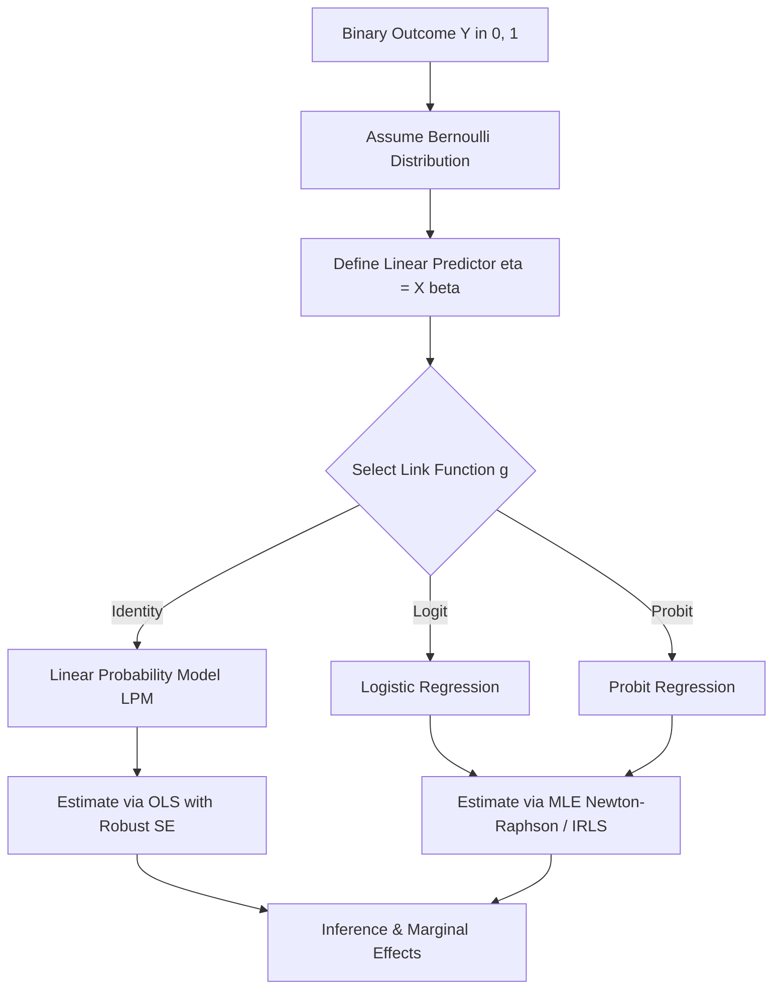

# 11. Mermaid Diagrams

The Generalized Linear Model pipeline for binary data.

```mermaid
flowchart TD
    A[Binary Outcome Y in 0, 1] --> B[Assume Bernoulli Distribution]
    B --> C[Define Linear Predictor eta = X beta]
    C --> D{Select Link Function g}
    D -->|Identity| E[Linear Probability Model LPM]
    D -->|Logit| F[Logistic Regression]
    D -->|Probit| G[Probit Regression]
    E --> H[Estimate via OLS with Robust SE]
    F --> I[Estimate via MLE Newton-Raphson / IRLS]
    G --> I
    H --> J[Inference & Marginal Effects]
    I --> J
```
