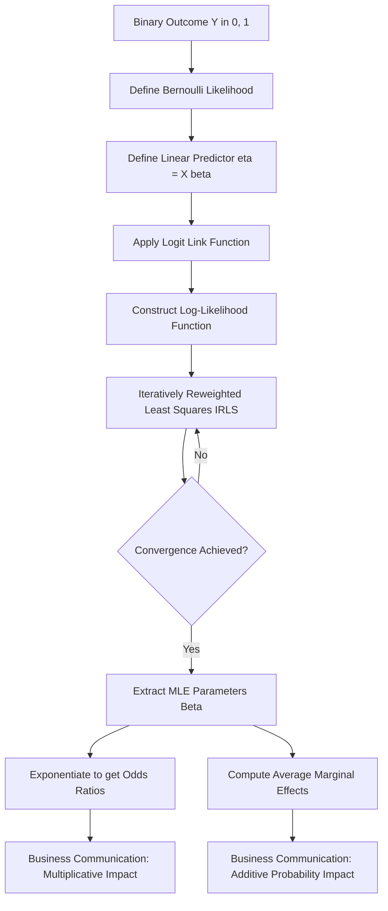

# Discrete Response Models: Logistic Regression and Maximum Likelihood Estimation

This document provides a rigorous technical analysis of Logistic Regression within the framework of Generalized Linear Models (GLMs). It details the structural failures of the Linear Probability Model, the mathematical formulation of the Logit link function, the derivation of Maximum Likelihood Estimators, and the computational algorithms required for production-grade binary classification.

> [!IMPORTANT]
> Logistic Regression is the foundational algorithm for modeling dichotomous outcomes ($Y \in \{0, 1\}$). Unlike Ordinary Least Squares (OLS) regression, which assumes a continuous, unbounded dependent variable, Logistic Regression utilizes a non-linear link function to map the linear predictor to the strict $[0, 1]$ probability space. Parameter estimation is performed via Maximum Likelihood Estimation (MLE), yielding asymptotically efficient, consistent estimators.

## 1. Concept Introduction

In enterprise analytics, clinical research, and machine learning, the variable of interest is frequently discrete rather than continuous. Examples include patient mortality, loan default, equipment failure, or customer churn. 

Applying standard linear regression to a binary dependent variable creates a Linear Probability Model (LPM). While computationally trivial, the LPM fundamentally violates the axioms of probability and the Gauss-Markov assumptions. Logistic Regression resolves these structural flaws by modeling the log-odds of the outcome as a linear combination of the predictors, ensuring that all predicted probabilities remain mathematically valid and statistically efficient.

## 2. Intuition Section

The foundational intuition for binary response models is the **Latent Variable Framework**. 

Assume there is an unobservable, continuous "propensity" or "utility" variable $Y^*$ that determines the outcome. 
$$Y^* = X\beta + \epsilon$$
The observed binary outcome $Y$ is generated by a threshold mechanism:
$$Y = \begin{cases} 1 & \text{if } Y^* > 0 \\ 0 & \text{if } Y^* \le 0 \end{cases}$$
The probability of observing $Y=1$ is the probability that the error term $\epsilon$ is greater than $-X\beta$. The Logistic Regression model assumes that $\epsilon$ follows a Standard Logistic distribution. The choice of this specific distribution yields the characteristic S-shaped (sigmoid) cumulative distribution function, which naturally bounds the probability between 0 and 1.

## 3. Mathematical Explanation

Logistic Regression is a specific instance of the Generalized Linear Model (GLM) framework, defined by three components:
1.  **Random Component**: The response variable $Y_i$ follows a Bernoulli distribution with parameter $p_i = P(Y_i=1|X_i)$.
2.  **Systematic Component**: The linear predictor $\eta_i = X_i\beta$.
3.  **Link Function**: A monotonic, differentiable function $g(\cdot)$ that connects the mean of the response to the linear predictor: $g(p_i) = \ln\left(\frac{p_i}{1-p_i}\right) = X_i\beta$.

## 4. Formula Breakdowns

### The Logistic Cumulative Distribution Function (CDF)
The probability of the positive class is modeled using the logistic function:
$$ p_i = P(Y_i=1|X_i) = \frac{1}{1 + e^{-X_i\beta}} = \frac{e^{X_i\beta}}{1 + e^{X_i\beta}} $$

### The Logit Link and Odds
The **Odds** of the event occurring is the ratio of the probability of success to the probability of failure:
$$ \text{Odds}_i = \frac{p_i}{1-p_i} = e^{X_i\beta} $$
Taking the natural logarithm yields the **Log-Odds** (the Logit), which is strictly linear with respect to the parameters:
$$ \text{Logit}(p_i) = \ln\left(\frac{p_i}{1-p_i}\right) = X_i\beta = \beta_0 + \beta_1 X_{i1} + \dots + \beta_k X_{ik} $$

### The Odds Ratio (OR)
For a one-unit increase in a continuous predictor $X_j$, the new odds are:
$$ \text{Odds}_{new} = e^{\beta_j} \cdot \text{Odds}_{old} $$
Thus, $e^{\beta_j}$ is the **Odds Ratio**, representing the multiplicative factor by which the odds of the outcome change, holding all other variables constant.

## 5. Step-by-Step Derivations

### Deriving the MLE for Logistic Regression
Because the dependent variable is Bernoulli, OLS is invalid. We must construct the Likelihood function and maximize it.

1.  **Construct the Likelihood**:
    For $n$ independent observations, the joint probability mass function is:
    $$ L(\beta) = \prod_{i=1}^n p_i^{y_i} (1-p_i)^{1-y_i} $$

2.  **Construct the Log-Likelihood**:
    $$ \ell(\beta) = \sum_{i=1}^n \left[ y_i \ln(p_i) + (1-y_i) \ln(1-p_i) \right] $$
    Substituting $p_i = \frac{e^{X_i\beta}}{1 + e^{X_i\beta}}$ and simplifying yields the numerically stable form:
    $$ \ell(\beta) = \sum_{i=1}^n \left[ y_i (X_i\beta) - \ln(1 + e^{X_i\beta}) \right] $$

3.  **Compute the Score Vector (Gradient)**:
    Take the first derivative with respect to $\beta$ and set to zero:
    $$ S(\beta) = \frac{\partial \ell}{\partial \beta} = \sum_{i=1}^n X_i (y_i - p_i) $$
    > [!NOTE]
    > The Score vector for the Logit model has the exact same algebraic structure as the OLS normal equations, but the residual is the Pearson residual $(y_i - p_i)$ instead of the OLS residual.

4.  **Compute the Hessian Matrix**:
    Take the second derivative to verify concavity:
    $$ H(\beta) = \frac{\partial^2 \ell}{\partial \beta \partial \beta^T} = -\sum_{i=1}^n X_i X_i^T p_i (1-p_i) $$
    Because $p_i \in (0, 1)$, the term $p_i(1-p_i)$ is strictly positive. Assuming the design matrix $X$ has full column rank, $H(\beta)$ is negative definite. This proves the log-likelihood surface is strictly globally concave; there are no local maxima, and Newton-Raphson optimization is guaranteed to find the unique global MLE.

## 6. Real-World Analogies

**Pharmacological Dose-Response Saturation**: 
In clinical trials, the probability of a therapeutic response increases with drug dosage. However, physiological systems have a maximum efficacy ceiling. A linear model would erroneously predict that infinite dosage yields infinite response probability (e.g., >100%). The logistic function mathematically enforces the asymptotic saturation inherent in biological systems, bounding the response probability strictly between 0 and 1.

## 7. Python Implementations

The following implementation demonstrates a production-grade pipeline for fitting a Logistic Regression model via MLE, extracting Odds Ratios, and computing Average Marginal Effects (AME).

```python
import numpy as np
import pandas as pd
import statsmodels.api as sm
from scipy.optimize import minimize
import warnings

warnings.filterwarnings('ignore')

class LogisticRegressionPipeline:
    """
    A production-grade pipeline for Logistic Regression, 
    providing MLE estimation, Odds Ratios, and Marginal Effects.
    """
    
    def __init__(self, X_raw: pd.DataFrame, y: np.ndarray):
        self.X = sm.add_constant(X_raw)
        self.y = y
        self.model = None
        
    def fit_model(self):
        """Fits the Logistic Regression model via Iteratively Reweighted Least Squares."""
        self.model = sm.Logit(self.y, self.X).fit(disp=0, method='newton')
        return self.model
        
    def extract_odds_ratios(self) -> pd.DataFrame:
        """Extracts Odds Ratios and 95% Confidence Intervals."""
        if self.model is None:
            raise ValueError("Model must be fitted first.")
            
        params = self.model.params
        conf_int = self.model.conf_int()
        
        or_df = pd.DataFrame({
            'Log-Odds (Beta)': params,
            'Odds Ratio (exp(Beta))': np.exp(params),
            'OR 2.5%': np.exp(conf_int[0]),
            'OR 97.5%': np.exp(conf_int[1]),
            'P-value': self.model.pvalues
        })
        return or_df.drop('const', errors='ignore')
        
    def extract_average_marginal_effects(self) -> pd.DataFrame:
        """Computes the Average Marginal Effect (AME) for continuous interpretation."""
        if self.model is None:
            raise ValueError("Model must be fitted first.")
            
        margeff = self.model.get_margeff(at='overall', method='dydx')
        
        ame_data = []
        for i, var in enumerate(margeff.margeff):
            ame_data.append({
                'Variable': self.X.columns[i+1],
                'AME (dP/dX)': var,
                'Std Err': margeff.margeff_se[i],
                'P-value': margeff.pvalues[i]
            })
        return pd.DataFrame(ame_data)

# Execution Block
if __name__ == "__main__":
    # Simulate enterprise data: Clinical Trial Response
    np.random.seed(42)
    n = 1500
    dosage = np.random.uniform(10, 100, n)
    biomarker = np.random.normal(50, 15, n)
    
    # True data generating process
    log_odds_true = -4.0 + 0.05 * dosage - 0.02 * biomarker
    p_true = 1 / (1 + np.exp(-log_odds_true))
    response = np.random.binomial(1, p_true)
    
    X_data = pd.DataFrame({'dosage': dosage, 'biomarker': biomarker})
    
    # Initialize and run pipeline
    pipeline = LogisticRegressionPipeline(X_data, response)
    pipeline.fit_model()
    
    print("--- Logistic Regression Odds Ratios ---")
    print(pipeline.extract_odds_ratios().round(3))
    
    print("\n--- Average Marginal Effects (AME) ---")
    print(pipeline.extract_average_marginal_effects().round(4))
```

## 8. Python Simulations

This simulation empirically verifies the structural failure of the Linear Probability Model (unbounded predictions) compared to the bounded Logistic Regression model.

```python
import matplotlib.pyplot as plt

def visualize_lpm_vs_logit():
    """
    Simulates data to visually demonstrate the boundary violations 
    of the Linear Probability Model versus the bounded Logit model.
    """
    np.random.seed(42)
    n = 800
    X = np.random.uniform(-4, 4, n)
    
    # True data generating process is highly non-linear
    true_prob = 1 / (1 + np.exp(-X))
    y = np.random.binomial(1, true_prob)
    
    X_sm = sm.add_constant(X)
    lpm = sm.OLS(y, X_sm).fit()
    logit = sm.Logit(y, X_sm).fit(disp=0)
    
    X_plot = np.linspace(-5, 5, 200)
    X_plot_sm = sm.add_constant(X_plot)
    
    p_lpm = lpm.predict(X_plot_sm)
    p_logit = logit.predict(X_plot_sm)
    
    plt.figure(figsize=(10, 6))
    plt.scatter(X, y, alpha=0.2, color='gray', label='Observed Binary Data')
    plt.plot(X_plot, p_lpm, color='red', linewidth=2, linestyle='--', label='LPM (Unbounded)')
    plt.plot(X_plot, p_logit, color='blue', linewidth=2, label='Logit (Bounded)')
    plt.axhline(1, color='black', linestyle=':', alpha=0.7, label='Probability Bounds [0, 1]')
    plt.axhline(0, color='black', linestyle=':', alpha=0.7)
    
    plt.title('Structural Failure of LPM vs. Bounded Logistic Regression')
    plt.xlabel('Predictor Variable (X)')
    plt.ylabel('Predicted Probability / Observed Outcome')
    plt.ylim(-0.3, 1.3)
    plt.legend()
    plt.grid(True, alpha=0.3)
    plt.show()

visualize_lpm_vs_logit()
```

## 9. Practical Engineering Examples

*   **Clinical Trial Endpoints**: Modeling the binary endpoint of "30-day hospital readmission" based on patient vitals, comorbidities, and discharge medications. The Odds Ratios allow hospital administrators to identify which specific interventions (e.g., a specific follow-up protocol) most significantly reduce the odds of readmission.
*   **Credit Risk Scoring**: Predicting the probability of default (PD) for retail loans. Regulatory frameworks require highly calibrated probability estimates. The bounded nature of the Logistic function ensures that no customer is assigned a default probability greater than 100% or less than 0%, which is critical for calculating accurate Expected Loss (EL) reserves.

## 10. Common Mistakes

> [!WARNING]
> **Trap 1: Interpreting $\beta$ as a Marginal Effect.**
> In Logistic Regression, $\beta_j$ represents the change in the log-odds, not the change in probability. To find the change in probability, one must compute the marginal effect $\beta_j \cdot p(1-p)$, which varies depending on the values of all other covariates.

> [!WARNING]
> **Trap 2: Confusing Odds Ratios with Relative Risk.**
> An Odds Ratio of 2.0 does not mean the probability is doubled. If the baseline probability is 50% (Odds = 1.0), an OR of 2.0 makes the new odds 2.0, which corresponds to a probability of 66.7%, not 100%. OR only approximates Relative Risk when the baseline outcome is very rare (e.g., $< 10\%$).

> [!WARNING]
> **Trap 3: Ignoring Complete Separation.**
> If a predictor perfectly separates the outcomes (e.g., all observations with $X > 50$ have $Y=1$), the MLE for $\beta$ diverges to infinity. The optimization algorithm will fail to converge, and standard errors will become massive.

## 11. Visual Intuition

The visual signature of Logistic Regression is defined by the sigmoid curve. In the probability space, the curve is bounded by horizontal asymptotes at $Y=0$ and $Y=1$. The slope of the curve is steepest at $p=0.5$ (where the marginal effect is maximized) and flattens as it approaches the boundaries. 

However, if you plot the linear predictor $X\beta$ on the X-axis and the log-odds on the Y-axis, the relationship is a perfect 45-degree straight line. The non-linearity is entirely an artifact of mapping this linear space through the logistic CDF to constrain it within the probability boundaries.

## 12. Mermaid Diagrams

The computational pipeline for estimating and interpreting a Logistic Regression model.



## 13. Real-World Applications

*   **Epidemiology and Case-Control Studies**: Logistic Regression is the standard for estimating the association between risk factors and disease outcomes. In case-control studies, where the true incidence of the disease is unknown, the Odds Ratio derived from the Logit model is the only valid measure of association.
*   **Marketing Attribution**: Modeling the probability of a user clicking on a specific digital advertisement based on user demographics, time of day, and ad placement. The coefficients quantify the multiplicative lift in click-through odds provided by each feature.

## 14. Machine Learning Connections

*   **Binary Cross-Entropy Loss**: The objective function minimized by machine learning libraries (e.g., `scikit-learn`) is the Binary Cross-Entropy Loss. Mathematically, this is exactly the Negative Log-Likelihood of the Bernoulli distribution. Machine learning is simply performing MLE under a different nomenclature.
*   **Linear Classifier**: The term "linear classifier" arises because the decision boundary (where $P(Y=1|X) = 0.5$) occurs when the log-odds equal zero: $X^T\beta = 0$. This is the equation of a linear hyperplane in the feature space.
*   **Neural Network Equivalence**: A logistic regression model is mathematically identical to a single-layer neural network with no hidden layers, utilizing a sigmoid activation function in the output layer.

## 15. Interview-Style Insights

**Interviewer:** "Why is the Ordinary Least Squares (OLS) estimator inappropriate for a binary dependent variable?"
**Candidate:** "OLS is inappropriate for three fundamental reasons. First, it produces unbounded predictions, violating the $[0,1]$ constraint of probability. Second, it assumes homoskedasticity, but the variance of a Bernoulli variable is $p(1-p)$, which is strictly a function of the mean, inducing severe heteroskedasticity. Third, the error terms follow a Bernoulli distribution, not a Normal distribution, violating the assumption required for exact finite-sample hypothesis testing. Logistic Regression resolves these via a bounded link function and Bernoulli-specific Maximum Likelihood Estimation."

**Interviewer:** "How do you handle a situation where your Logistic Regression model fails to converge due to complete separation?"
**Candidate:** "Complete separation occurs when a linear combination of features perfectly predicts the outcome, causing the MLE coefficients to diverge to infinity. To resolve this, I would apply Firth's penalized likelihood method, which introduces a Jeffreys prior penalty to the log-likelihood. This shrinks the coefficients toward zero, ensuring they remain finite and reducing small-sample bias. Alternatively, I would apply strong L2 (Ridge) regularization, which mathematically acts as a Gaussian prior, preventing the coefficients from diverging."

## 16. Edge Cases

*   **Rare Events Bias**: When the event $Y=1$ is extremely rare (e.g., $< 1\%$), standard MLE for the Logit model systematically underestimates the probability of the event. Corrections such as the King-Zeng rare events logistic regression must be applied to adjust the intercept and recalibrate the predicted probabilities.
*   **Multicollinearity**: While Logistic Regression is more robust to mild multicollinearity than OLS in terms of prediction, severe multicollinearity inflates the variance of the coefficient estimates, making the Odds Ratios highly unstable and difficult to interpret.

## 17. Mental Models

**The Latent Utility Threshold**: 
Do not view binary outcomes as arbitrary discrete states. View them as the observable manifestation of an unobservable, continuous latent utility $Y^* = X\beta + \epsilon$. The binary outcome is simply a threshold crossing: $Y=1$ if $Y^* > 0$. The logistic distribution defines the probability density of the unobserved error term $\epsilon$. This mental model unifies discrete choice theory with continuous statistical mechanics.

## 18. Performance/Computational Insights

*   **Iteratively Reweighted Least Squares (IRLS)**: Production statistical software does not use standard Gradient Descent for GLMs. They use IRLS (equivalent to Newton-Raphson), which utilizes the Hessian matrix to achieve quadratic convergence. 
*   **Computational Complexity**: Each iteration of IRLS requires computing the $K \times K$ Hessian matrix and inverting it. The time complexity per iteration is $O(N \cdot K^2 + K^3)$. For massive datasets with thousands of features, this becomes computationally expensive.
*   **Numerical Stability**: When computing the log-likelihood, calculating $\ln(1 + e^{X_i\beta})$ directly can result in floating-point overflow if $X_i\beta$ is large. Production implementations use the log-sum-exp trick: $\ln(1 + e^x) = \max(0, x) + \ln(1 + e^{-|x|})$ to ensure numerical stability.

## 19. Advanced Notes

*   **Regularization as MAP Estimation**: Applying L1 (Lasso) or L2 (Ridge) penalties to the Logistic Regression log-likelihood is mathematically equivalent to performing Maximum A Posteriori (MAP) estimation with Laplace or Gaussian priors on the coefficients, respectively.
*   **Multinomial Logistic Regression**: When the outcome has more than two unordered categories ($Y \in \{1, 2, \dots, J\}$), the binary logistic function generalizes to the Softmax function, modeling the relative log-odds of each category against a baseline reference category.

## 20. Final Takeaways

### Key Takeaways
*   Logistic Regression maps a linear predictor to a probability space $[0, 1]$ using the logistic link function, resolving the unbounded predictions and heteroskedasticity of the Linear Probability Model.
*   The coefficients $\beta$ represent the change in the log-odds. Exponentiating them yields the **Odds Ratio**, the standard metric for business interpretation.
*   The **Average Marginal Effect (AME)** provides the average change in probability across the dataset, bridging the gap between statistical output and business intuition.
*   Parameter estimation relies on Iteratively Reweighted Least Squares (IRLS) to maximize the globally concave log-likelihood function.

### Common Traps to Avoid
*   Interpreting Logit coefficients as direct percentage-point changes in probability.
*   Equating Odds Ratios with Relative Risk, especially when the baseline probability is high.
*   Ignoring complete separation, which causes optimization failure and infinite coefficient estimates.

### Interview Questions to Drill
1. Derive the Score vector and Hessian matrix for the Logistic Regression log-likelihood, and prove that the Hessian is negative definite.
2. Explain the mathematical relationship between the Logistic link function and the latent variable threshold model.
3. How does the Average Marginal Effect (AME) differ from the Marginal Effect at the Mean (MEM), and why is AME preferred?
4. What is the Hauck-Donner effect, and how does Firth's penalization resolve it?

### Advanced Learning Roadmap
1. **Next Step**: Master **Multinomial and Ordinal Logistic Regression** to handle outcomes with multiple unordered or ordered categories.
2. **Next Step**: Study **Poisson and Negative Binomial Regression** for modeling count data, extending the GLM framework beyond binary outcomes.
3. **Next Step**: Explore **Generalized Additive Models (GAMs)** to relax the linearity assumption of the predictors while maintaining the logistic link function.

### Recommended Python Libraries
*   `statsmodels`: The definitive library for statistical inference, providing MLE estimation, robust standard errors, Odds Ratios, and the `get_margeff()` method for computing AME.
*   `scikit-learn`: For high-performance, regularized Logistic Regression (using L1/L2 penalties) focused purely on predictive classification and integration into machine learning pipelines.
*   `scipy.optimize`: For understanding the underlying numerical routines (BFGS, Newton-CG) used to maximize the log-likelihood in custom model implementations.