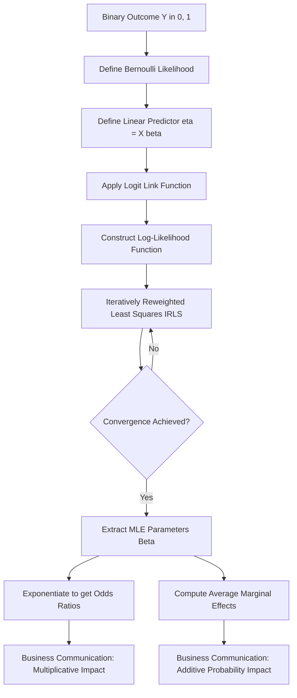

# 12. Mermaid Diagrams

The computational pipeline for estimating and interpreting a Logistic Regression model.

```mermaid
flowchart TD
    A[Binary Outcome Y in 0, 1] --> B[Define Bernoulli Likelihood]
    B --> C[Define Linear Predictor eta = X beta]
    C --> D[Apply Logit Link Function]
    D --> E[Construct Log-Likelihood Function]
    E --> F[Iteratively Reweighted Least Squares IRLS]
    F --> G{Convergence Achieved?}
    G -->|No| F
    G -->|Yes| H[Extract MLE Parameters Beta]
    H --> I[Exponentiate to get Odds Ratios]
    H --> J[Compute Average Marginal Effects]
    I --> K[Business Communication: Multiplicative Impact]
    J --> L[Business Communication: Additive Probability Impact]
```
