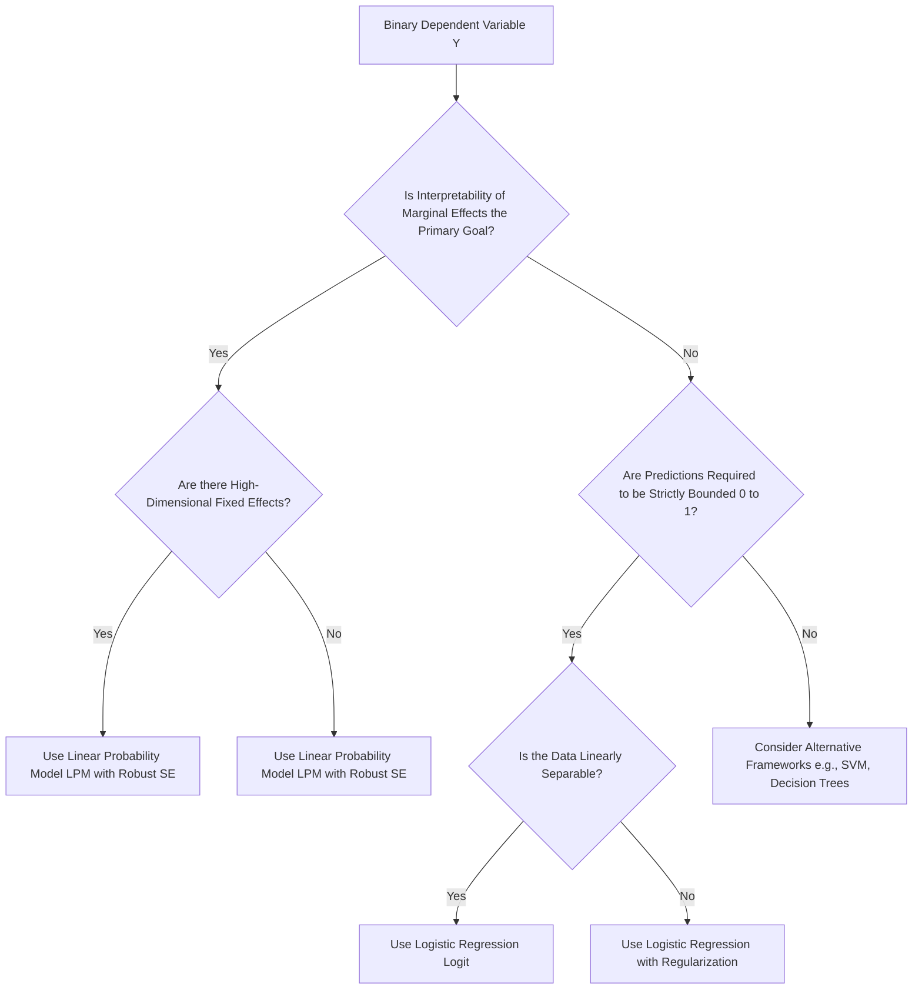

# The Linear Probability Model: Theoretical Foundations and Structural Limitations

This document provides a rigorous technical analysis of the Linear Probability Model (LPM). It details the mathematical formulation of applying Ordinary Least Squares (OLS) to binary dependent variables, derives the structural violations of OLS assumptions, and establishes the engineering contexts where the LPM remains a viable baseline despite its theoretical flaws.

> [!IMPORTANT]
> The Linear Probability Model is the naive application of multiple linear regression to a binary dependent variable $Y \in \{0, 1\}$. While it violates the Gauss-Markov assumptions regarding error distribution and homoskedasticity, it remains a critical baseline in econometrics and causal inference due to its computational efficiency, direct interpretability of coefficients as marginal effects, and compatibility with high-dimensional fixed effects.

## 1. Concept Introduction

In predictive modeling and statistical inference, the nature of the dependent variable dictates the choice of the algorithmic framework. When the outcome of interest is continuous and unbounded, Ordinary Least Squares (OLS) regression is the standard tool. However, in numerous enterprise and scientific applications, the outcome is dichotomous: a customer defaults or repays, a patient survives or expires, a user clicks or ignores.

The Linear Probability Model attempts to model the conditional probability $P(Y=1|X)$ directly as a linear combination of the covariates. It treats the binary outcome as if it were a continuous variable, estimating the parameters via standard OLS minimization of the sum of squared residuals.

## 2. Intuition Section

The fundamental tension of the LPM lies in the geometric mismatch between a linear function and a bounded probability space. 

Imagine a scatter plot where the Y-axis is strictly confined to two horizontal lines: $Y=0$ and $Y=1$. The data points exist only on these two lines. The OLS algorithm attempts to draw a single, infinitely long straight line through this cloud of points to minimize the vertical distances. Because a straight line has a constant slope and extends to infinity in both directions, it will inevitably cross the $Y=1$ boundary and predict values greater than 1, and cross the $Y=0$ boundary to predict values less than 0. Since probabilities cannot exceed 1 or fall below 0, these predictions are mathematically non-sensical.

## 3. Mathematical Explanation

Let $Y_i$ be a binary random variable such that $Y_i \in \{0, 1\}$. Let $X_i$ be a $K \times 1$ vector of explanatory variables. The conditional probability of success is defined as:
$$p_i = P(Y_i = 1 | X_i)$$

The expected value of a Bernoulli random variable is its probability of success:
$$ E[Y_i | X_i] = 1 \cdot P(Y_i = 1 | X_i) + 0 \cdot P(Y_i = 0 | X_i) = p_i $$

The Linear Probability Model specifies the conditional expectation function as a linear parameterization:
$$ E[Y_i | X_i] = X_i^T \beta $$

Therefore, the population model is written as:
$$ Y_i = X_i^T \beta + \epsilon_i $$

Where $\epsilon_i$ is the error term. By construction, $E[\epsilon_i | X_i] = 0$.

## 4. Formula Breakdowns

### The Error Term Distribution
Because $Y_i$ can only take the values 0 or 1, the error term $\epsilon_i = Y_i - X_i^T \beta$ is strictly limited to two possible outcomes for any given $X_i$:
1.  If $Y_i = 1$, then $\epsilon_i = 1 - X_i^T \beta$. This occurs with probability $p_i = X_i^T \beta$.
2.  If $Y_i = 0$, then $\epsilon_i = 0 - X_i^T \beta = -X_i^T \beta$. This occurs with probability $1 - p_i = 1 - X_i^T \beta$.

This proves that the error term $\epsilon_i$ follows a Bernoulli-derived distribution, not a Normal distribution. It is highly skewed unless $p_i = 0.5$.

### Conditional Variance (Heteroskedasticity)
The variance of the error term conditional on $X_i$ is:
$$ Var(\epsilon_i | X_i) = E[\epsilon_i^2 | X_i] - (E[\epsilon_i | X_i])^2 $$
Since $E[\epsilon_i | X_i] = 0$:
$$ Var(\epsilon_i | X_i) = p_i(1 - X_i^T \beta)^2 + (1 - p_i)(-X_i^T \beta)^2 $$
Substituting $p_i = X_i^T \beta$:
$$ Var(\epsilon_i | X_i) = (X_i^T \beta)(1 - X_i^T \beta)^2 + (1 - X_i^T \beta)(X_i^T \beta)^2 $$
$$ Var(\epsilon_i | X_i) = (X_i^T \beta)(1 - X_i^T \beta) [ (1 - X_i^T \beta) + (X_i^T \beta) ] $$
$$ Var(\epsilon_i | X_i) = (X_i^T \beta)(1 - X_i^T \beta) = p_i(1 - p_i) $$

> [!WARNING]
> The variance of the error term is a direct function of the covariates $X_i$. This is the definition of heteroskedasticity. The OLS assumption of constant error variance ($Var(\epsilon|X) = \sigma^2$) is structurally and mathematically violated in the LPM.

## 5. Step-by-Step Derivations

### Deriving the Marginal Effect
In the LPM, the coefficient $\beta_k$ represents the marginal effect of the $k$-th feature on the probability of the outcome.
$$ \frac{\partial P(Y=1|X)}{\partial X_k} = \frac{\partial (X^T \beta)}{\partial X_k} = \beta_k $$
This constant marginal effect is the primary advantage of the LPM. In non-linear models (like Logit), the marginal effect is $\beta_k \cdot p(1-p)$, which varies depending on the values of all other covariates. The LPM provides a single, global average marginal effect.

### Deriving the Heteroskedasticity-Robust Variance
Because the standard OLS variance-covariance matrix $\sigma^2(X^TX)^{-1}$ is invalid due to heteroskedasticity, we must use the White's Heteroskedasticity-Consistent Covariance Matrix Estimator (HC0):
$$ \hat{V}_{robust}(\hat{\beta}) = (X^TX)^{-1} \left( \sum_{i=1}^n \hat{\epsilon}_i^2 X_i X_i^T \right) (X^TX)^{-1} $$
This matrix provides consistent standard errors, allowing for valid hypothesis testing (t-tests, p-values) despite the heteroskedasticity.

## 6. Real-World Analogies

**The Rigid Ruler in a Bounded Box**:
Imagine trying to measure the probability of an event using a rigid, infinitely long wooden ruler. The "box" of valid probabilities is strictly between 0 and 1. If the true relationship is highly non-linear (e.g., probability spikes rapidly and then plateaus), forcing the rigid ruler through the data will cause it to poke out of the top of the box (predicting >100% probability) or fall out the bottom (predicting <0% probability). The ruler is mathematically straight, but the reality it attempts to measure is curved and bounded.

## 7. Python Implementations

The following implementation demonstrates the estimation of an LPM, the extraction of marginal effects, and the critical application of heteroskedasticity-robust standard errors.

```python
import numpy as np
import pandas as pd
import statsmodels.api as sm
import warnings

warnings.filterwarnings('ignore')

def fit_linear_probability_model(X_raw, y):
    """
    Fits a Linear Probability Model using OLS and computes 
    heteroskedasticity-robust standard errors.
    """
    # Add constant term for the intercept
    X = sm.add_constant(X_raw)
    
    # Fit standard OLS
    model = sm.OLS(y, X).fit()
    
    # Compute heteroskedasticity-robust covariance matrix (HC3)
    # HC3 is generally preferred over HC0 for finite samples
    robust_model = sm.OLS(y, X).fit(cov_type='HC3')
    
    return robust_model

# Simulate enterprise data: Loan Default Prediction
np.random.seed(42)
n_samples = 2000
credit_score = np.random.normal(650, 100, n_samples)
income = np.random.normal(50, 20, n_samples)

# True probability follows a logistic curve, but we will fit an LPM
true_prob = 1 / (1 + np.exp(-(0.05 * (650 - credit_score) + 0.1 * (50 - income))))
y_binary = np.random.binomial(1, true_prob)

X_data = pd.DataFrame({'credit_score': credit_score, 'income': income})

# Fit the LPM
lpm_results = fit_linear_probability_model(X_data, y_binary)

print("Linear Probability Model Results (with Robust Standard Errors):")
print(lpm_results.summary().tables[1])
```

## 8. Python Simulations

This simulation empirically verifies the two fatal flaws of the LPM: unbounded predictions and heteroskedastic residuals.

```python
import matplotlib.pyplot as plt

def simulate_lpm_flaws():
    """
    Simulates data to visually demonstrate unbounded predictions 
    and heteroskedasticity in the Linear Probability Model.
    """
    np.random.seed(42)
    n = 1000
    X = np.random.uniform(-4, 4, n)
    
    # True data generating process is highly non-linear
    true_prob = 1 / (1 + np.exp(-X))
    y = np.random.binomial(1, true_prob)
    
    X_sm = sm.add_constant(X)
    lpm = sm.OLS(y, X_sm).fit()
    lpm_predictions = lpm.predict(X_sm)
    residuals = lpm.resid
    
    fig, axes = plt.subplots(1, 2, figsize=(14, 5))
    
    # Plot 1: Unbounded Predictions
    axes[0].scatter(X, y, alpha=0.3, color='gray', label='Observed Binary Data')
    axes[0].plot(X, lpm_predictions, color='red', linewidth=2, label='LPM Prediction')
    axes[0].axhline(1, color='black', linestyle='--', alpha=0.7, label='Probability Bounds')
    axes[0].axhline(0, color='black', linestyle='--', alpha=0.7)
    axes[0].set_title('Flaw 1: Unbounded Predictions')
    axes[0].set_xlabel('Feature X')
    axes[0].set_ylabel('Predicted Probability / Observed Y')
    axes[0].legend()
    axes[0].grid(True, alpha=0.3)
    
    # Plot 2: Heteroskedastic Residuals
    axes[1].scatter(lpm_predictions, residuals, alpha=0.4, color='purple')
    axes[1].axhline(0, color='black', linestyle='-', linewidth=1)
    axes[1].set_title('Flaw 2: Heteroskedasticity (Fan Shape)')
    axes[1].set_xlabel('LPM Predicted Probability')
    axes[1].set_ylabel('Residuals')
    axes[1].grid(True, alpha=0.3)
    
    plt.tight_layout()
    plt.show()

simulate_lpm_flaws()
```

## 9. Practical Engineering Examples

Despite its flaws, the LPM is actively used in specific engineering and econometric contexts:
*   **Panel Data with High-Dimensional Fixed Effects**: In datasets with millions of individuals and thousands of time periods (e.g., scanner data, tax records), estimating a Logit model with fixed effects for every individual is computationally intractable and statistically inconsistent (the incidental parameters problem). The LPM with fixed effects remains consistent and can be estimated rapidly using sparse matrix algebra.
*   **Instrumental Variable (IV) Estimation**: In two-stage least squares (2SLS) for causal inference, the first stage requires a linear projection. If the endogenous variable is binary, the first stage is inherently an LPM.
*   **Baseline Interpretability**: In business intelligence dashboards where stakeholders require a simple "percentage point increase" interpretation (e.g., "A 10-point increase in credit score increases default probability by 2.5 percentage points"), the LPM provides this directly without requiring average marginal effect calculations.

## 10. Common Mistakes

> [!WARNING]
> **Trap 1: Using Standard OLS Standard Errors.**
> Because the LPM is inherently heteroskedastic, the default standard errors produced by OLS are biased and inconsistent. Hypothesis tests (p-values) will be invalid. You must always specify robust standard errors (e.g., `cov_type='HC3'` in statsmodels).

> [!WARNING]
> **Trap 2: Extrapolating Probabilities for Expected Value Calculations.**
> If the LPM predicts a probability of 1.15 for a specific customer, and you multiply this by the Loss Given Default (LGD) to calculate Expected Loss, you will systematically overestimate the risk. Probabilities must be clipped to the $[0, 1]$ interval before being used in downstream financial calculations.

> [!WARNING]
> **Trap 3: Ignoring the Non-Normality of Errors.**
> While the Central Limit Theorem ensures that the coefficient estimates $\hat{\beta}$ are asymptotically normal (allowing for valid t-tests in large samples), the residuals themselves are strictly non-normal. Do not use residual normality tests (like the Shapiro-Wilk test) to validate an LPM; they will always fail.

## 11. Visual Intuition

The visual signature of an LPM is defined by two distinct geometric artifacts:
1.  **The Boundary Breach**: The regression line extends past the $Y=0$ and $Y=1$ thresholds. The regions where the line is outside these bounds represent the "impossible" predictions.
2.  **The Residual Fan**: If you plot the residuals against the predicted values, the variance is not a uniform cloud. It forms a distinct inverted-U or "fan" shape. The variance is exactly zero at the boundaries (when $\hat{p}=0$ or $\hat{p}=1$) and reaches its maximum at $\hat{p}=0.5$.

## 12. Mermaid Diagrams

The decision framework for selecting a binary response model.



## 13. Real-World Applications

*   **Epidemiology and Public Health**: Estimating the "risk difference" between a treatment and control group. The LPM coefficient directly provides the absolute change in disease probability attributable to the treatment.
*   **Discrimination Studies**: In labor economics, the Oaxaca-Blinder decomposition is used to measure wage gaps. When the outcome is binary (e.g., hired vs. not hired), the decomposition is mathematically straightforward using an LPM, whereas non-linear decompositions (like the Fairlie decomposition for Logit) are complex and sensitive to functional form assumptions.

## 14. Machine Learning Connections

In the machine learning domain, the LPM is largely obsolete for classification tasks due to its unbounded nature and poor calibration. 
*   **Perceptron Equivalence**: The LPM is mathematically equivalent to a single-layer neural network (a perceptron) with a linear activation function, trained using Mean Squared Error (MSE) loss. 
*   **Transition to Logit**: By simply replacing the linear activation function with a sigmoid (logistic) activation function and changing the loss function from MSE to Binary Cross-Entropy, the model transitions from an LPM to Logistic Regression. This single architectural change resolves the unbounded prediction issue and aligns the loss function with the true Bernoulli likelihood.

## 15. Interview-Style Insights

**Interviewer:** "If the Linear Probability Model violates OLS assumptions and produces impossible probabilities, why do econometricians still use it?"
**Candidate:** "The LPM is used when the research design prioritizes causal identification over predictive calibration. Specifically, in panel data with high-dimensional fixed effects, non-linear models like Logit suffer from the incidental parameters problem, rendering their estimates inconsistent as the number of groups grows. The LPM with fixed effects remains consistent. Furthermore, the LPM coefficients are directly interpretable as average marginal effects, whereas Logit coefficients require post-estimation calculations to interpret. If the data is clustered away from the 0 and 1 boundaries, the LPM's flaws are minimized, making it a robust, computationally efficient tool for causal inference."

**Interviewer:** "How do you perform valid hypothesis testing in an LPM given the heteroskedasticity?"
**Candidate:** "I would never rely on the default OLS standard errors. I would compute heteroskedasticity-consistent standard errors, specifically the HC2 or HC3 estimator, which provide better finite-sample performance than the basic HC0 (White's) estimator. This adjusts the variance-covariance matrix of the coefficients, ensuring that the t-statistics and p-values are valid despite the non-constant variance of the error term."

## 16. Edge Cases

*   **Perfect Prediction**: If a covariate perfectly separates the 0s and 1s, the LPM will simply fit a line that passes exactly through the step function. Unlike Logit, which will fail to converge (coefficients approach infinity), the LPM will converge to a finite solution, though the $R^2$ will be 1 and the standard errors may be poorly estimated.
*   **Extreme Covariate Values**: If the training data has a narrow range of $X$, but the deployment environment introduces extreme outliers, the LPM will generate massively out-of-bounds predictions (e.g., -5.0 or 8.2). A Logit model would asymptotically approach 0 or 1, providing a graceful degradation.

## 17. Mental Models

**The Constant Slope Fallacy**:
Do not view probability as a linear accumulation of evidence. In reality, the first few units of evidence move the probability rapidly from the baseline. As the probability approaches certainty (100%) or impossibility (0%), it becomes increasingly difficult to move it further. The LPM assumes a "constant slope fallacy"—that every unit of $X$ adds the exact same amount of probability, regardless of where you currently sit on the probability spectrum.

## 18. Performance and Computational Insights

*   **Computational Complexity**: The LPM is solved via a single matrix inversion $(X^TX)^{-1}X^TY$. The time complexity is $O(N \cdot K^2)$ for computing the cross-products and $O(K^3)$ for the inversion. 
*   **Comparison to MLE**: Logit and Probit models require Iteratively Reweighted Least Squares (IRLS) or Newton-Raphson optimization. This requires computing the Hessian matrix and inverting it at every iteration until convergence. For massive datasets ($N > 10^7$) with many features, the LPM is orders of magnitude faster to train than Logit. In distributed computing environments (like Spark), fitting an LPM is trivially parallelizable, whereas MLE requires global synchronization at each iteration.

## 19. Advanced Notes

*   **The Incidental Parameters Problem**: Formulated by Neyman and Scott (1948). In a panel data Logit model with individual fixed effects $\alpha_i$, if the number of time periods $T$ is fixed and the number of individuals $N \to \infty$, the maximum likelihood estimates of the structural parameters $\beta$ are inconsistent. The LPM does not suffer from this problem; its fixed effects estimates remain consistent. This is the primary theoretical justification for the LPM in modern empirical economics.
*   **Fractional Response Models**: If the dependent variable is a proportion (e.g., the percentage of a portfolio invested in equities, bounded between 0 and 1 but not strictly binary), the LPM is also inappropriate. Papke and Wooldridge (1996) developed a Quasi-MLE framework using a Logit link function with robust standard errors to handle continuous fractional responses.

## 20. Final Takeaways

### Key Takeaways
*   The Linear Probability Model applies OLS to a binary outcome, modeling $P(Y=1|X) = X^T \beta$.
*   **Fatal Flaws**: It produces unbounded predictions (outside $[0, 1]$) and exhibits severe heteroskedasticity ($Var(\epsilon) = p(1-p)$).
*   **Mandatory Correction**: Standard OLS standard errors are invalid. Heteroskedasticity-robust standard errors (HC2/HC3) must be used for all inference.
*   **Primary Advantage**: Coefficients are directly interpretable as constant marginal effects, and the model is computationally trivial to estimate.

### Common Traps to Avoid
*   Using LPM predictions for financial expected value calculations without clipping to $[0, 1]$.
*   Reporting default OLS p-values in an LPM, leading to incorrect conclusions about statistical significance.
*   Applying the LPM when the true probabilities are close to 0 or 1, where the unboundedness and constant slope assumptions severely distort reality.

### Interview Questions to Drill
1. Derive the conditional variance of the error term in an LPM and explain why it violates the Gauss-Markov assumptions.
2. Explain the incidental parameters problem and why it justifies the use of the LPM in panel data.
3. How do you calculate the marginal effect of a variable in an LPM versus a Logit model?
4. What is the computational complexity difference between fitting an LPM and a Logit model, and how does this impact big data pipelines?

### Advanced Learning Roadmap
1. **Next Step**: Master **Logistic Regression (Logit)** to understand how the log-odds link function resolves the unbounded prediction and heteroskedasticity issues.
2. **Next Step**: Study **Panel Data Econometrics** to deeply understand fixed effects, random effects, and the incidental parameters problem.
3. **Next Step**: Explore **Fractional Response Models** for handling dependent variables that are continuous proportions rather than strictly binary.

### Recommended Python Libraries
*   `statsmodels`: The definitive library for LPM, providing OLS estimation and seamless integration of heteroskedasticity-robust covariance estimators (`cov_type='HC3'`).
*   `linearmodels`: An advanced econometrics library specifically designed for panel data, instrumental variables, and high-dimensional fixed effects models where LPM is frequently required.
*   `scikit-learn`: While not used for LPM inference, it is the standard for training bounded, non-linear classification models (Logistic Regression, SVMs) to compare against the LPM baseline.