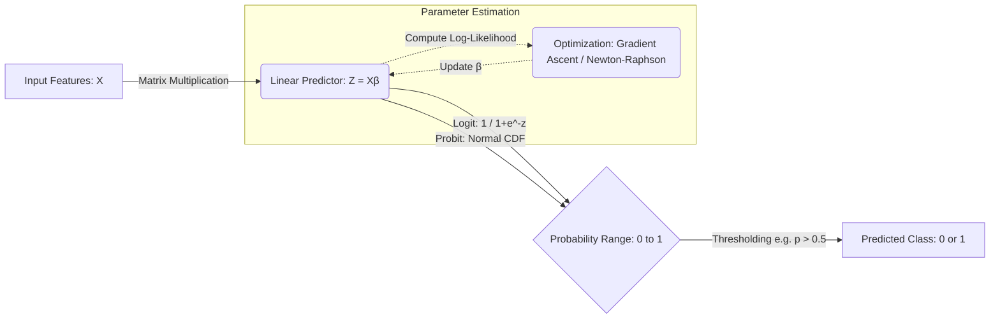

# Logit and Probit Models: Probabilistic Modeling for Binary Outcomes

> [!IMPORTANT]
> The fundamental challenge in binary classification is mapping an unconstrained linear combination of inputs $Z \in (-\infty, \infty)$ into a strictly bounded probability space $P \in [0, 1]$. Logit and Probit models achieve this by using specific Cumulative Distribution Functions (CDFs) as "link functions" to squash linear predictions into valid probabilities.

## 1. Concept Introduction

When modeling binary outcomes (e.g., predicting if a user will click an ad, if a patient has a disease, or if a transaction is fraudulent), we are attempting to estimate the probability that a target variable $Y$ equals $1$, given a feature vector $\mathbf{X}$. 

The naive approach is the **Linear Probability Model (LPM)**:
$$P(Y=1 | \mathbf{X}) = \beta_0 + \beta_1 X_1 + ... + \beta_k X_k = \mathbf{X}\beta$$

> [!WARNING]
> The LPM is structurally flawed for binary outcomes. Because $\mathbf{X}\beta$ is an unbounded linear equation, it can easily predict probabilities greater than $1$ or less than $0$, which violates the axioms of probability. Additionally, the variance of the error term in an LPM is dependent on $\mathbf{X}$ (heteroskedasticity), violating standard Ordinary Least Squares (OLS) assumptions.

**Logit (Logistic Regression)** and **Probit** models solve this by passing the linear combination $\mathbf{X}\beta$ through a non-linear transformation function (an S-shaped curve) that asymptotically approaches $0$ and $1$.

## 2. Intuition and Real-World Analogy

Imagine a structural engineering scenario: you are testing whether a wooden beam will break ($Y=1$) or hold ($Y=0$) under varying amounts of weight ($X$). 

Each beam has an underlying, unobservable **tolerance limit** (a latent variable). If the applied weight exceeds this unobservable tolerance, the beam breaks. 
*   If the unobservable tolerance follows a **Normal (Gaussian) Distribution** across the population of beams, you are modeling the breakage probability using a **Probit Model**.
*   If the unobservable tolerance follows a **Logistic Distribution** (which looks like a Normal distribution but has slightly "fatter tails" for extreme outlier beams), you are using a **Logit Model**.

In both cases, as you add a little bit of weight to an already massive load, the *change* in probability of breaking is small (it's already highly likely to break). This naturally creates an "S-shaped" (sigmoid) curve rather than a straight line.

## 3. Mathematical Foundations and Formula Breakdowns

Both models follow the same general framework known as Generalized Linear Models (GLMs), utilizing a **link function**.

Let $Z$ be the linear predictor:
$$Z = \mathbf{X}\beta = \beta_0 + \beta_1 X_1 + ... + \beta_k X_k$$

We define the probability $p = P(Y=1 | \mathbf{X})$ as $F(Z)$, where $F$ is a cumulative distribution function.

### The Logit Model
The Logit model uses the Standard Logistic CDF.

$$ p = \Lambda(Z) = \frac{e^Z}{1 + e^Z} = \frac{1}{1 + e^{-Z}} $$

> [!NOTE]
> If $Z = 0$, $p = 1 / (1 + 1) = 0.5$. 
> As $Z \to \infty$, $e^{-Z} \to 0$, so $p \to 1$. 
> As $Z \to -\infty$, $e^{-Z} \to \infty$, so $p \to 0$.

### The Probit Model
The Probit model uses the Standard Normal CDF, usually denoted as $\Phi(Z)$.

$$ p = \Phi(Z) = \int_{-\infty}^{Z} \frac{1}{\sqrt{2\pi}} \exp\left(-\frac{u^2}{2}\right) du $$

This integral does not have a closed-form algebraic solution and must be evaluated numerically. This is one historical reason why Logit (which has a clean algebraic form) became more dominant in machine learning, while Probit remained popular in econometrics.

## 4. Step-by-Step Derivation: The Odds Ratio Interpretation (Logit)

One of the most powerful aspects of the Logit model is its interpretation via odds.

**Step 1: Define the Odds**
Odds are defined as the ratio of the probability of success to the probability of failure.
$$ \text{Odds} = \frac{p}{1-p} $$

**Step 2: Substitute the Logistic Function**
$$ \frac{p}{1-p} = \frac{\frac{e^Z}{1+e^Z}}{1 - \frac{e^Z}{1+e^Z}} = \frac{\frac{e^Z}{1+e^Z}}{\frac{1}{1+e^Z}} = e^Z $$

**Step 3: Take the Natural Logarithm (The "Logit" Link)**
$$ \ln\left(\frac{p}{1-p}\right) = Z = \beta_0 + \beta_1 X_1 + ... + \beta_k X_k $$

> [!TIP]
> This derivation proves that the **log-odds** in a logistic regression model are strictly linear with respect to the parameters. A 1-unit increase in $X_1$ changes the log-odds by $\beta_1$, meaning the *odds* are multiplied by $e^{\beta_1}$.

## 5. Visual Intuition and System Architecture

The computational graph for both models can be visualized as a pipeline mapping raw features to probabilistic predictions.



## 6. Python Implementations

### A. Beginner: Building Link Functions from Scratch
Here we will define the mathematical link functions mathematically using NumPy and SciPy, and visualize their difference.

```python
import numpy as np
import matplotlib.pyplot as plt
from scipy.stats import norm

# 1. Define the linear combination range (Z)
z = np.linspace(-4, 4, 1000)

# 2. Logit Transformation (Sigmoid)
def logit_prob(z):
    return 1 / (1 + np.exp(-z))

p_logit = logit_prob(z)

# 3. Probit Transformation (Standard Normal CDF)
def probit_prob(z):
    return norm.cdf(z)

p_probit = probit_prob(z)

# 4. Visualization
plt.figure(figsize=(10, 6))
plt.plot(z, p_logit, label="Logit (Logistic CDF)", color="#1f77b4", linewidth=2)
plt.plot(z, p_probit, label="Probit (Normal CDF)", color="#ff7f0e", linewidth=2, linestyle="--")
plt.axvline(0, color='gray', linestyle=':', alpha=0.7)
plt.axhline(0.5, color='gray', linestyle=':', alpha=0.7)
plt.title("Logit vs Probit Link Functions")
plt.xlabel("Linear Predictor (Z = Xβ)")
plt.ylabel("Probability P(Y=1)")
plt.legend()
plt.grid(alpha=0.3)
plt.show()
```

> [!NOTE]
> If you run this code, you will notice the Probit curve approaches the $0$ and $1$ asymptotes slightly faster than the Logit curve. The Logit has "fatter tails". 

### B. Intermediate: Scikit-Learn Logistic Regression
In machine learning, we typically only use the Logit model (LogisticRegression). We will simulate a dataset to see it in action.

```python
import numpy as np
from sklearn.linear_model import LogisticRegression
from sklearn.metrics import log_loss, accuracy_score

# Ensure reproducibility
np.random.seed(42)

# 1. Simulate Features (e.g., User Age, Time spent on site)
n_samples = 1000
X = np.random.normal(size=(n_samples, 2))

# 2. Define true parameters for the Data Generating Process
true_beta = np.array([1.5, -2.0])
true_intercept = -0.5

# 3. Generate linear combinations (Z)
Z = true_intercept + np.dot(X, true_beta)

# 4. Apply Logit Link to get True Probabilities
p_true = 1 / (1 + np.exp(-Z))

# 5. Simulate Binary Outcomes (Bernoulli trials)
y = np.random.binomial(n=1, p=p_true)

# 6. Fit Logistic Regression Model
# penalty=None ensures we do unregularized MLE just like classical statistics
model = LogisticRegression(penalty=None)
model.fit(X, y)

print(f"True Intercept: {true_intercept} | Estimated: {model.intercept_[0]:.3f}")
print(f"True Coefficients: {true_beta} | Estimated: {model.coef_[0]}")

# 7. Make Predictions
y_pred_prob = model.predict_proba(X)[:, 1]
print(f"Log-Loss (Cross-Entropy): {log_loss(y, y_pred_prob):.4f}")
```

### C. Advanced/Real-World: Statsmodels for Econometric Inference
In ML, we just care about prediction. In inference/research, we need standard errors, p-values, and we often compare Probit and Logit directly.

```python
import pandas as pd
import statsmodels.api as sm

# Using the X and y from the previous step
X_df = pd.DataFrame(X, columns=['Feature_1', 'Feature_2'])
X_df = sm.add_constant(X_df) # Statsmodels requires explicit intercept
y_series = pd.Series(y, name='Target')

# 1. Fit Logit Model
logit_model = sm.Logit(y_series, X_df)
logit_results = logit_model.fit(disp=False)

# 2. Fit Probit Model
probit_model = sm.Probit(y_series, X_df)
probit_results = probit_model.fit(disp=False)

# 3. Compare Coefficients
comparison_df = pd.DataFrame({
    'Logit_Coef': logit_results.params,
    'Probit_Coef': probit_results.params,
    # Scale Probit by roughly 1.6 to compare with Logit
    'Scaled_Probit': probit_results.params * (np.pi / np.sqrt(3)) 
})

print(comparison_df.round(4))
```

> [!TIP]
> **The Amemiya Scaling Factor:** Probit coefficients are generally smaller than Logit coefficients. Because the variance of the standard normal distribution is $1$ and the variance of the standard logistic distribution is $\pi^2 / 3$, you can multiply Probit coefficients by $\approx 1.6$ (or strictly $\pi / \sqrt{3}$) to approximate the corresponding Logit coefficients.

## 7. Mathematical Estimation: Maximum Likelihood (MLE)

Unlike OLS which minimizes Mean Squared Error, Logit and Probit models are fit using Maximum Likelihood Estimation.

The likelihood of observing our dataset given parameter $\beta$ is the product of individual probabilities:
$$ L(\beta) = \prod_{i=1}^{n} p_i^{y_i} (1 - p_i)^{(1 - y_i)} $$

Taking the natural log gives the **Log-Likelihood** (which is mathematically equivalent to negative Cross-Entropy loss in neural networks):
$$ \ell(\beta) = \sum_{i=1}^{n} \left[ y_i \ln(p_i) + (1 - y_i)\ln(1 - p_i) \right] $$

For Logit, substituting $p_i = \sigma(\mathbf{X}_i\beta)$ guarantees that $\ell(\beta)$ is strictly concave. This means gradient descent or Newton-Raphson methods are guaranteed to find the global maximum.

## 8. Common Mistakes and Traps

1. **Interpreting Coefficients as Probabilities**: 
   A coefficient $\beta_1 = 0.5$ in a logit model does NOT mean $P(Y=1)$ increases by $50\%$. It means the *log-odds* increase by $0.5$. To interpret the marginal effect on probability, you must evaluate the derivative at a specific point (usually the mean of $X$).
2. **Ignoring the Baseline Probability**:
   A massive odds ratio (e.g., $10$) might sound dramatic, but if the baseline probability of an event is $0.0001\%$, a $10x$ increase in odds still results in an incredibly rare event.
3. **Using OLS/MSE for Binary Classification**:
   Minimizing Mean Squared Error for binary targets assumes errors are normally distributed. Bernoulli outcomes produce non-normal, heteroskedastic errors. Always use Log-Loss / Cross-Entropy for Logit/Probit models.

## 9. Edge Cases: Complete Separation

> [!WARNING]
> **Complete Separation (The Hauck-Donner Effect):** If a single feature perfectly separates the $1$s from the $0$s (e.g., all users above age 50 clicked the ad, all under 50 did not), the MLE for the coefficient will attempt to reach infinity ($\infty$). The optimization algorithm will fail to converge.

**Solution:** In such edge cases, standard Logit/Probit fail. You must use **Firth's Penalized Likelihood** or apply $L1/L2$ regularization (which is why `scikit-learn` applies L2 penalty by default).

## 10. Practical Engineering Applications

*   **CTR Prediction (Ad Tech):** Logit is the foundational model for Click-Through Rate prediction. Huge sparse matrices are multiplied by weights and pushed through a sigmoid to rank ads.
*   **Credit Scoring (Finance):** Banks rely heavily on Logistic Regression because regulators require exactly interpretable models. If a user is denied a loan, the bank must provide the exact log-odds deduction for every feature (e.g., missed payments).
*   **Biostatistics:** Probit is heavily used in toxicology to determine the Lethal Dose (LD50) of compounds, interpreting the $Z$-score as the tolerance threshold of an organism.

## 11. Final Summary and Interview Guide

### Key Takeaways
*   LPMs fail because probabilities are bounded $[0, 1]$, while linear functions are unbounded $(-\infty, \infty)$.
*   Both models compress linear combinations using a CDF link function.
*   Logit uses the Logistic CDF, granting computational efficiency and clean "odds ratio" interpretations.
*   Probit uses the Normal CDF, motivated by normally distributed latent unobservable variables.
*   Parameters are estimated using Maximum Likelihood Estimation (MLE), specifically optimizing Cross-Entropy / Log-Loss.

### Interview Questions
**Q: Why do we prefer Logistic Regression over a Linear Probability Model?**
*A: LPMs can predict probabilities outside $[0,1]$ and suffer from heteroskedasticity. Logistic regression bounds outputs between $[0,1]$ using a sigmoid function and handles the Bernoulli error distribution properly via MLE.*

**Q: When would you use Probit instead of Logit?**
*A: In most ML pipelines, Logit is strictly preferred due to faster computational graphs (the derivative of sigmoid is heavily optimized). Probit is preferred in econometrics when theoretical reasons suggest the underlying latent variable is strictly Gaussian.*

**Q: In scikit-learn, LogisticRegression uses regularization by default. Why might this be an issue for statistical inference?**
*A: Regularization penalizes the coefficients, shrinking them towards zero. This introduces bias, invalidating classical p-values and standard errors that econometricians rely on. To replicate statsmodels output, you must set `penalty=None`.*

### Advanced Learning Roadmap
1. **Multinomial Logit/Probit:** Extending binary models to multi-class problems.
2. **Latent Variable Formulations:** Understanding $Y^* = \mathbf{X}\beta + \epsilon$.
3. **Firth Regression:** Handling rare events and complete separation mathematically.
4. **Generalized Linear Models (GLMs):** Generalizing this framework to Poisson (count data) and Gamma distributions.

### Recommended Python Libraries
*   `scikit-learn`: For highly optimized, regularized predictive modeling.
*   `statsmodels`: For deep statistical inference, p-values, and unregularized MLE.
*   `scipy.stats`: For interacting directly with `norm.cdf` and `logistic.cdf` for manual calculations.