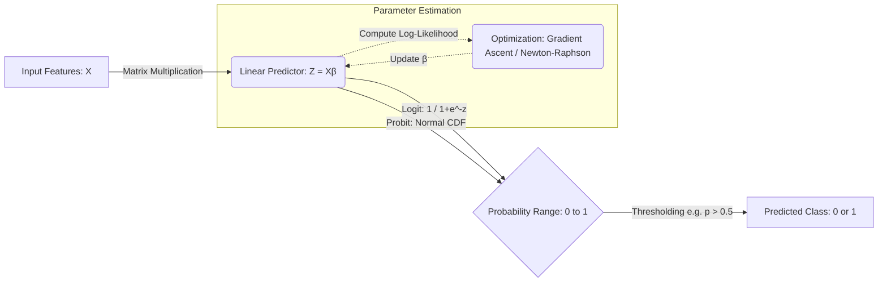

# 5. Visual Intuition and System Architecture

The computational graph for both models can be visualized as a pipeline mapping raw features to probabilistic predictions.

```mermaid
flowchart LR
    A[Input Features: X] -->|Matrix Multiplication| B(Linear Predictor: Z = Xβ)
    B -->|Logit: 1 / 1+e^-z| C{Probability Range: 0 to 1}
    B -->|Probit: Normal CDF| C
    C -->|Thresholding e.g. p > 0.5| D[Predicted Class: 0 or 1]
    
    subgraph Parameter Estimation
    B -.->|Compute Log-Likelihood| E(Optimization: Gradient Ascent / Newton-Raphson)
    E -.->|Update β| B
    end
```
