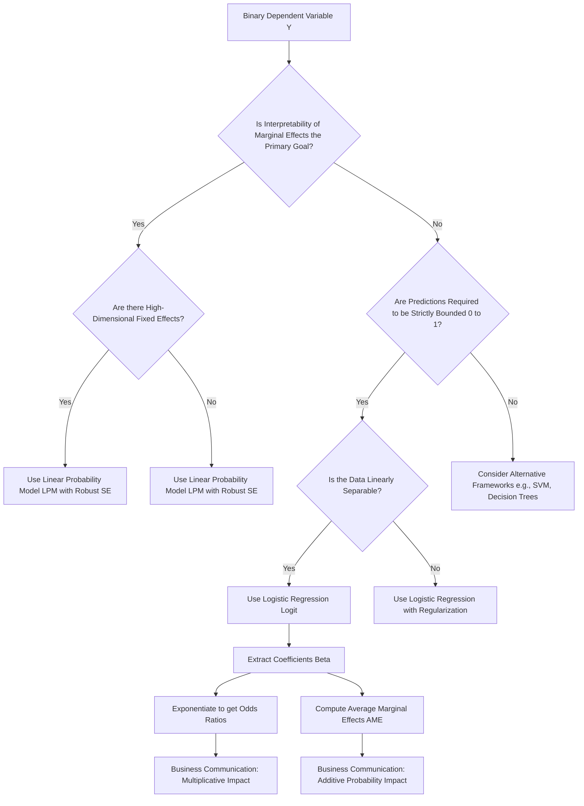

# Binary Response Models: Linear Probability, Logit, and Probit Frameworks

This document provides a rigorous technical analysis of binary response models. It details the transition from continuous Ordinary Least Squares (OLS) regression to discrete Maximum Likelihood Estimation (MLE) frameworks, specifically the Linear Probability Model (LPM), Logit, and Probit models. It establishes the mathematical foundations for interpreting coefficients through log-odds, odds ratios, and marginal effects.

> [!IMPORTANT]
> Binary response models are a specialized class of Generalized Linear Models (GLMs). They model the conditional probability $P(Y=1|X)$ of a dichotomous outcome. Unlike OLS, which assumes a continuous, unbounded dependent variable with constant variance, binary models require non-linear link functions to bound predictions between 0 and 1 and account for the heteroskedasticity inherent in Bernoulli distributions.

## 1. Concept Introduction

In many enterprise applications, the outcome of interest is not a continuous magnitude but a discrete state: a customer churns or does not churn, a loan defaults or is repaid, a patient has a disease or is healthy. 

Applying standard linear regression to a binary dependent variable $Y \in \{0, 1\}$ violates the core assumptions of the Gauss-Markov theorem. The errors cannot be normally distributed (they can only take two values), and the variance of the errors is strictly dependent on the mean (heteroskedasticity). Furthermore, a linear model will inevitably produce predictions outside the valid probability range $[0, 1]$. Binary response models resolve these structural failures by mapping the linear predictor $X\beta$ through a non-linear Cumulative Distribution Function (CDF) or link function.

## 2. Intuition Section

The foundational intuition for binary models is the **Latent Variable Framework**. 

Assume there is an unobservable, continuous "propensity" or "utility" variable $Y^*$ that determines the outcome. 
$$Y^* = X\beta + \epsilon$$
We do not observe $Y^*$; we only observe the binary realization $Y$. The observation rule is a threshold mechanism:
$$Y = \begin{cases} 1 & \text{if } Y^* > 0 \\ 0 & \text{if } Y^* \le 0 \end{cases}$$
The probability of observing $Y=1$ is the probability that the error term $\epsilon$ is greater than $-X\beta$. The specific statistical model (LPM, Probit, or Logit) is defined entirely by the assumed probability distribution of the unobserved error term $\epsilon$.

## 3. Mathematical Explanation

All binary response models fall under the Generalized Linear Model (GLM) framework. The components are:
1.  **Random Component**: The response variable $Y_i$ follows a Bernoulli distribution with parameter $p_i = P(Y_i=1|X_i)$.
2.  **Systematic Component**: The linear predictor $\eta_i = X_i\beta$.
3.  **Link Function**: A monotonic, differentiable function $g(\cdot)$ that connects the mean of the response to the linear predictor: $g(E[Y_i|X_i]) = g(p_i) = X_i\beta$.

## 4. Formula Breakdowns

### The Linear Probability Model (LPM)
Assumes the error term $\epsilon$ follows a Uniform distribution. The link function is the identity function.
$$P(Y=1|X) = X\beta$$
*   **Advantage**: Coefficients $\beta$ are directly interpretable as marginal effects (change in probability for a unit change in $X$).
*   **Fatal Flaw**: The predictions are unbounded. For extreme values of $X$, $\hat{p}$ will exceed 1 or fall below 0.

### The Logit Model
Assumes the error term $\epsilon$ follows a Standard Logistic distribution. The link function is the logit (log-odds) transformation.
$$P(Y=1|X) = \Lambda(X\beta) = \frac{1}{1 + e^{-X\beta}}$$
The inverse link function yields the log-odds:
$$\ln\left(\frac{p}{1-p}\right) = X\beta$$

### The Probit Model
Assumes the error term $\epsilon$ follows a Standard Normal distribution. The link function is the inverse standard normal CDF.
$$ P(Y=1|X) = \Phi(X\beta) = \int_{-\infty}^{X\beta} \frac{1}{\sqrt{2\pi}} e^{-\frac{t^2}{2}} dt $$

### Odds and Odds Ratios
The **Odds** of an event is the ratio of the probability of success to the probability of failure:
$$ \text{Odds} = \frac{p}{1-p} $$
The **Odds Ratio (OR)** for a one-unit increase in $X_k$ is the exponentiated coefficient:
$$ \text{OR}_k = e^{\beta_k} $$

## 5. Step-by-Step Derivations

### Deriving the Marginal Effect for the Logit Model
To find the actual change in probability with respect to a continuous predictor $X_k$, we take the partial derivative of $p$ using the chain rule:
$$ \frac{\partial p}{\partial X_k} = \frac{\partial}{\partial X_k} \left( \frac{1}{1 + e^{-X\beta}} \right) $$
$$ \frac{\partial p}{\partial X_k} = \beta_k \cdot \left( \frac{e^{-X\beta}}{(1 + e^{-X\beta})^2} \right) $$
$$ \frac{\partial p}{\partial X_k} = \beta_k \cdot p(1-p) $$

> [!NOTE]
> The marginal effect is not a single constant number; it is a function of $X$. It is maximized when $p = 0.5$ (where $p(1-p) = 0.25$) and approaches zero as $p$ approaches 0 or 1. This mathematically proves why the coefficient $\beta_k$ cannot be interpreted as a direct change in probability.

### Deriving the Odds Ratio Interpretation
Starting from the log-odds equation:
$$ \ln\left(\frac{p}{1-p}\right) = \beta_0 + \beta_1 X_1 + \dots + \beta_k X_k $$
Exponentiate both sides to isolate the odds:
$$ \frac{p}{1-p} = e^{\beta_0 + \beta_1 X_1 + \dots + \beta_k X_k} $$
If we increase $X_k$ by one unit (from $x$ to $x+1$), the new odds are:
$$ \text{Odds}_{new} = e^{\beta_0 + \dots + \beta_k(x+1) + \dots} = e^{\beta_k} \cdot e^{\beta_0 + \dots + \beta_k x + \dots} $$
$$ \text{Odds}_{new} = e^{\beta_k} \cdot \text{Odds}_{old} $$
Thus, $e^{\beta_k}$ is the multiplicative factor by which the odds change for a one-unit increase in $X_k$.

## 6. Real-World Analogies

**The Signal Detection Threshold**:
Imagine a radio receiver trying to detect a faint binary signal (0 or 1) buried in static noise. The true signal strength is the linear predictor $X\beta$. The static is the error term $\epsilon$. The receiver has a hardware threshold set at 0 volts. If the combined signal plus noise crosses 0 volts, the receiver outputs a "1". The Logit and Probit models are simply mathematical descriptions of the probability distribution of that static noise.

**The Rigid Ruler vs. The Elastic Band**:
The LPM is like a rigid, infinitely long wooden ruler trying to measure a bounded space. It will inevitably poke out of the $[0, 1]$ boundaries. The Logit model is like an elastic band; it stretches easily in the middle (where probability is near 0.5) but becomes rigid and resists further stretching as it approaches the 0 and 1 boundaries, capturing the saturation effect of probability.

## 7. Python Implementations

The following implementation demonstrates the structural differences between LPM, Logit, and Probit, and provides a production-grade pipeline for extracting Odds Ratios and Average Marginal Effects (AME).

```python
import numpy as np
import pandas as pd
import statsmodels.api as sm
import warnings

warnings.filterwarnings('ignore')

class BinaryResponsePipeline:
    """
    A production-grade pipeline for fitting binary response models 
    and extracting statistically rigorous interpretations.
    """
    
    def __init__(self, X_raw: pd.DataFrame, y: np.ndarray):
        self.X = sm.add_constant(X_raw)
        self.y = y
        
    def fit_models(self):
        """Fits LPM, Logit, and Probit models."""
        self.lpm = sm.OLS(self.y, self.X).fit(cov_type='HC3') # Robust SEs mandatory for LPM
        self.logit = sm.Logit(self.y, self.X).fit(disp=0)
        self.probit = sm.Probit(self.y, self.X).fit(disp=0)
        
    def extract_odds_ratios(self):
        """Extracts Odds Ratios and 95% Confidence Intervals from the Logit model."""
        params = self.logit.params
        conf_int = self.logit.conf_int()
        
        or_df = pd.DataFrame({
            'Log-Odds (Beta)': params,
            'Odds Ratio (exp(Beta))': np.exp(params),
            'OR 2.5%': np.exp(conf_int[0]),
            'OR 97.5%': np.exp(conf_int[1])
        })
        return or_df.drop('const', errors='ignore')
        
    def extract_average_marginal_effects(self):
        """Computes the Average Marginal Effect (AME) for the Logit model."""
        margeff = self.logit.get_margeff(at='overall', method='dydx')
        
        # Extracting AME values into a clean DataFrame
        ame_data = []
        for i, var in enumerate(margeff.margeff):
            ame_data.append({
                'Variable': self.X.columns[i+1], # Skip constant
                'AME (dP/dX)': var,
                'Std Err': margeff.margeff_se[i],
                'P-value': margeff.pvalues[i]
            })
        return pd.DataFrame(ame_data)

# Execution Block
if __name__ == "__main__":
    # Simulate enterprise data: Loan Default Prediction
    np.random.seed(42)
    n = 2000
    credit_score = np.random.normal(650, 80, n)
    income = np.random.normal(50, 20, n)
    
    # True data generating process (Logistic)
    log_odds_true = -5.0 - 0.015 * credit_score + 0.05 * income
    p_true = 1 / (1 + np.exp(-log_odds_true))
    default = np.random.binomial(1, p_true)
    
    X_data = pd.DataFrame({'credit_score': credit_score, 'income': income})
    
    # Initialize and run pipeline
    pipeline = BinaryResponsePipeline(X_data, default)
    pipeline.fit_models()
    
    print("--- Logit Odds Ratios ---")
    print(pipeline.extract_odds_ratios().round(3))
    
    print("\n--- Logit Average Marginal Effects (AME) ---")
    print(pipeline.extract_average_marginal_effects().round(4))
```

## 8. Python Simulations

This simulation empirically verifies the two fatal flaws of the LPM: unbounded predictions and heteroskedastic residuals, contrasting them with the bounded Logit model.

```python
import matplotlib.pyplot as plt

def visualize_binary_model_flaws():
    """
    Simulates data to visually demonstrate unbounded predictions 
    and heteroskedasticity in the Linear Probability Model.
    """
    np.random.seed(42)
    n = 1000
    X = np.random.uniform(-4, 4, n)
    
    # True data generating process is highly non-linear
    true_prob = 1 / (1 + np.exp(-X))
    y = np.random.binomial(1, true_prob)
    
    X_sm = sm.add_constant(X)
    lpm = sm.OLS(y, X_sm).fit()
    logit = sm.Logit(y, X_sm).fit(disp=0)
    
    lpm_predictions = lpm.predict(X_sm)
    logit_predictions = logit.predict(X_sm)
    lpm_residuals = lpm.resid
    
    fig, axes = plt.subplots(1, 3, figsize=(18, 5))
    
    # Plot 1: Unbounded Predictions (LPM vs Logit)
    axes[0].scatter(X, y, alpha=0.2, color='gray', label='Observed Binary Data')
    axes[0].plot(X, lpm_predictions, color='red', linewidth=2, label='LPM (Unbounded)')
    axes[0].plot(X, logit_predictions, color='blue', linewidth=2, label='Logit (Bounded)')
    axes[0].axhline(1, color='black', linestyle='--', alpha=0.7, label='Probability Bounds')
    axes[0].axhline(0, color='black', linestyle='--', alpha=0.7)
    axes[0].set_title('Flaw 1: Unbounded Predictions')
    axes[0].set_xlabel('Feature X')
    axes[0].set_ylabel('Predicted Probability')
    axes[0].legend()
    axes[0].grid(True, alpha=0.3)
    
    # Plot 2: Heteroskedastic Residuals (LPM)
    axes[1].scatter(lpm_predictions, lpm_residuals, alpha=0.4, color='purple')
    axes[1].axhline(0, color='black', linestyle='-', linewidth=1)
    axes[1].set_title('Flaw 2: Heteroskedasticity (Fan Shape)')
    axes[1].set_xlabel('LPM Predicted Probability')
    axes[1].set_ylabel('Residuals')
    axes[1].grid(True, alpha=0.3)
    
    # Plot 3: The Three Spaces (Log-Odds, Odds, Probability)
    x_vals = np.linspace(-4, 4, 200)
    log_odds = x_vals
    odds = np.exp(log_odds)
    probability = 1 / (1 + np.exp(-log_odds))
    
    axes[2].plot(x_vals, log_odds, color='green', linewidth=2, label='Log-Odds (Linear)')
    axes[2].plot(x_vals, probability, color='red', linewidth=2, linestyle='--', label='Probability (S-Curve)')
    axes[2].set_title('The Link Function Transformation')
    axes[2].set_xlabel('Linear Predictor ($X\\beta$)')
    axes[2].set_ylabel('Transformed Value')
    axes[2].legend()
    axes[2].grid(True, alpha=0.3)
    
    plt.tight_layout()
    plt.show()

visualize_binary_model_flaws()
```

## 9. Practical Engineering Examples

*   **Credit Risk Modeling**: Predicting the probability of default (PD) for a loan applicant. Regulatory frameworks like Basel III require highly calibrated probability estimates, making the bounded nature of the Logit model mandatory. The Odds Ratio for a feature like "number of late payments" directly informs the risk weighting of the loan.
*   **A/B Testing and Conversion Rate Optimization**: An e-commerce platform tests a new checkout UI. The logit model yields a coefficient of $\beta = 0.223$ for the `treatment_group` dummy variable. The Odds Ratio is $e^{0.223} = 1.25$. The engineering report states: "The new UI increases the *odds* of conversion by 25% relative to the control group."
*   **Medical Triage Systems**: Estimating the probability that a patient in the ER has a critical condition based on vital signs. The marginal effect allows doctors to understand the exact percentage point increase in risk for a specific symptom.

## 10. Common Mistakes

> [!WARNING]
> **Trap 1: Interpreting $\beta$ as a percentage point change in probability.**
> Stating "a one-unit increase in X increases the probability of Y by $\beta$" is mathematically false in a Logit model. This is the Linear Probability Model fallacy applied to a non-linear model. The coefficient $\beta$ represents the change in log-odds.

> [!WARNING]
> **Trap 2: Confusing Odds Ratios with Relative Risk.**
> An Odds Ratio of 2.0 does *not* mean the probability is doubled. If the baseline probability is 50% (Odds = 1.0), an OR of 2.0 makes the new odds 2.0, which corresponds to a probability of 66.7%, not 100%. OR only approximates Relative Risk when the outcome is very rare (e.g., $< 10\%$).

> [!WARNING]
> **Trap 3: Ignoring Heteroskedasticity in LPM.**
> If you must use LPM for interpretability, you cannot use standard OLS standard errors. The error variance is $p(1-p)$, which varies with $X$. You must use heteroskedasticity-robust standard errors (e.g., Huber-White HC2 or HC3) to perform valid hypothesis testing.

## 11. Visual Intuition

The visual signature of the models is defined by their link functions:
*   **LPM**: A straight line extending to infinity. It assumes the effect of $X$ on probability is constant everywhere.
*   **Logit & Probit**: S-shaped curves (sigmoids) asymptotically bounded at 0 and 1. They capture the "saturation effect"—when a probability is already very close to 0 or 1, additional changes in $X$ have diminishing impacts on the probability. 
*   **Log-Odds Space**: If you plot the linear predictor $X\beta$ on the X-axis and the log-odds on the Y-axis, the relationship is a perfect 45-degree straight line. The non-linearity only appears when mapping this line through the sigmoid function to the probability space.

## 12. Mermaid Diagrams

The decision framework and computational pipeline for selecting and interpreting a binary response model.



## 13. Real-World Applications

*   **Epidemiology and Public Health**: Estimating the "risk difference" between a treatment and control group. While LPM provides direct risk differences, Logit provides Odds Ratios, which are the standard metric in case-control studies where relative risks cannot be directly calculated.
*   **Actuarial Science**: Insurance companies use logit models to price policies. The coefficients are translated into relativities (similar to odds ratios) to adjust base premiums up or down based on risk factors like age, location, and vehicle type.
*   **Discrimination Studies**: In labor economics, the Oaxaca-Blinder decomposition is used to measure wage gaps. When the outcome is binary (e.g., hired vs. not hired), the decomposition is mathematically straightforward using an LPM, whereas non-linear decompositions for Logit are complex and sensitive to functional form assumptions.

## 14. Machine Learning Connections

In the machine learning domain, the Logit model is known as **Logistic Regression**. 
*   **Linear Decision Boundary**: The term "linear classifier" arises because the decision boundary (where $P(Y=1|X) = 0.5$) occurs when the log-odds equal zero: $X^T\beta = 0$. This is the equation of a hyperplane in the feature space.
*   **Loss Function Equivalence**: The objective function minimized by ML libraries (like `sklearn.linear_model.LogisticRegression`) is the **Binary Cross-Entropy Loss**. Mathematically, Binary Cross-Entropy is exactly the Negative Log-Likelihood of the Bernoulli distribution. ML is simply performing MLE under a different nomenclature.
*   **Neural Network Equivalence**: A logistic regression model is mathematically identical to a single-layer neural network with no hidden layers, a linear activation in the hidden layer, and a sigmoid activation in the output layer.

## 15. Interview-Style Insights

**Interviewer:** "If the Linear Probability Model violates OLS assumptions and produces impossible probabilities, why do econometricians still use it?"
**Candidate:** "The LPM is used when the research design prioritizes causal identification over predictive calibration. Specifically, in panel data with high-dimensional fixed effects, non-linear models like Logit suffer from the incidental parameters problem, rendering their estimates inconsistent as the number of groups grows. The LPM with fixed effects remains consistent. Furthermore, the LPM coefficients are directly interpretable as average marginal effects. If the data is clustered away from the 0 and 1 boundaries, the LPM's flaws are minimized, making it a robust, computationally efficient tool for causal inference."

**Interviewer:** "How do you explain the coefficient of a logistic regression model to a non-technical business stakeholder?"
**Candidate:** "I avoid using the terms 'log-odds' or 'coefficients.' Instead, I translate the coefficient into an Odds Ratio or a Marginal Effect. For a business stakeholder, I would say: 'Holding all other factors constant, a one-unit increase in this variable multiplies the odds of the event happening by [Odds Ratio], which translates to an average increase in the probability of the event by [AME] percentage points.'"

**Interviewer:** "Why is the Average Marginal Effect (AME) generally preferred over the Marginal Effect at the Mean (MEM)?"
**Candidate:** "The MEM calculates the marginal effect for a hypothetical individual whose features are exactly at the dataset's mean. In datasets with categorical variables or highly skewed distributions, this 'average' individual may not represent any real entity. The AME calculates the marginal effect for every actual observation in the dataset and then averages those effects, providing a more robust and representative summary of the model's behavior across the actual population."

## 16. Edge Cases

*   **Complete or Quasi-Complete Separation**: If a linear combination of features perfectly predicts the outcome (e.g., all observations with $X > 5$ have $Y=1$), the MLE for $\beta$ does not exist; the coefficient will approach infinity. This is known as the Hauck-Donner effect. The Hessian matrix becomes singular, and the optimization algorithm will fail to converge.
*   **Rare Events Bias**: When the event $Y=1$ is extremely rare (e.g., $< 1\%$), standard MLE for the Logit model systematically underestimates the probability of the event. 
*   **Interaction Terms**: In linear regression, the marginal effect of an interaction term $X_1 X_2$ is simply the coefficient $\beta_3$. In logistic regression, the marginal effect of an interaction is a complex function of $\beta_3$, the main effects, and the probability $p(1-p)$. It cannot be interpreted by looking at the interaction coefficient alone.

## 17. Mental Models

**The Unbounding Transformation**:
View the logit model as a three-stage pipeline:
1. **Linear Predictor ($X\beta$)**: A rigid, unbounded ruler measuring latent utility.
2. **Log-Odds**: The direct reading from that ruler.
3. **Probability**: The ruler's reading passed through a "compression valve" (the sigmoid function) that forces the output to fit within the strict 0-to-1 boundaries of reality. 
Interpreting coefficients requires knowing which stage of the pipeline you are reporting on.

## 18. Performance and Computational Insights

*   **LPM Computational Speed**: The LPM is solved via a single matrix inversion $(X^TX)^{-1}X^TY$. The time complexity is $O(N \cdot K^2)$ for computing the cross-products and $O(K^3)$ for the inversion. It is trivially parallelizable in distributed computing environments.
*   **MLE Iterative Cost**: Logit and Probit models require Iteratively Reweighted Least Squares (IRLS) or Newton-Raphson optimization. This requires computing the Hessian matrix and inverting it at every iteration until convergence. For massive datasets ($N > 10^7$) with many features, the LPM is orders of magnitude faster to train than Logit.
*   **Post-Estimation Overhead**: Calculating the Average Marginal Effect requires computing the predicted probability $p_i$ for every single observation in the dataset, multiplying by $p_i(1-p_i)$, and averaging. This adds an $O(N \cdot K)$ computational step post-estimation.

## 19. Advanced Notes

*   **Firth's Bias-Reduced Logistic Regression**: To solve the complete separation problem and reduce small-sample bias, Firth's method introduces a penalization term to the log-likelihood function, equivalent to using a specific Jeffreys prior in Bayesian inference. This forces the coefficients to remain finite even under perfect separation.
*   **Fractional Response Models**: If the dependent variable is a proportion (e.g., the percentage of a portfolio invested in equities, bounded between 0 and 1 but not strictly binary), the LPM is also inappropriate. Papke and Wooldridge (1996) developed a Quasi-MLE framework using a Logit link function with robust standard errors to handle continuous fractional responses.
*   **Multinomial and Ordinal Extensions**: When the outcome has more than two unordered categories, the binary logistic function generalizes to the Softmax function (Multinomial Logit). When the categories have a natural order (e.g., Low, Medium, High), the Proportional Odds Model (Ordinal Logit) is used, modeling the cumulative log-odds.

## 20. Final Takeaways

### Key Takeaways
*   Binary response models map a linear predictor to a probability space $[0, 1]$ using a non-linear link function.
*   The **Linear Probability Model** is unbounded and heteroskedastic; it should only be used with robust standard errors for quick interpretability or high-dimensional fixed effects.
*   The **Logit Model** assumes a logistic error distribution. Its coefficients represent log-odds, and it is the industry standard due to computational efficiency and interpretability via Odds Ratios.
*   The **Probit Model** assumes a normal error distribution. It is mathematically similar to Logit but lacks a closed-form CDF.
*   **Odds Ratios** ($e^\beta$) provide a multiplicative interpretation, while **Average Marginal Effects** (AME) provide an additive, probability-based interpretation. AME is the industry standard for reporting practical impact.

### Common Traps to Avoid
*   Interpreting Logit coefficients ($\beta$) as direct percentage-point changes in probability.
*   Equating Odds Ratios with Relative Risk, especially when the baseline probability is high ($>10\%$).
*   Using LPM predictions for downstream expected value calculations without clipping probabilities to $[0, 1]$.
*   Ignoring the Hauck-Donner effect (complete separation) when features perfectly divide the classes.

### Interview Questions to Drill
1. Derive the formula for the marginal effect of a continuous variable in a logistic regression model and explain why it is non-constant.
2. Explain the incidental parameters problem and why it justifies the use of the LPM in panel data.
3. How does the interpretation of an interaction term differ between linear regression and logistic regression?
4. Why is the Average Marginal Effect (AME) generally preferred over the Marginal Effect at the Mean (MEM)?

### Advanced Learning Roadmap
1. **Next Step**: Master **Poisson and Negative Binomial Regression** for modeling count data (non-negative integers).
2. **Next Step**: Study **Survival Analysis (Cox Proportional Hazards)** to handle binary outcomes where the *time* until the event occurs is the primary variable of interest.
3. **Next Step**: Explore **Firth’s Penalized Likelihood** to handle coefficient estimation in the presence of quasi-complete separation.

### Recommended Python Libraries
*   `statsmodels`: The definitive library for statistical inference, providing MLE estimation, robust standard errors, and the `get_margeff()` method for computing AME.
*   `scikit-learn`: For high-performance, regularized Logistic Regression (using L1/L2 penalties) focused purely on predictive classification.
*   `linearmodels`: An advanced econometrics library specifically designed for panel data and high-dimensional fixed effects models where LPM is frequently required.
*   `marginaleffects`: A powerful library specifically designed for computing and visualizing marginal effects, contrasts, and predictions across complex models.