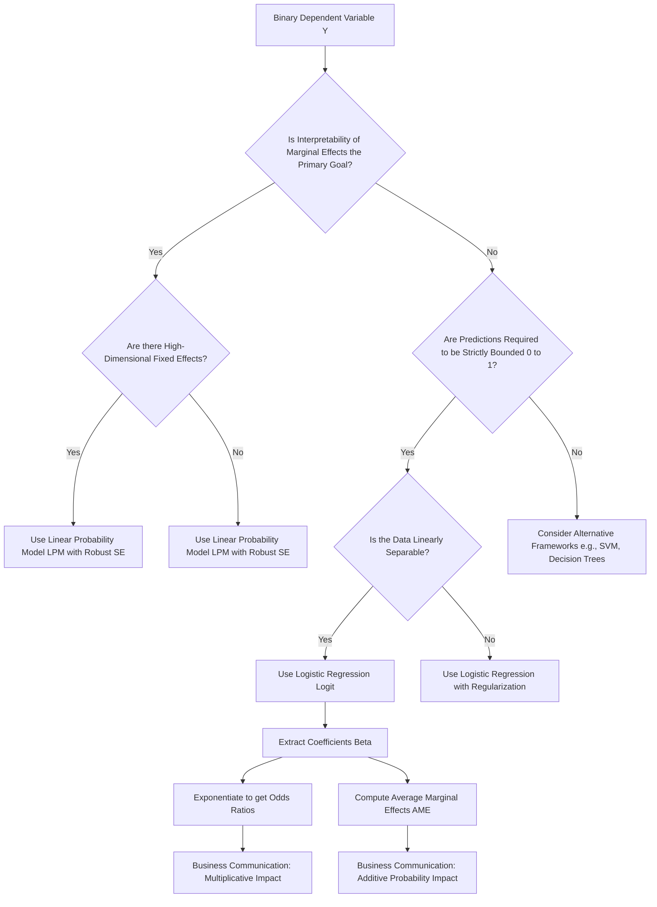

# 12. Mermaid Diagrams

The decision framework and computational pipeline for selecting and interpreting a binary response model.

```mermaid
flowchart TD
    A[Binary Dependent Variable Y] --> B{Is Interpretability of Marginal Effects the Primary Goal?}
    B -->|Yes| C{Are there High-Dimensional Fixed Effects?}
    C -->|Yes| D[Use Linear Probability Model LPM with Robust SE]
    C -->|No| E[Use Linear Probability Model LPM with Robust SE]
    B -->|No| F{Are Predictions Required to be Strictly Bounded 0 to 1?}
    F -->|Yes| G{Is the Data Linearly Separable?}
    G -->|Yes| H[Use Logistic Regression Logit]
    G -->|No| I[Use Logistic Regression with Regularization]
    F -->|No| J[Consider Alternative Frameworks e.g., SVM, Decision Trees]
    
    H --> K[Extract Coefficients Beta]
    K --> L[Exponentiate to get Odds Ratios]
    K --> M[Compute Average Marginal Effects AME]
    L --> N[Business Communication: Multiplicative Impact]
    M --> O[Business Communication: Additive Probability Impact]
```
