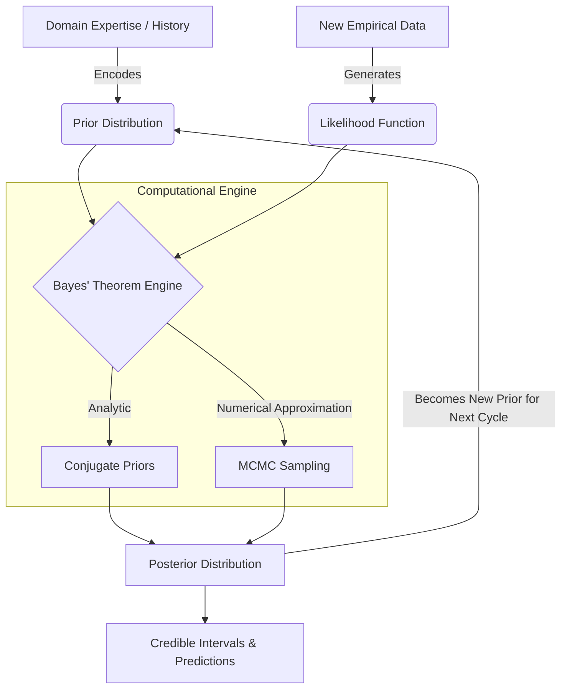

# Bayesian Inference: Probabilistic Programming and Belief Updating

> [!IMPORTANT]
> Bayesian Inference is a paradigm of statistical reasoning where probabilities represent **degrees of belief** rather than long-run frequencies. Instead of treating parameters as fixed and data as random (the Frequentist view), Bayesian inference treats the observed data as fixed and parameters as random variables described by probability distributions.

## 1. Concept Introduction

In traditional machine learning and frequentist statistics (like Maximum Likelihood Estimation), we seek a single optimal point estimate for a parameter $\theta$. We ask: *"What single value of $\theta$ maximizes the probability of observing our data?"*

Bayesian inference flips this. We acknowledge that our knowledge is imperfect, so we represent our uncertainty about $\theta$ as a distribution. We ask: *"Given our prior knowledge and the new data, what is the entire distribution of plausible values for $\theta$?"*

This requires fundamentally reframing probability:
*   **Frequentist:** Probability is the limit of relative frequency over infinite trials.
*   **Bayesian:** Probability is a quantifiable measure of uncertainty or degree of belief.

## 2. Intuition and Real-World Analogy

Imagine you are a radar operator tracking a submarine.

1.  **Prior:** Before looking at the screen, you know submarines typically travel in deep trenches. You construct a mental map of where it *probably* is.
2.  **Likelihood (Data):** The radar pings a faint signal in a specific sector. However, the radar is noisy. It could be a false positive, or it could be the submarine.
3.  **Posterior:** You update your mental map. You don't blindly trust the noisy ping (MLE), nor do you ignore it and stick to your initial guess. You combine them. If the ping is strong and aligns with the trench, your confidence spikes. If the ping is in shallow water (where submarines rarely go), you remain skeptical.

This continuous cycle of **Prior $\to$ Observation $\to$ Posterior** is the Bayesian engine. Today's posterior becomes tomorrow's prior.

## 3. Mathematical Foundations and Formula Breakdowns

The core of this engine is Bayes' Theorem, applied to probability distributions rather than discrete events.

$$
P(\theta|D) = \frac{P(D|\theta)P(\theta)}{P(D)}
$$

### Formula Breakdown

*   **$P(\theta|D)$ [The Posterior]:** The updated probability distribution of the parameters $\theta$ after observing data $D$. This is the ultimate goal of Bayesian inference.
*   **$P(D|\theta)$ [The Likelihood]:** The probability of observing the data $D$ given a specific parameter value $\theta$. This represents the evidence.
*   **$P(\theta)$ [The Prior]:** The initial distribution of the parameters before any data is observed. It encodes domain expertise or historical constraints.
*   **$P(D)$ [The Evidence / Marginal Likelihood]:** The total probability of the data across all possible parameter values.

> [!WARNING]
> The denominator $P(D)$ is the central computational bottleneck of Bayesian inference. It requires integrating over the entire parameter space:
> $$P(D) = \int_{\Theta} P(D|\theta)P(\theta) d\theta$$
> For models with thousands of parameters (like Neural Networks), this integral is impossible to compute algebraically. This intractable denominator forces us to use approximation techniques like Markov Chain Monte Carlo (MCMC).

## 4. Visual Intuition and System Architecture

The Bayesian workflow is a continuous pipeline of belief updating. 



## 5. Step-by-Step Derivation: Analytical Solution (Conjugate Priors)

Before jumping to numerical approximations, let us solve Bayes' Theorem analytically using a **Conjugate Prior**. A prior is conjugate to a likelihood if the resulting posterior belongs to the same probability distribution family as the prior.

**Scenario:** Estimating the Click-Through Rate (CTR), denoted as $p$, of a new advertisement.

**Step 1: Define the Likelihood (Binomial)**
We observe $k$ clicks out of $n$ impressions.
$$ P(D|p) \propto p^k (1-p)^{n-k} $$

**Step 2: Define the Prior (Beta Distribution)**
We know from historical ads that CTRs are usually around 5%. We model this with a Beta distribution parameterized by $\alpha$ (pseudo-successes) and $\beta$ (pseudo-failures).
$$ P(p) \propto p^{\alpha - 1} (1-p)^{\beta - 1} $$

**Step 3: Multiply to find the Posterior**
Because the Evidence $P(D)$ is just a normalizing constant, we can use the proportional relationship: $\text{Posterior} \propto \text{Likelihood} \times \text{Prior}$.

$$ P(p|D) \propto \left[ p^k (1-p)^{n-k} \right] \times \left[ p^{\alpha - 1} (1-p)^{\beta - 1} \right] $$

Combine the exponents algebraically:

$$ P(p|D) \propto p^{k + \alpha - 1} (1-p)^{n - k + \beta - 1} $$

> [!TIP]
> Notice the result! The posterior is mathematically identical to a new Beta distribution with updated parameters:
> $$ \text{Posterior} \sim \text{Beta}(\alpha_{\text{new}}, \beta_{\text{new}}) $$
> Where $\alpha_{\text{new}} = \alpha + k$ and $\beta_{\text{new}} = \beta + n - k$. 
> We completely bypassed the impossible denominator integral by exploiting algebraic structure.

## 6. Python Implementation: The Analytical Approach (SciPy)

Let us implement the Beta-Binomial update process to visualize how the data pulls the prior towards the likelihood.

```python
import numpy as np
import matplotlib.pyplot as plt
from scipy.stats import beta

# 1. Define the Prior (Weak belief that CTR is around 10%)
alpha_prior = 2
beta_prior = 18
x = np.linspace(0, 1, 500)
prior_pdf = beta.pdf(x, alpha_prior, beta_prior)

# 2. Observe New Data (The Likelihood)
# We showed the ad 100 times, got 25 clicks (25% CTR in data)
n = 100
k = 25
likelihood = (x**k) * ((1-x)**(n-k))
likelihood_normalized = likelihood / np.max(likelihood) * np.max(prior_pdf) # Scale for plotting

# 3. Compute the Posterior exactly using Conjugacy
alpha_post = alpha_prior + k
beta_post = beta_prior + n - k
posterior_pdf = beta.pdf(x, alpha_post, beta_post)

# 4. Visualization
plt.figure(figsize=(10, 6))
plt.plot(x, prior_pdf, label=f'Prior: Beta({alpha_prior}, {beta_prior})', color='gray', linestyle='--')
plt.plot(x, likelihood_normalized, label=f'Likelihood (Data): {k} clicks / {n} views', color='blue', alpha=0.3)
plt.plot(x, posterior_pdf, label=f'Posterior: Beta({alpha_post}, {beta_post})', color='purple', linewidth=2)

plt.title("Bayesian Updating: Beta-Binomial Conjugacy", fontsize=14)
plt.xlabel("Click-Through Rate (p)", fontsize=12)
plt.ylabel("Density / Degree of Belief", fontsize=12)
plt.xlim(0, 0.5)
plt.legend()
plt.grid(alpha=0.3)
plt.show()

print(f"Prior Expected Value: {alpha_prior / (alpha_prior + beta_prior):.3f}")
print(f"Data MLE Point Estimate: {k / n:.3f}")
print(f"Posterior Expected Value: {alpha_post / (alpha_post + beta_post):.3f}")
```

## 7. Overcoming the Integral: Markov Chain Monte Carlo (MCMC)

When likelihoods and priors are not cleanly conjugate (which is 99% of real-world ML problems), we cannot use algebra. We must use algorithms.

**Intuition:** 
If we cannot calculate the exact mathematical equation for the Posterior curve, can we build a robot that wanders around the parameter space, spending time in different areas exactly proportional to the posterior probability?

If the robot spends 80% of its time between $\theta=0.4$ and $\theta=0.6$, we simply tally its footsteps (samples). The histogram of these footsteps *is* the Posterior distribution.

This is the **Metropolis-Hastings Algorithm**:
1. Start at a random parameter value $\theta_{\text{current}}$.
2. Propose a new step to $\theta_{\text{proposed}}$.
3. Calculate the acceptance ratio: $R = \frac{P(D|\theta_{\text{proposed}})P(\theta_{\text{proposed}})}{P(D|\theta_{\text{current}})P(\theta_{\text{current}})}$
4. If $R > 1$, always accept the move (it's a better area).
5. If $R < 1$, accept the move probabilistically.

## 8. Python Implementation: MCMC from Scratch (NumPy)

Writing a Metropolis-Hastings sampler from scratch is a rite of passage for understanding probabilistic programming. Let's estimate the mean ($\mu$) of a normal distribution.

```python
import numpy as np
import matplotlib.pyplot as plt
import scipy.stats as stats

# Ensure reproducibility
np.random.seed(42)

# 1. Generate Synthetic Data (True mean = 5.0)
true_mu = 5.0
data = np.random.normal(loc=true_mu, scale=1.0, size=50)

# 2. Define the Unnormalized Posterior (Likelihood * Prior)
def prior(mu):
    # We believe the mean is probably around 0, standard deviation 3
    return stats.norm.pdf(mu, loc=0, scale=3)

def likelihood(mu, data):
    # Multiply the probability of each data point
    # In practice we use log-likelihoods to prevent underflow, but we keep it basic for learning
    probs = stats.norm.pdf(data, loc=mu, scale=1.0)
    return np.prod(probs)

def unnormalized_posterior(mu, data):
    return likelihood(mu, data) * prior(mu)

# 3. Metropolis-Hastings MCMC Sampler
def run_mcmc(data, iterations, initial_mu):
    samples = []
    current_mu = initial_mu
    current_posterior = unnormalized_posterior(current_mu, data)
    
    accepted = 0
    
    for _ in range(iterations):
        # Propose a new mu by taking a random walk (adding Gaussian noise)
        proposed_mu = np.random.normal(loc=current_mu, scale=0.5)
        proposed_posterior = unnormalized_posterior(proposed_mu, data)
        
        # Calculate acceptance ratio (avoiding division by zero)
        if current_posterior == 0:
            ratio = 1
        else:
            ratio = proposed_posterior / current_posterior
            
        # Accept or Reject
        if ratio > 1.0 or np.random.rand() < ratio:
            current_mu = proposed_mu
            current_posterior = proposed_posterior
            accepted += 1
            
        samples.append(current_mu)
        
    print(f"Acceptance Rate: {accepted / iterations:.2f}")
    return np.array(samples)

# 4. Run the simulation
iterations = 15000
burn_in = 2000 # Discard the early samples before the chain "converged"
samples = run_mcmc(data, iterations, initial_mu=0.0)
valid_samples = samples[burn_in:]

# 5. Visualize the Trace and Posterior
fig, axes = plt.subplots(1, 2, figsize=(14, 5))

# Trace Plot (The robot's path)
axes[0].plot(valid_samples, alpha=0.7, color='teal')
axes[0].set_title("MCMC Trace (Path of the Chain)")
axes[0].set_ylabel("Sampled Mean (μ)")
axes[0].set_xlabel("Iteration")

# Histogram (The Posterior Distribution)
axes[1].hist(valid_samples, bins=40, density=True, color='teal', alpha=0.7)
axes[1].axvline(true_mu, color='red', linestyle='--', label=f"True µ ({true_mu})")
axes[1].axvline(np.mean(valid_samples), color='black', label=f"Estimated µ ({np.mean(valid_samples):.2f})")
axes[1].set_title("Approximated Posterior Distribution")
axes[1].set_xlabel("Mean (μ)")
axes[1].legend()

plt.tight_layout()
plt.show()
```

> [!NOTE]
> The "Trace Plot" in the output is critical in Bayesian engineering. It allows you to visualize the MCMC chain. A healthy trace plot looks like a "hairy caterpillar," indicating the sampler is efficiently exploring the parameter space without getting stuck.

## 9. Common Mistakes

1. **Confidence vs. Credible Intervals:** 
   *   *Frequentist 95% Confidence Interval:* "If we ran this test 100 times, 95 of the intervals would contain the true parameter." (The parameter is fixed, the interval is random).
   *   *Bayesian 95% Credible Interval:* "Given our data, there is a 95% probability that the parameter lies within this range." (The interval is fixed, the parameter is random).
2. **Cromwell's Rule (Zero Probability Priors):**
   If you assign a Prior probability of exactly $0$ to an event, the Posterior will *always* be $0$, no matter how much contradictory data you collect ($0 \times \text{Likelihood} = 0$). Never use strictly bounded uniform priors unless physically impossible bounds dictate it.
3. **Ignoring MCMC Convergence:**
   Running MCMC is not a black box. You must check convergence metrics (like $\hat{R}$ - Gelman-Rubin statistic) to ensure different random chains converge to the same distribution.

## 10. Practical Engineering Applications

*   **Multi-Armed Bandits (Thompson Sampling):** In reinforcement learning, Bayesian inference is used to balance exploration vs. exploitation. You maintain a Beta posterior for the payout rate of each "arm" (or ad). You sample from the posteriors and pick the arm with the highest sample.
*   **Bayesian Neural Networks (BNNs):** Instead of learning a single weight matrix $W$, BNNs learn a *distribution* over weights. This allows the network to say "I don't know" when predicting out-of-distribution data, heavily used in self-driving cars for safety and uncertainty quantification.
*   **A/B Testing (Bayesian Approach):** Unlike Frequentist A/B testing which requires fixed sample sizes and complex p-value interpretations, Bayesian A/B testing allows stakeholders to "peek" at the results continuously and directly answers "What is the probability Variant B is better than Variant A?"

## 11. Edge Cases

*   **High-Dimensional Space:** As the number of parameters grows (e.g., millions in deep learning), traditional MCMC (Metropolis-Hastings, Gibbs) fails because the volume of the space becomes overwhelmingly empty (Curse of Dimensionality). Advanced physics-based methods like **Hamiltonian Monte Carlo (HMC)** or **Variational Inference (VI)** are required.
*   **Uninformative Priors Dominated by Little Data:** If data is extremely sparse, an uninformative prior (like a flat uniform distribution) can result in a highly variable posterior that provides no actionable business value. In small-data regimes, strong, carefully elicited priors are legally and scientifically vital.

## 12. Final Summary & Interview Guide

### Key Takeaways
*   Bayesian Inference treats parameters as probability distributions.
*   The workflow updates a **Prior** belief with a data **Likelihood** to form a **Posterior**.
*   Conjugate priors allow for exact, closed-form algebraic solutions.
*   MCMC allows us to bypass the intractable marginal likelihood integral by mathematically simulating a random walk that converges to the posterior.

### Interview Questions
**Q: How does a Bayesian approach handle small datasets compared to a Frequentist approach?**
*A: A Frequentist approach on small datasets often yields massive, uninformative Confidence Intervals or point estimates highly susceptible to outliers. A Bayesian approach anchors the estimate using a Prior. The Prior acts as a regularizer, preventing extreme conclusions when evidence is sparse.*

**Q: What is the difference between MAP and fully Bayesian Inference?**
*A: MAP (Maximum A Posteriori) finds the single peak (mode) of the posterior distribution. It is a point estimate that incorporates a prior (equivalent to L2 Regularization). Fully Bayesian inference calculates the entire posterior distribution, allowing for uncertainty quantification.*

**Q: Why don't we use Bayesian methods for everything if they are so intuitive?**
*A: Computation cost. MLE is often just a fast derivative optimization (Gradient Descent). Bayesian inference requires calculating intractable integrals over complex spaces, often requiring thousands of MCMC simulation steps, which scales poorly to massive datasets or huge neural architectures.*

### Advanced Learning Roadmap
1. **Hamiltonian Monte Carlo (HMC):** Using gradient geometry to sample high-dimensional posteriors.
2. **Variational Inference (VI):** Framing Bayesian inference as an optimization problem (approximating the posterior with a simpler distribution by minimizing KL Divergence).
3. **Probabilistic Programming Languages (PPLs):** Mastering `PyMC`, `Stan`, or `Pyro` to build hierarchical Bayesian models without writing samplers from scratch.