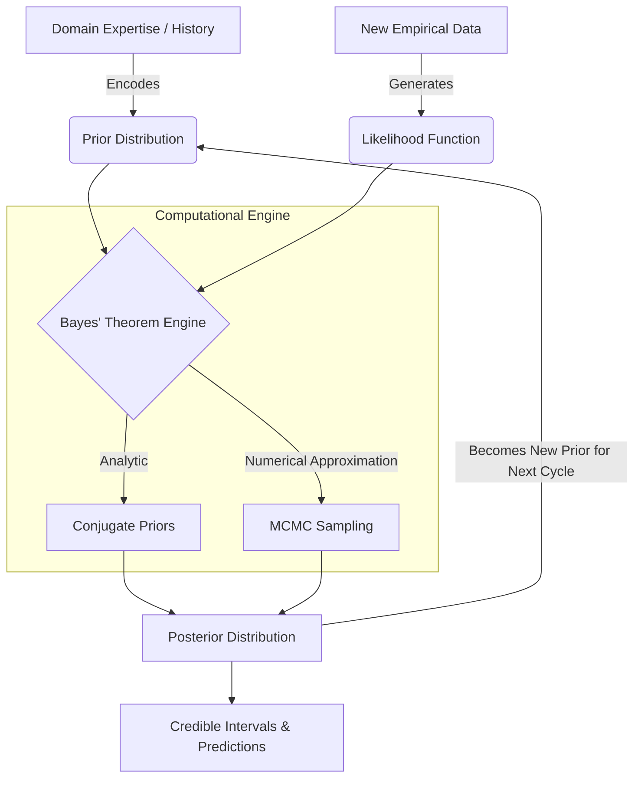

# 4. Visual Intuition and System Architecture

The Bayesian workflow is a continuous pipeline of belief updating. 

```mermaid
flowchart TD
    A[Domain Expertise / History] -->|Encodes| B(Prior Distribution)
    C[New Empirical Data] -->|Generates| D(Likelihood Function)
    
    B --> E{Bayes' Theorem Engine}
    D --> E
    
    subgraph Computational Engine
    E -->|Analytic| F[Conjugate Priors]
    E -->|Numerical Approximation| G[MCMC Sampling]
    end
    
    F --> H[Posterior Distribution]
    G --> H
    
    H -->|Becomes New Prior for Next Cycle| B
    H --> I[Credible Intervals & Predictions]
```
