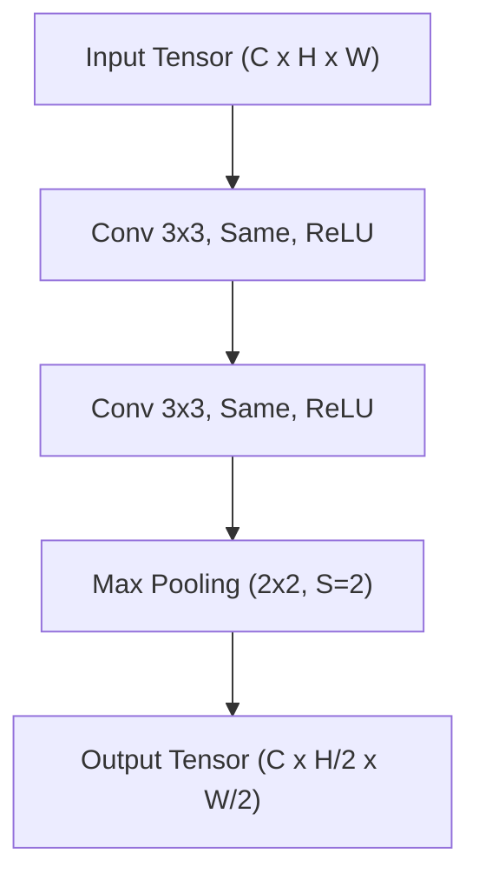
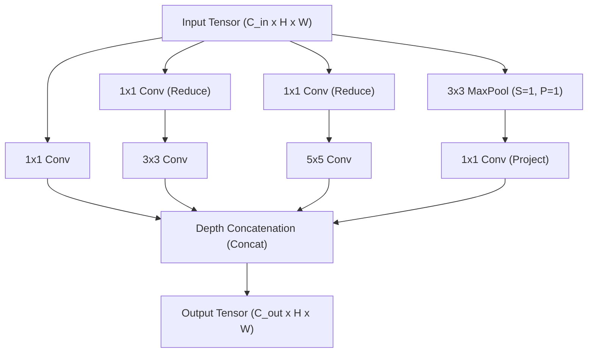
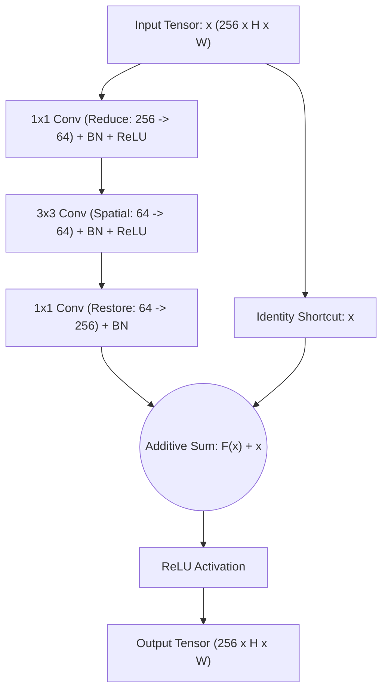

# Migration in progress
# Lesson 4: CNN Architecture Blocks

## Modular CNN Architecture Blocks and Structural Design Patterns

The evolution of Convolutional Neural Networks shifted historical practice from manually engineering individual layers to composing standardized, repeatable computational modules known as architecture blocks. By defining self-contained micro-architectural sub-networks that address specific gradient flow, feature reuse, and computational efficiency bottlenecks, modular blocks allow networks to scale to hundreds of layers. Examining the structural topology and mathematical mechanisms of landmark building blocks establishes the design patterns that power deep vision models.

## The Modular Shift: From Layer Stacks to Repeatable Blocks

### Micro-Architecture Versus Macro-Architecture

- Early convolutional networks (such as AlexNet) were designed by stacking unique, hand-tuned layers with varying kernel sizes, strides, and channel dimensions.
- Modern convolutional engineering decouples design into two independent tiers:
  - **Micro-Architecture (The Block):** A repeatable, self-contained multi-layer sub-network that processes an input tensor through specialized operations (e.g., skip connections, multi-scale branches, or bottleneck projections).
  - **Macro-Architecture (The Backbone):** The global pipeline that cascades identical blocks across multiple stages, systematically downsampling spatial resolution while expanding channel depth.

### The Design Principle of Standardized Interfaces

- Modular design requires blocks to maintain standardized tensor input and output interfaces.
- Standard blocks preserve spatial height, width, and channel depth ($C \times H \times W \to C \times H \times W$), allowing multiple identical units to stack sequentially without modifying surrounding layers.
- Dedicated **transition blocks** or **downsampling stages** handle spatial downsampling ($H/2 \times W/2$) and channel expansion ($2C$) at controlled structural boundaries.

> [!Tip]
> **Modular blocks decouple layer engineering**: designing repeatable micro-architectural blocks with consistent tensor interfaces allows practitioners to scale network depth and width without redesigning internal layer connections.

## The Homogeneous Stacking Block: VGG

### Architectural Anatomy of the VGG Block

- Introduced by Karen Simonyan and Andrew Zisserman (2014), the **VGG Block** replaced heterogeneous filter sizes with a standardized, homogeneous structural rule.
- A VGG block chains two or three consecutive $3 \times 3$ convolutional layers with unit stride ($S=1$) and same padding ($P=1$), each followed by a Rectified Linear Unit (ReLU) activation function.
- The block terminates with a non-parametric $2 \times 2$ Max Pooling layer with stride $S=2$, which halves spatial resolution ($H/2 \times W/2$).

### Receptive Field Factorization

- Stacking two $3 \times 3$ convolutions covers an effective receptive field of $5 \times 5$, while three consecutive $3 \times 3$ convolutions cover $7 \times 7$.
- Replacing a single $7 \times 7$ convolution with three stacked $3 \times 3$ convolutions reduces parameter consumption by nearly half ($3 \times 3^2 C^2 = 27 C^2$ vs $7^2 C^2 = 49 C^2$).
- The intermediate layers insert three non-linear activation functions instead of one, increasing the discriminative expressive capacity of the block.

> [!Important]
> **Homogeneous VGG blocks establish structural simplicity**: stacking small $3 \times 3$ convolutions factorizes large receptive fields, lowering parameter counts and increasing non-linear depth compared to large spatial filters.

## Multi-Scale Processing: The Inception Module

### Parallel Multi-Resolution Branching

- Introduced in GoogLeNet (Christian Szegedy et al., 2014), the **Inception Module** addresses scale variation by processing input features at multiple spatial resolutions concurrently within the same layer.
- Rather than selecting a single filter size, an Inception block processes the input through four parallel branches:
  - Branch 1: $1 \times 1$ convolution (preserves localized pixel context).
  - Branch 2: $3 \times 3$ convolution (captures intermediate spatial patterns).
  - Branch 3: $5 \times 5$ convolution (captures broad, global context; often implemented as two stacked $3 \times 3$ filters).
  - Branch 4: $3 \times 3$ Max Pooling (retains dominant spatial activations).

### Bottleneck Projections via $1 \times 1$ Convolutions

- Naive multi-scale branching creates computational bottlenecks: stacking $3 \times 3$ and $5 \times 5$ filters directly on high-channel inputs requires massive floating-point operations.
- The Inception block resolves this by placing **$1 \times 1$ convolutional bottlenecks** before the $3 \times 3$ and $5 \times 5$ filters, and after the pooling branch.
- A $1 \times 1$ bottleneck reduces channel depth (e.g., projecting 256 input channels down to 64), allowing spatial convolutions to execute across compressed channels before concatenation.

### Depth Concatenation Dynamics

- All four branches employ same padding and stride $S=1$, guaranteeing that their output feature maps match the spatial dimensions of the input grid ($H \times W$).
- The terminal operation concatenates the four resulting tensors along the channel axis:
  $$C_{\text{out}} = C_{\text{branch1}} + C_{\text{branch2}} + C_{\text{branch3}} + C_{\text{branch4}}$$
- Depth concatenation merges multi-scale receptive field responses into a single tensor, allowing downstream layers to select optimal spatial scales dynamically.

> [!Tip]
> **Inception modules process multiple scales in parallel**: using $1 \times 1$ bottleneck convolutions compresses channel depth before spatial filtering, keeping computational costs bounded while merging multi-resolution features.

## Residual Shortcut Blocks: ResNet and Bottlenecks

### The Identity Mapping Formulation

- In standard networks, stacking layers beyond 20 causes optimization degradation: training accuracy saturates and degrades because backpropagated gradients vanish or shatter.
- Kaiming He et al. (2015) introduced the **Residual Block**, reformulating layers to fit a residual mapping rather than an unconstrained transformation:
  $$\mathcal{H}(x) = \mathcal{F}(x, \{W_i\}) + x$$
  where $x$ is the input tensor, $\mathcal{F}(x)$ is the residual function parameterized by weights, and $\mathcal{H}(x)$ is the target output mapping.
- If an identity mapping is optimal, the optimizer drives the residual weights to zero ($\mathcal{F}(x) \to 0$), making parameter learning easier than forcing a standard stack of non-linearities to approximate an identity function.

### Basic Residual Block Versus Bottleneck Block

- **Basic Block (ResNet-18 / ResNet-34):** Consists of two $3 \times 3$ convolutions with an additive skip connection that routes the input directly around the parameterized path.
- **Bottleneck Block (ResNet-50 / ResNet-101 / ResNet-152):** Designed to maintain computational efficiency in deeper architectures by using a three-tier structure:
  1. $1 \times 1$ convolution to **reduce** channel depth by a factor of 4 (e.g., $256 \to 64$).
  2. $3 \times 3$ convolution to execute **spatial filtering** across the compressed channel dimensions.
  3. $1 \times 1$ convolution to **restore** channel depth to its original capacity (e.g., $64 \to 256$).

### Projection Shortcuts and Dimension Matching

- The additive operation $\mathcal{F}(x) + x$ requires the spatial dimensions and channel counts of the residual path $\mathcal{F}(x)$ and shortcut $x$ to match exactly.
- When crossing a stage boundary that downsamples spatial resolution ($S=2$) or expands channels, the shortcut applies a **projection shortcut**:
  $$y = \mathcal{F}(x, \{W_i\}) + W_s x$$
  where $W_s$ is a $1 \times 1$ convolution with stride $S=2$ that matches channel depth and spatial dimensions.

### Pre-Activation Order and Gradient Unimpeded Flow

- The standard residual block places Batch Normalization and ReLU inside the residual path, ending with an external ReLU after addition: $\text{ReLU}(\mathcal{F}(x) + x)$.
- The **Pre-Activation Residual Block** (He et al., 2016) reorganizes block operations:
  $$\text{BatchNorm} \lon