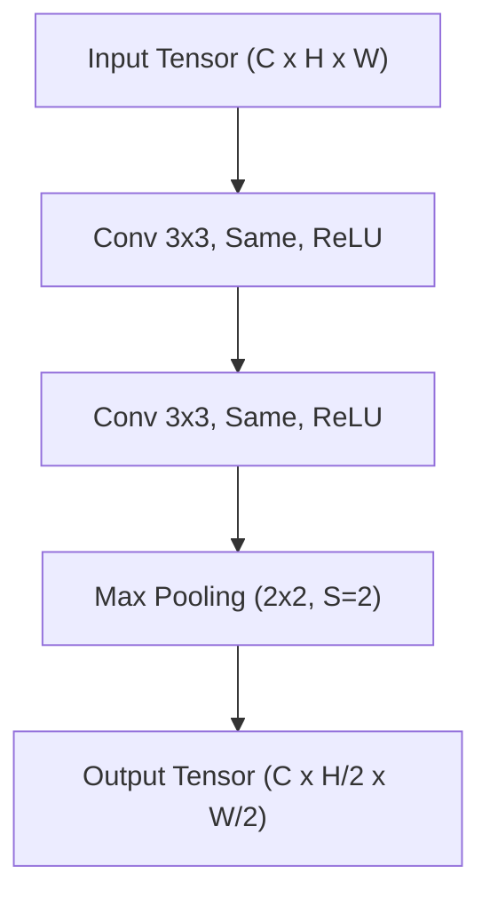
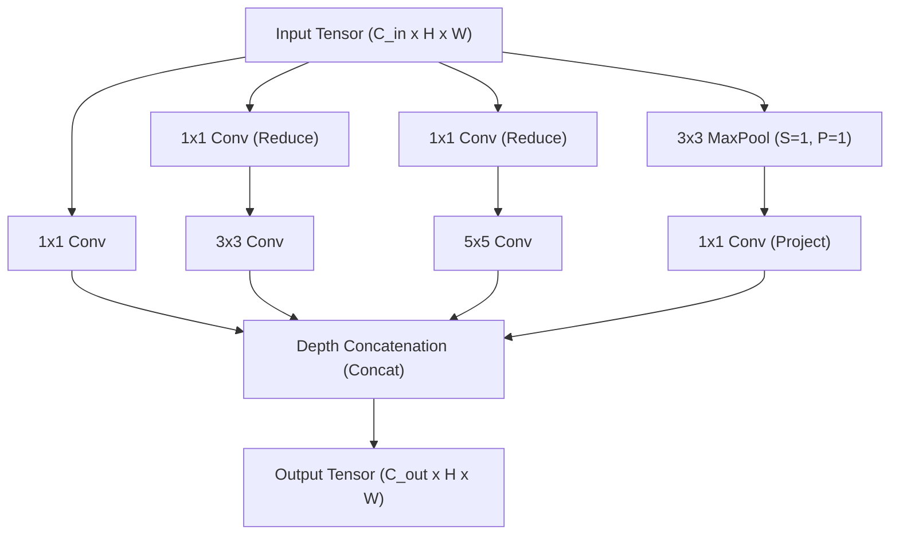
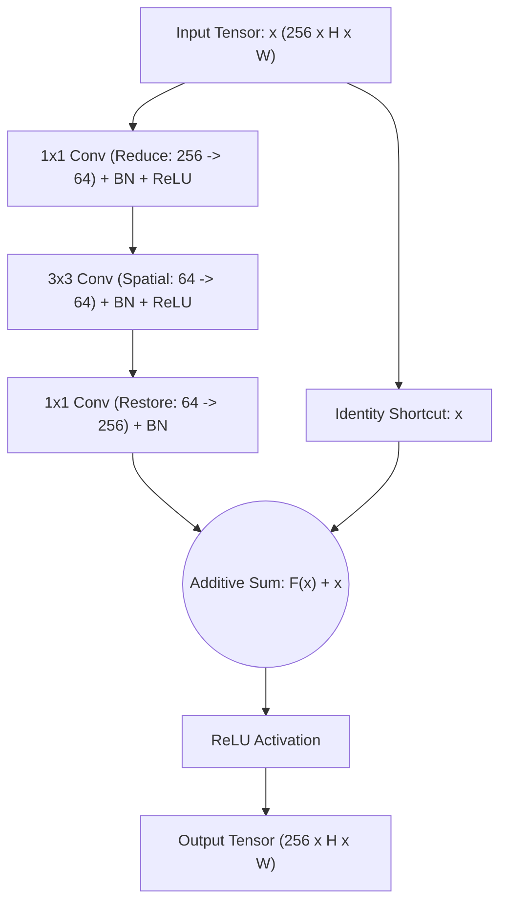
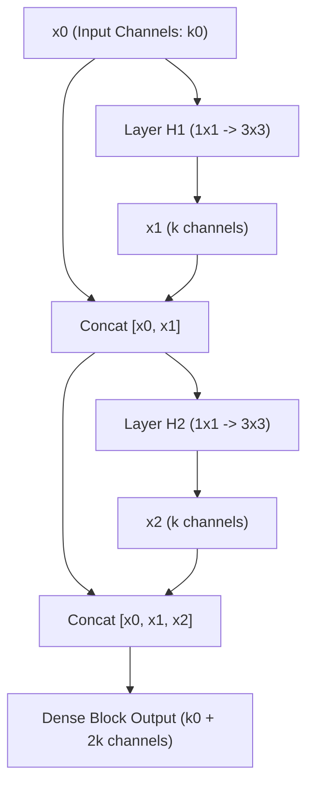
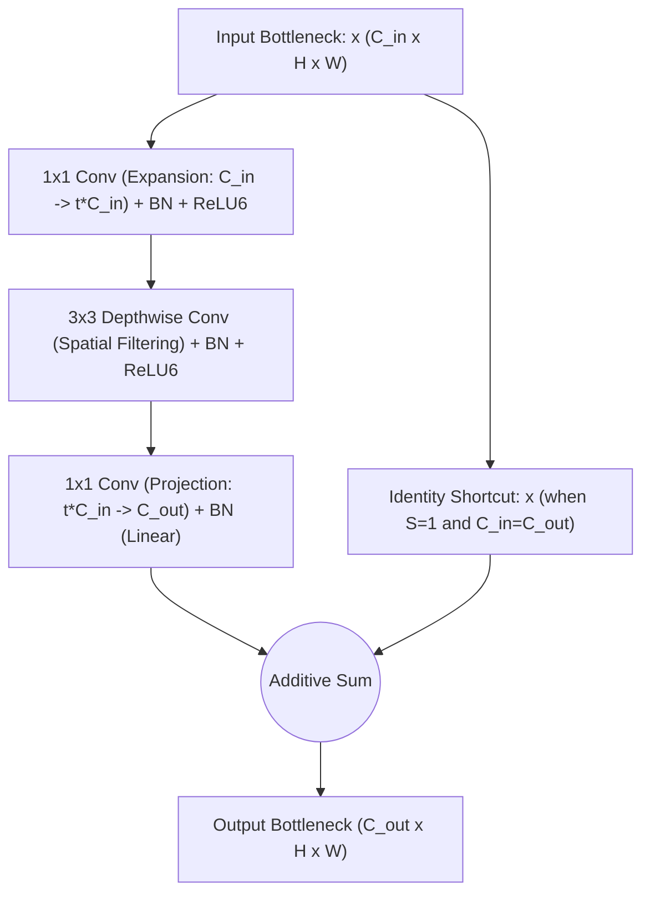

# Lesson 4: CNN Architecture Blocks

## Modular CNN Architecture Blocks and Structural Design Patterns

The evolution of Convolutional Neural Networks shifted historical practice from manually engineering individual layers to composing standardized, repeatable computational modules known as architecture blocks. By defining self-contained micro-architectural sub-networks that address specific gradient flow, feature reuse, and computational efficiency bottlenecks, modular blocks allow networks to scale to hundreds of layers. Examining the structural topology and mathematical mechanisms of landmark building blocks establishes the design patterns that power deep vision models.

## The Modular Shift: From Layer Stacks to Repeatable Blocks

### Micro-Architecture Versus Macro-Architecture

- Early convolutional networks (such as AlexNet) were designed by stacking unique, hand-tuned layers with varying kernel sizes, strides, and channel dimensions.
- Modern convolutional engineering decouples design into two independent tiers:
  - **Micro-Architecture (The Block):** A repeatable, self-contained multi-layer sub-network that processes an input tensor through specialized operations (e.g., skip connections, multi-scale branches, or bottleneck projections).
  - **Macro-Architecture (The Backbone):** The global pipeline that cascades identical blocks across multiple stages, systematically downsampling spatial resolution while expanding channel depth.

### The Design Principle of Standardized Interfaces

- Modular design requires blocks to maintain standardized tensor input and output interfaces.
- Standard blocks preserve spatial height, width, and channel depth ($C \times H \times W \to C \times H \times W$), allowing multiple identical units to stack sequentially without modifying surrounding layers.
- Dedicated **transition blocks** or **downsampling stages** handle spatial downsampling ($H/2 \times W/2$) and channel expansion ($2C$) at controlled structural boundaries.

> [!Tip]
> **Modular blocks decouple layer engineering**: designing repeatable micro-architectural blocks with consistent tensor interfaces allows practitioners to scale network depth and width without redesigning internal layer connections.

## The Homogeneous Stacking Block: VGG

### Architectural Anatomy of the VGG Block

- Introduced by Karen Simonyan and Andrew Zisserman (2014), the **VGG Block** replaced heterogeneous filter sizes with a standardized, homogeneous structural rule.
- A VGG block chains two or three consecutive $3 \times 3$ convolutional layers with unit stride ($S=1$) and same padding ($P=1$), each followed by a Rectified Linear Unit (ReLU) activation function.
- The block terminates with a non-parametric $2 \times 2$ Max Pooling layer with stride $S=2$, which halves spatial resolution ($H/2 \times W/2$).

### Receptive Field Factorization

- Stacking two $3 \times 3$ convolutions covers an effective receptive field of $5 \times 5$, while three consecutive $3 \times 3$ convolutions cover $7 \times 7$.
- Replacing a single $7 \times 7$ convolution with three stacked $3 \times 3$ convolutions reduces parameter consumption by nearly half ($3 \times 3^2 C^2 = 27 C^2$ vs $7^2 C^2 = 49 C^2$).
- The intermediate layers insert three non-linear activation functions instead of one, increasing the discriminative expressive capacity of the block.

> [!Important]
> **Homogeneous VGG blocks establish structural simplicity**: stacking small $3 \times 3$ convolutions factorizes large receptive fields, lowering parameter counts and increasing non-linear depth compared to large spatial filters.

## Multi-Scale Processing: The Inception Module

### Parallel Multi-Resolution Branching

- Introduced in GoogLeNet (Christian Szegedy et al., 2014), the **Inception Module** addresses scale variation by processing input features at multiple spatial resolutions concurrently within the same layer.
- Rather than selecting a single filter size, an Inception block processes the input through four parallel branches:
  - Branch 1: $1 \times 1$ convolution (preserves localized pixel context).
  - Branch 2: $3 \times 3$ convolution (captures intermediate spatial patterns).
  - Branch 3: $5 \times 5$ convolution (captures broad, global context; often implemented as two stacked $3 \times 3$ filters).
  - Branch 4: $3 \times 3$ Max Pooling (retains dominant spatial activations).

### Bottleneck Projections via $1 \times 1$ Convolutions

- Naive multi-scale branching creates computational bottlenecks: stacking $3 \times 3$ and $5 \times 5$ filters directly on high-channel inputs requires massive floating-point operations.
- The Inception block resolves this by placing **$1 \times 1$ convolutional bottlenecks** before the $3 \times 3$ and $5 \times 5$ filters, and after the pooling branch.
- A $1 \times 1$ bottleneck reduces channel depth (e.g., projecting 256 input channels down to 64), allowing spatial convolutions to execute across compressed channels before concatenation.

### Depth Concatenation Dynamics

- All four branches employ same padding and stride $S=1$, guaranteeing that their output feature maps match the spatial dimensions of the input grid ($H \times W$).
- The terminal operation concatenates the four resulting tensors along the channel axis:
  $$C_{\text{out}} = C_{\text{branch1}} + C_{\text{branch2}} + C_{\text{branch3}} + C_{\text{branch4}}$$
- Depth concatenation merges multi-scale receptive field responses into a single tensor, allowing downstream layers to select optimal spatial scales dynamically.

> [!Tip]
> **Inception modules process multiple scales in parallel**: using $1 \times 1$ bottleneck convolutions compresses channel depth before spatial filtering, keeping computational costs bounded while merging multi-resolution features.

## Residual Shortcut Blocks: ResNet and Bottlenecks

### The Identity Mapping Formulation

- In standard networks, stacking layers beyond 20 causes optimization degradation: training accuracy saturates and degrades because backpropagated gradients vanish or shatter.
- Kaiming He et al. (2015) introduced the **Residual Block**, reformulating layers to fit a residual mapping rather than an unconstrained transformation:
  $$\mathcal{H}(x) = \mathcal{F}(x, \{W_i\}) + x$$
  where $x$ is the input tensor, $\mathcal{F}(x)$ is the residual function parameterized by weights, and $\mathcal{H}(x)$ is the target output mapping.
- If an identity mapping is optimal, the optimizer drives the residual weights to zero ($\mathcal{F}(x) \to 0$), making parameter learning easier than forcing a standard stack of non-linearities to approximate an identity function.

### Basic Residual Block Versus Bottleneck Block

- **Basic Block (ResNet-18 / ResNet-34):** Consists of two $3 \times 3$ convolutions with an additive skip connection that routes the input directly around the parameterized path.
- **Bottleneck Block (ResNet-50 / ResNet-101 / ResNet-152):** Designed to maintain computational efficiency in deeper architectures by using a three-tier structure:
  1. $1 \times 1$ convolution to **reduce** channel depth by a factor of 4 (e.g., $256 \to 64$).
  2. $3 \times 3$ convolution to execute **spatial filtering** across the compressed channel dimensions.
  3. $1 \times 1$ convolution to **restore** channel depth to its original capacity (e.g., $64 \to 256$).

### Projection Shortcuts and Dimension Matching

- The additive operation $\mathcal{F}(x) + x$ requires the spatial dimensions and channel counts of the residual path $\mathcal{F}(x)$ and shortcut $x$ to match exactly.
- When crossing a stage boundary that downsamples spatial resolution ($S=2$) or expands channels, the shortcut applies a **projection shortcut**:
  $$y = \mathcal{F}(x, \{W_i\}) + W_s x$$
  where $W_s$ is a $1 \times 1$ convolution with stride $S=2$ that matches channel depth and spatial dimensions.

### Pre-Activation Order and Gradient Unimpeded Flow

- The standard residual block places Batch Normalization and ReLU inside the residual path, ending with an external ReLU after addition: $\text{ReLU}(\mathcal{F}(x) + x)$.
- The **Pre-Activation Residual Block** (He et al., 2016) reorganizes block operations:
  $$\text{BatchNorm} \longrightarrow \text{ReLU} \longrightarrow \text{Weight}$$
- Pre-activation ensures that the additive skip connection remains entirely uninhibited by non-linear thresholds:
  $$x_{l+1} = x_l + \mathcal{F}(x_l)$$
- Evaluating backpropagation through pre-activation skip connections preserves an unbroken linear identity path ($\frac{\partial x_L}{\partial x_l} = I + \dots$), allowing error signals to propagate across hundreds of layers without attenuation.

> [!Important]
> **Residual connections create identity gradient highways**: the additive shortcut ensures that backpropagated error signals propagate directly to early layers via an identity term ($+I$), eliminating vanishing gradients in deep architectures.

## Dense Feature Reuse: The DenseNet Block

### Direct Concatenation and Feature Propagation

- Introduced by Gao Huang et al. (2017), the **Dense Block** in DenseNet connects every layer directly to every subsequent layer within the block.
- Instead of summing activations via addition like ResNets, a DenseNet layer receives the concatenated feature maps of all preceding layers as its input:
  $$x_l = H_l([x_0, \; x_1, \; x_2, \; \dots, \; x_{l-1}])$$
  where $[x_0, \dots, x_{l-1}]$ denotes concatenation along the channel dimension.
- An $L$-layer dense block establishes $\frac{L(L+1)}{2}$ direct connections, eliminating the need to relearn redundant feature representations across depth.

### The Growth Rate Hyperparameter

- Because each layer concatenates its output feature maps with all preceding inputs, the total channel depth increases continuously across the block.
- The **growth rate** ($k$) defines the fixed number of output channels produced by each constituent layer (typically small, such as $k = 12$ or $k = 32$).
- If a dense block receives an input tensor with $k_0$ channels, layer $l$ receives an input tensor containing $k_0 + k \times (l - 1)$ channels.
- Dense feature reuse allows each layer to remain narrow, producing compact models that maintain high representational capacity with fewer total parameters.

### Transition Layers and Channel Compression

- Concatenating channels continuously would cause tensor depths to explode across a deep network.
- DenseNet places **Transition Layers** between consecutive dense blocks to regulate channel growth and execute spatial downsampling.
- A transition layer consists of:
  - A $1 \times 1$ convolution that compresses channel depth by a compression factor $\theta \in (0, 1]$ (typically $\theta = 0.5$).
  - A $2 \times 2$ Average Pooling layer with stride $S=2$ that halves spatial dimensions.

> [!Tip]
> **Dense blocks maximize feature reuse via concatenation**: connecting all layers within a block passes early visual features directly to late layers, allowing each layer to produce only a small number of channels ($k$).

## Mobile and Efficient Blocks: The Inverted Residual (MBConv)

### Standard Residual Versus Inverted Residual Topology

- Standard ResNet bottleneck blocks connect high-dimensional channel spaces via skip connections, compressing intermediate representations through $1 \times 1$ bottlenecks (Wide $\to$ Narrow $\to$ Wide).
- Introduced in MobileNetV2 (Mark Sandler et al., 2018), the **Inverted Residual Block (MBConv)** reverses this topology (Narrow $\to$ Wide $\to$ Narrow).
- Skip connections connect low-dimensional **bottleneck representations**, while intermediate operations expand channel depth to process features across a high-dimensional manifold.

### Depthwise Separable Filtering Inside the Block

- The MBConv block organizes execution into three sequential stages:
  1. **$1 \times 1$ Expansion Convolution:** Expands low-dimensional input channels by an expansion factor $t$ (typically $t = 6$), increasing channel depth to provide space for non-linear operations.
  2. **$3 \times 3$ Depthwise Convolution:** Performs localized spatial filtering independently per channel using depthwise cross-correlation.
  3. **$1 \times 1$ Linear Projection:** Projects the expanded channels back down to a low-dimensional output representation ($C_{\text{out}}$).

### Linear Bottlenecks and Information Preservation

- Applying non-linear activation functions (such as ReLU) on low-dimensional manifolds destroys information by zeroing out negative activations.
- If a low-dimensional manifold is projected down and passed through a non-linear activation, channels that collapse to zero lose representational information permanently.
- MBConv implements a **Linear Bottleneck**, omitting non-linear activation functions after the final $1 \times 1$ projection layer.
- Retaining a linear output preserves continuous representations across skip connections, while non-linear activations remain restricted to the high-dimensional intermediate expansion space.

> [!Important]
> **Inverted residuals protect low-dimensional representations**: expanding channels internally ($6\times$) allows depthwise filters to separate features, while linear projection bottlenecks preserve continuous signals across skip connections.

## Comparative Matrix of CNN Architecture Blocks

| Architecture Block | Primary Design Objective | Branching and Connectivity | Channel Transformation Pattern | Downsampling Strategy | Primary Computational Strength |
|---|---|---|---|---|---|
| **VGG Block** | Structural homogeneity | Strictly sequential (linear stack) | Channel doubling ($C \to 2C$) | Terminal $2 \times 2$ Max Pooling ($S=2$) | Factorizes large filters into stacked $3 \times 3$ layers |
| **Inception Module** | Multi-scale feature extraction | Four parallel branches ($1 \times 1, 3 \times 3, 5 \times 5, \text{Pool}$) | Channel depth concatenation | Strided pooling in parallel branches | Captures multi-resolution features with $1 \times 1$ bottlenecks |
| **ResNet Bottleneck** | Alleviate vanishing gradients | Two-branch additive skip connection | Wide $\to$ Narrow $\to$ Wide ($1 \times 1$ reduce $\to$ expand) | Strided convolution ($S=2$) in $3 \times 3$ filter | Enables training of networks exceeding 100 layers |
| **DenseNet Block** | Maximum feature reuse | Direct all-to-all channel concatenation | Additive expansion ($k_0 + l \cdot k$) | External transition layers ($1 \times 1 \text{ conv} + \text{AvgPool}$) | Reuses early features; small parameter growth ($k$) |
| **MBConv Block** | Mobile and edge efficiency | Additive skip between bottlenecks | Narrow $\to$ Wide $\to$ Narrow ($1 \times 1 \text{ expand} \to \text{project}$) | Strided depthwise convolution ($S=2$) | Cuts compute by $\approx 90\%$ via depthwise separable operations |

> [!Tip]
> **Match blocks to deployment constraints**: use ResNet bottlenecks for deep vision backbones, DenseNet blocks for parameter-constrained medical imaging, and MBConv blocks for low-latency mobile inference.

## Key Takeaways

- **Modular block design replaced layer-by-layer tuning**, establishing standardized micro-architectures that repeat across deep backbones.
- **VGG blocks standardize spatial filtering**, proving that stacks of factorized $3 \times 3$ convolutions reduce parameters and increase non-linear depth compared to large filters.
- **Inception modules evaluate multiple spatial resolutions in parallel**, using $1 \times 1$ convolutions to compress channels before expensive spatial convolutions.
- **Residual blocks eliminate vanishing gradients** by reformulating layer targets as residual functions ($\mathcal{H}(x) = \mathcal{F}(x) + x$), creating an identity gradient highway.
- **ResNet bottleneck blocks** use $1 \times 1$ convolutions to reduce channel depth by $4\times$ before spatial filtering, restoring channels afterward to maintain computational efficiency.
- **Pre-activation residual blocks** arrange operations as $\text{BatchNorm} \to \text{ReLU} \to \text{Weight}$, ensuring uninhibited gradient flow through the additive skip connection.
- **DenseNet blocks concatenate all preceding feature maps directly**, maximizing feature reuse and allowing narrow layers to grow by a fixed rate $k$.
- **Inverted residual blocks (MBConv) reverse bottleneck topology**, expanding channels internally for depthwise filtering while maintaining linear projection bottlenecks to preserve feature information.

> [!Tip]
> The defining principle of modular CNN design: **block topology shapes representation and gradient flow**; whether using additive shortcuts in ResNets, dense concatenations in DenseNets, or inverted bottlenecks in MobileNets, modular building blocks allow deep networks to scale while maintaining computational efficiency and gradient stability.
