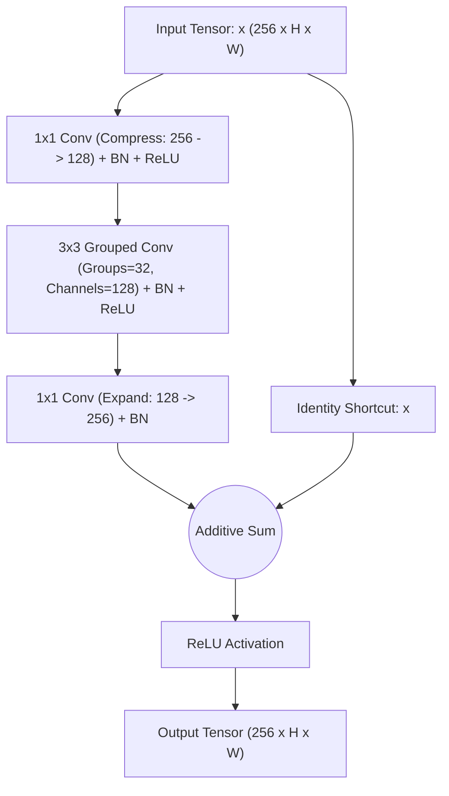
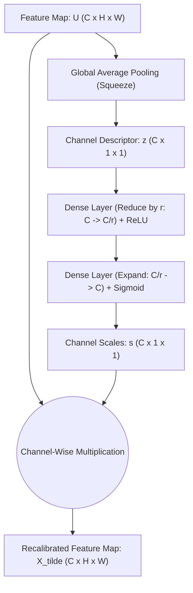
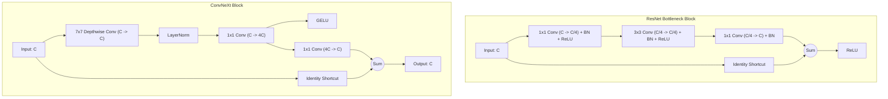

# Lesson 5: Modern CNNs (Overview)

## Modern CNN Architectures: Advanced Paradigms and Design Evolution

The architectural design of Convolutional Neural Networks advanced from empirical trial-and-error toward systematic structural engineering. Following the success of classical deep models like ResNet, modern CNNs address fundamental bottlenecks in feature representation, channel interdependencies, multidimensional resource scaling, and computational efficiency. Examining multi-path cardinality in ResNeXt, dynamic channel recalibration in Squeeze-and-Excitation Networks, compound resource allocation in EfficientNet, and the modern architectural redesign of ConvNeXt establishes the state of contemporary convolutional vision backbones.

## Multi-Path Cardinality: ResNeXt

### The Cardinality Dimension

- Traditional methods scaled convolutional networks along two primary structural axes: **depth** (adding more sequential layers) and **width** (increasing the number of channels per layer).
- Saining Xie et al. (2017) introduced **ResNeXt**, proposing a third structural dimension: **cardinality**.
- **Cardinality** defines the *size of the set of transformations*, representing the number of parallel, independent computational paths operating within a single block.
- Empirical and theoretical findings demonstrated that increasing cardinality improves representational accuracy more effectively than increasing depth or width, while keeping computational complexity (FLOPs) and parameter count bounded.

### Split-Transform-Merge Topology

- ResNeXt formalizes an aggregated network transformation following a **Split-Transform-Merge** paradigm:
  $$\mathcal{F}(x) = \sum_{i=1}^C \mathcal{T}_i(x)$$
  where $C$ denotes the cardinality hyperparameter, and each $\mathcal{T}_i(x)$ is a low-dimensional non-linear transformation.
- The input tensor splits into $C$ distinct lower-dimensional paths, each branch undergoes an identical sequence of transformations ($1 \times 1 \to 3 \times 3 \to 1 \times 1$), and the outputs merge via element-wise addition before joining the residual skip connection:
  $$y = x + \sum_{i=1}^C \mathcal{T}_i(x)$$

### Grouped Convolutions as Computational Equivalents

- Evaluating 32 separate individual branches sequentially creates implementation friction on hardware accelerators.
- ResNeXt reformulates the Split-Transform-Merge operation into an equivalent **Grouped Convolution**:
  - A grouped convolution divides incoming channels into $G = C$ mutually exclusive groups.
  - Convolutions execute independently within each group without cross-channel communication.
- Using grouped convolutions allows a ResNeXt bottleneck block to achieve the exact mathematical representation of 32 parallel paths in a single hardware-optimized layer.

> [!Important]
> **Cardinality outperforms depth and width**: increasing the number of parallel grouped transformation paths (cardinality) yields greater gains in top-1 classification accuracy per FLOP than expanding layer depth or channel width.

## Channel-Wise Attention: Squeeze-and-Excitation Networks

### The Squeeze Step: Global Spatial Embedding

- Standard convolutional layers aggregate spatial context and cross-channel patterns simultaneously, treating all channels with equal importance.
- Proposed by Jie Hu et al. (2018), **Squeeze-and-Excitation Networks (SENet)** introduce dynamic channel-wise attention to model interdependencies between channels explicitly.
- The **Squeeze** operation aggregates spatial feature dimensions $(H \times W)$ into a single scalar per channel using **Global Average Pooling (GAP)**:
  $$z_c = \mathbf{F}_{\text{sq}}(u_c) = \frac{1}{H \times W} \sum_{i=1}^H \sum_{j=1}^W u_c(i, j)$$
- The squeeze step produces a 1D channel descriptor vector $z \in \mathbb{R}^C$ that captures the global contextual distribution of each feature map across the entire spatial canvas.

### The Excitation Step: Adaptive Gating via Bottlenecks

- The **Excitation** operation maps the global channel descriptor $z$ to a set of per-channel modulation weights through a parameterized two-layer bottleneck:
  $$s = \mathbf{F}_{\text{ex}}(z, W) = \sigma\left( W_2 \, \delta(W_1 z) \right)$$
  where $\delta$ denotes the ReLU activation function, $\sigma$ denotes the Sigmoid gating function, $W_1 \in \mathbb{R}^{\frac{C}{r} \times C}$, and $W_2 \in \mathbb{R}^{C \times \frac{C}{r}}$.
- The **reduction ratio** $r$ (typically $r = 16$) compresses channel dimensionality to limit parameter overhead.
- The terminal Sigmoid function bounds the output excitation vector to $s \in (0, 1)^C$, representing the relative importance scalar of each individual channel.

### The Scale Step: Dynamic Channel Recalibration

- The final **Scale** operation multiplies each spatial feature map in the original tensor $U$ by its corresponding scalar activation weight $s_c$:
  $$\tilde{x}_c = \mathbf{F}_{\text{scale}}(u_c, s_c) = s_c \cdot u_c$$
  where $u_c \in \mathbb{R}^{H \times W}$, and $s_c \in (0, 1)$ acts as a dynamic channel gate.
- Channels capturing task-critical signals receive weights near one, while channels capturing background noise or redundant features are suppressed toward zero.
- SE blocks introduce minimal parameter overhead (less than 1% additional parameters) and can be bolted onto any baseline architecture (e.g., SE-ResNet, SE-ResNeXt).

> [!Tip]
> **Squeeze-and-Excitation recalibrates channel attention**: squeezing spatial dimensions via global pooling and passing descriptors through a bottleneck allows the network to dynamically scale the importance of individual channels.

## Systematic Scaling: EfficientNet and Compound Scaling

### The Flaws of Unidimensional Scaling

- Scaling convolutional architectures to improve accuracy historically relied on tuning a single dimension arbitrarily:
  - **Depth ($d$):** Adding layers (e.g., ResNet-50 to ResNet-152) captures richer hierarchical features, but suffers from diminishing returns due to vanishing gradients.
  - **Width ($w$):** Expanding channel counts (e.g., WideResNet) captures fine-grained features, but wide, shallow networks struggle to learn complex structural abstractions.
  - **Resolution ($r$):** Increasing input image resolution (e.g., $224 \times 224 \to 512 \times 512$) provides finer visual patterns, but computational cost scales quadratically ($O(r^2)$).
- Mingxing Tan and Quoc Le (2019) demonstrated that scaling any single dimension independently leads to rapid accuracy saturation.

### The Compound Scaling Formula

- **EfficientNet** balances depth, width, and resolution concurrently using a principled mathematical formulation known as **Compound Scaling**.
- The three dimensions scale jointly using a user-defined compound coefficient $\phi$ and fixed scaling constants $(\alpha, \beta, \gamma)$:
  $$\text{Depth: } d = \alpha^\phi$$
  $$\text{Width: } w = \beta^\phi$$
  $$\text{Resolution: } r = \gamma^\phi$$
  $$\text{subject to } \alpha \cdot \beta^2 \cdot \gamma^2 \approx 2 \quad \text{and} \quad \alpha \ge 1, \; \beta \ge 1, \; \gamma \ge 1$$
- Because doubling network depth doubles FLOPs ($2^1$), while doubling width or resolution quadruples FLOPs ($w^2, r^2$), constraining $\alpha \cdot \beta^2 \cdot \gamma^2 \approx 2$ guarantees that scaling $\phi$ by 1 increases total model FLOPs by approximately $2^\phi$.

### EfficientNet-B0 Baseline and MBConv Integration

- The baseline architecture, **EfficientNet-B0**, was discovered using Neural Architecture Search (NAS) to optimize both top-1 accuracy and floating-point operations.
- The primary computational unit is the **MBConv block** (Inverted Residual Block from MobileNetV2) augmented with internal **Squeeze-and-Excitation** attention modules and Swish (SiLU) activation functions.
- Scaling coefficient $\phi$ systematically from 1 to 7 produced the EfficientNet B1 through B7 family, achieving higher accuracy on ImageNet than prior state-of-the-art models while using up to $8.4\times$ fewer parameters.

> [!Important]
> **Compound scaling coordinates depth, width, and resolution**: scaling all three dimensions simultaneously via $\alpha \cdot \beta^2 \cdot \gamma^2 \approx 2$ prevents individual dimensions from saturating, maximizing accuracy gains per computational operation.

## The Modernized Convolutional Paradigm: ConvNeXt

### Re-Engineering ResNet for the Vision Transformer Era

- In 2020, Vision Transformers (ViTs) surpassed CNNs in large-scale visual recognition, leading to claims that self-attention mechanisms would render convolutions obsolete.
- Zhuang Liu et al. (2022) introduced **ConvNeXt**, systematically modernizing a standard ResNet-50 using design choices borrowed from Vision Transformers (specifically Swin Transformers) *without* introducing self-attention.
- ConvNeXt proved that standard pure convolutional networks can match or exceed the performance, scalability, and efficiency of Vision Transformers.

### Macro-Design: Patchify Stems and Stage Compute Ratios

- **Patchify Stem:** Classical CNN stems used a $7 \times 7$ convolution ($S=2$) followed by max pooling. ConvNeXt adopts ViT-style non-overlapping patchification, using a $4 \times 4$ strided convolution ($S=4$) to downsample the input aggressively at the entry point.
- **Stage Compute Ratios:** ResNet-50 allocated layers across four stages in a ratio of $3:4:6:3$ (1:1:2:1). ConvNeXt aligns with Swin Transformer, adopting a $3:3:9:3$ ratio (1:1:3:1), concentrating compute heavily in the third stage.
- **Dedicated Downsampling Layers:** Instead of executing spatial downsampling inside residual blocks using strided $3 \times 3$ convolutions, ConvNeXt uses separate downsampling blocks consisting of Layer Normalization followed by a $2 \times 2$ convolution with stride 2.

### Inverted Bottlenecks and Large $7 \times 7$ Depthwise Kernels

- **Inverted Bottleneck Design:** ResNet bottleneck blocks compress channel depth before spatial filtering ($256 \to 64 \to 256$). ConvNeXt adopts the inverted bottleneck topology of Transformers and MobileNetV2, expanding channel dimensions by $4\times$ before projection ($C \to 4C \to C$).
- **Depthwise Convolutions Moved Up:** Spatial filtering is delegated entirely to a depthwise convolution positioned at the start of the block, minimizing computation across high-channel stages.
- **Large Kernel Footprint:** Standard CNNs relied on $3 \times 3$ filters. ConvNeXt adopts a large **$7 \times 7$ depthwise convolution**, expanding the local receptive field to match the wider window attention of Swin Transformers.

### Micro-Design: LayerNorm, GELU, and Component Reduction

- **Replacing ReLU with GELU:** ConvNeXt replaces standard ReLU activations with Gaussian Error Linear Units (GELU), matching Transformer non-linearities.
- **Fewer Activation Functions:** While standard ResNet placed activations after every single convolution, ConvNeXt uses only a solitary GELU activation per block, situated between the two $1 \times 1$ projection layers.
- **Replacing BatchNorm with LayerNorm:** Batch Normalization was removed entirely in favor of **Layer Normalization (LN)**, eliminating batch dependency issues and stabilizing cross-device training.
- **Fewer Normalization Layers:** ConvNeXt deploys only one Layer Normalization module per block, placed immediately following the $7 \times 7$ depthwise filter.

> [!Tip]
> **ConvNeXt modernized pure convolution**: adopting ViT design patterns (patchify stems, $7 \times 7$ depthwise kernels, inverted bottlenecks, LayerNorm, and GELU) allows pure CNNs to match Vision Transformers in accuracy and efficiency.

## Comparative Matrix of Modern CNN Architectures

| Modern Architecture | Core Design Philosophy | Primary Micro-Architectural Innovation | Scaling Methodology | Normalization & Activation Suite | Primary Operational Strength |
|---|---|---|---|---|---|
| **ResNeXt (2017)** | Multi-path aggregated transformations | Grouped convolutions with cardinality $C=32$ | Traditional depth and width scaling | Batch Normalization + ReLU | Stronger representations than ResNet without adding parameters |
| **SENet (2018)** | Dynamic inter-channel attention | Squeeze-and-Excitation bottleneck modules | Modular add-on to existing backbones | Inherits baseline suite + Sigmoid gate | Explicit channel attention with less than 1% parameter overhead |
| **EfficientNet (2019)** | Balanced multidimensional resource allocation | MBConv blocks with built-in SE attention | **Compound Scaling:** $\alpha^\phi, \beta^\phi, \gamma^\phi$ | Batch Normalization + Swish (SiLU) | Optimal Pareto frontier of ImageNet accuracy versus FLOPs |
| **ConvNeXt (2022)** | Modernized CNNs matching Transformer baselines | $7 \times 7$ depthwise convolutions, inverted bottlenecks | Stage-ratio compute reallocation ($3:3:9:3$) | **Layer Normalization + single GELU** | Matches Swin Transformer accuracy with pure convolutional simplicity |

> [!Important]
> **Architectural evolution converged with Transformers**: modern convolutional engineering (ConvNeXt) adopted the micro-design choices of Transformers (fewer activations, LayerNorm, large kernels), proving that network topology matters more than self-attention alone.

## Key Takeaways

- **Cardinality provides a more effective scaling dimension** than depth or width, using grouped convolutions in ResNeXt to execute parallel transformations within a single layer.
- **Squeeze-and-Excitation networks compute dynamic channel attention**, squeezing spatial dimensions via global pooling and passing descriptors through a bottleneck to recalibrate feature map weights.
- **Unidimensional scaling causes accuracy saturation**; increasing depth, width, or input resolution independently yields diminishing returns.
- **EfficientNet compound scaling balances depth, width, and resolution concurrently** using fixed coefficients ($\alpha \cdot \beta^2 \cdot \gamma^2 \approx 2$), optimizing accuracy per unit of compute.
- **ConvNeXt modernized pure convolutions for the Transformer era**, adopting patchify stems, stage ratios of $3:3:9:3$, and inverted bottlenecks.
- **ConvNeXt expands receptive fields using $7 \times 7$ depthwise convolutions**, matching the localized window attention of Swin Transformers.
- **Micro-design simplifications stabilize deep backbones**: ConvNeXt replaces Batch Normalization with Layer Normalization, substitutes ReLU with GELU, and limits activations to a single non-linearity per block.

> [!Tip]
> The defining insight of modern CNN development: **macro-topology and training design dominate model success**; by combining channel attention, compound resource scaling, and modern micro-design patterns, pure convolutional architectures achieve competitive performance against vision transformers while preserving spatial inductive biases and deployment efficiency.
