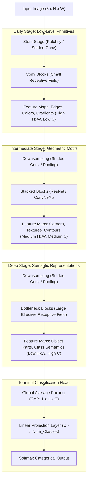

# Migration in progress
# Lesson 6: Summary and Assessment

## Convolutional Neural Networks: Module Summary and Assessment

Convolutional Neural Networks (CNNs) provide the architectural foundation for deep computer vision by aligning neural network structure with the spatial properties of physical imagery. By substituting dense matrix multiplications with localized receptive fields, parameter sharing, and spatial subsampling, CNNs achieve translation equivariance while avoiding the parameter explosion that destabilizes fully connected networks. Synthesizing tensor cross-correlation mechanics, receptive field mathematics, modular block design patterns, and modern scaling laws equips practitioners to design, optimize, and diagnose high-performance visual recognition pipelines.

## Synthesis of Core Week 8 Foundations

### Spatial Inductive Biases and Tensor Mechanics

- **Failure of dense networks on imagery:** Fully connected layers destroy spatial grid topology upon vectorization, explode parameter counts ($O(H \cdot W \cdot C)$), and lack translation equivariance, forcing models to learn duplicate feature detectors at every pixel coordinate.
- **The triad of convolutional inductive biases:**
  - **Local Receptive Fields (Sparse Connectivity):** Neurons connect exclusively to localized $K \times K$ spatial patches, decoupling parameter scaling from input image resolution.
  - **Parameter Sharing (Tied Weights):** A single learned kernel tensor sweeps across the entire input grid, cutting parameter counts by orders of magnitude.
  - **Translation Equivariance:** Shifting an input pattern spatially produces an identical shift in the output feature map: $\text{Conv}(\text{Shift}(x)) = \text{Shift}(\text{Conv}(x))$.
- **Discrete cross-correlation:** Deep learning frameworks implement cross-correlation rather than formal mathematical convolution, omitting the kernel-flipping step because filter orientations are learned directly via backpropagation.
- **Multichannel tensor volume:** An individual filter is a 3D tensor of shape $(C_{\text{in}} \times K_h \times K_w)$ that fuses spatial coordinates and channel depth simultaneously. A bank of $C_{\text{out}}$ filters produces a 4D weight tensor $\mathcal{W} \in \mathbb{R}^{C_{\text{out}} \times C_{\text{in}} \times K_h \times K_w}$, outputting a 3D tensor containing $C_{\text{out}}$ distinct feature maps.

### Dimensional Mathematics of Filtering and Pooling

- **Output spatial dimensions** depend on input size, kernel diameter, padding ($P$), and stride ($S$):
  $$H_{\text{out}} = \left\lfloor \frac{H_{\text{in}} - K_h + 2P}{S} \right\rfloor + 1$$
- **Padding strategies:** Valid padding ($P=0$) erodes spatial boundaries by $(K-1)$ pixels per layer; same padding ($P = \frac{K-1}{2}$ for odd $K$) preserves spatial dimensions when $S=1$.
- **Non-parametric pooling:** Max pooling extracts peak localized signals and provides local shift invariance, while average pooling smooths background context. Both operations contain zero learnable parameters.
- **Gradient routing through pooling:** Max pooling backpropagation uses forward switch maps to route 100% of incoming error gradients to the winning argmax coordinate while zeroing non-maximal positions; average pooling divides incoming gradients equally ($\frac{1}{K_p^2}$) across all window units.
- **Global Average Pooling (GAP)** reduces entire $(H \times W)$ feature maps to single channel means, replacing fully connected classification heads, preventing overfitting, and enabling variable-resolution input processing.

### The Modular Block Evolution

- **Factorized VGG blocks:** Stacking two $3 \times 3$ convolutions matches the $5 \times 5$ receptive field of a single filter while using 28% fewer parameters and adding an extra non-linear activation.
- **Inception multi-scale blocks:** Parallel branches ($1 \times 1, 3 \times 3, 5 \times 5, \text{Pool}$) capture multi-scale features concurrently, using $1 \times 1$ bottleneck convolutions to compress channel depth before expensive spatial filtering.
- **ResNet residual blocks:** Reformulating layers as residual functions ($\mathcal{H}(x) = \mathcal{F}(x) + x$) introduces additive identity skip connections ($+I$) that allow error signals to propagate across hundreds of layers without vanishing.
- **DenseNet dense blocks:** Concatenating all preceding feature maps directly ($[x_0, \dots, x_{l-1}]$) maximizes feature reuse and allows narrow layers to grow by a fixed rate $k$.
- **MobileNet inverted residuals (MBConv):** Expands channels internally ($6\times$) for depthwise spatial filtering while maintaining linear projection bottlenecks to preserve feature information.
- **ConvNeXt modernized CNNs:** Adopts Vision Transformer design choices (patchify stems, $7 \times 7$ depthwise filters, inverted bottlenecks, LayerNorm, and GELU) to match Transformer accuracy while preserving convolutional simplicity.

> [!Tip]
> **Convolutional engineering evolved from layers to blocks**: modern architectures compose standardized modular blocks that coordinate receptive field expansion, channel bottlenecks, and identity shortcut paths to maintain gradient stability across deep backbones.

## The Hierarchical Feature Processing Pipeline

> [!Important]
> **Spatial resolution trades for semantic abstraction**: convolutional pipelines downsample spatial grids ($H \downarrow, W \downarrow$) while expanding channel cardinality ($C \uparrow$), transforming local pixel edges into global, class-specific semantic representations.

## Comprehensive Convolutional Operators and Blocks Matrix

| Operator / Architecture Block | Mathematical Mechanism | Primary Parameter Scaling | Receptive Field Impact | Primary Structural Advantage | Known Tradeoff / Limitation |
|---|---|---|---|---|---|
| **Standard 2D Conv** | Joint spatial and cross-channel cross-correlation | $O(C_{\text{out}} \cdot C_{\text{in}} \cdot K^2)$ | Standard expansion: $K \times K$ | Fundamental local feature extractor | Computationally heavy on large channel depths |
| **Factorized $3 \times 3$ Stack** | Consecutive $3 \times 3$ convolutions | $O(2 \cdot C^2 \cdot 3^2) = 18 C^2$ | Receptive field: $5 \times 5$ | Saves 28% parameters vs $5 \times 5$; adds non-linearity | Increases sequential layer latency |
| **$1 \times 1$ Conv Projection** | Pointwise cross-channel linear combination | $O(C_{\text{out}} \cdot C_{\text{in}})$ | Spatially invariant ($1 \times 1$) | Channel pooling; dimensionality reduction/expansion | Captures zero localized spatial context |
| **Dilated (Atrous) Conv** | Strided kernel indexing with gaps ($d$) | $O(C_{\text{out}} \cdot C_{\text{in}} \cdot K^2)$ | Rapid expansion: $K + (K-1)(d-1)$ | Expands receptive field without spatial downsampling | Gridding artifacts; high memory footprint |
| **Depthwise Separable Conv** | Spatial depthwise + Pointwise $1 \times 1$ | $O(C_{\text{in}} \cdot K^2 + C_{\text{in}} \cdot C_{\text{out}})$ | Standard expansion: $K \times K$ | Cuts parameters and FLOPs by nearly 90% | Lower representational capacity on small models |
| **Inception Module** | Multi-scale branching + $1 \times 1$ bottlenecks | Sum of branch parameters | Multi-resolution coverage | Processes multiple spatial scales concurrently | High memory usage from concatenated feature maps |
| **ResNet Bottleneck** | Residual shortcut: $\mathcal{F}(x) + x$ | $O(C \cdot \frac{C}{4} + \frac{C}{4} \cdot \frac{C}{4} \cdot K^2 + \frac{C}{4} \cdot C)$ | Standard expansion: $3 \times 3$ | Eliminates vanishing gradients across depth | Additive bottleneck requires matching channel shapes |
| **DenseNet Block** | All-to-all channel concatenation | Scales with growth rate $k$ | Standard expansion: $3 \times 3$ | Maximum feature reuse; narrow layers | Channel concatenation consumes substantial GPU RAM |
| **MBConv Block** | Inverted bottleneck (expand $\to$ DW $\to$ project) | $O(t \cdot C_{\text{in}}^2 + t \cdot C_{\text{in}} \cdot K^2 + t \cdot C_{\text{in}} \cdot C_{\text{out}})$ | Standard expansion: $3 \times 3$ | Highly efficient on mobile edge hardware | Memory-bandwidth intensive during expansion |
| **ConvNeXt Block** | $7 \times 7$ depthwise + inverted bottleneck | $O(C \cdot 7^2 + 2 \cdot 4C^2)$ | Wide local window ($7 \times 7$) | Matches Vision Transformer accuracy with CNN simplicity | Larger kernel requires optimized depthwise CUDA kernels |

> [!Tip]
> **Operator choice dictates operational efficiency**: use depthwise separable blocks (MBConv) for mobile inference, standard residual bottlenecks for general vision tasks, and dilated convolutions for dense spatial segmentation.

## Assessment Preparation

### Conceptual Review Questions

- **Question 1 (The Mathematical Necessity of Cross-Correlation Over True Convolution):** Why do deep learning frameworks implement discrete cross-correlation rather than formal mathematical convolution, and does this discrepancy affect network performance?
  - *Answer:* Formal convolution requires flipping the kernel horizontally and vertically before computing products ($K(-m, -n)$), while cross-correlation computes inner products directly ($K(m, n)$). In deep learning, kernel weights are not handcrafted; they are learned via gradient descent initialized from random distributions. If a true convolution were used, the optimization algorithm would learn the mirrored orientation of the kernel. Omitting the flipping operation saves indexing overhead during forward and backward passes without altering model capacity or gradient flow.
- **Question 2 (Max Pooling Backpropagation Mechanics):** How do gradients flow through a non-differentiable max pooling layer during backpropagation?
  - *Answer:* Max pooling calculates a piecewise maximum operation, which is non-differentiable at points where two inputs tie for the maximum. In practice, backpropagation uses subgradient routing via a forward **switch map** (argmax cache). The switch map stores the exact coordinate index of the winning maximum pixel within each pooling window during the forward pass. During the backward pass, 100% of the incoming error gradient $\frac{\partial \mathcal{L}}{\partial Y}$ routes directly to that winning coordinate, while all non-maximal coordinates in the window receive a gradient of zero: $\frac{\partial \mathcal{L}}{\partial X_i} = \frac{\partial \mathcal{L}}{\partial Y} \cdot \mathbf{1}[i = \arg\max]$.
- **Question 3 (Compound Scaling Mathematical Constraint):** In EfficientNet's compound scaling method, why are the scaling coefficients constrained by $\alpha \cdot \beta^2 \cdot \gamma^2 \approx 2$?
  - *Answer:* The computational cost (FLOPs) of a convolutional network scales proportionally to depth ($d$), but quadratically with width ($w^2$) and image resolution ($r^2$). Doubling depth doubles operations ($2^1$), while doubling channel width doubles both input and output channels ($2 \times 2 = 4 = 2^2$), and doubling image resolution quadruples total pixels ($2 \times 2 = 4 = 2^2$). For an arbitrary compound scaling factor $\phi$, total FLOPs scale as $(\alpha \cdot \beta^2 \cdot \gamma^2)^\phi$. Enforcing $\alpha \cdot \beta^2 \cdot \gamma^2 \approx 2$ ensures that increasing $\phi$ by 1 scales total network FLOPs by approximately $2^1 = 2\times$, providing predictable computational growth.
- **Question 4 (Feature Reuse in DenseNet Versus ResNet):** Contrast how DenseNet and ResNet reuse features across layers, and explain the architectural trade-off of each approach.
  - *Answer:* ResNet reuses features via **element-wise addition** ($\mathcal{F}(x) + x$). While addition preserves tensor shapes and creates an identity gradient highway, it can impede information flow if early features and late transformations cancel each other out or blend destructively. DenseNet reuses features via **channel concatenation** ($[x_0, x_1, \dots, x_{l-1}]$). Early features are preserved in their original form and passed directly to all subsequent layers, allowing narrow layers (small growth rate $k$) to achieve high representational capacity. The trade-off is memory: concatenating feature maps creates wide tensors that consume substantial GPU memory bandwidth during training.

### Applied Analytical Scenarios

- **Scenario A (GPU Out-of-Memory Bottleneck on High-Resolution Data