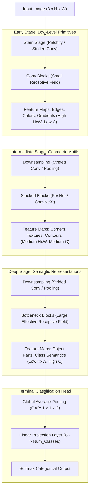

# Lesson 6: Summary and Assessment

## Convolutional Neural Networks: Module Summary and Assessment

Convolutional Neural Networks (CNNs) provide the architectural foundation for deep computer vision by aligning neural network structure with the spatial properties of physical imagery. By substituting dense matrix multiplications with localized receptive fields, parameter sharing, and spatial subsampling, CNNs achieve translation equivariance while avoiding the parameter explosion that destabilizes fully connected networks. Synthesizing tensor cross-correlation mechanics, receptive field mathematics, modular block design patterns, and modern scaling laws equips practitioners to design, optimize, and diagnose high-performance visual recognition pipelines.

## Synthesis of Core Week 8 Foundations

### Spatial Inductive Biases and Tensor Mechanics

- **Failure of dense networks on imagery:** Fully connected layers destroy spatial grid topology upon vectorization, explode parameter counts ($O(H \cdot W \cdot C)$), and lack translation equivariance, forcing models to learn duplicate feature detectors at every pixel coordinate.
- **The triad of convolutional inductive biases:**
  - **Local Receptive Fields (Sparse Connectivity):** Neurons connect exclusively to localized $K \times K$ spatial patches, decoupling parameter scaling from input image resolution.
  - **Parameter Sharing (Tied Weights):** A single learned kernel tensor sweeps across the entire input grid, cutting parameter counts by orders of magnitude.
  - **Translation Equivariance:** Shifting an input pattern spatially produces an identical shift in the output feature map: $\text{Conv}(\text{Shift}(x)) = \text{Shift}(\text{Conv}(x))$.
- **Discrete cross-correlation:** Deep learning frameworks implement cross-correlation rather than formal mathematical convolution, omitting the kernel-flipping step because filter orientations are learned directly via backpropagation.
- **Multichannel tensor volume:** An individual filter is a 3D tensor of shape $(C_{\text{in}} \times K_h \times K_w)$ that fuses spatial coordinates and channel depth simultaneously. A bank of $C_{\text{out}}$ filters produces a 4D weight tensor $\mathcal{W} \in \mathbb{R}^{C_{\text{out}} \times C_{\text{in}} \times K_h \times K_w}$, outputting a 3D tensor containing $C_{\text{out}}$ distinct feature maps.

### Dimensional Mathematics of Filtering and Pooling

- **Output spatial dimensions** depend on input size, kernel diameter, padding ($P$), and stride ($S$):
  $$H_{\text{out}} = \left\lfloor \frac{H_{\text{in}} - K_h + 2P}{S} \right\rfloor + 1$$
- **Padding strategies:** Valid padding ($P=0$) erodes spatial boundaries by $(K-1)$ pixels per layer; same padding ($P = \frac{K-1}{2}$ for odd $K$) preserves spatial dimensions when $S=1$.
- **Non-parametric pooling:** Max pooling extracts peak localized signals and provides local shift invariance, while average pooling smooths background context. Both operations contain zero learnable parameters.
- **Gradient routing through pooling:** Max pooling backpropagation uses forward switch maps to route 100% of incoming error gradients to the winning argmax coordinate while zeroing non-maximal positions; average pooling divides incoming gradients equally ($\frac{1}{K_p^2}$) across all window units.
- **Global Average Pooling (GAP)** reduces entire $(H \times W)$ feature maps to single channel means, replacing fully connected classification heads, preventing overfitting, and enabling variable-resolution input processing.

### The Modular Block Evolution

- **Factorized VGG blocks:** Stacking two $3 \times 3$ convolutions matches the $5 \times 5$ receptive field of a single filter while using 28% fewer parameters and adding an extra non-linear activation.
- **Inception multi-scale blocks:** Parallel branches ($1 \times 1, 3 \times 3, 5 \times 5, \text{Pool}$) capture multi-scale features concurrently, using $1 \times 1$ bottleneck convolutions to compress channel depth before expensive spatial filtering.
- **ResNet residual blocks:** Reformulating layers as residual functions ($\mathcal{H}(x) = \mathcal{F}(x) + x$) introduces additive identity skip connections ($+I$) that allow error signals to propagate across hundreds of layers without vanishing.
- **DenseNet dense blocks:** Concatenating all preceding feature maps directly ($[x_0, \dots, x_{l-1}]$) maximizes feature reuse and allows narrow layers to grow by a fixed rate $k$.
- **MobileNet inverted residuals (MBConv):** Expands channels internally ($6\times$) for depthwise spatial filtering while maintaining linear projection bottlenecks to preserve feature information.
- **ConvNeXt modernized CNNs:** Adopts Vision Transformer design choices (patchify stems, $7 \times 7$ depthwise filters, inverted bottlenecks, LayerNorm, and GELU) to match Transformer accuracy while preserving convolutional simplicity.

> [!Tip]
> **Convolutional engineering evolved from layers to blocks**: modern architectures compose standardized modular blocks that coordinate receptive field expansion, channel bottlenecks, and identity shortcut paths to maintain gradient stability across deep backbones.

## The Hierarchical Feature Processing Pipeline

> [!Important]
> **Spatial resolution trades for semantic abstraction**: convolutional pipelines downsample spatial grids ($H \downarrow, W \downarrow$) while expanding channel cardinality ($C \uparrow$), transforming local pixel edges into global, class-specific semantic representations.

## Comprehensive Convolutional Operators and Blocks Matrix

| Operator / Architecture Block | Mathematical Mechanism | Primary Parameter Scaling | Receptive Field Impact | Primary Structural Advantage | Known Tradeoff / Limitation |
|---|---|---|---|---|---|
| **Standard 2D Conv** | Joint spatial and cross-channel cross-correlation | $O(C_{\text{out}} \cdot C_{\text{in}} \cdot K^2)$ | Standard expansion: $K \times K$ | Fundamental local feature extractor | Computationally heavy on large channel depths |
| **Factorized $3 \times 3$ Stack** | Consecutive $3 \times 3$ convolutions | $O(2 \cdot C^2 \cdot 3^2) = 18 C^2$ | Receptive field: $5 \times 5$ | Saves 28% parameters vs $5 \times 5$; adds non-linearity | Increases sequential layer latency |
| **$1 \times 1$ Conv Projection** | Pointwise cross-channel linear combination | $O(C_{\text{out}} \cdot C_{\text{in}})$ | Spatially invariant ($1 \times 1$) | Channel pooling; dimensionality reduction/expansion | Captures zero localized spatial context |
| **Dilated (Atrous) Conv** | Strided kernel indexing with gaps ($d$) | $O(C_{\text{out}} \cdot C_{\text{in}} \cdot K^2)$ | Rapid expansion: $K + (K-1)(d-1)$ | Expands receptive field without spatial downsampling | Gridding artifacts; high memory footprint |
| **Depthwise Separable Conv** | Spatial depthwise + Pointwise $1 \times 1$ | $O(C_{\text{in}} \cdot K^2 + C_{\text{in}} \cdot C_{\text{out}})$ | Standard expansion: $K \times K$ | Cuts parameters and FLOPs by nearly 90% | Lower representational capacity on small models |
| **Inception Module** | Multi-scale branching + $1 \times 1$ bottlenecks | Sum of branch parameters | Multi-resolution coverage | Processes multiple spatial scales concurrently | High memory usage from concatenated feature maps |
| **ResNet Bottleneck** | Residual shortcut: $\mathcal{F}(x) + x$ | $O(C \cdot \frac{C}{4} + \frac{C}{4} \cdot \frac{C}{4} \cdot K^2 + \frac{C}{4} \cdot C)$ | Standard expansion: $3 \times 3$ | Eliminates vanishing gradients across depth | Additive bottleneck requires matching channel shapes |
| **DenseNet Block** | All-to-all channel concatenation | Scales with growth rate $k$ | Standard expansion: $3 \times 3$ | Maximum feature reuse; narrow layers | Channel concatenation consumes substantial GPU RAM |
| **MBConv Block** | Inverted bottleneck (expand $\to$ DW $\to$ project) | $O(t \cdot C_{\text{in}}^2 + t \cdot C_{\text{in}} \cdot K^2 + t \cdot C_{\text{in}} \cdot C_{\text{out}})$ | Standard expansion: $3 \times 3$ | Highly efficient on mobile edge hardware | Memory-bandwidth intensive during expansion |
| **ConvNeXt Block** | $7 \times 7$ depthwise + inverted bottleneck | $O(C \cdot 7^2 + 2 \cdot 4C^2)$ | Wide local window ($7 \times 7$) | Matches Vision Transformer accuracy with CNN simplicity | Larger kernel requires optimized depthwise CUDA kernels |

> [!Tip]
> **Operator choice dictates operational efficiency**: use depthwise separable blocks (MBConv) for mobile inference, standard residual bottlenecks for general vision tasks, and dilated convolutions for dense spatial segmentation.

## Assessment Preparation

### Conceptual Review Questions

- **Question 1 (The Mathematical Necessity of Cross-Correlation Over True Convolution):** Why do deep learning frameworks implement discrete cross-correlation rather than formal mathematical convolution, and does this discrepancy affect network performance?
  - *Answer:* Formal convolution requires flipping the kernel horizontally and vertically before computing products ($K(-m, -n)$), while cross-correlation computes inner products directly ($K(m, n)$). In deep learning, kernel weights are not handcrafted; they are learned via gradient descent initialized from random distributions. If a true convolution were used, the optimization algorithm would learn the mirrored orientation of the kernel. Omitting the flipping operation saves indexing overhead during forward and backward passes without altering model capacity or gradient flow.
- **Question 2 (Max Pooling Backpropagation Mechanics):** How do gradients flow through a non-differentiable max pooling layer during backpropagation?
  - *Answer:* Max pooling calculates a piecewise maximum operation, which is non-differentiable at points where two inputs tie for the maximum. In practice, backpropagation uses subgradient routing via a forward **switch map** (argmax cache). The switch map stores the exact coordinate index of the winning maximum pixel within each pooling window during the forward pass. During the backward pass, 100% of the incoming error gradient $\frac{\partial \mathcal{L}}{\partial Y}$ routes directly to that winning coordinate, while all non-maximal coordinates in the window receive a gradient of zero: $\frac{\partial \mathcal{L}}{\partial X_i} = \frac{\partial \mathcal{L}}{\partial Y} \cdot \mathbf{1}[i = \arg\max]$.
- **Question 3 (Compound Scaling Mathematical Constraint):** In EfficientNet's compound scaling method, why are the scaling coefficients constrained by $\alpha \cdot \beta^2 \cdot \gamma^2 \approx 2$?
  - *Answer:* The computational cost (FLOPs) of a convolutional network scales proportionally to depth ($d$), but quadratically with width ($w^2$) and image resolution ($r^2$). Doubling depth doubles operations ($2^1$), while doubling channel width doubles both input and output channels ($2 \times 2 = 4 = 2^2$), and doubling image resolution quadruples total pixels ($2 \times 2 = 4 = 2^2$). For an arbitrary compound scaling factor $\phi$, total FLOPs scale as $(\alpha \cdot \beta^2 \cdot \gamma^2)^\phi$. Enforcing $\alpha \cdot \beta^2 \cdot \gamma^2 \approx 2$ ensures that increasing $\phi$ by 1 scales total network FLOPs by approximately $2^1 = 2\times$, providing predictable computational growth.
- **Question 4 (Feature Reuse in DenseNet Versus ResNet):** Contrast how DenseNet and ResNet reuse features across layers, and explain the architectural trade-off of each approach.
  - *Answer:* ResNet reuses features via **element-wise addition** ($\mathcal{F}(x) + x$). While addition preserves tensor shapes and creates an identity gradient highway, it can impede information flow if early features and late transformations cancel each other out or blend destructively. DenseNet reuses features via **channel concatenation** ($[x_0, x_1, \dots, x_{l-1}]$). Early features are preserved in their original form and passed directly to all subsequent layers, allowing narrow layers (small growth rate $k$) to achieve high representational capacity. The trade-off is memory: concatenating feature maps creates wide tensors that consume substantial GPU memory bandwidth during training.

### Applied Analytical Scenarios

- **Scenario A (GPU Out-of-Memory Bottleneck on High-Resolution Data):** A computer vision engineer trains a ResNet-50 on high-resolution medical scans ($1024 \times 1024 \times 3$) with a batch size of 32. The GPU runs out of memory on the first forward pass. The engineer notes that ResNet-50 contains only 25.6 million parameters ($\approx 102\text{ MB}$ in FP32), and cannot understand why a 24 GB GPU is out of memory.
  - *Diagnosis:* The engineer is confusing static parameter memory with **intermediate activation cache memory**. While the model parameters require only 102 MB, early convolutional layers processing $1024 \times 1024$ inputs generate massive intermediate feature maps that must be cached for backpropagation. A single batch of 32 for early residual stages generates tens of gigabytes of activation tensors.
  - *Remedy:* Reduce the training mini-batch size and employ gradient accumulation to maintain the effective batch size. Implement **activation checkpointing** to discard early feature maps and recompute them on demand during backpropagation. Alternatively, modify the network stem to downsample resolution aggressively at entry using a strided $4 \times 4$ or $7 \times 7$ convolution ($S=4$).
- **Scenario B (Optimization Degradation in a 40-Layer Plain CNN):** A researcher builds a 40-layer plain convolutional network using homogeneous $3 \times 3$ convolutions with Batch Normalization and ReLU, but without skip connections. The training loss decreases initially, then plateaus at an unacceptably high level. Adding 10 more layers makes the training loss worse.
  - *Diagnosis:* The network is suffering from the **degradation problem** in deep plain architectures. Even with Batch Normalization preventing catastrophic vanishing gradients, long chains of non-linear transformations disrupt gradient flow, causing optimization to stall.
  - *Remedy:* Restructure the architecture into **Residual Blocks** by adding identity skip connections ($F(x) + x$) every two convolutions. The additive shortcut provides an unbroken gradient highway that carries error signals directly back to early layers, allowing the network to train stably beyond 100 layers.
- **Scenario C (Boundary Information Loss in Satellite Imagery):** An object detection model identifying small vehicles in satellite images struggles to detect targets located near the borders of input tiles. The architecture uses multiple sequential convolutional layers with valid padding ($P = 0$).
  - *Diagnosis:* Valid padding erodes spatial dimensions by $(K - 1)$ pixels on every layer. Pixels near the borders of the image are sampled in far fewer cross-correlation operations than central pixels, causing spatial features near tile perimeters to attenuate.
  - *Remedy:* Transition all convolutional layers to **Same Padding** ($P = \frac{K - 1}{2}$ for odd kernels). Zero-padding preserves boundary spatial dimensions and ensures border pixels participate in an equal number of filtering operations as central pixels.

> [!Important]
> **Activation tensors dominate training memory**: high-resolution inputs create intermediate feature maps that consume gigabytes of GPU RAM during forward caching, making activation checkpointing and strided stems essential for large images.

### Self-Assessment Technical Calculations

#### Problem 1: Spatial Dimensions and Parameter Accounting in a Multi-Stage CNN

A convolutional pipeline processes an input tensor $X \in \mathbb{R}^{3 \times 128 \times 128}$ (RGB image of resolution $128 \times 128$). The network executes four sequential stages:
1. **Stage 1 (Convolutional Layer):** $C_{\text{out}} = 32$ filters of size $5 \times 5$, stride $S = 1$, padding $P = 2$, with scalar biases.
2. **Stage 2 (Max Pooling Layer):** Pooling window $K_p = 2 \times 2$, stride $S = 2$, padding $P = 0$.
3. **Stage 3 (Strided Convolutional Layer):** $C_{\text{out}} = 64$ filters of size $3 \times 3$, stride $S = 2$, padding $P = 1$, with scalar biases.
4. **Stage 4 (Global Average Pooling):** Collapses spatial dimensions to $1 \times 1$.

*Questions:*
1. Calculate the output spatial dimensions $(C \times H \times W)$ following each stage.
2. Calculate the total learnable parameters across the entire four-stage pipeline.

*Stepwise Solution:*
1. Output Shape Determination Across Stages:
   - **Stage 1 (Conv Layer):**
     $$H_1 = \left\lfloor \frac{H_{\text{in}} - K + 2P}{S} \right\rfloor + 1 = \left\lfloor \frac{128 - 5 + 2(2)}{1} \right\rfloor + 1 = \left\lfloor \frac{127}{1} \right\rfloor + 1 = 128$$
     Output Tensor Shape: $\mathbf{32 \times 128 \times 128}$ (Same padding preserves resolution).
   - **Stage 2 (Max Pooling Layer):**
     $$H_2 = \left\lfloor \frac{H_1 - K_p + 2P}{S} \right\rfloor + 1 = \left\lfloor \frac{128 - 2 + 0}{2} \right\rfloor + 1 = \left\lfloor \frac{126}{2} \right\rfloor + 1 = 63 + 1 = 64$$
     Output Tensor Shape: $\mathbf{32 \times 64 \times 64}$ (Stride 2 halves spatial resolution).
   - **Stage 3 (Strided Conv Layer):**
     $$H_3 = \left\lfloor \frac{H_2 - K + 2P}{S} \right\rfloor + 1 = \left\lfloor \frac{64 - 3 + 2(1)}{2} \right\rfloor + 1 = \left\lfloor \frac{63}{2} \right\rfloor + 1 = 31 + 1 = 32$$
     Output Tensor Shape: $\mathbf{64 \times 32 \times 32}$.
   - **Stage 4 (Global Average Pooling):**
     Averages across the entire $32 \times 32$ spatial canvas per channel.
     Output Tensor Shape: $\mathbf{64 \times 1 \times 1}$ (or flattened vector of length $64$).
2. Parameter Count Calculation:
   - **Stage 1 Parameters:**
     $$P_1 = C_{\text{out}} \times (C_{\text{in}} \times K_h \times K_w + 1) = 32 \times (3 \times 5 \times 5 + 1) = 32 \times (75 + 1) = 32 \times 76 = \mathbf{2,432}$$
   - **Stage 2 Parameters (Max Pooling):**
     Pooling layers contain zero weights and zero biases: $P_2 = \mathbf{0}$.
   - **Stage 3 Parameters:**
     $$P_3 = C_{\text{out}} \times (C_{\text{in}} \times K_h \times K_w + 1) = 64 \times (32 \times 3 \times 3 + 1) = 64 \times (288 + 1) = 64 \times 289 = \mathbf{18,496}$$
   - **Stage 4 Parameters (Global Average Pooling):**
     Non-parametric arithmetic averaging: $P_4 = \mathbf{0}$.
   - **Total Learnable Parameters:**
     $$P_{\text{total}} = 2,432 + 0 + 18,496 + 0 = \mathbf{20,928 \text{ parameters}}$$

#### Problem 2: Theoretical Receptive Field Recursive Calculation

A four-layer convolutional feature extractor processes an input image where $RF_0 = 1$ and initial jump $J_0 = 1$. The layers are configured as follows:
- **Layer 1 (Conv):** Kernel size $K_1 = 3$, Stride $S_1 = 1$.
- **Layer 2 (MaxPool):** Kernel size $K_2 = 2$, Stride $S_2 = 2$.
- **Layer 3 (Conv):** Kernel size $K_3 = 3$, Stride $S_3 = 1$.
- **Layer 4 (Strided Conv):** Kernel size $K_4 = 3$, Stride $S_4 = 2$.

Compute the cumulative jump $J_l$ and the theoretical receptive field $RF_l$ for each layer.

*Stepwise Solution:*
1. State the recursive receptive field equations:
   $$RF_l = RF_{l-1} + (K_l - 1) \cdot J_{l-1}$$
   $$J_l = J_{l-1} \cdot S_l$$
   Base conditions: $RF_0 = 1$, $J_0 = 1$.
2. Recursive Evaluation Across Layers:
   - **Layer 1 (Conv: $K_1 = 3, S_1 = 1$):**
     $$RF_1 = RF_0 + (K_1 - 1) \cdot J_0 = 1 + (3 - 1) \cdot 1 = 1 + 2 = \mathbf{3}$$
     $$J_1 = J_0 \cdot S_1 = 1 \cdot 1 = \mathbf{1}$$
   - **Layer 2 (MaxPool: $K_2 = 2, S_2 = 2$):**
     $$RF_2 = RF_1 + (K_2 - 1) \cdot J_1 = 3 + (2 - 1) \cdot 1 = 3 + 1 = \mathbf{4}$$
     $$J_2 = J_1 \cdot S_2 = 1 \cdot 2 = \mathbf{2}$$
   - **Layer 3 (Conv: $K_3 = 3, S_3 = 1$):**
     $$RF_3 = RF_2 + (K_3 - 1) \cdot J_2 = 4 + (3 - 1) \cdot 2 = 4 + 4 = \mathbf{8}$$
     $$J_3 = J_2 \cdot S_3 = 2 \cdot 1 = \mathbf{2}$$
   - **Layer 4 (Strided Conv: $K_4 = 3, S_4 = 2$):**
     $$RF_4 = RF_3 + (K_4 - 1) \cdot J_3 = 8 + (3 - 1) \cdot 2 = 8 + 4 = \mathbf{12}$$
     $$J_4 = J_3 \cdot S_4 = 2 \cdot 2 = \mathbf{4}$$
*Conclusion:* A single neuron in the final feature map has a theoretical receptive field of $12 \times 12$ pixels on the input image, with a cumulative stride jump of 4 pixels between adjacent features.

#### Problem 3: Efficiency Derivation of Depthwise Separable Convolutions

A feature map with shape $(C_{\text{in}} \times H \times W) = (64 \times 56 \times 56)$ is transformed into an output tensor with shape $(C_{\text{out}} \times H \times W) = (128 \times 56 \times 56)$ using $3 \times 3$ filters ($K=3$) with same padding and unit stride.

1. Compute the parameter count and total multiply-accumulate operations (FLOPs) for a **Standard Convolutional Layer** (ignoring biases).
2. Compute the parameter count and total FLOPs for a **Depthwise Separable Convolutional Layer** (Depthwise $3 \times 3$ + Pointwise $1 \times 1$, ignoring biases).
3. Compute the exact computational efficiency ratio comparing depthwise separable convolution to standard convolution.

*Stepwise Solution:*
1. Standard Convolution Calculations:
   - Parameter Count:
     $$P_{\text{standard}} = C_{\text{out}} \times C_{\text{in}} \times K \times K = 128 \times 64 \times 3 \times 3 = 128 \times 576 = \mathbf{73,728 \text{ parameters}}$$
   - Multiply-Accumulate Operations (FLOPs):
     $$\text{FLOPs}_{\text{standard}} = 2 \times H_{\text{out}} \times W_{\text{out}} \times P_{\text{standard}} = 2 \times 56 \times 56 \times 73,728 = 2 \times 3,136 \times 73,728 = \mathbf{462,422,016 \text{ FLOPs}}$$
2. Depthwise Separable Convolution Calculations:
   - **Stage 1 (Depthwise Conv: $K=3$ across $C_{\text{in}}$ channels):**
     $$P_{\text{DW}} = C_{\text{in}} \times K \times K = 64 \times 3 \times 3 = 576 \text{ parameters}$$
     $$\text{FLOPs}_{\text{DW}} = 2 \times H_{\text{out}} \times W_{\text{out}} \times P_{\text{DW}} = 2 \times 56 \times 56 \times 576 = 6,272 \times 576 = 3,612,672 \text{ FLOPs}$$
   - **Stage 2 (Pointwise $1 \times 1$ Conv: $C_{\text{in}} \to C_{\text{out}}$):**
     $$P_{\text{PW}} = C_{\text{out}} \times C_{\text{in}} \times 1 \times 1 = 128 \times 64 \times 1 = 8,192 \text{ parameters}$$
     $$\text{FLOPs}_{\text{PW}} = 2 \times H_{\text{out}} \times W_{\text{out}} \times P_{\text{PW}} = 2 \times 56 \times 56 \times 8,192 = 6,272 \times 8,192 = 51,379,968 \text{ FLOPs}$$
   - **Total Combined Separable Metrics:**
     $$P_{\text{separable}} = P_{\text{DW}} + P_{\text{PW}} = 576 + 8,192 = \mathbf{8,768 \text{ parameters}}$$
     $$\text{FLOPs}_{\text{separable}} = 3,612,672 + 51,379,968 = \mathbf{54,992,640 \text{ FLOPs}}$$
3. Computational Efficiency Ratio:
   - Evaluate empirical parameter and FLOP reduction ratios:
     $$\text{Ratio}_{\text{params}} = \frac{P_{\text{separable}}}{P_{\text{standard}}} = \frac{8,768}{73,728} \approx \mathbf{0.1189} \quad (\approx \mathbf{11.9\%})$$
     $$\text{Ratio}_{\text{FLOPs}} = \frac{\text{FLOPs}_{\text{separable}}}{\text{FLOPs}_{\text{standard}}} = \frac{54,992,640}{462,422,016} \approx \mathbf{0.1189} \quad (\approx \mathbf{11.9\%})$$
   - Verify against the theoretical reduction equation:
     $$\text{Theoretical Ratio} = \frac{1}{C_{\text{out}}} + \frac{1}{K^2} = \frac{1}{128} + \frac{1}{3^2} = \frac{1}{128} + \frac{1}{9} \approx 0.00781 + 0.11111 = \mathbf{0.11892}$$
*Conclusion:* Depthwise separable convolution achieves an **$8.4\times$ reduction** in parameters and floating-point operations while maintaining identical spatial resolution and channel depth.

> [!Tip]
> **Mathematical verification confirms theoretical bounds**: calculating FLOPs and parameter footprints verifies that factoring spatial convolutions into depthwise and pointwise stages cuts computational costs by nearly 90%.

## Key Takeaways

- **Convolutional inductive biases solve dense scaling failures**: local receptive fields restrict parameter counts, parameter sharing enforces translation equivariance, and hierarchical downsampling constructs abstract representations.
- **The output spatial dimension formula** $H_{\text{out}} = \lfloor \frac{H - K + 2P}{S} \rfloor + 1$ dictates feature map resolution across arbitrary padding and stride configurations.
- **Same padding preserves resolution across depth**, ensuring boundary coordinates are sampled with the same frequency as central pixels.
- **Max pooling backpropagation uses forward switch maps**, routing 100% of error signals to the winning argmax position while zeroing all non-maximal inputs.
- **Global Average Pooling eliminates dense layer bottlenecks**, removing millions of classification weights and enabling models to process variable-resolution inputs.
- **Factorized $3 \times 3$ convolutions outperform large kernels**, matching the receptive field of large filters while using fewer parameters and incorporating additional non-linear activations.
- **Residual skip connections eliminate vanishing gradients**, introducing an additive identity term ($+I$) that carries error signals directly across deep backbones.
- **Depthwise separable convolutions cut computation by nearly 90%**, decoupling spatial filtering from cross-channel mixing to power mobile architectures.
- **Modern architectures modernized pure convolutions for the Transformer era**, adopting large $7 \times 7$ depthwise kernels, inverted bottlenecks, Layer Normalization, and GELU activations.

> [!Tip]
> The foundational principle of Convolutional Neural Networks: **structural inductive bias preserves spatial topology while maximizing efficiency**; replacing dense matrices with localized tensor kernels, identity shortcuts, and channel bottlenecks enables deep networks to process complex visual data with high accuracy and computational scalability.
