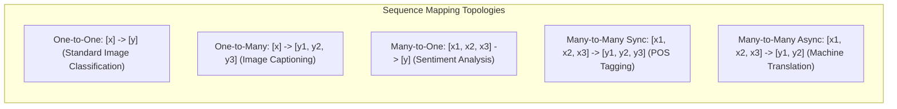
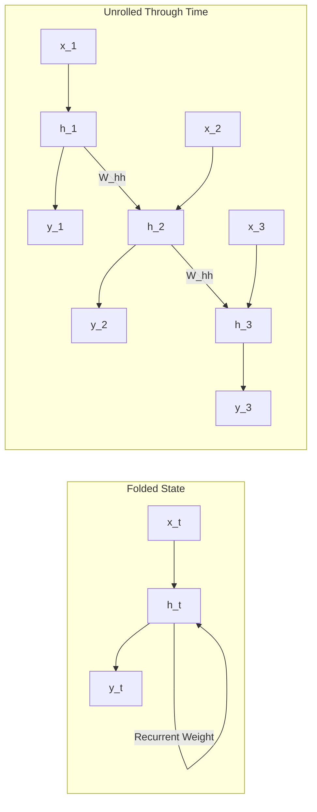
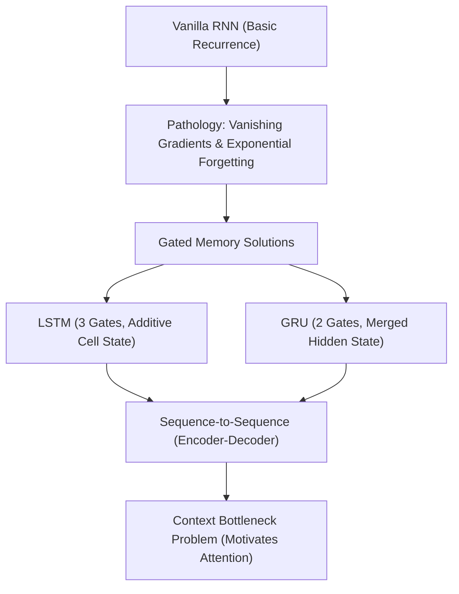

# Lesson 1: Module Introduction

## Module Introduction: Sequential Modeling and Recurrent Paradigms

Traditional feedforward networks and spatial convolutional architectures operate on fixed-dimensional inputs, assuming each observation is statistically independent from all others. Real-world phenomena such as written language, spoken audio, financial market trends, and biological sequences exhibit temporal dependencies where the order and context of inputs govern semantic meaning. Introducing recurrent state transitions and temporal parameter sharing equips artificial neural networks to process variable-length streams while maintaining persistent working memory across time.

## The Transition from Static to Sequential Processing

### The Temporal Dimension in Machine Learning

- Static models process individual data instances $x \in \mathbb{R}^D$ that exist without temporal ordering or sequential dependence.
- Sequential modeling processes ordered series of observation vectors:
  $$X = (x_1, x_2, \dots, x_T), \quad x_t \in \mathbb{R}^D$$
  where $t$ designates discrete time step or token position, and $T$ represents sequence length.
- The meaning of element $x_t$ depends directly on the sequence history $(x_1, \dots, x_{t-1})$ and, in non-causal settings, the subsequent future context $(x_{t+1}, \dots, x_T)$.

### Why Spatial and Feedforward Models Break on Sequences

- **Rigid Dimensionality Constraints:** Dense Multi-Layer Perceptrons require fixed input vector sizes; handling variable-length sequences requires padding or cropping, which wastes compute or discards information.
- **Destruction of Temporal Order:** Flattening an ordered sequence into an unrolled vector discards temporal topology, forcing models to treat a word at step 1 as unrelated to the identical word at step 5.
- **Finite Context Receptive Fields:** While 1D convolutions process localized temporal windows, capturing dependencies that span dozens of steps requires deep dilated stacks that increase latency.

### The Need for Dynamic Temporal Working Memory

- Processing variable-length streams requires networks to maintain an internal **hidden state vector** $h_t \in \mathbb{R}^H$.
- The hidden state serves as an internal memory buffer, updated recurrently at each step as new tokens arrive.
- By recycling hidden states through continuous feedback loops, models compress arbitrary-length histories into continuous latent vectors.

> [!Tip]
> **Sequential modeling requires persistent memory**: while static feedforward architectures treat every input independently, sequence models maintain an evolving hidden state that carries historical context across time steps.

## The Five Canonical Sequence Mapping Paradigms

### One-to-One and One-to-Many Formulations

- **One-to-One:** The classical non-sequential paradigm where a single fixed vector maps to a single output prediction (e.g., standard image classification: image $\to$ class label).
- **One-to-Many:** A single static input maps to an ordered output sequence of variable length (e.g., Image Captioning: static image $\to$ sequence of descriptive text tokens).

### Many-to-One Classification Topologies

- **Many-to-One:** An ordered sequence of inputs compresses into a single stationary target prediction.
- The network consumes inputs sequentially, updates its internal hidden state across all $T$ steps, and passes the terminal hidden state $h_T$ to a classification head.
- Typical applications include text sentiment classification, document topic assignment, and time-series anomaly detection.

### Many-to-Many Synchronous and Asynchronous Topologies

- **Many-to-Many (Synchronous):** The input sequence and output sequence possess identical lengths ($T_x = T_y$), with predictions generated at every time step (e.g., Part-of-Speech tagging, video frame segmentation).
- **Many-to-Many (Asynchronous / Delayed):** The input sequence length $T_x$ and output sequence length $T_y$ differ, requiring the model to consume the entire input sequence before emitting output tokens (e.g., Machine Translation, Speech-to-Text).

> [!Important]
> **Map architectures to task topology**: sentiment classification requires Many-to-One compression, real-time token tagging demands Many-to-Many synchronization, and machine translation requires asynchronous Encoder-Decoder structures.

## Conceptual Foundations of Recurrent Memory

### The Recurrent State Transition Principle

- Recurrent architectures model temporal dependencies by making current hidden states a function of both current inputs and previous hidden states:
  $$h_t = f(h_{t-1}, x_t; \theta)$$
- The transition function $f$ combines affine projections with non-linear activation functions (such as $\tanh$).
- Information propagates sequentially through time, allowing historical context to influence future predictions.

### Temporal Parameter Sharing and Generalization

- An identical set of parameter matrices and bias vectors updates the hidden state at every time step $t \in \{1, \dots, T\}$.
- Parameter sharing across time provides two advantages:
  - The model processes inputs of arbitrary, variable duration without allocating new parameters for longer sequences.
  - The network learns position-invariant temporal features, recognizing patterns regardless of where they appear within the sequence.

### The Unrolling Concept in Discrete Time

- While recurrent models appear compact in their folded cyclic representation, computing gradients requires unrolling the computational graph across all $T$ temporal steps.
- Unrolling transforms a recurrent loop into an equivalent $T$-layer feedforward network where all layers share identical weight matrices.
- Evaluating parameter gradients across this unrolled graph requires **Backpropagation Through Time (BPTT)**.

> [!Tip]
> **Unrolling reveals underlying depth**: an unrolled recurrent network acts as a deep feedforward network where depth equals sequence length $T$ and weights are shared across every layer.

## Module Roadmap: From Vanilla Recurrence to Modern Gating

### The Core Sequence Learning Trajectory

- This module examines the mathematical mechanics, training failures, and architectural solutions of temporal models:
  - **Vanilla RNNs:** Basic hidden state recurrences, temporal parameter sharing, and Backpropagation Through Time.
  - **The Vanishing and Exploding Gradient Problem:** The mathematical cause of exponential forgetting across long time horizons.
  - **Long Short-Term Memory (LSTM):** Constant Error Carousels, additive cell states, and multi-gate memory control.
  - **Gated Recurrent Units (GRU):** Streamlined two-gate recurrent cells that reduce parameter overhead.
  - **Sequence-to-Sequence Models:** Encoder-Decoder frameworks and the fixed-length context vector bottleneck.

### The Long-Range Gradient Bottleneck Preview

- Because unrolling an RNN across $T$ steps compounds transition matrices repeatedly ($W_{hh}^T$), error signals vanish or explode over long time horizons.
- Vanilla RNNs struggle to preserve information across more than 10 to 15 steps.
- Resolving this limitation motivated the development of **gated memory architectures** (LSTMs and GRUs) that establish additive gradient highways across time.

> [!Important]
> **Gradient stability dictates architectural choice**: vanilla RNNs fail on long dependencies due to multiplicative gradient decay, requiring gated architectures (LSTM, GRU) to preserve signals over extended sequences.

## Comparative Matrix of Sequence Mapping Paradigms

| Sequence Mapping Paradigm | Input Structure | Output Structure | Temporal Synchronization | Primary Real-World Application |
|---|---|---|---|---|
| **One-to-One** | Single static vector: $x \in \mathbb{R}^D$ | Single static vector: $y \in \mathbb{R}^K$ | Static (non-temporal) | Standard image classification; tabular regression |
| **One-to-Many** | Single static vector: $x \in \mathbb{R}^D$ | Ordered sequence: $(y_1, \dots, y_{T_y})$ | Output-driven autoregression | Image captioning; text generation from an embedding |
| **Many-to-One** | Ordered sequence: $(x_1, \dots, x_{T_x})$ | Single static vector: $y \in \mathbb{R}^K$ | Terminal aggregation at $t=T_x$ | Text sentiment analysis; audio clip classification |
| **Many-to-Many (Synchronous)** | Ordered sequence: $(x_1, \dots, x_T)$ | Ordered sequence: $(y_1, \dots, y_T)$ | Step-wise real-time alignment ($T_x = T_y$) | Part-of-speech tagging; video frame categorization |
| **Many-to-Many (Asynchronous)** | Ordered sequence: $(x_1, \dots, x_{T_x})$ | Ordered sequence: $(y_1, \dots, y_{T_y})$ | Delayed generation ($T_x \neq T_y$) | Machine language translation; speech-to-text transcription |

> [!Tip]
> **Identify synchronization requirements early**: choose synchronous recurrence when predictions must align step-by-step with inputs, and select asynchronous Encoder-Decoder models when input and output lengths vary.

## Key Takeaways

- **Sequential data requires specialized models** because ordering, dynamic context, and variable sequence lengths break the assumptions of static feedforward architectures.
- **Dense networks fail on sequences** due to rigid input dimensions, lack of temporal parameter sharing, and vulnerability to parameter explosion.
- **Sequence mapping follows five distinct topologies**: One-to-One, One-to-Many, Many-to-One, Many-to-Many Synchronous, and Many-to-Many Asynchronous.
- **Recurrent models maintain an evolving hidden state** that acts as continuous memory, updated at each step by current inputs and previous hidden representations.
- **Temporal parameter sharing** applies identical weight matrices across all time steps, allowing models to process sequences of arbitrary length.
- **Unrolling transforms recurrent loops** into deep computational graphs where depth corresponds to sequence length, trained using Backpropagation Through Time.
- **Vanilla RNNs suffer from vanishing gradients**, which limits their effective memory to short sequences and motivated the development of gated architectures.
- **Gated models (LSTM and GRU) use additive updates** to preserve gradient signals across extended temporal horizons.

> [!Tip]
> The foundational principle of sequence modeling: **temporal recurrence turns dynamic streams into continuous latent memory**; applying shared weight matrices across unrolled time steps allows neural networks to parse variable-length inputs while maintaining context across time.
