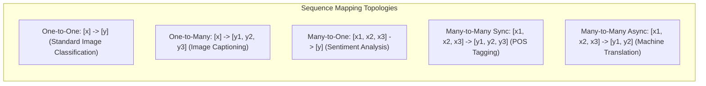

# Migration in progress
# Lesson 1: Module Introduction

## Module Introduction: Sequential Modeling and Recurrent Paradigms

Traditional feedforward networks and spatial convolutional architectures operate on fixed-dimensional inputs, assuming each observation is statistically independent from all others. Real-world phenomena such as written language, spoken audio, financial market trends, and biological sequences exhibit temporal dependencies where the order and context of inputs govern semantic meaning. Introducing recurrent state transitions and temporal parameter sharing equips artificial neural networks to process variable-length streams while maintaining persistent working memory across time.

## The Transition from Static to Sequential Processing

### The Temporal Dimension in Machine Learning

- Static models process individual data instances $x \in \mathbb{R}^D$ that exist without temporal ordering or sequential dependence.
- Sequential modeling processes ordered series of observation vectors:
  $$X = (x_1, x_2, \dots, x_T), \quad x_t \in \mathbb{R}^D$$
  where $t$ designates discrete time step or token position, and $T$ represents sequence length.
- The meaning of element $x_t$ depends directly on the sequence history $(x_1, \dots, x_{t-1})$ and, in non-causal settings, the subsequent future context $(x_{t+1}, \dots, x_T)$.

### Why Spatial and Feedforward Models Break on Sequences

- **Rigid Dimensionality Constraints:** Dense Multi-Layer Perceptrons require fixed input vector sizes; handling variable-length sequences requires padding or cropping, which wastes compute or discards information.
- **Destruction of Temporal Order:** Flattening an ordered sequence into an unrolled vector discards temporal topology, forcing models to treat a word at step 1 as unrelated to the identical word at step 5.
- **Finite Context Receptive Fields:** While 1D convolutions process localized temporal windows, capturing dependencies that span dozens of steps requires deep dilated stacks that increase latency.

### The Need for Dynamic Temporal Working Memory

- Processing variable-length streams requires networks to maintain an internal **hidden state vector** $h_t \in \mathbb{R}^H$.
- The hidden state serves as an internal memory buffer, updated recurrently at each step as new tokens arrive.
- By recycling hidden states through continuous feedback loops, models compress arbitrary-length histories into continuous latent vectors.

> [!Tip]
> **Sequential modeling requires persistent memory**: while static feedforward architectures treat every input independently, sequence models maintain an evolving hidden state that carries historical context across time steps.

## The Five Canonical Sequence Mapping Paradigms

### One-to-One and One-to-Many Formulations

- **One-to-One:** The classical non-sequential paradigm where a single fixed vector maps to a single output prediction (e.g., standard image classification: image $\to$ class label).
- **One-to-Many:** A single static input maps to an ordered output sequence of variable length (e.g., Image Captioning: static image $\to$ sequence of descriptive text tokens).

### Many-to-One Classification Topologies

- **Many-to-One:** An ordered sequence of inputs compresses into a single stationary target prediction.
- The network consumes inputs sequentially, updates its internal hidden state across all $T$ steps, and passes the terminal hidden state $h_T$ to a classification head.
- Typical applications include text sentiment classification, document topic assignment, and time-series anomaly detection.

### Many-to-Many Synchronous and Asynchronous Topologies

- **Many-to-Many (Synchronous):** The input sequence and output sequence possess identical lengths ($T_x = T_y$), with predictions generated at every time step (e.g., Part-of-Speech tagging, video frame segmentation).
- **Many-to-Many (Asynchronous / Delayed):** The input sequence length $T_x$ and output sequence length $T_y$ differ, requiring the model to consume the entire input sequence before emitting output tokens (e.g., Machine Translation, Speech-to-Text).

> [!Important]
> **Map architectures to task topology**: sentiment classification requires Many-to-One compression, real-time token tagging demands Many-to-Many synchronization, and machine translation requires asynchronous Encoder-Decoder structures.

## Conceptual Foundations of Recurrent Memory

### The Recurrent State Transition Principle

- Recurrent architectures model temporal dependencies by making current hidden states a function of both current inputs and previous hidden states:
  $$h_t = f(h_{t-1}, x_t; \theta)$$
- The transition function $f$ combines affine projections with non-linear activation functions (such as $\tanh$).
- Information propagates sequentially through time, allowing historical context to influence future predictions.

### Temporal Parameter Sharing and Generalization

- An identical set of parameter matrices and bias vectors updates the hidden state at every time step $t \in \{1, \dots, T\}$.
- Parameter sharing across time provides two advantages:
  - The model processes inputs of arbitrary, variable duration without allocating new parameters for longer sequences.
  - The network learns position-invariant temporal features, recognizing patterns regardless of where they appear within the sequence.

### The Unrolling Concept in Discrete Time

- While recurrent models appear compact in their folded cyclic re