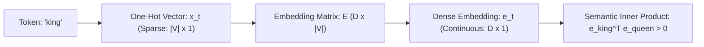

# Migration in progress
# Lesson 2: Introduction to Sequence Models

## Mathematical Formulations of Sequence Models and Token Representations

Sequence modeling addresses the problem of estimating probability distributions over ordered collections of discrete tokens or continuous vectors. Before a neural network can process temporal dynamics, raw symbolic data must be mapped into continuous vector spaces that preserve semantic geometry. Analyzing the mathematical mechanics of token encodings, probabilistic chain rule factorizations, classical Markovian approximations, and autoregressive decoding strategies establishes the analytical foundation for all sequence modeling architectures.

## Token Encoding and Vector Representations

### Discrete Vocabulary Indexing and One-Hot Vectors

- A sequential dataset begins as an ordered sequence of discrete symbolic tokens drawn from a finite vocabulary $\mathcal{V}$:
  $$X = (w_1, w_2, \dots, w_T), \quad w_t \in \mathcal{V}$$
  where $|\mathcal{V}|$ represents the total vocabulary size.
- The classical numerical baseline encodes each token as a **one-hot vector** $x_t \in \{0, 1\}^{|\mathcal{V}|}$:
  $$x_t = [0, \; \dots, \; 0, \; 1, \; 0, \; \dots, \; 0]^T$$
  where a single index corresponding to the token's dictionary rank contains a one, and all other entries are zero.
- In real-world natural language processing, vocabulary sizes range from $|\mathcal{V}| \approx 30,000$ to $250,000$, making one-hot vectors high-dimensional and computationally sparse.

### The Orthogonality Bottleneck of One-Hot Encodings

- One-hot vectors are mutually **orthogonal** in Euclidean vector space:
  $$x_i^T x_j = \begin{cases} 1 & \text{if } i = j \\ 0 & \text{if } i \neq j \end{cases}$$
- The Euclidean distance between any two distinct tokens is identical and invariant:
  $$\|x_i - x_j\|_2 = \sqrt{(1)^2 + (-1)^2} = \sqrt{2} \quad \forall i \neq j$$
- Orthogonal encodings contain zero semantic distance metrics: the mathematical representation of the word *king* shares the exact same geometric distance with *queen* as it does with an unrelated word like *refrigerator*.
- A model trained on one-hot encodings cannot generalize across synonymous words without independently learning identical parameter sets for each dictionary index.

### Continuous Dense Embeddings

- Neural sequence models project high-dimensional sparse one-hot vectors into a low-dimensional, continuous vector space using an **embedding matrix** $E \in \mathbb{R}^{D \times |\mathcal{V}|}$:
  $$e_t = E x_t \in \mathbb{R}^D$$
  where $D \ll |\mathcal{V}|$ denotes the embedding dimension (typically $D \in [256, 1024]$).
- Multiplying the embedding matrix by a one-hot vector acts as a lookup operation that extracts the $k$-th column of matrix $E$.
- The embedding matrix parameters are optimized end-to-end via backpropagation.
- During training, tokens appearing in similar contextual distributions are pulled together in embedding space, allowing the inner product $e_i^T e_j$ to encode continuous **cosine similarity** and semantic relationships.

> [!Tip]
> **Dense embeddings introduce semantic geometry**: projecting sparse one-hot vectors through an embedding matrix compresses dimensionality from $|\mathcal{V}|$ to $D$, allowing vector inner products to reflect semantic similarity.

## Statistical Language Modeling and the Chain Rule

### Joint Sequence Probability Formulation

- A **statistical language model** quantifies the likelihood of an entire ordered sequence of tokens occurring within a domain:
  $$P(X) = P(w_1, w_2, \dots, w_T)$$
- Computing this joint distribution allows models to evaluate whether a generated sentence is syntactically coherent and semantically plausible.
- Because language exhibits combinatorial diversity, estimating the joint probability of an entire multi-token sequence directly from empirical frequency tables is impossible.

### Autoregressive Factorization via the Chain Rule of Probability

- Applying the **chain rule of probability** decomposes the joint probability of any sequence into an exact product of conditional next-token probabilities:
  $$P(w_1, w_2, \dots, w_T) = P(w_1) P(w_2 \mid w_1) P(w_3 \mid w_1, w_2) \cdots P(w_T \mid w_1, \dots, w_{T-1})$$
- Compactly, the joint probability expresses as an **autoregressive product**:
  $$P(X) = \prod_{t=1}^T P(w_t \mid w_{<t})$$
  where $w_{<t} = (w_1, \dots, w_{t-1})$ represents the historical context prefix preceding time step $t$.
- This factorization transforms the global sequence estimation problem into a sequence of local **next-token prediction** subproblems.

### Conditional Next-Token Prediction

- An **autoregressive model** estimates the conditional probability distribution over the entire vocabulary at each time step:
  $$P(w_t = v \mid w_{<t}) \quad \forall v \in \mathcal{V}$$
- The model processes the historical prefix $w_{<t}$, outputs a raw real-valued logit vector $z_t \in \mathbb{R}^{|\mathcal{V}|}$, and normalizes values using the Softmax function:
  $$P(w_t = v \mid w_{<t}) = \frac{\exp(z_t[v])}{\sum_{j=1}^{|\mathcal{V}|} \exp(z_t[j])}$$
- Training minimizes the **cross-entropy loss** between the predicted categorical distribution and the true target token $w_t$:
  $$\mathcal{L}_t = -\ln P(w_t \mid w_{<t})$$

> [!Important]
> **The chain rule enables autoregressive modeling**: factorizing joint sequence distributions into conditional next-token probabilities transforms sequence learning into a step-by-step classification task across the vocabulary.

## Classical N-Gram Models Versus Neural Sequences

### The Markov Property in Sequence Modeling

- Evaluating the full conditional probability $P(w_t \mid w_1, \dots, w_{t-1})$ requires conditioning on an expanding historical prefix that grows with sequence length $t$.
- Classical statistical modeling simplifies this dependency using a stationary **Markov assumption** of order $k$:
  $$P(w_t \mid w_1, \dots, w_{t-1}) \approx P(w_t \mid w_{t-k}, \dots, w_{t-1})$$
- Under a $k$-th order Markov assumption, token $w_t$ depends exclusively on the immediately preceding $k$ tokens, treating all earlier historical context as conditionally independent.

### N-Gram Frequency Estimation and Combinatorial Explosion

- An **N-gram model** sets the Markov order to $k = N - 1$, estimating conditional probabilities using maximum likelihood frequency counts from a text corpus:
  $$P_{\text{N-gram}}(w_t \mid w_{t-N+1}, \dots, w_{t-1}) = \frac{\text{Count}(w_{t-N+1}, \dots, w_{t-1}, w_t)}{\text{Count}(w_{t-N+1}, \dots, w_{t-1})}$$
- **Combinatorial Parameter Explosion:** Storing frequency tables for an $N$-gram model requires parameter space that scales exponentially with sequence context length:
  $$\text{Storage Complexity} \in O(|\mathcal{V}|^N)$$
- For a vocabulary of $|\mathcal{V}| = 100,000$, a 4-gram model theoretically requires storing up to $100,000^4 = 10^{20}$ possible frequency entries, making scaling beyond $N=5$ computationally impossible.

### The Zero-Probability Sparsity Trap

- Because the vast majority of valid $N$-token phrases never appear within a finite training corpus, empirical counts evaluate to zero:
  $$\text{Count}(w_{t-N+1}, \dots, w_t) = 0 \implies P(w_t \mid w_{<t}) = 0$$
- A single zero-probability token causes the entire multiplicative joint sequence probability $P(X) = \prod P(w_t \mid w_{<t})$ to collapse to zero.
- Mitigating this failure requires heuristic statistical smoothing algorithms (e.g., Kneser-Ney