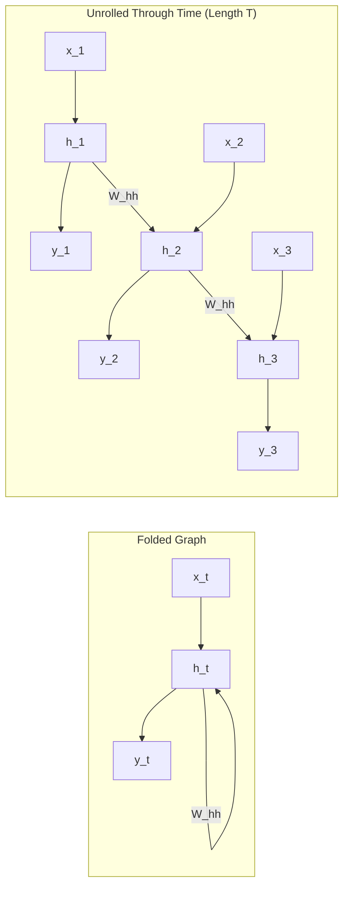
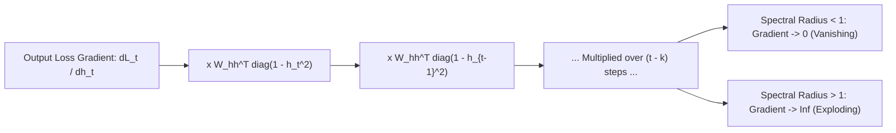
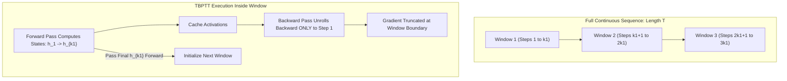

# Lesson 3: Recurrent Neural Networks

## Recurrent Neural Networks: Architecture, Dynamics, and Gradient Flow

Vanilla Recurrent Neural Networks (RNNs) provide the foundational architecture for modeling sequential dependencies through cyclical feedback loops. By maintaining an internal hidden state that persists across time steps, an RNN combines current inputs with dynamic historical memory. Evaluating gradients in recurrent architectures requires unrolling the computational graph across time via Backpropagation Through Time (BPTT). Understanding the mathematical formulation of recurrent state transitions, the temporal Jacobian chain, and the exponential dynamics governing vanishing and exploding gradients clarifies the architectural necessity of gated sequence models.

## Recurrent State Equations and Architecture

### The Core Recurrence Relation

- A **Recurrent Neural Network** processes an input sequence $(x_1, x_2, \dots, x_T)$ by maintaining a continuous **hidden state vector** $h_t \in \mathbb{R}^H$ that evolves at each discrete time step $t$.
- The hidden state updates by combining the current input vector $x_t \in \mathbb{R}^D$ with the preceding hidden state $h_{t-1}$ through affine projections mapped by a hyperbolic tangent non-linearity:
  $$h_t = \tanh(W_{hh} h_{t-1} + W_{xh} x_t + b_h)$$
  where $W_{hh} \in \mathbb{R}^{H \times H}$ is the recurrent state transition matrix, $W_{xh} \in \mathbb{R}^{H \times D}$ is the input-to-hidden projection matrix, and $b_h \in \mathbb{R}^H$ is the hidden bias vector.
- The network computes an optional output prediction $\hat{y}_t \in \mathbb{R}^K$ by projecting the current hidden state through an independent output head:
  $$\hat{y}_t = g(W_{hy} h_t + b_y)$$
  where $W_{hy} \in \mathbb{R}^{K \times H}$ is the hidden-to-output matrix, $b_y \in \mathbb{R}^K$ is the output bias, and $g(\cdot)$ represents an output activation (such as Softmax for classification or Identity for regression).

### Matrix Dimensions and Parameter Accounting

- Unlike feedforward layers where parameter counts scale with input length, an RNN allocates a fixed parameter budget regardless of sequence duration $T$.
- For an input dimension $D$, hidden dimension $H$, and output dimension $K$, the total learnable parameters evaluate as:
  $$P_{W_{xh}} = H \times D$$
  $$P_{W_{hh}} = H \times H = H^2$$
  $$P_{W_{hy}} = K \times H$$
  $$P_{\text{biases}} = H + K$$
  $$P_{\text{total}} = H(D + H + 1) + K(H + 1)$$
- For a mini-batch of $m$ sequences, computations evaluate in parallel using batch matrix operations:
  $$H_t = \tanh(H_{t-1} W_{hh}^T + X_t W_{xh}^T + \mathbf{1}_m b_h^T)$$
  where $H_t \in \mathbb{R}^{m \times H}$ and $X_t \in \mathbb{R}^{m \times D}$.

### Temporal Parameter Sharing Mechanics

- The identical parameter matrices ($W_{hh}, W_{xh}, W_{hy}$) update activations at every time step $t \in \{1, \dots, T\}$.
- **Parameter sharing across time** enforces translation invariance along the temporal axis: a grammatical dependency or audio pattern is evaluated with the exact same synaptic weights whether it appears at step 2 or step 200.
- Shared parameters allow the model to process variable-length inputs without expanding parameter memory.

> [!Tip]
> **Temporal parameter sharing decouples weights from sequence length**: reusing identical transition matrices across time allows recurrent models to process variable-length streams while keeping parameter memory constant.

## Backpropagation Through Time (BPTT)

### The Cumulative Sequence Loss

- Training a recurrent model requires unrolling the network across all $T$ operational time steps to form a directed acyclic graph.
- The global objective loss $\mathcal{L}$ evaluates as the scalar sum of step-wise losses over the entire sequence:
  $$\mathcal{L} = \sum_{t=1}^T \mathcal{L}_t(\hat{y}_t, y_t)$$
- For classification tasks, each $\mathcal{L}_t$ represents the cross-entropy loss between the predicted distribution $\hat{y}_t$ and true target $y_t$.

### Derivation of Recurrent Weight Gradients

- Because $W_{hh}$ participates in every temporal transition, computing its gradient requires summing its contributions across all time steps.
- Applying the multivariate chain rule to parameter matrix $W_{hh}$ yields:
  $$\frac{\partial \mathcal{L}}{\partial W_{hh}} = \sum_{t=1}^T \frac{\partial \mathcal{L}_t}{\partial W_{hh}}$$
- Because the hidden state $h_t$ depends on $h_{t-1}$, which in turn depends on all preceding hidden states $(h_{t-2}, \dots, h_1)$, the gradient at step $t$ expands as an unrolled temporal sum:
  $$\frac{\partial \mathcal{L}_t}{\partial W_{hh}} = \sum_{k=1}^t \frac{\partial \mathcal{L}_t}{\partial h_t} \left( \frac{\partial h_t}{\partial h_k} \right) \frac{\partial h_k}{\partial W_{hh}}$$
  where $\frac{\partial h_k}{\partial W_{hh}}$ is the local derivative evaluating $W_{hh}$'s direct contribution to step $k$ while treating $h_{k-1}$ as constant:
  $$\frac{\partial h_k}{\partial W_{hh}} = \text{diag}(1 - h_k^2) h_{k-1}^T$$

### The Temporal Jacobian Product

- The central term linking step $t$ to historical step $k$ expands as a chained product of intermediate layer-to-layer Jacobian matrices:
  $$\frac{\partial h_t}{\partial h_k} = \prod_{j=k+1}^t \frac{\partial h_j}{\partial h_{j-1}}$$
- Evaluating the derivative of the recurrent state transition $h_j = \tanh(W_{hh} h_{j-1} + W_{xh} x_j + b_h)$ with respect to $h_{j-1}$ yields:
  $$\frac{\partial h_j}{\partial h_{j-1}} = W_{hh}^T \text{diag}(1 - h_j^2)$$
  where $\text{diag}(1 - h_j^2)$ is the diagonal Jacobian matrix of the hyperbolic tangent activation evaluated at pre-activation $z_j$.
- Expanding across all intermediate steps from $k$ to $t$ reveals the chained matrix product:
  $$\frac{\partial h_t}{\partial h_k} = \prod_{j=k+1}^t \left( W_{hh}^T \text{diag}(1 - h_j^2) \right)$$

> [!Important]
> **BPTT unrolls gradients across historical paths**: evaluating the gradient of the loss at step $t$ with respect to recurrent weights requires propagating error signals backward across all preceding steps through chained Jacobian products.

## Gradient Pathologies across Temporal Horizons

### Mathematical Anatomy of the Vanishing Gradient

- The magnitude of the backpropagated error signal depends on the continuous multiplication of the temporal Jacobian product:
  $$\left\| \frac{\partial h_t}{\partial h_k} \right\|_2 \le \prod_{j=k+1}^t \|W_{hh}^T\|_2 \|\text{diag}(1 - h_j^2)\|_2$$
- The derivative of the hyperbolic tangent function satisfies $|\tanh'(z)| = (1 - \tanh^2(z)) \le 1.0$, reaching a peak of $1.0$ only when the pre-activation is exactly zero and decaying toward zero as $|z|$ grows.
- If the largest singular value of the recurrent transition matrix satisfies $\sigma_{\max}(W_{hh}) < 1.0$, or if hidden activations saturate ($|h_j| \approx 1$), each step scales the incoming gradient down by a factor $\gamma < 1.0$.
- Over a temporal gap of $\tau = t - k$ steps, the gradient norm decays exponentially:
  $$\left\| \frac{\partial h_t}{\partial h_k} \right\|_2 \propto \gamma^\tau \longrightarrow 0 \quad (\text{as } \tau \to \infty)$$
- When $\tau > 10$, the gradient approaches machine epsilon ($0.0$). Early hidden states receive zero update signals from distant outputs, causing the network to suffer from **exponential forgetting**.

### The Spectral Radius Criterion of the Recurrent Matrix

- Long-term asymptotic behavior is governed by the **spectral radius** $\rho(W_{hh}) = \max_i |\lambda_i(W_{hh})|$.
- Razvan Pascanu, Tomas Mikolov, and Yoshua Bengio (2013) proved the formal conditions for temporal gradient degradation:
  - **Vanishing Condition:** If $\rho(W_{hh}) < 1.0$, gradients vanish exponentially for almost all operational paths, meaning long-term temporal dependencies cannot be learned.
  - **Exploding Condition:** If $\rho(W_{hh}) > 1.0$, gradients can grow exponentially along eigenvector directions associated with eigenvalues greater than one:
    $$\lim_{\tau \to \infty} \left\| \frac{\partial h_t}{\partial h_k} \right\|_2 = \infty$$

### Exploding Gradients and Loss Instability

- When the temporal Jacobian product exceeds unity ($\gamma > 1.0$), error signals compound exponentially across time.
- Exploding gradients generate massive parameter updates that push weights outside valid numerical boundaries:
  $$\Delta W_{hh} = -\eta \nabla_{W_{hh}} \mathcal{L} \gg 10^6$$
- Large updates destroy learned representations and cause floating-point numbers to overflow into `NaN` or `Inf`, causing training to diverge.

> [!Important]
> **Spectral radius governs temporal stability**: repeated multiplication by $W_{hh}^T$ causes gradients to decay exponentially if $\rho(W_{hh}) < 1$ or explode exponentially if $\rho(W_{hh}) > 1$, making vanilla RNNs unstable beyond short horizons.

## Stabilization Strategies and Truncated BPTT

### Truncated Backpropagation Through Time (TBPTT)

- On extended sequences (e.g., thousands of steps in audio streams or long documents), executing full BPTT across the entire sequence is computationally and memory prohibitive.
- **Truncated Backpropagation Through Time (TBPTT)** splits the full sequence into localized operational windows:
  - The **forward pass** evaluates continuously across the full sequence, passing the hidden state $h_t$ forward across window boundaries without interruption.
  - The **backward pass** unrolls backward for only a fixed window of $k_1$ steps, truncating gradient propagation beyond that horizon:
    $$\frac{\partial \mathcal{L}}{\partial W_{hh}} \approx \sum_{t=1}^T \sum_{k = \max(1, t - k_1)}^t \frac{\partial \mathcal{L}_t}{\partial h_t} \left( \frac{\partial h_t}{\partial h_k} \right) \frac{\partial h_k}{\partial W_{hh}}$$
- TBPTT caps activation memory consumption at $O(k_1 \cdot H)$ and prevents gradients from compounding across unbounded sequence lengths.

### Gradient Norm Clipping Protocols

- **Gradient Norm Clipping** serves as the standard defense against exploding gradients in recurrent networks.
- Before applying the optimizer step, the global $L_2$ norm across all concatenated network parameters is evaluated:
  $$\|g_{\text{global}}\|_2 = \sqrt{\sum_i \|\nabla_{\theta_i} \mathcal{L}\|_2^2}$$
- If the global norm exceeds a predefined threshold $c$ (typically $c \in [1.0, 5.0]$), the gradient vector rescales proportionally:
  $$g \leftarrow g \cdot \frac{c}{\max(c, \|g_{\text{global}}\|_2)}$$
- Norm clipping bounds the maximum parameter step size while preserving the exact directional heading computed by BPTT, preventing parameter updates from diverging when navigating steep loss cliffs.

### Orthogonal Initialization and the Identity Trick (IRNN)

- Initializing $W_{hh}$ from standard random Gaussian distributions accelerates gradient vanishing or explosion.
- **Orthogonal Initialization:** Samples $W_{hh}$ as a random orthogonal matrix ($W_{hh}^T W_{hh} = I$). Because all eigenvalues of an orthogonal matrix have an absolute magnitude of exactly one ($|\lambda_i| = 1.0$), error signals propagate backward initially without exponential scaling.
- **The Identity Trick (IRNN):** Quoc Le, Navdeep Jaitly, and Geoffrey Hinton (2015) demonstrated that initializing the recurrent weight matrix to the **identity matrix** ($W_{hh} = I$) and pairing it with **Rectified Linear Units (ReLU)** stabilizes training:
  $$h_t = \max(0, \; I h_{t-1} + W_{xh} x_t + b_h)$$
- An identity matrix keeps the recurrent derivative at unity ($\frac{\partial h_t}{\partial h_{t-1}} = I$) when units are active, allowing vanilla RNNs to learn temporal dependencies spanning hundreds of steps.

> [!Tip]
> **Gradient clipping and orthogonal initialization stabilize recurrent training**: norm clipping prevents gradient explosions, while orthogonal or identity initializations prevent early gradient vanishing.

## Comparative Matrix of Recurrent Training Algorithms

| Training Algorithm | Mathematical Operational Mechanism | Computational Cost per Step | Memory Complexity per Batch | Maximum Temporal Dependency Horizon | Primary Limitation |
|---|---|---|---|---|---|
| **Full BPTT** | Unrolls the computational graph across all $T$ temporal steps | $O(T \cdot H^2)$ operations | $O(T \cdot H)$ activation storage | Entire sequence length ($T$) | Prohibitive memory consumption on long sequences ($T > 1000$) |
| **Truncated BPTT (TBPTT)** | Evaluates forward across $T$; truncates backward sweeps to $k_1$ steps | $O(k_1 \cdot H^2)$ per window | $O(k_1 \cdot H)$ activation storage | Strictly bounded by window $k_1$ (typically $20$ to $50$) | Cannot learn dependencies spanning across window boundaries |
| **Real-Time Recurrent Learning (RTRL)**| Forward propagation of gradient sensitivities: $\frac{\partial h_t}{\partial \theta}$ | $O(H^4)$ operations per step | $O(H^3)$ state storage | Infinite continuous temporal horizon | Computationally intractable for large hidden dimensions ($H > 100$) |

> [!Important]
> **TBPTT balances memory and temporal context**: full BPTT exhausts GPU memory on long sequences, making Truncated BPTT the practical standard by limiting reverse sweeps to a fixed window $k_1$.

## Key Takeaways

- **Vanilla RNNs maintain internal state** via the recurrence $h_t = \tanh(W_{hh} h_{t-1} + W_{xh} x_t + b_h)$, combining new inputs with historical context.
- **Temporal parameter sharing** applies identical weight matrices across all time steps, allowing models to process variable-length inputs with fixed parameter budgets.
- **Backpropagation Through Time (BPTT)** unrolls recurrent loops into an equivalent feedforward graph across $T$ steps to calculate parameter gradients.
- **The temporal Jacobian chain** $\frac{\partial h_t}{\partial h_k} = \prod_{j=k+1}^t W_{hh}^T \text{diag}(1 - h_j^2)$ compounds transition matrices exponentially over time.
- **Vanishing gradients cause exponential forgetting** when the spectral radius satisfies $\rho(W_{hh}) < 1.0$ or activations saturate, limiting vanilla RNNs to short dependencies.
- **Exploding gradients occur when $\rho(W_{hh}) > 1.0$**, causing numerical overflow and parameter divergence.
- **Gradient norm clipping** rescales gradient vectors that exceed a threshold $c$, preserving update direction while preventing numerical divergence.
- **Truncated BPTT restricts backward sweeps** to a fixed window $k_1$, bounding GPU memory consumption on long sequence streams.
- **Orthogonal and identity initializations (IRNN)** maintain transition singular values near unity, improving long-range gradient propagation in vanilla recurrent networks.

> [!Tip]
> The foundational rule of recurrent dynamics: **continuous multiplicative transitions cause exponential decay**; because unrolled recurrent graphs repeatedly multiply by transition matrices across time, preserving long-range context requires linear additive memory highways or explicit gating mechanisms.
