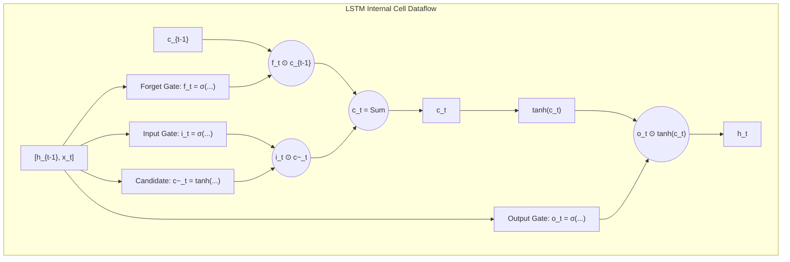

# Migration in progress
# Lesson 4: LSTM and GRU Architectures

## Gated Sequence Architectures: LSTM and GRU Mechanics

Vanilla Recurrent Neural Networks struggle to capture long-range temporal dependencies because continuous matrix multiplications across time steps cause backpropagated gradients to vanish or explode. Gated recurrent architectures resolve this mathematical breakdown by introducing continuous, differentiable gating mechanisms that regulate information flow into and out of persistent memory buffers. Analyzing the internal state equations, constant error dynamics, and computational trade-offs between Long Short-Term Memory (LSTM) networks and Gated Recurrent Units (GRUs) establishes the engineering principles governing modern recurrent modeling.

## The Gated Memory Paradigm

### The Need for Differentiable Switching

- In digital logic, physical transistors execute discrete binary switching ($0$ or $1$) to store or overwrite memory registers.
- Neural networks require all operations to be **end-to-end differentiable** to allow parameter optimization via gradient descent and Backpropagation Through Time (BPTT).
- Gated recurrent architectures emulate digital memory registers using **continuous soft gates** parameterized by the logistic sigmoid activation function:
  $$g = \sigma(W x + b) \in (0, 1)$$
- When gate activation approaches zero ($g \to 0$), the network blocks incoming information; when gate activation approaches one ($g \to 1$), the gate allows signals to pass unimpeded.

### The Mathematical Mechanics of Continuous Gates

- A gate evaluates as an affine combination of the incoming input vector $x_t \in \mathbb{R}^D$ and previous recurrent state $h_{t-1} \in \mathbb{R}^H$:
  $$g_t = \sigma(W_g \cdot [h_{t-1}, \; x_t] + b_g)$$
  where $[h_{t-1}, x_t] \in \mathbb{R}^{H+D}$ denotes vector concatenation along the feature dimension, and $W_g \in \mathbb{R}^{H \times (H+D)}$.
- The gate vector applies to a candidate memory tensor via the element-wise **Hadamard product** ($\odot$):
  $$\text{Filtered Signal} = g_t \odot C_t$$
- Because the gate outputs real numbers within the open unit interval $(0, 1)$, backpropagation calculates exact partial derivatives with respect to gate parameters, allowing the network to learn when to retain or erase memory.

### Additive Conveyor Belts Versus Multiplicative State Updates

- Vanilla RNNs update hidden states through continuous multiplicative mappings: $h_t = \tanh(W_{hh} h_{t-1} + \dots)$.
- Multiplicative transitions force the temporal Jacobian $\frac{\partial h_t}{\partial h_{t-1}}$ to depend directly on transition weights $W_{hh}^T$, causing exponential signal decay across time.
- Gated architectures replace multiplicative loops with **additive memory updates**:
  $$\text{State}_t = \text{State}_{t-1} + \Delta \text{State}$$
- Integrating information additively establishes an uninterrupted conveyor belt where error signals propagate backward across time without compounding through weight matrices.

> [!Tip]
> **Continuous gates make memory differentiable**: using Sigmoid activations allows networks to open or close memory channels via soft fractions in $(0, 1)$, preserving gradient flow during backpropagation.

## Long Short-Term Memory Architecture

### Dual-State Separation: Cell State Versus Hidden State

- Formulated by Sepp Hochreiter and Jürgen Schmidhuber (1997) and refined by Felix Gers et al. (2000), **Long Short-Term Memory (LSTM)** decomposes internal memory into two distinct vectors:
  - **Cell State ($c_t \in \mathbb{R}^H$):** Acts as a dedicated long-term memory conveyor belt, modified strictly through linear additive updates.
  - **Hidden State ($h_t \in \mathbb{R}^H$):** Acts as short-term working memory, representing the filtered, non-linear output exposed to downstream layers and output projections.

### The Mathematical Gate Equations

- At time step $t$, an LSTM cell receives input $x_t$, previous hidden state $h_{t-1}$, and previous cell state $c_{t-1}$, executing six sequential calculations:
  1. **Forget Gate ($f_t$):** Determines what proportion of the previous cell state $c_{t-1}$ to discard:
     $$f_t = \sigma(W_f \cdot [h_{t-1}, \; x_t] + b_f)$$
  2. **Input Gate ($i_t$):** Determines which coordinates of the candidate state to write into memory:
     $$i_t = \sigma(W_i \cdot [h_{t-1}, \; x_t] + b_i)$$
  3. **Candidate Cell State ($\tilde{c}_t$):** Creates new candidate memory values using a hyperbolic tangent activation:
     $$\tilde{c}_t = \tanh(W_c \cdot [h_{t-1}, \; x_t] + b_c)$$
  4. **Cell State Update ($c_t$):** Executes linear additive combination using the forget and input gates:
     $$c_t = f_t \odot c_{t-1} + i_t \odot \tilde{c}_t$$
  5. **Output Gate ($o_t$):** Determines which parts of the internal cell state to expose externally:
     $$o_t = \sigma(W_o \cdot [h_{t-1}, \; x_t] + b_o)$$
  6. **Hidden State Update ($h_t$):** Scales the normalized cell state by the output gate:
     $$h_t = o_t \odot \tanh(c_t)$$

### The Constant Error Carousel (CEC) and Gradient Preservation

- Differentiating the cell state update equation with respect to the previous cell state yields:
  $$\frac{\partial c_t}{\partial c_{t-1}} = \text{diag}(f_t)$$
- The backpropagated error signal along the cell state conveyor belt across a temporal span of $\tau = t - k$ steps expands as:
  $$\frac{\partial \mathcal{L}}{\partial c_k} = \frac{\partial \mathcal{L}}{\partial c_t} \left( \prod_{j=k+1}^t \frac{\partial c_j}{\partial c_{j-1}} \right) = \frac{\partial \mathcal{L}}{\partial c_t} \left( \prod_{j=k+1}^t \text{diag}(f_j) \right)$$
- If the network learns to keep the forget gate open ($f_j \approx 1.0$), the temporal Jacobian equals the identity matrix:
  $$\frac{\partial c_t}{\partial c_k} \approx I$$
- This structural identity creates the **Constant Error Carousel (CEC)**: error signals propagate backward across hundreds of time steps without exponential decay, eliminating the vanishing gradient problem.

### Architectural Variants: Peephole Connections and CIFG

- **Peephole Connections (Gers & Schmidhuber, 2000):** Standard LSTM gates observe only $h_{t-1}$ and $x_t$, remaining blind to the internal cell state $c_{t-1}$. Peephole connections allow gates to inspect the cell state directly:
  $$f_t = \sigma(W_f \cdot [h_{t-1}, \; x_t] + P_f \odot c_{t-1} + b_f)$$
  where $P_f \in \mathbb{R}^H$ is a diagonal weight vector. This enables precise timing coordination in sequence counting and frequency synchronization tasks.
- **Coupled Input and Forget Gate (CIFG):** Sets $i_t = 1 - f_t$, coupling writing and erasing into a single operation. The cell writes new candidate data only into coordinates that were erased, saving one gate projection.

> [!Important]
> **The Constant Error Carousel preserves gradients**: because the cell state updates additively ($c_t = f_t \odot c_{t-1} + \dots$), its temporal derivative equals the forget gate directly ($\frac{\partial c_t}{\partial c_{t-1}} = f_t$), creating a linear gradient highway across time.

## Gated Recurrent Unit Architecture

### State Consolidation and Component Simplification

- Proposed by Kyunghyun Cho et al. (2014), the **Gated Recurrent Unit (GRU)** streamlines recurrent gating by eliminating the separate cell state vector.
- The GRU tracks a single recurrent state vector $h_t \in \mathbb{R}^H$ that s