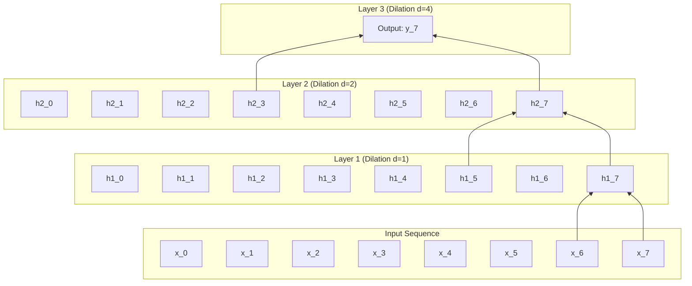

# Migration in progress
# Lesson 5: Beyond RNNs

## Beyond Recurrence: Convolutional Sequences, Attention, and Parallel Architectures

While Gated Recurrent Units (GRUs) and Long Short-Term Memory (LSTM) networks resolve vanishing gradients across moderate sequence lengths, their sequential formulation creates fundamental computational bottlenecks. Step-by-step recurrent processing prevents parallel execution on modern tensor accelerators, while long-range information transfer remains constrained by sequential path lengths. Transitioning beyond recurrence requires examining non-recurrent alternatives, including Temporal Convolutional Networks, dynamic attention mechanisms, and modern state-space formulations that process sequences in parallel while capturing long-range context.

## The Structural Bottlenecks of Recurrent Models

### The Sequential Execution Bottleneck

- Recurrent architectures compute hidden states through a strict temporal recurrence relation:
  $$h_t = f(h_{t-1}, x_t)$$
- Evaluating state $h_t$ strictly requires the prior state $h_{t-1}$ to complete evaluation and materialize in memory.
- For a sequence of length $T$, the computational graph enforces an unalterable sequence of $O(T)$ dependent operations during both forward evaluation and Backpropagation Through Time (BPTT).
- Modern hardware accelerators (GPUs and TPUs) achieve peak throughput by executing thousands of matrix operations in parallel; recurrent architectures force parallel tensor cores to wait idle while steps execute sequentially.

### The Memory Footprint of Temporal Unrolling

- Evaluating parameter gradients during BPTT requires caching all intermediate hidden states ($h_1, \dots, h_T$) and gate pre-activations in high-bandwidth GPU memory.
- Memory consumption scales linearly with sequence length:
  $$\text{Memory}_{\text{activations}} \in O(T \cdot H \cdot B)$$
  where $H$ denotes hidden dimension and $B$ denotes batch size.
- Long-sequence workloads (such as genomic modeling, audio synthesis, and document parsing where $T > 10,000$) quickly exceed physical GPU memory capacity.

### The Long-Range Path Length Limitation

- The efficiency with which a network learns long-range dependencies depends on the **maximum path length** that signals must traverse through the computational graph.
- In recurrent models, propagating an error signal from step $T$ to step $1$ requires traversing $O(T)$ sequential synaptic transitions.
- Although gating prevents catastrophic vanishing gradients, signal dilution and noise accumulation persist over hundreds of transitions, making recurrent networks struggle when context spans thousands of steps.

> [!Important]
> **Recurrence prevents hardware parallelization**: because step $t$ depends strictly on step $t-1$, recurrent models cannot compute sequence steps concurrently, creating an operational bottleneck on parallel GPU architectures.

## Temporal Convolutional Networks

### 1D Convolutions Over Sequence Dimensions

- Convolutions are not restricted to 2D spatial imagery; a **1D Convolution** sweeps a filter kernel across the temporal axis of a sequential tensor.
- An input sequence $X \in \mathbb{R}^{T \times D}$ convolved with a filter $W \in \mathbb{R}^{K \times D}$ produces an entire output sequence simultaneously:
  $$y_t = \sum_{k=0}^{K-1} W_k^T x_{t+k}$$
- All $T$ output steps compute in parallel using high-throughput matrix multiplications (GEMM), eliminating the sequential $O(T)$ execution barrier of RNNs during training.

### Causal Convolutions and Temporal Directionality

- Standard convolutions process symmetric spatial patches, sampling inputs from both the past ($t - k$) and the future ($t + k$).
- In autoregressive sequence modeling, future information leakage must be strictly prevented: predictions at time step $t$ may depend only on historical tokens $(x_1, \dots, x_t)$.
- A **Causal Convolution** enforces temporal directionality by shifting the filter window so that the output at step $t$ convolves strictly with current and preceding inputs:
  $$y_t = \sum_{k=0}^{K-1} W_k^T x_{t - k}$$
- Causal alignment is implemented by appending $K - 1$ zero-padding elements strictly to the *beginning* (left side) of the sequence, while trimming trailing elements.

### Dilated Convolutions and Exponential Receptive Fields

- A standard causal convolution with filter size $K$ expands its receptive field linearly: an $L$-layer network achieves a historical reach of only $L \cdot (K - 1) + 1$ steps.
- Proposed in WaveNet (Aaron van den Oord et al., 2016) and formalized in **Temporal Convolutional Networks (TCNs)** (Shaojie Bai et al., 2018), **Dilated Convolutions** introduce spaces between kernel taps.
- A dilated convolution with dilation factor $d$ evaluates inputs spaced $d$ steps apart:
  $$y_t = (x *_d W)(t) = \sum_{k=0}^{K-1} W_k^T x_{t - d \cdot k}$$
- By increasing the dilation factor exponentially across layer depth ($d = 2^0, 2^1, 2^2, \dots, 2^{L-1}$), the network's receptive field expands exponentially without increasing parameter counts:
  $$\text{Receptive Field} = 1 + \sum_{l=0}^{L-1} (K - 1) \cdot 2^l = 1 + (K - 1)(2^L - 1)$$
- An 8-layer TCN using $K=3$ covers an effective historical context of 511 steps while computing all steps in parallel during training.

> [!Tip]
> **Dilated causal convolutions enable parallel long-range reach**: stacking causal filters with exponentially increasing dilation rates ($d=2^l$) expands receptive fields exponentially while preserving full parallel training execution.

## The Emergence of the Attention Mechanism

### Breaking the Fixed-Length Context Bottleneck

- Standard Sequence-to-Sequence (Seq2Seq) models compress an arbitrary-length input sequence $(x_1, \dots, x_{T_x})$ into a single fixed-length vector $c = h_{T_x}$.
- This fixed vector creates an **information bottleneck**: when sequence length exceeds 20 to 30 tokens, representational capacity saturates, causing translation accuracy to degrade.
- Dzmitry Bahdanau, Kyunghyun Cho, and Yoshua Bengio (2014) introduced the **Attention Mechanism**, replacing the single static context vector with a **dynamically generated context vector** $c_i$ computed independently for each decoding step $i$.

### Alignment Scores: Additive Versus Multiplicative Formulations

- The attention mechanism computes an **alignment score** $e_{ij}$ measuring the relevance of encoder hidden state $h_j$ to the current decoder state $s_{i-1}$:
  - **Bahdanau Additive Attention:**
    $$e_{ij} = v_a^T \tanh(W_a s_{i-1} + U_a h_j)$$
    where $W_a \in \mathbb{R}^{A \times H_{\text{dec}}}$, $U_a \in \mathbb{R}^{A \times H_{\text{enc}}}$, and $v_a \in \mathbb{R}^A$.
  - **Luong Multiplicative (Dot-Product) Attention (2015):**
    $$e_{ij} = s_{i-1}^T W_a h_j$$
    When hidden dimensions match, it evaluates as a raw inner product: $e_{ij} = s_{i-1}^T h_j$.
- Passing alignment scores through a Softmax function across the input sequence length $T_x$ yields normalized **attention weights** $\alpha_{ij} \in (0, 1)$:
  $$\