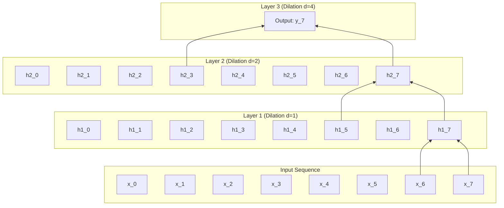
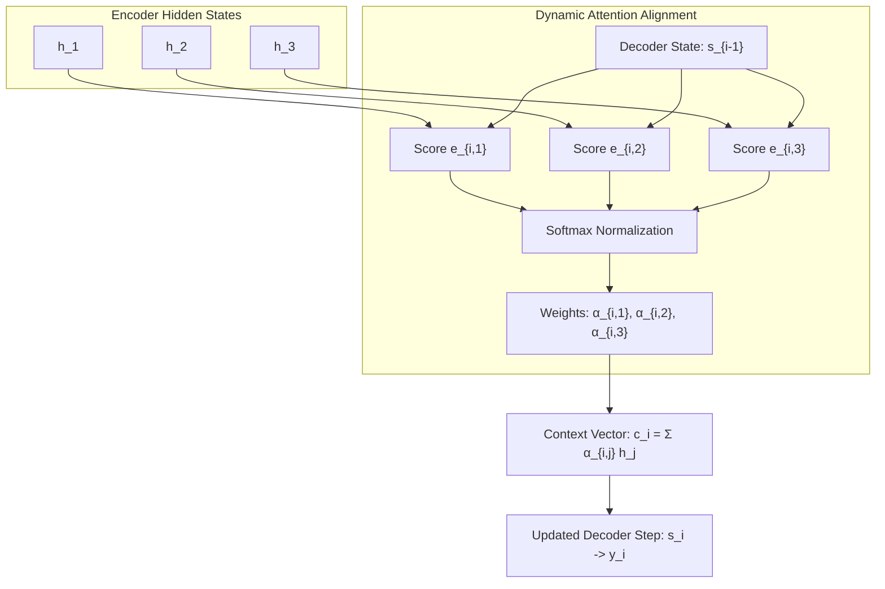

# Lesson 5: Beyond RNNs

## Beyond Recurrence: Convolutional Sequences, Attention, and Parallel Architectures

While Gated Recurrent Units (GRUs) and Long Short-Term Memory (LSTM) networks resolve vanishing gradients across moderate sequence lengths, their sequential formulation creates fundamental computational bottlenecks. Step-by-step recurrent processing prevents parallel execution on modern tensor accelerators, while long-range information transfer remains constrained by sequential path lengths. Transitioning beyond recurrence requires examining non-recurrent alternatives, including Temporal Convolutional Networks, dynamic attention mechanisms, and modern state-space formulations that process sequences in parallel while capturing long-range context.

## The Structural Bottlenecks of Recurrent Models

### The Sequential Execution Bottleneck

- Recurrent architectures compute hidden states through a strict temporal recurrence relation:
  $$h_t = f(h_{t-1}, x_t)$$
- Evaluating state $h_t$ strictly requires the prior state $h_{t-1}$ to complete evaluation and materialize in memory.
- For a sequence of length $T$, the computational graph enforces an unalterable sequence of $O(T)$ dependent operations during both forward evaluation and Backpropagation Through Time (BPTT).
- Modern hardware accelerators (GPUs and TPUs) achieve peak throughput by executing thousands of matrix operations in parallel; recurrent architectures force parallel tensor cores to wait idle while steps execute sequentially.

### The Memory Footprint of Temporal Unrolling

- Evaluating parameter gradients during BPTT requires caching all intermediate hidden states ($h_1, \dots, h_T$) and gate pre-activations in high-bandwidth GPU memory.
- Memory consumption scales linearly with sequence length:
  $$\text{Memory}_{\text{activations}} \in O(T \cdot H \cdot B)$$
  where $H$ denotes hidden dimension and $B$ denotes batch size.
- Long-sequence workloads (such as genomic modeling, audio synthesis, and document parsing where $T > 10,000$) quickly exceed physical GPU memory capacity.

### The Long-Range Path Length Limitation

- The efficiency with which a network learns long-range dependencies depends on the **maximum path length** that signals must traverse through the computational graph.
- In recurrent models, propagating an error signal from step $T$ to step $1$ requires traversing $O(T)$ sequential synaptic transitions.
- Although gating prevents catastrophic vanishing gradients, signal dilution and noise accumulation persist over hundreds of transitions, making recurrent networks struggle when context spans thousands of steps.

> [!Important]
> **Recurrence prevents hardware parallelization**: because step $t$ depends strictly on step $t-1$, recurrent models cannot compute sequence steps concurrently, creating an operational bottleneck on parallel GPU architectures.

## Temporal Convolutional Networks

### 1D Convolutions Over Sequence Dimensions

- Convolutions are not restricted to 2D spatial imagery; a **1D Convolution** sweeps a filter kernel across the temporal axis of a sequential tensor.
- An input sequence $X \in \mathbb{R}^{T \times D}$ convolved with a filter $W \in \mathbb{R}^{K \times D}$ produces an entire output sequence simultaneously:
  $$y_t = \sum_{k=0}^{K-1} W_k^T x_{t+k}$$
- All $T$ output steps compute in parallel using high-throughput matrix multiplications (GEMM), eliminating the sequential $O(T)$ execution barrier of RNNs during training.

### Causal Convolutions and Temporal Directionality

- Standard convolutions process symmetric spatial patches, sampling inputs from both the past ($t - k$) and the future ($t + k$).
- In autoregressive sequence modeling, future information leakage must be strictly prevented: predictions at time step $t$ may depend only on historical tokens $(x_1, \dots, x_t)$.
- A **Causal Convolution** enforces temporal directionality by shifting the filter window so that the output at step $t$ convolves strictly with current and preceding inputs:
  $$y_t = \sum_{k=0}^{K-1} W_k^T x_{t - k}$$
- Causal alignment is implemented by appending $K - 1$ zero-padding elements strictly to the *beginning* (left side) of the sequence, while trimming trailing elements.

### Dilated Convolutions and Exponential Receptive Fields

- A standard causal convolution with filter size $K$ expands its receptive field linearly: an $L$-layer network achieves a historical reach of only $L \cdot (K - 1) + 1$ steps.
- Proposed in WaveNet (Aaron van den Oord et al., 2016) and formalized in **Temporal Convolutional Networks (TCNs)** (Shaojie Bai et al., 2018), **Dilated Convolutions** introduce spaces between kernel taps.
- A dilated convolution with dilation factor $d$ evaluates inputs spaced $d$ steps apart:
  $$y_t = (x *_d W)(t) = \sum_{k=0}^{K-1} W_k^T x_{t - d \cdot k}$$
- By increasing the dilation factor exponentially across layer depth ($d = 2^0, 2^1, 2^2, \dots, 2^{L-1}$), the network's receptive field expands exponentially without increasing parameter counts:
  $$\text{Receptive Field} = 1 + \sum_{l=0}^{L-1} (K - 1) \cdot 2^l = 1 + (K - 1)(2^L - 1)$$
- An 8-layer TCN using $K=3$ covers an effective historical context of 511 steps while computing all steps in parallel during training.

> [!Tip]
> **Dilated causal convolutions enable parallel long-range reach**: stacking causal filters with exponentially increasing dilation rates ($d=2^l$) expands receptive fields exponentially while preserving full parallel training execution.

## The Emergence of the Attention Mechanism

### Breaking the Fixed-Length Context Bottleneck

- Standard Sequence-to-Sequence (Seq2Seq) models compress an arbitrary-length input sequence $(x_1, \dots, x_{T_x})$ into a single fixed-length vector $c = h_{T_x}$.
- This fixed vector creates an **information bottleneck**: when sequence length exceeds 20 to 30 tokens, representational capacity saturates, causing translation accuracy to degrade.
- Dzmitry Bahdanau, Kyunghyun Cho, and Yoshua Bengio (2014) introduced the **Attention Mechanism**, replacing the single static context vector with a **dynamically generated context vector** $c_i$ computed independently for each decoding step $i$.

### Alignment Scores: Additive Versus Multiplicative Formulations

- The attention mechanism computes an **alignment score** $e_{ij}$ measuring the relevance of encoder hidden state $h_j$ to the current decoder state $s_{i-1}$:
  - **Bahdanau Additive Attention:**
    $$e_{ij} = v_a^T \tanh(W_a s_{i-1} + U_a h_j)$$
    where $W_a \in \mathbb{R}^{A \times H_{\text{dec}}}$, $U_a \in \mathbb{R}^{A \times H_{\text{enc}}}$, and $v_a \in \mathbb{R}^A$.
  - **Luong Multiplicative (Dot-Product) Attention (2015):**
    $$e_{ij} = s_{i-1}^T W_a h_j$$
    When hidden dimensions match, it evaluates as a raw inner product: $e_{ij} = s_{i-1}^T h_j$.
- Passing alignment scores through a Softmax function across the input sequence length $T_x$ yields normalized **attention weights** $\alpha_{ij} \in (0, 1)$:
  $$\alpha_{ij} = \frac{\exp(e_{ij})}{\sum_{k=1}^{T_x} \exp(e_{ik})}, \quad \text{where } \sum_{j=1}^{T_x} \alpha_{ij} = 1$$

### Dynamic Context Vector Computation

- The dynamic context vector $c_i$ evaluates as the **weighted sum** of all encoder hidden states:
  $$c_i = \sum_{j=1}^{T_x} \alpha_{ij} h_j$$
- The decoder updates its state by concatenating the dynamic context vector with its current representation:
  $$\tilde{s}_i = \tanh(W_c [s_i \; ; \; c_i])$$
  $$\hat{y}_i = \text{Softmax}(W_s \tilde{s}_i)$$
- Instead of forcing the encoder to compress an entire sentence into a single vector, the decoder inspects all source tokens directly, shifting its focus dynamically as generation proceeds.

### Direct $O(1)$ Dependency Paths

- The attention mechanism changes the path length connecting distant tokens.
- In recurrent models, connecting token 1 to token $T$ requires traversing $T$ sequential transitions.
- In an attention-augmented model, the attention weight $\alpha_{T, 1}$ connects the output directly to the first input state in a **single step ($O(1)$ path length)**.
- Direct connectivity eliminates temporal gradient decay, allowing models to align and translate sequences spanning hundreds of words without context loss.

> [!Important]
> **Attention eliminates the fixed-vector bottleneck**: computing dynamic weighted sums over all encoder states ($c_i = \sum \alpha_{ij} h_j$) creates a direct $O(1)$ path length between any source token and the target prediction.

## Modern Sequence Paradigms: Transformers and State Space Models

### Pure Self-Attention and the Transformer Architecture

- Ashish Vaswani et al. (2017) published *Attention Is All You Need*, introducing the **Transformer** architecture.
- The Transformer discarded recurrence and convolutions entirely, modeling sequence dependencies exclusively through **Scaled Dot-Product Self-Attention**:
  $$\text{Attention}(Q, K, V) = \text{Softmax}\left( \frac{Q K^T}{\sqrt{d_k}} \right) V$$
  where queries ($Q$), keys ($K$), and values ($V$) are linear projections of the input sequence.
- Because self-attention evaluates all pairs of tokens simultaneously, training executes with full parallel efficiency on GPU clusters, making the Transformer the architectural foundation of modern Large Language Models.

### The Quadratic Computational Frontier

- While self-attention eliminates sequential execution bottlenecks, comparing every token against every other token incurs a **quadratic computational and memory cost**:
  $$\text{Time Complexity} \in O(T^2 \cdot d), \quad \text{Memory Complexity} \in O(T^2)$$
- Storing the $T \times T$ attention matrix becomes computationally prohibitive as context windows expand beyond 32,000 tokens, motivating research into sub-quadratic sequence alternatives.

### Structured State Space Models (SSMs)

- Emerging architectures like **Structured State Space Models (S4)** (Albert Gu et al., 2021) and **Mamba** (Albert Gu and Tri Dao, 2023) bridge continuous control theory and sequence modeling.
- SSMs map a continuous 1D input signal $x(t)$ to an output $y(t)$ through a latent state $h(t)$ using linear differential equations:
  $$h'(t) = A h(t) + B x(t), \quad y(t) = C h(t) + D x(t)$$
- Discretizing these equations allows the model to switch operational representations:
  - **During Training:** Evaluates as a **parallel 1D convolution** across the entire sequence ($O(T \log T)$ compute, zero step-wise bottlenecks).
  - **During Inference:** Evaluates as a **linear recurrent state update** ($O(1)$ compute and memory per token, eliminating the growing key-value cache of Transformers).
- Modern selective state-space models process million-token contexts with linear $O(T)$ complexity while matching Transformer benchmark quality.

> [!Tip]
> **Modern sequence architectures trade off scalability**: Transformers achieve high accuracy with $O(T^2)$ self-attention, while modern State Space Models (Mamba) achieve linear $O(T)$ scaling by combining parallel training with recurrent inference.

## Comparative Matrix of Sequence Modeling Paradigms

| Sequence Modeling Paradigm | Sequential Operations During Training | Maximum Dependency Path Length | Training Compute Complexity | Inference Cost per Token | Primary Operational Strength |
|---|---|---|---|---|---|
| **Recurrent (LSTM / GRU)** | $O(T)$ (Strictly sequential) | $O(T)$ sequential steps | $O(T \cdot H^2)$ | $O(1)$ compute, $O(1)$ memory | Compact memory footprint; efficient on short streams |
| **Temporal ConvNet (TCN)** | $O(1)$ (Fully parallelized) | $O(\log_K T)$ dilated layers | $O(T \cdot K \cdot C^2)$ | $O(K \cdot L)$ buffer lookup | Parallel training; stable gradient propagation |
| **Attention / Transformer** | $O(1)$ (Fully parallelized) | $O(1)$ direct connection | $O(T^2 \cdot d + T \cdot d^2)$ | $O(T)$ compute, $O(T)$ KV-cache | Highest representational accuracy; global context |
| **State Space Models (SSM)**| $O(1)$ (Convolutional mode) | $O(1)$ continuous state | $O(T \cdot H)$ (Linear scaling) | $O(1)$ compute, $O(1)$ memory | Linear $O(T)$ scaling; ultra-long sequence modeling |

> [!Important]
> **The evolution of sequence modeling moved from recurrence to parallel attention**: replacing sequential recurrent loops ($O(T)$ operations) with parallel convolutions, direct attention, and state-space systems allows models to train efficiently on modern GPU hardware while scaling to massive context lengths.

## Key Takeaways

- **Recurrent models suffer from a sequential bottleneck** because step $t$ depends strictly on step $t-1$, preventing parallel execution on modern GPU tensor cores.
- **Temporal Convolutional Networks (TCNs) parallelize training** by applying 1D causal convolutions across the time dimension.
- **Dilated convolutions expand receptive fields exponentially** ($d = 2^l$) without adding parameters, covering long historical contexts efficiently.
- **The fixed-length context vector in Seq2Seq** creates an information bottleneck that causes performance to degrade on sequences longer than 20 to 30 tokens.
- **The attention mechanism calculates dynamic context vectors** ($c_i = \sum \alpha_{ij} h_j$), creating direct $O(1)$ path lengths between any input and output token.
- **Additive (Bahdanau) and multiplicative (Luong) attention** score token relevance, normalizing values through Softmax to focus decoder computation dynamically.
- **Transformers eliminate recurrence and convolution entirely**, utilizing Scaled Dot-Product Self-Attention to achieve high training parallelization at $O(T^2)$ computational cost.
- **Structured State Space Models (SSMs)** offer linear $O(T)$ scaling, executing as parallel convolutions during training and recurrent state updates during inference.

> [!Tip]
> The defining evolution of sequence modeling: **direct connectivity and parallel execution replace recurrent chains**; transitioning from sequential hidden state passing to causal convolutions, dynamic attention, and state-space formulations allows models to scale across hardware accelerators while capturing long-range dependencies.
