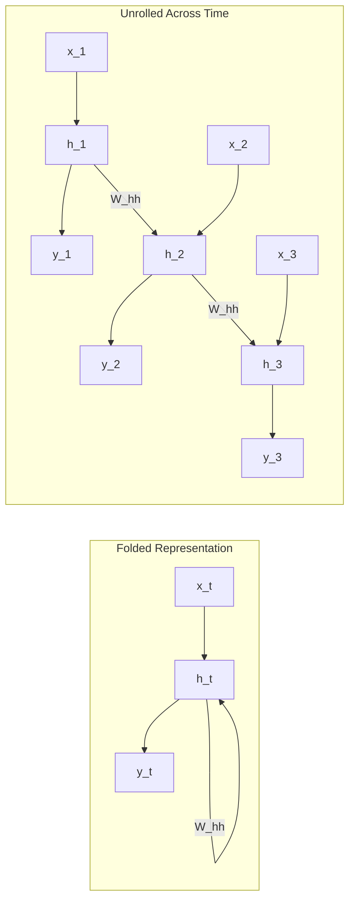
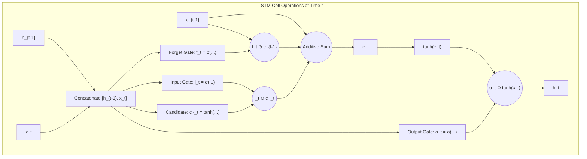
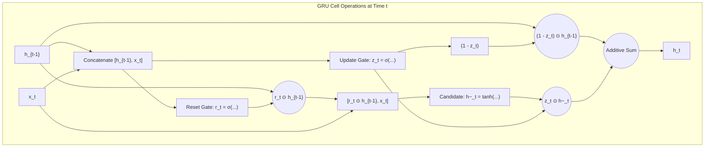
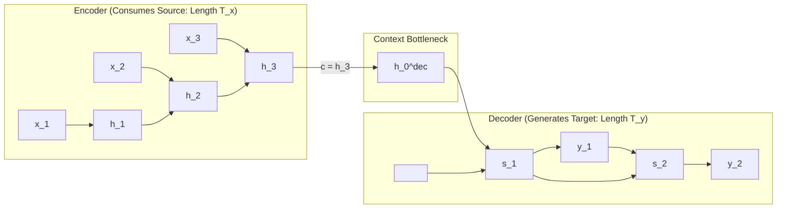

# W09: Sequence Models

## Sequence Models and Recurrent Architectures

Feedforward and convolutional networks operate on the assumption of independent, identically distributed instances with fixed-dimensional inputs. Real-world tasks such as natural language processing, speech recognition, financial forecasting, and computational biology process sequential data where ordering, temporal context, and variable lengths dictate semantic meaning. Recurrent architectures resolve these challenges by maintaining internal hidden states that persist information across time steps through cyclical feedback loops. Analyzing the mathematical formulations of Recurrent Neural Networks (RNNs), Long Short-Term Memory (LSTM) cells, Gated Recurrent Units (GRUs), and sequence-to-sequence mappings provides the theoretical framework for modeling temporal dependencies.

## Foundations of Sequential Processing

### The Nature of Temporal and Sequential Data

- Sequential data consists of ordered tokens or vectors where the semantic value of coordinate $t$ depends directly on historical context:
  $$X = (x_1, x_2, \dots, x_T), \quad x_t \in \mathbb{R}^D$$
- The sequence length $T$ is generally non-uniform across samples within a dataset.
- Sequential distributions violate standard Markov assumptions: long-range semantic relationships require information to persist across dozens or hundreds of intervening time steps.

### Why Feedforward and Convolutional Networks Fail on Sequences

- **Fixed-Dimensional Inputs:** Standard MLPs require input vectors of rigid dimension $N$; handling variable sequence lengths requires artificial truncation or zero-padding that discards information or wastes compute.
- **Absence of Shared Temporal Memory:** An MLP cannot share parameters across time steps; a word appearing at index 1 is evaluated with entirely different weights than the identical word appearing at index 10.
- **Finite Context Receptive Fields:** While 1D convolutions process local sequence windows, capturing long-range dependencies requires stacking deep dilated layers, which increases latency and parameter volume.

### Sequence Mapping Taxonomies

- Sequence processing encompasses five distinct structural input-to-output topologies:
  - **One-to-One:** Standard non-sequential classification (fixed vector to fixed class).
  - **One-to-Many:** An individual non-sequential input maps to an ordered sequence (e.g., Image Captioning: image $\to$ sequence of descriptive words).
  - **Many-to-One:** An input sequence compresses into a single stationary prediction (e.g., Sentiment Analysis: text reviews $\to$ binary sentiment scalar).
  - **Many-to-Many (Synchronized):** Real-time sequence alignment where an output token is generated for every input token (e.g., Video Frame Classification, Part-of-Speech Tagging).
  - **Many-to-Many (Asynchronous / Delayed):** An input sequence is consumed entirely before generating an output sequence of different length (e.g., Machine Translation: English sentence $\to$ French sentence).

> [!Important]
> **Sequential processing requires dynamic temporal memory**: feedforward networks fail on sequences because they enforce static input dimensions, lack temporal parameter sharing, and cannot maintain long-range state across time.

## Vanilla Recurrent Neural Networks

### The Recurrent State Equation

- A standard **Recurrent Neural Network (RNN)** maintains an internal **hidden state vector** $h_t \in \mathbb{R}^H$ that acts as dynamic working memory.
- At time step $t$, the network receives input vector $x_t \in \mathbb{R}^D$ and the previous hidden state $h_{t-1}$, computing the updated hidden representation via an affine transformation followed by a hyperbolic tangent activation:
  $$h_t = \tanh(W_{hh} h_{t-1} + W_{xh} x_t + b_h)$$
  where $W_{hh} \in \mathbb{R}^{H \times H}$ is the recurrent transition weight matrix, $W_{xh} \in \mathbb{R}^{H \times D}$ is the input-to-hidden weight matrix, and $b_h \in \mathbb{R}^H$ is the hidden bias vector.
- The model computes an optional output prediction $\hat{y}_t$ by projecting the current hidden state:
  $$\hat{y}_t = g(W_{hy} h_t + b_y)$$
  where $W_{hy} \in \mathbb{R}^{K \times H}$ is the hidden-to-output matrix, and $g(\cdot)$ is an output activation (such as Softmax).

### Temporal Parameter Sharing

- An RNN applies the identical parameter matrices ($W_{hh}, W_{xh}, W_{hy}$) and biases across every time step $t \in \{1, \dots, T\}$.
- Temporal parameter sharing enables the network to process sequences of arbitrary length without allocating new weights for longer inputs.
- Shared parameters allow the model to recognize temporal patterns regardless of where they appear within the sequence duration.

### Backpropagation Through Time (BPTT)

- Training an RNN requires unrolling the computational graph across all $T$ operational time steps.
- The total loss $\mathcal{L}$ evaluates as the sum of step-wise losses:
  $$\mathcal{L} = \sum_{t=1}^T \mathcal{L}_t(\hat{y}_t, y_t)$$
- Computing the gradient with respect to the recurrent matrix $W_{hh}$ requires applying the multivariate chain rule backward across time:
  $$\frac{\partial \mathcal{L}}{\partial W_{hh}} = \sum_{t=1}^T \sum_{k=1}^t \frac{\partial \mathcal{L}_t}{\partial h_t} \left( \frac{\partial h_t}{\partial h_k} \right) \frac{\partial h_k}{\partial W_{hh}}$$
- The Jacobian chain linking step $t$ to earlier step $k$ evaluates as a matrix product:
  $$\frac{\partial h_t}{\partial h_k} = \prod_{j=k+1}^t \frac{\partial h_j}{\partial h_{j-1}} = \prod_{j=k+1}^t W_{hh}^T \text{diag}(1 - h_j^2)$$

### The Mathematical Cause of Vanishing and Exploding Gradients

- The temporal Jacobian product $\prod_{j=k+1}^t W_{hh}^T \text{diag}(1 - h_j^2)$ compounds exponentially over temporal distance $(t - k)$:
  - **Vanishing Gradients:** Because the derivative of Tanh satisfies $|\tanh'(z)| \le 1.0$, if the spectral radius of $W_{hh}$ satisfies $\rho(W_{hh}) < 1.0$, the gradient norm decays to machine zero: $\lim_{t - k \to \infty} \left\| \frac{\partial h_t}{\partial h_k} \right\| = 0$.
  - **Exploding Gradients:** If $\rho(W_{hh}) > 1.0$, error signals compound exponentially toward infinity, triggering floating-point overflow and `NaN` parameter divergence.
- Because of vanishing gradients, vanilla RNNs suffer from **exponential forgetting**, making them incapable of learning dependencies that span more than 10 to 15 time steps.

> [!Tip]
> **Vanilla RNNs suffer from exponential forgetting**: multiplying by the recurrent transition matrix $W_{hh}^T$ at every step causes backpropagated error signals to decay exponentially, restricting learning to short, localized contexts.

## Gated Memory: Long Short-Term Memory

### The Constant Error Carousel and Additive Cell State

- Formulated by Sepp Hochreiter and Jürgen Schmidhuber (1997), **Long Short-Term Memory (LSTM)** eliminates vanishing gradients by separating memory storage from hidden feature representation.
- The LSTM introduces an explicit **cell state** vector $c_t \in \mathbb{R}^H$ that functions as a linear memory conveyor belt.
- While the hidden state $h_t$ undergoes non-linear projections at each step, the cell state updates primarily through **linear additive operations**, establishing a **Constant Error Carousel (CEC)** that preserves gradient signals across hundreds of steps.

### Gating Equations: Forget, Input, and Output Gates

- An LSTM regulates the flow of information using three parameterized **multiplicative gates** that use Sigmoid activations ($\sigma(z) \in [0, 1]$):
  1. **Forget Gate ($f_t$):** Controls what proportion of the previous cell state $c_{t-1}$ to discard:
     $$f_t = \sigma(W_f \cdot [h_{t-1}, x_t] + b_f)$$
  2. **Input Gate ($i_t$):** Controls which coordinates of the candidate memory to write into the cell state:
     $$i_t = \sigma(W_i \cdot [h_{t-1}, x_t] + b_i)$$
  3. **Candidate Memory ($\tilde{c}_t$):** Generates new candidate feature values using a Tanh activation:
     $$\tilde{c}_t = \tanh(W_c \cdot [h_{t-1}, x_t] + b_c)$$
  4. **Cell State Update ($c_t$):** Combines the gated historical memory with the gated candidate update via addition:
     $$c_t = f_t \odot c_{t-1} + i_t \odot \tilde{c}_t$$
  5. **Output Gate ($o_t$):** Controls which parts of the internal cell state to expose as the external hidden state:
     $$o_t = \sigma(W_o \cdot [h_{t-1}, x_t] + b_o)$$
     $$h_t = o_t \odot \tanh(c_t)$$

### Uninterrupted Gradient Highways in the Cell State

- Differentiating the cell state update with respect to the previous cell state yields:
  $$\frac{\partial c_t}{\partial c_{t-1}} = f_t$$
- The backpropagated error signal along the cell state path evaluates as:
  $$\frac{\partial \mathcal{L}}{\partial c_k} = \frac{\partial \mathcal{L}}{\partial c_t} \left( \prod_{j=k+1}^t f_j \right)$$
- If the network learns to keep the forget gate open ($f_j \approx 1.0$), the gradient flows backward across arbitrary temporal distances without exponential decay, eliminating the vanishing gradient problem.

> [!Important]
> **Additive cell states eliminate vanishing gradients**: because the cell state updates linearly ($c_t = f_t \odot c_{t-1} + i_t \odot \tilde{c}_t$), the backward gradient derivative is scaled directly by the forget gate $f_t$, preserving error signals across hundreds of steps.

## Computational Streamlining: Gated Recurrent Units

### Merging Hidden and Cell States

- Proposed by Kyunghyun Cho et al. (2014), the **Gated Recurrent Unit (GRU)** streamlines the LSTM architecture by merging the cell state and hidden state into a single representation vector $h_t \in \mathbb{R}^H$.
- The GRU removes the separate memory conveyor belt, retaining gated control while reducing structural complexity and memory footprint.

### Reset and Update Gate Mechanics

- The GRU regulates information flow using two internal gates:
  1. **Reset Gate ($r_t$):** Determines how much of the previous hidden state to ignore when computing candidate activations:
     $$r_t = \sigma(W_r \cdot [h_{t-1}, x_t] + b_r)$$
  2. **Update Gate ($z_t$):** Acts simultaneously as a forget gate and an input gate, balancing past memory retention against new candidate integration:
     $$z_t = \sigma(W_z \cdot [h_{t-1}, x_t] + b_z)$$
  3. **Candidate Hidden State ($\tilde{h}_t$):** Uses the reset gate to selectively forget historical context:
     $$\tilde{h}_t = \tanh(W \cdot [r_t \odot h_{t-1}, \; x_t] + b)$$
  4. **Hidden State Interpolation ($h_t$):** Executes a convex linear combination between the previous state and the candidate state:
     $$h_t = (1 - z_t) \odot h_{t-1} + z_t \odot \tilde{h}_t$$

### Parameter and Computational Efficiency Versus LSTM

- An LSTM block contains four parameterized linear projections ($W_f, W_i, W_c, W_o$), allocating $4 \times (H \cdot (D + H + 1))$ parameters.
- A GRU block contains three parameterized linear projections ($W_r, W_z, W$), allocating $3 \times (H \cdot (D + H + 1))$ parameters.
- The GRU achieves an exact **25% reduction in parameter count** relative to an LSTM with identical hidden dimensions, accelerating forward and backward passes while requiring less memory to store intermediate activations.

> [!Tip]
> **GRUs achieve 25% parameter savings**: combining forget and input operations into a coupled update gate ($z_t$) allows GRUs to match LSTM long-range accuracy while training faster on small to medium datasets.

## Advanced Sequential Topologies

### Bidirectional Recurrent Networks (BiRNNs)

- Standard unidirectional recurrent models process sequences chronologically ($t = 1 \to T$), meaning hidden state $h_t$ contains context strictly from the past: $x_1, \dots, x_t$.
- In tasks like speech transcription, named entity recognition, and protein sequencing, the semantic meaning of token $t$ depends equally on subsequent future tokens ($x_{t+1}, \dots, x_T$).
- **Bidirectional Recurrent Neural Networks (BiRNNs)** process inputs through two independent recurrent hidden layers running in opposite directions:
  - **Forward Recurrent Pass:** Computes $\vec{h}_t = \text{RNN}_{\text{fwd}}(x_t, \vec{h}_{t-1})$ from $t = 1$ to $T$.
  - **Backward Recurrent Pass:** Computes $\overleftarrow{h}_t = \text{RNN}_{\text{bwd}}(x_t, \overleftarrow{h}_{t+1})$ from $t = T$ to $1$.
- The final representation concatenates both directional states at each time step:
  $$h_t^{\text{bi}} = \left[ \vec{h}_t \; ; \; \overleftarrow{h}_t \right] \in \mathbb{R}^{2H}$$

### Deep Stacked Recurrent Networks

- While standard recurrent models unroll across time, they remain shallow along the vertical spatial dimension ($L=1$).
- **Deep (Stacked) RNNs** place multiple recurrent layers vertically: the hidden sequence $h^{[1]} = (h_1^{[1]}, \dots, h_T^{[1]})$ generated by layer 1 serves as the input sequence for layer 2:
  $$h_t^{[l]} = \text{RNN}^{[l]}\left( h_t^{[l-1]}, \; h_{t-1}^{[l]} \right)$$
- Stacking layers allows early recurrent stages to extract low-level temporal features (such as acoustic pitches or phonemes), while deeper layers capture abstract semantic context.
- Stacking beyond 3 to 4 recurrent layers exacerbates vanishing gradients along the vertical axis, requiring residual connections between stacked recurrent tiers.

### The Sequence-to-Sequence Encoder-Decoder Architecture

- Developed by Ilya Sutskever et al. and Kyunghyun Cho et al. (2014), the **Sequence-to-Sequence (Seq2Seq)** framework maps an input sequence of length $T_x$ to an output sequence of different length $T_y$.
- **The Encoder:** Processes input sequence $(x_1, \dots, x_{T_x})$ sequentially, discarding step-wise outputs and retaining the final hidden state $h_{T_x}$ as a fixed-length **context vector** $c$:
  $$c = h_{T_x}^{\text{enc}}$$
- **The Decoder:** An independent recurrent network initialized with context vector $h_0^{\text{dec}} = c$. The decoder generates the output sequence $(y_1, \dots, y_{T_y})$ autoregressively, feeding its own previous prediction $\hat{y}_{t-1}$ as the input for time step $t$.

### The Fixed-Length Information Bottleneck

- The standard Seq2Seq architecture forces the encoder to compress an arbitrary-length input sequence into a solitary, fixed-size vector $c \in \mathbb{R}^H$.
- As input sequences exceed 20 to 30 tokens, the context vector encounters an **information bottleneck**, overflowing its representational capacity and causing translation accuracy to degrade sharply.
- This fundamental bottleneck exposed the limits of fixed-vector recurrent representations, prompting the development of the **Attention Mechanism**.

> [!Tip]
> **The Seq2Seq bottleneck motivated attention**: forcing an entire sequence into a single fixed vector $c$ causes catastrophic information loss on long sequences, setting the stage for attention-based alignment.

## Comparative Matrix of Recurrent Architectures

| Recurrent Architecture | Memory State Representation | Gating Primitives | Parameter Scaling Count | Gradient Flow Mechanism | Primary Operational Advantage |
|---|---|---|---|---|---|
| **Vanilla RNN** | Solitary hidden state: $h_t \in \mathbb{R}^H$ | None (static affine transformation) | $H \cdot (D + H + 1)$ | Repeated multiplicative transition ($W_{hh}^T$) | Minimal compute and parameters; fast on short contexts |
| **LSTM** | Dual state: Hidden $h_t$ + Cell $c_t$ | Three gates: Forget ($f_t$), Input ($i_t$), Output ($o_t$) | $4 \times H \cdot (D + H + 1)$ | Additive linear cell highway ($c_t = f_t \odot c_{t-1} + \dots$) | Eliminates vanishing gradients; models 100+ time steps |
| **GRU** | Solitary hidden state: $h_t \in \mathbb{R}^H$ | Two gates: Reset ($r_t$), Update ($z_t$) | $3 \times H \cdot (D + H + 1)$ | Coupled convex interpolation ($h_t = (1-z_t)h_{t-1} + z_t\tilde{h}_t$) | 25% fewer parameters than LSTM; faster training convergence |
| **Bidirectional LSTM** | Dual directional hidden states: $[\vec{h}_t ; \overleftarrow{h}_t]$ | Forward and backward LSTM cell banks | $2 \times \text{Params}_{\text{LSTM}}$ | Dual independent additive cell state highways | Accesses past and future temporal context simultaneously |

> [!Important]
> **Select recurrent models based on temporal depth**: use GRUs for faster convergence on medium-length sequences, LSTMs for complex long-range dependencies, and Bidirectional variants when full sequence context is available.

## Key Takeaways

- **Recurrent models process variable-length sequences** by applying shared weight transformations across time steps while maintaining an internal hidden memory vector.
- **Vanilla RNNs suffer from vanishing gradients** caused by compounding multiplications across the recurrent transition matrix ($W_{hh}^T$), limiting their effective memory to short sequences.
- **LSTMs solve vanishing gradients using an additive cell state** ($c_t$), which acts as a linear conveyor belt governed by forget, input, and output gates.
- **The constant error carousel in LSTMs** ensures that when forget gates remain open ($f_t \approx 1.0$), backpropagated error signals travel across hundreds of steps without exponential decay.
- **GRUs streamline the LSTM cell by 25%**, merging the cell and hidden states into a single vector governed by coupled reset and update gates.
- **Bidirectional RNNs process sequences in forward and backward directions concurrently**, providing downstream layers with simultaneous past and future temporal context.
- **Deep stacked RNNs scale representational capacity vertically**, passing hidden sequences through multiple hierarchical recurrent layers.
- **The Seq2Seq encoder-decoder bottleneck** compresses entire input sequences into a single fixed-length vector, causing performance degradation on long sequences and motivating the attention mechanism.

> [!Tip]
> The foundational principle of recurrent sequence modeling: **linear additive state updates preserve long-range gradients**; while multiplicative recurrent projections cause exponential signal collapse, gating mechanisms allow neural networks to regulate and preserve temporal dependencies across extended horizons.
