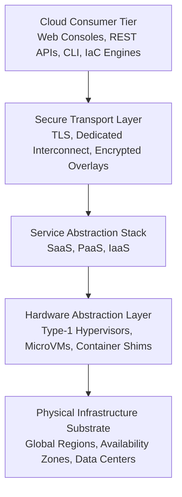
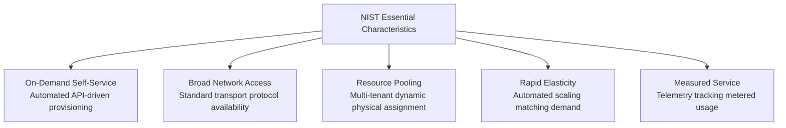
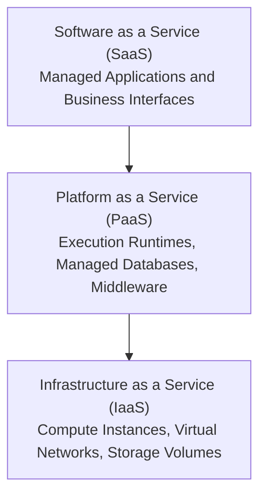
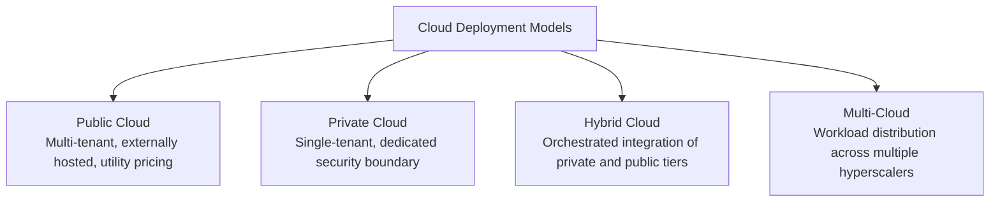
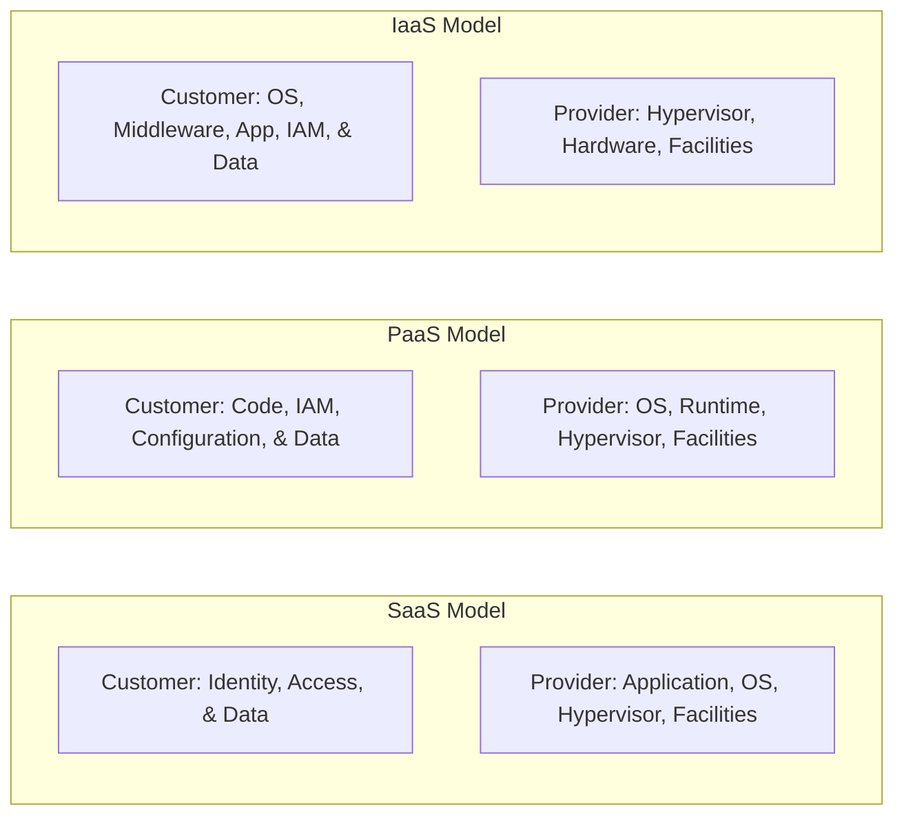
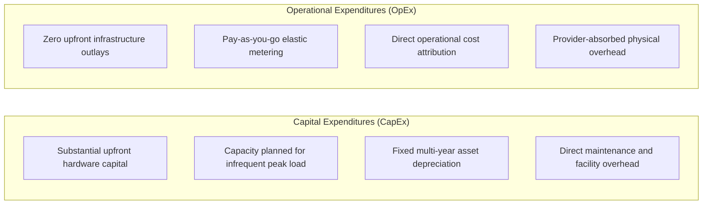
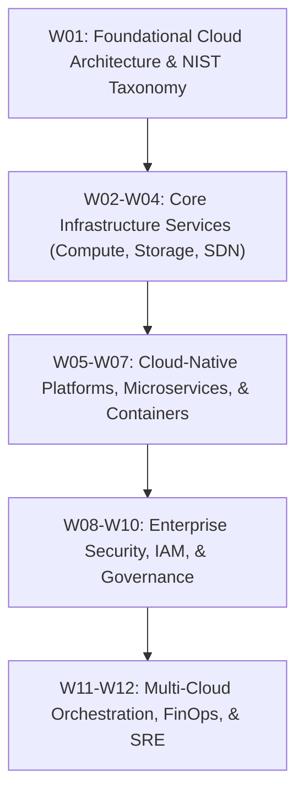

# **Lesson 0: Module Introduction**

Cloud computing represents a structural shift from localized, capital-intensive IT infrastructure toward utility-driven, distributed resource provisioning. By abstracting physical hardware into dynamically scheduled virtual assets, cloud platforms deliver elastic scaling, multi-tenant isolation, and automated service orchestration. Mastering the architectural taxonomies, service boundaries, and governance demarcations defined by the National Institute of Standards and Technology provides the foundational blueprint for designing scalable cloud systems.

## **The Cloud Computing Paradigm and NIST Architectural Framework**

### Core Architectural Definition

- The **NIST SP 800-145** standard defines cloud computing as an architectural model enabling ubiquitous, convenient, on-demand network access to a shared pool of configurable computing resources.
- Resource allocation proceeds through automated software control planes that provision and release systems with minimal management effort or direct service provider intervention.
- The computing environment relies on virtualization and containerization abstractions to decouple software workloads from underlying bare-metal constraints.

### The Five Essential Characteristics

- **On-Demand Self-Service**: Consumers provision computing capabilities, such as server uptime, network endpoints, and storage volumes, programmatically without human intervention from the provider.
- **Broad Network Access**: Services are accessible over standard network topologies through unified protocols that support heterogeneous client platforms, including workstations, mobile devices, and automated microservices.
- **Resource Pooling**: Physical and virtual compute elements are dynamically aggregated into multi-tenant pools, assigning and reallocating capacity according to client demand with complete physical hardware abstraction.
- **Rapid Elasticity**: Capabilities scale outward and inward automatically to track real-time workload fluctuations, providing consumers with the operational effect of unlimited capacity.
- **Measured Service**: Metering infrastructure continuously instruments and reports resource utilization at granular thresholds, delivering transparent cost allocation and billing auditability.

> [!Important]
> **Virtualization boundary separation**: Virtualization alone does not constitute cloud computing; virtualized systems require automated self-service APIs, pooled multi-tenancy, dynamic elasticity, and metered accounting to satisfy foundational architectural requirements.

## **Cloud Service Delivery Models: The SPI Framework**

The cloud service delivery taxonomy divides architectural responsibilities into three distinct tiers: Infrastructure as a Service, Platform as a Service, and Software as a Service.

### Infrastructure as a Service (IaaS)

- **IaaS Primitives**: Delivers raw computing abstractions, including virtualized compute instances, software-defined networks, firewalls, and block or object storage systems.
- **Provider Boundaries**: The hyperscaler manages physical data center security, environmental mechanics, physical host units, storage area networks, and hypervisor execution.
- **Consumer Ownership**: The tenant retains authority over guest operating systems, kernel patching, middleware runtimes, networking rules, security parameters, and application logic.

### Platform as a Service (PaaS)

- **PaaS Primitives**: Delivers managed execution layers, pre-configured application runtimes, automated continuous deployment environments, and serverless compute engines.
- **Provider Boundaries**: The cloud vendor manages physical infrastructure, hypervisors, operating system maintenance, vulnerability patching, runtime updates, and baseline scaling mechanics.
- **Consumer Ownership**: The tenant focuses entirely on application code development, schema definitions, service configuration variables, and persistent data assets.

### Software as a Service (SaaS)

- **SaaS Primitives**: Delivers fully developed, end-user applications hosted, maintained, and operated centrally across remote infrastructure.
- **Provider Boundaries**: The provider assumes complete operational control over infrastructure, operating systems, application updates, fault tolerance, and system scalability.
- **Consumer Ownership**: The user retains responsibility only for tenant-specific configuration settings, administrative policies, and role-based access management.

> [!Tip]
> **Balancing abstraction and control**: Moving upward from IaaS to PaaS or SaaS accelerates application delivery velocity by removing operational overhead, but it proportionally reduces low-level network customization and operating system governance.

## **Cloud Deployment Topologies**

Deployment models dictate the physical ownership, isolation mechanisms, and network proximity of cloud environments.

### Public Cloud

- Delivers multi-tenant computational infrastructure owned and managed by third-party hyperscalers.
- Leverages hyperscale hardware distribution to achieve extensive economies of scale, dynamic elasticity, and high regional redundancy without capital infrastructure outlays.

### Private Cloud

- Allocates dedicated computing infrastructure strictly to a single enterprise organization.
- Provides absolute control over regulatory compliance, hardware isolation, network topologies, and sensitive data access, while requiring ongoing capital and operational investment.

### Hybrid Cloud

- Interconnects at least one private infrastructure environment with one or more public cloud domains through secure networking overlays, such as IPsec VPN tunnels or dedicated optical cross-connects.
- Supports workload portability, dynamic cloud-bursting during computational spikes, and regulatory isolation of sensitive data tiers.

### Multi-Cloud

- Deploys discrete workloads or distributed microservices across multiple competing public cloud providers.
- Mitigates vendor lock-in risks, optimizes infrastructure expenditure through cross-vendor cost evaluation, and provides access to proprietary vendor-specific platform capabilities.

> [!Important]
> **Hybrid network integrity**: Hybrid architectures require high-throughput, low-latency interconnects with deterministic routing policies to prevent distributed state inconsistencies across private and public boundaries.

## **The Shared Responsibility Model and Security Governance**

Operational security and system reliability are shared responsibilities divided between the cloud service provider and the cloud tenant based on the chosen deployment layer.

### Division of Security Controls

- **Security OF the Cloud (Provider Mandate)**: The provider assumes strict accountability for the physical facilities, power redundancy, host servers, network cabling, storage media destruction, and hypervisor isolation boundaries.
- **Security IN the Cloud (Customer Mandate)**: The customer manages the confidentiality, integrity, and availability of assets deployed within the infrastructure. This includes Identity and Access Management (IAM), access key lifecycles, operating system patch levels, firewall rules, and application security.

### Responsibility Demarcation Matrix

| Architectural Subsystem | On-Premises | IaaS | PaaS | SaaS |
|---|---|---|---|---|
| **Data Governance & Classification** | Customer | Customer | Customer | Customer |
| **Client Access & IAM Policies** | Customer | Customer | Customer | Customer |
| **Application Logic & Code** | Customer | Customer | Customer | Provider |
| **Runtimes & Middleware** | Customer | Customer | Provider | Provider |
| **Guest Operating System** | Customer | Customer | Provider | Provider |
| **Virtualization & Hypervisor** | Customer | Provider | Provider | Provider |
| **Physical Compute, Storage, & Networking** | Customer | Provider | Provider | Provider |
| **Facility Security & Environmental Controls**| Customer | Provider | Provider | Provider |

> [!Tip]
> **Data ownership remains absolute**: Tenants retain sole liability for data protection, cryptographic key lifecycles, and access control policies across every service tier, including SaaS.

## **Financial Architecture: CapEx Versus OpEx Dynamics**

The transition to utility computing fundamentally restructures enterprise financial mechanics by replacing fixed depreciation schedules with dynamic operational tracking.

- **Capital Expenditures (CapEx)**: Demands substantial upfront capital investments to procure physical server racks, SAN devices, network switches, cooling infrastructure, and disaster recovery sites. Organizations over-provision capacity to handle theoretical peak demands, leaving hardware underutilized during normal operational cycles.
- **Operational Expenditures (OpEx)**: Consumes resources as metered operational utilities. Financial commitments map dynamically to real-time workload usage, eliminating sunk costs, simplifying financial forecasting, and enabling agile project funding.
- **Total Cost of Ownership (TCO)**: Comprehensive cloud financial engineering balances instance runtime fees against secondary on-premises savings, including retired real estate, reduced electrical footprints, eliminated hardware support contracts, and minimized administrative overhead.

> [!Important]
> **Uncontrolled elasticity risks expenditure inflation**: Elastic cloud resources can drive unanticipated operational budget overruns without automated budget alerting, programmatic billing guardrails, and automated resource shutdown policies.

## **Comparative Matrix of Cloud Delivery and Deployment Models**

| Model Type | Abstraction Primitive | Administrative Friction | Elasticity Velocity | Operational Flexibility | Primary Cost Driver |
|---|---|---|---|---|---|
| **IaaS** | Virtual machine, block volume, VPC | High (manual OS maintenance) | Minutes (VM bootstrap cycles) | Maximum low-level control | Instance uptime hours, allocated storage capacity |
| **PaaS** | Application code, containers, managed runtime | Low (provider handles OS) | Seconds (runtime auto-scaling) | Constrained to runtime specifications | Compute execution units, memory allocation, request counts |
| **SaaS** | Complete application interface, APIs | Minimal (administrative settings) | Instantaneous (vendor managed) | Strict interface constraints | Active user licenses, transaction consumption volumes |
| **Public** | Shared regional hyperscaler capacity | Low (fully automated APIs) | Dynamic (virtually unbounded) | High architectural standardization | Metered egress bandwidth, provisioned capacity |
| **Private** | Dedicated enterprise hardware pools | High (internal operations) | Constrained by procurement | Maximum hardware customization | Amortized hardware, data center operational costs |
| **Hybrid** | Interconnected heterogeneous nodes | High (cross-environment policies)| Variable across tiers | High deployment versatility | Direct Connect circuits, egress transit charges |

## **Module Roadmap and Competency Framework**

This course is structured as a sequential progression from virtualization primitives to distributed enterprise orchestration.

- **W01: Foundational Cloud Architecture & NIST Taxonomy**: Deconstructs foundational distributed models, economic drivers, virtualization primitives, and utility compute metrics.
- **W02-W04: Core Infrastructure Services**: Analyzes software-defined networks, software-defined storage (block, file, object), and scalable compute abstractions.
- **W05-W07: Cloud-Native Platforms, Microservices, & Containers**: Focuses on container engines, Kubernetes orchestration frameworks, and serverless execution models.
- **W08-W10: Enterprise Security, IAM, & Governance**: Implements zero-trust networks, cryptographically enforced identity systems, and audit frameworks.
- **W11-W12: Multi-Cloud Orchestration, FinOps, & SRE**: Develops multi-region disaster recovery models, Site Reliability Engineering observability practices, and infrastructure-as-code automation.

## **Key Takeaways**

- **Cloud computing is defined by operational characteristics**: Adherence to the NIST framework requires on-demand self-service, broad network access, multi-tenant resource pooling, rapid elasticity, and transparently measured service.
- **The SPI framework defines operational boundaries**: Moving from IaaS to PaaS and SaaS delegates underlying infrastructure control to the provider while shifting customer focus toward software engineering.
- **The Shared Responsibility Model governs operations**: Hyperscalers protect the security *of* the cloud, while consumers maintain absolute accountability for the data, configurations, and identities *in* the cloud.
- **Financial structures transition from CapEx to OpEx**: Utility-based resource billing converts large, speculative hardware purchases into metered operational expenditures that track application demand.
- **Deployment topologies resolve distinct operational trade-offs**: Engineering choices between public, private, hybrid, and multi-cloud models balance regulatory sovereignty, network latency, system control, and operational complexity.
- **Cloud engineering requires software-defined automation**: Treating modern infrastructure as dynamic, programmatic, and ephemeral code constructs is necessary to build resilient, fault-tolerant enterprise platforms.

> [!Important]
> **Cloud architecture treats infrastructure as software**: Modern cloud engineering avoids manual resource provisioning in favor of programmatic, automated, and declarative configuration models that ensure continuous system reliability and scalability.
