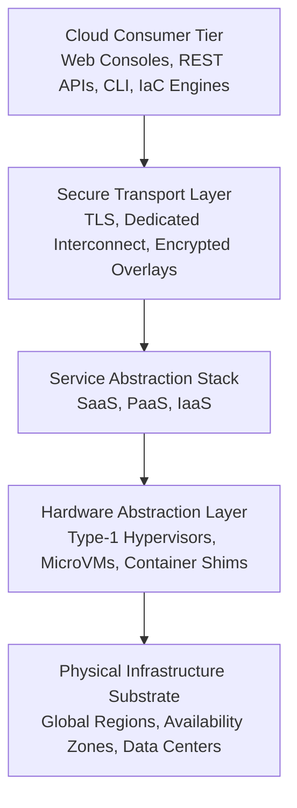
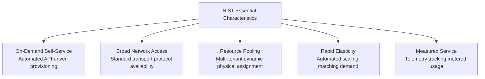
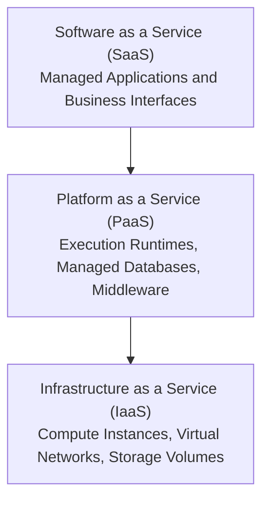
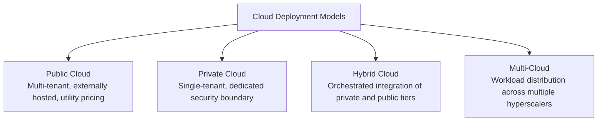

# Migration in progress
# **Lesson 0: Module Introduction**

Cloud computing represents a structural shift from localized, capital-intensive IT infrastructure toward utility-driven, distributed resource provisioning. By abstracting physical hardware into dynamically scheduled virtual assets, cloud platforms deliver elastic scaling, multi-tenant isolation, and automated service orchestration. Mastering the architectural taxonomies, service boundaries, and governance demarcations defined by the National Institute of Standards and Technology provides the foundational blueprint for designing scalable cloud systems.



## **The Cloud Computing Paradigm and NIST Architectural Framework**

### Core Architectural Definition

- The **NIST SP 800-145** standard defines cloud computing as an architectural model enabling ubiquitous, convenient, on-demand network access to a shared pool of configurable computing resources.
- Resource allocation proceeds through automated software control planes that provision and release systems with minimal management effort or direct service provider intervention.
- The computing environment relies on virtualization and containerization abstractions to decouple software workloads from underlying bare-metal constraints.

### The Five Essential Characteristics



- **On-Demand Self-Service**: Consumers provision computing capabilities, such as server uptime, network endpoints, and storage volumes, programmatically without human intervention from the provider.
- **Broad Network Access**: Services are accessible over standard network topologies through unified protocols that support heterogeneous client platforms, including workstations, mobile devices, and automated microservices.
- **Resource Pooling**: Physical and virtual compute elements are dynamically aggregated into multi-tenant pools, assigning and reallocating capacity according to client demand with complete physical hardware abstraction.
- **Rapid Elasticity**: Capabilities scale outward and inward automatically to track real-time workload fluctuations, providing consumers with the operational effect of unlimited capacity.
- **Measured Service**: Metering infrastructure continuously instruments and reports resource utilization at granular thresholds, delivering transparent cost allocation and billing auditability.

> [!Important]
> **Virtualization boundary separation**: Virtualization alone does not constitute cloud computing; virtualized systems require automated self-service APIs, pooled multi-tenancy, dynamic elasticity, and metered accounting to satisfy foundational architectural requirements.

## **Cloud Service Delivery Models: The SPI Framework**

The cloud service delivery taxonomy divides architectural responsibilities into three distinct tiers: Infrastructure as a Service, Platform as a Service, and Software as a Service.



### Infrastructure as a Service (IaaS)

- **IaaS Primitives**: Delivers raw computing abstractions, including virtualized compute instances, software-defined networks, firewalls, and block or object storage systems.
- **Provider Boundaries**: The hyperscaler manages physical data center security, environmental mechanics, physical host units, storage area networks, and hypervisor execution.
- **Consumer Ownership**: The tenant retains authority over guest operating systems, kernel patching, middleware runtimes, networking rules, security parameters, and application logic.

### Platform as a Service (PaaS)

- **PaaS Primitives**: Delivers managed execution layers, pre-configured application runtimes, automated continuous deployment environments, and serverless compute engines.
- **Provider Boundaries**: The cloud vendor manages physical infrastructure, hypervisors, operating system maintenance, vulnerability patching, runtime updates, and baseline scaling mechanics.
- **Consumer Ownership**: The tenant focuses entirely on application code development, schema definitions, service configuration variables, and persistent data assets.

### Software as a Service (SaaS)

- **SaaS Primitives**: Delivers fully developed, end-user applications hosted, maintained, and operated centrally across remote infrastructure.
- **Provider Boundaries**: The provider assumes complete operational control over infrastructure, operating systems, application updates, fault tolerance, and system scalability.
- **Consumer Ownership**: The user retains responsibility only for tenant-specific configuration settings, administrative policies, and role-based access management.

> [!Tip]
> **Balancing abstraction and control**: Moving upward from IaaS to PaaS or SaaS accelerates application delivery velocity by removing operational overhead, but it proportionally reduces low-level network customization and operating system governance.

## **Cloud Deployment Topologies**

Deployment models dictate the physical ownership, isolation mechanisms, and network proximity of cloud environments.



### Public Cloud

- Delivers multi-tenant computational infrastructure owned and managed by third-party hyperscalers.
- Leverages hyperscale hardware distribution to achieve extensive economies of scale, dynamic elasticity, and high regional redundancy without capital infrastructure outlays.

### Private Cloud

- Allocates dedicated computing infrastructure strictly to a single enterprise organization.
- Provides absolute control over regulatory compliance, hardware isolation, network topologies, and sensitive data access, while requiring ongoing capital and operational investment.

### Hybrid Cloud

- Interconnects at least one private infrastructure environment with one or more public cloud domains through secure networking overlays, such as IPsec VPN tunnels or dedicated optical cross-connects.
- Supports workload portability, dynamic cloud-bursting during computational spikes, and regulatory isolation of sensitive data tiers.

### Multi-Cloud

- Deploys discrete workloads or distributed microservices across multiple competing public cloud providers.
- Mitigates vendor lock-in risks, optimizes infrastructure expenditure through cross-vendor cost evaluation, and provides access to proprietary vendor-specific platform capabilities.

> [!Important]
> **Hybrid network integrity**: Hybrid architectures require high-throughput, low-latency interconnects with deterministic routing policies to prevent distributed state inconsistencies across private and public boundaries.

## **The Shared Responsibility Model and Security Governance**

Operational security and system reliability are shared responsibilities divided between the cloud service provider and the cloud tenant based on the chosen deployment layer.

```mermaid
flowchart LR
    subgraph SaaS["SaaS Model"]
        directio