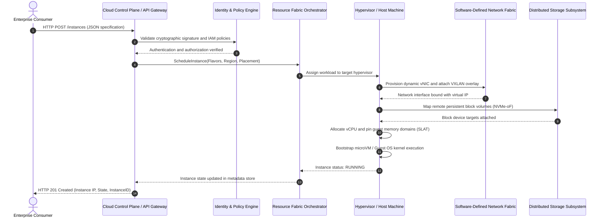
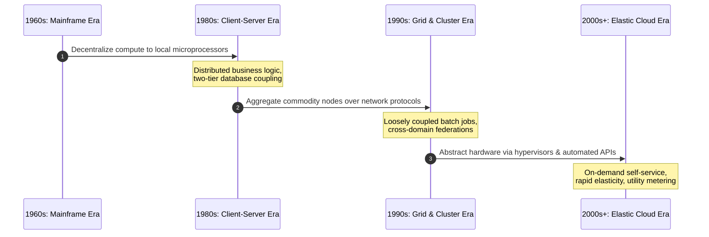
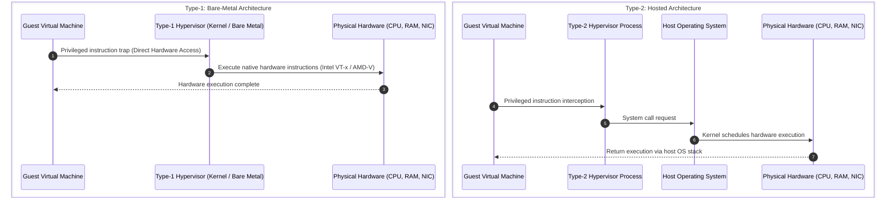
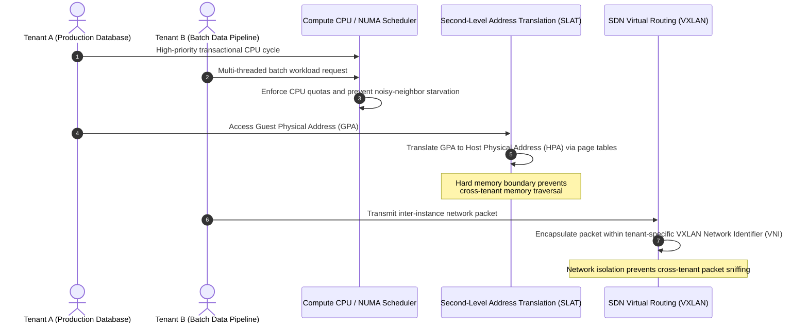

# **Lesson 1: Cloud Evolution & Fundamentals**

Cloud computing represents the convergence of multiple decades of evolutionary breakthroughs across distributed systems, hardware virtualization, and utility metering. From centralized mainframe time-sharing systems to modern dynamic hyperscale platforms, computing paradigms shifted from localized physical hardware ownership to elastic, software-defined execution environments. Understanding this evolutionary lineage and its underlying virtualization primitives provides the technical context required to engineer resilient, high-throughput cloud architectures.

## **The Evolutionary Lineage of Computing Paradigms**

### Mainframe Computing and Time-Sharing (1960s)

- *Mainframes* established centralized computation, relying on massive monolithic hardware to execute batch processing for financial ledgers, scientific calculations, and census registries.
- **Time-Sharing Systems** (such as Compatible Time-Sharing System and Multics) pioneered multi-user operation by executing rapid round-robin CPU scheduling across concurrent interactive terminals.
- Physical dumb terminals functioned strictly as human-machine input/output interfaces, offloading all storage and computation tasks directly to the centralized host.

### Client-Server Architecture (1980s)

- The emergence of low-cost microprocessors and personal computers decentralized computing capacity, distributing operational burdens between client machines and back-end servers.
- **Two-Tier and Multi-Tier Frameworks** divided system responsibilities into dedicated presentation layers, business logic components, and database storage tiers.
- High hardware costs, non-standard operating environments, and physical data center expansion created operational silos and low aggregate hardware utilization.

### Cluster and Grid Computing (1990s)

- **Cluster Computing** coupled homogeneous bare-metal servers using dedicated high-speed local area networks, combining commodity hardware to act as a unified, high-performance supercomputing cluster.
- **Grid Computing** extended distributed execution by federating geographically dispersed, heterogeneous computing nodes over public or wide-area networks to process batch-oriented scientific workloads.
- Rigid administrative barriers, lack of runtime virtualization, and complex inter-node synchronization protocols prevented grid frameworks from achieving dynamic commercial utility scale.

### Hardware Virtualization and Utility Computing (2000s)

- The commercialization of **x86 Hardware Virtualization** enabled a single physical host to securely isolate and execute multiple concurrent guest operating systems.
- *Utility Computing* models transformed compute from a static capital asset into a dynamically measured commodity, aligning with John McCarthy's 1961 prediction of computing as a public utility.
- Hypervisor orchestration platforms evolved into automated cloud control planes, formalizing the emergence of hyperscale infrastructure providers.

> [!Important]
> **Evolutionary drivers of cloud adoption**: Cloud platforms did not replace earlier distributed systems through isolated breakthroughs; they integrated time-sharing resource allocation, grid-scale distributed networking, and x86 hardware virtualization into a single automated control plane.

## **Virtualization Mechanics and Hypervisor Architectures**

Virtualization decouples software runtimes and guest operating systems from the underlying physical compute substrate. The engine driving this separation is the **Hypervisor** or **Virtual Machine Monitor (VMM)**.

### Type-1 (Bare-Metal) Hypervisors

- Deploy directly on the bare-metal hardware without an intermediate general-purpose host operating system.
- The hypervisor directly manages hardware devices, CPU execution rings, interrupt routing, and physical memory addressing.
- Deliver near-native execution throughput, minimal latency, and strict security isolation, serving as the standard virtualization engine for modern enterprise hyperscalers.
- Common implementations include KVM, VMware ESXi, and Xen.

### Type-2 (Hosted) Hypervisors

- Execute as user-space processes within a traditional host operating system.
- Hardware access relies on the host operating system kernel to translate, schedule, and dispatch instructions to physical silicon.
- Introduce latency and virtualization overhead due to double-scheduling cycles and nested system call boundaries.
- Common implementations include Oracle VirtualBox and VMware Workstation.

### Virtualization Execution Models

- **Full Virtualization**: The guest operating system remains unaware that it executes within an abstracted environment. The hypervisor binary-translates or hardware-intercepts sensitive non-virtualizable CPU instructions on the fly without modifying the guest kernel.
- **Paravirtualization**: The guest operating system kernel is explicitly modified to execute software hypercalls instead of raw privileged hardware instructions, reducing translation overhead at the cost of guest portability.
- **Hardware-Assisted Virtualization**: Physical CPUs integrate silicon-level instruction set extensions (such as Intel VT-x or AMD-V) that expose distinct operational states (Root and Non-Root modes), allowing unmodified guest operating systems to execute ring-0 privileged operations safely without emulation penalties.

> [!Tip]
> **Production hypervisor selection**: Deploy Type-1 bare-metal hypervisors utilizing hardware-assisted virtualization for low-latency production workloads to avoid the scheduling latency and memory bloat inherent to Type-2 host operating system layers.

## **Multi-Tenancy and Isolation Primitives**

Cloud scalability depends on *multi-tenancy*, an architectural design where a single set of physical resources simultaneously supports multiple logically segregated tenant environments without data leakage or performance interference.

### Compute Isolation

- **Virtual CPU (vCPU) Scheduling**: Hypervisors represent virtual processors as software threads dispatched onto physical CPU execution threads.
- Non-Uniform Memory Access (**NUMA**) affinity pinning binds specific vCPU clusters to co-located physical memory nodes, eliminating cross-socket bus contention.
- Hard real-time quotas and rate limiters constrain CPU usage, preventing misbehaving tenant workloads from consuming disproportionate CPU cycles (the *noisy neighbor* problem).

### Memory Isolation

- Hypervisors manage isolated address spaces using **Second-Level Address Translation (SLAT)**, known as Extended Page Tables (EPT) on Intel architectures and Nested Page Tables (NPT) on AMD architectures.
- The hardware translates Guest Virtual Addresses (GVA) to Guest Physical Addresses (GPA), and subsequently translates GPA to Host Physical Addresses (HPA).
- A guest operating system can access only the physical memory pages mapped explicitly to its tenant domain, preventing arbitrary cross-VM memory reads and writes.

### Network and Storage Isolation

- **Software-Defined Overlays**: Tenant network traffic is isolated using network encapsulation technologies like Virtual Extensible LAN (**VXLAN**) and Generic Network Virtualization Encapsulation (**GENEVE**). Traffic is tagged with a unique 24-bit Virtual Network Identifier (VNI), maintaining complete layer-2 and layer-3 separation over shared physical switches.
- **Storage Multi-Tenancy**: Distributed block storage fabrics enforce strict multi-tenant bandwidth throttling using token-bucket or leaky-bucket algorithms, guaranteeing provisioned Input/Output Operations Per Second (**IOPS**) and preventing cache saturation.

> [!Important]
> **Noisy neighbor mitigation**: Multi-tenant systems enforce strict quality of service (QoS) rate limits across compute, network bandwidth, and storage IOPS to ensure that resource exhaustion in one tenant container does not degrade adjacent workloads.

## **Comparative Matrix of Computing Paradigms**

| Dimension | Mainframe Architecture | Client-Server Architecture | Grid Computing | Modern Cloud Computing |
|---|---|---|---|---|
| **Resource Abstraction** | Physical machine partitioning | Discrete physical host nodes | Loosely coupled heterogeneous middleware | Elastic, software-defined virtualized instances |
| **Compute Location** | Centrally consolidated | Partially localized client processing | Globally dispersed participating nodes | Regionally clustered hyper-scale data centers |
| **Scaling Mechanism** | Vertical scale-up (hardware expansion) | Vertical scale-up and basic load balancing | Coarse batch scale-out across institutions | Dynamic, automated horizontal auto-scaling |
| **Provisioning Velocity** | Weeks (manual hardware reconfiguration) | Days to weeks (server procurement) | Variable (subject to cluster queue policies) | Seconds to minutes (API-driven automation) |
| **Isolation Mechanism** | Hardware logical partitions (LPARs) | Operating system user profiles | Software sandboxes and access certificates | Hardware-assisted hypervisors and SDN overlays |
| **Failure Recovery** | High-availability hardware redundancy | Manual failover or secondary server pairs | Checkpoint restarts and task retries | Automated instance migration, self-healing orchestration |
| **Financial Accounting** | Substantial capital investment (CapEx) | Capital hardware and software licensing | Institutional grants and shared pooling | Fine-grained, metered operational cost (OpEx) |

## **Key Takeaways**

- **Cloud computing combines proven distributed concepts**: Modern platforms synthesize time-shared CPU slicing, grid resource aggregation, and hypervisor-driven isolation under an automated self-service API.
- **Provisioning operates via decoupled control loops**: Provisioning a cloud instance triggers coordinated, automated steps across authentication engines, fabric orchestrators, hypervisors, and software-defined network layers.
- **Type-1 hypervisors underpin enterprise scale**: Bare-metal virtualization architectures eliminate host operating system overhead, relying on CPU hardware extensions to execute privileged workloads with minimal latency.
- **Hardware-assisted virtualization secures performance**: Modern CPUs use root and non-root execution modes alongside nested page tables to run guest kernels safely at native speeds.
- **Multi-tenancy relies on multi-layer isolation**: Maintaining workload isolation across shared physical infrastructure requires coordinated controls spanning vCPU scheduling, nested memory translation, VXLAN network tagging, and storage IOPS rate limiting.
- **Cloud models redefine operational economics**: Modern infrastructures replace rigid hardware procurement schedules with automated, elastic utility provisioning that converts capital expenditures into direct operational costs.

> [!Important]
> **The hypervisor functions as a distributed kernel**: Cloud platforms treat physical data centers as unified computers, using the hypervisor and control plane orchestrators to manage compute, storage, and networking as pooled, software-defined primitives.
