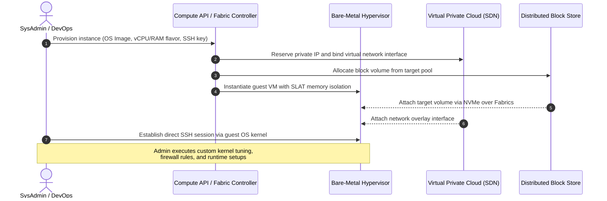
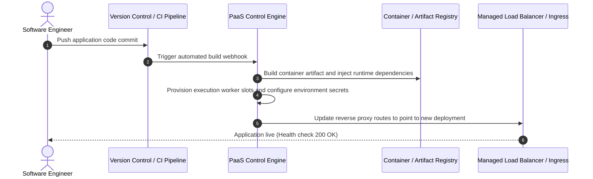
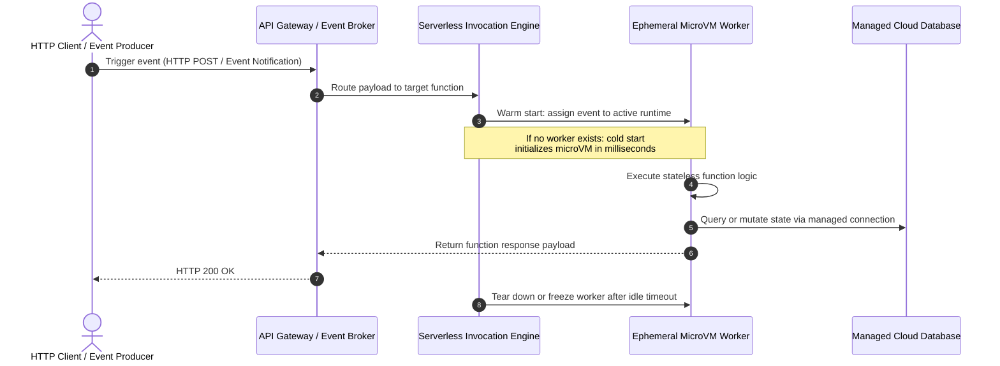
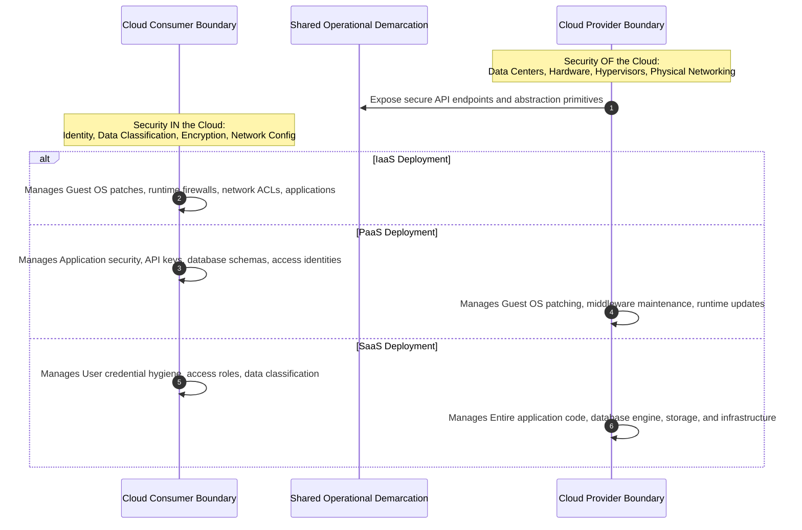

# **Lesson 2: Cloud Service Models**

Cloud computing delivers compute, storage, and application capabilities through distinct abstraction layers classified as Infrastructure as a Service (IaaS), Platform as a Service (PaaS), and Software as a Service (SaaS). Each service model delineates a specific division of administrative control, architectural flexibility, and operational responsibility between the cloud consumer and the cloud service provider. Deciding between these tiers requires balancing customization requirements against operational maintenance overhead and developer productivity.

```mermaid
sequenceDiagram
    autonumber
    actor Dev as Application Architect
    participant IaaS as IaaS Layer (Virtual Compute & Network)
    participant PaaS as PaaS Layer (Runtime Engine & Middleware)
    participant FaaS as FaaS Layer (Serverless Event Handler)
    participant SaaS as SaaS Layer (Fully Managed Application)

    Dev->>IaaS: Provision VM, configure Linux kernel, mount block volume
    Note over IaaS: Consumer controls OS, runtime,<br/>patches, and networking stack
    Dev->>PaaS: Deploy compiled container artifact or source code bundle
    Note over PaaS: Provider manages OS and runtime;<br/>Consumer controls application logic
    Dev->>FaaS: Register stateless event handler function (code only)
    Note over FaaS: Provider manages execution lifecycle,<br/>event routing, and scale-to-zero
    Dev->>SaaS: Configure tenant policies, identities, and datasets via API
    Note over SaaS: Provider operates entire stack;<br/>Consumer consumes software interface
```

## **The Cloud Service Abstraction Hierarchy**

Cloud architectures establish functional boundaries by systematically abstracting physical hardware, operating systems, execution runtimes, and user interfaces. The standard service models defined by the National Institute of Standards and Technology (NIST SP 800-145) organize these boundaries into three foundational tiers, complemented by event-driven execution paradigms.

```mermaid
sequenceDiagram
    autonumber
    participant OnPrem as On-Premises Stack
    participant IaaS as Infrastructure as a Service
    participant PaaS as Platform as a Service
    participant SaaS as Software as a Service

    Note over OnPrem: Consumer manages Hardware, Network, OS, Runtime, Data, Application
    OnPrem->>IaaS: Offload hardware, virtualization, and physical networking
    Note over IaaS: Consumer retains OS, Middleware, Runtime, Data, Application
    IaaS->>PaaS: Offload OS, kernel patching, database engines, and runtime
    Note over PaaS: Consumer retains Application Logic and Data
    PaaS->>SaaS: Offload application runtime, code execution, and data storage systems
    Note over SaaS: Provider manages full stack; Consumer manages identity and access
```

### Infrastructure as a Service (IaaS)

- Delivers fundamental computing primitives including virtualized server instances, raw block storage volumes, software-defined network topologies, and firewall rule tables.
- Consumers retain administrative root access over the guest operating system, granting total configuration authority over kernel parameters, local storage file systems, and installed software dependencies.
- Cloud providers maintain the underlying physical data center infrastructure, host virtualization hypervisors, hardware reliability, and physical network switching fabrics.
- Common implementations include Amazon Elastic Compute Cloud (EC2), Google Compute Engine (GCE), and Azure Virtual Machines.

### Platform as a Service (PaaS)

- Exposes pre-configured runtime environments, application engines, and managed middleware layers without requiring consumer administration of the underlying operating system or virtual machine instances.
- Software engineering teams package application code or container images, delegating operating system patch management, language runtime upgrades, and web server clustering to the cloud control plane.
- Eliminates low-level maintenance burdens but limits the execution environment to supported runtime engines, language versions, and configuration frameworks.
- Common implementations include AWS Elastic Beanstalk, Google App Engine, and Azure App Services.

### Software as a Service (SaaS)

- Delivers end-user software applications hosted and operated entirely within the provider infrastructure, accessible over the internet via thin client web browsers or programmatic REST APIs.
- The provider manages every structural layer of the technology stack, spanning data center facilities, hypervisors, server operating systems, application runtime binaries, and patch release cycles.
- Consumers interact with the system strictly through high-level administrative configurations, tenant profile parameters, and role-based access control assignments.
- Common implementations include Microsoft 365, Google Workspace, and Salesforce.

> [!Important]
> **Abstraction versus control trade-off**: As workloads advance from IaaS toward SaaS, the consumer reduces operational management overhead while sacrificing fine-grained control over underlying operating system configurations, execution dependencies, and host architectures.

## **Infrastructure as a Service (IaaS) Mechanics**

IaaS provisions compute resources by packaging isolated virtual instances directly on top of physical host hypervisors. This tier provides maximum architectural flexibility, enabling organizations to replicate bespoke on-premises architectures inside public cloud environments.



### Compute and Storage Orchestration

- **Virtual Machine Flavors**: Compute instances present predefined ratios of virtual CPUs to physical memory, tailored for compute-optimized, memory-optimized, or accelerated graphics processing tasks.
- *Block storage decoupling*: High-performance storage is separated from instance compute nodes, communicating over low-latency storage network fabrics to maintain persistent disk volumes that outlive the lifecycle of individual virtual compute instances.
- **Operating System Control**: Engineers select the exact Linux distribution or Windows Server release, configure system daemons, tune networking parameters, and control file system encryption settings.

### Networking and Security Isolation

- **Virtual Private Clouds (VPC)**: IaaS provides dedicated software-defined virtual networks with private IPv4 and IPv6 subnet ranges, route tables, and internet gateway attachments.
- Security groups function as stateful distributed firewalls at the virtual network interface level, enforcing ingress and egress traffic filtering before packets reach the guest operating system.
- Network Access Control Lists (NACLs) act as stateless subnet-level boundaries to filter malicious network traffic across entire network segments.

> [!Tip]
> **Stateful versus stateless network filtering**: Pair stateful security groups with stateless subnet NACLs to implement defense-in-depth across IaaS instances without incurring guest operating system processing penalties.

## **Platform as a Service (PaaS) and Container Platforms**

PaaS shifts operational focus away from infrastructure administration and redirects engineering resources toward application business logic, continuous integration, and rapid automated delivery.



### Runtime Abstraction and Lifecycle Automation

- *Managed runtimes*: Platforms natively execute standard development environments such as Node.js, Python, Java, Go, and .NET without requiring manual virtual machine provisioning or patch automation.
- Automated horizontal scaling evaluates incoming HTTP request traffic and system metrics to deploy or terminate runtime worker processes dynamically.
- Built-in zero-downtime deployment pipelines support blue-green transitions, canary releases, and instantaneous rollbacks to prior code revisions.

### Container as a Service (CaaS) as Modern PaaS

- Modern cloud platforms frequently expose PaaS capabilities through managed container orchestration systems such as managed Kubernetes.
- Developers declare runtime configurations through declarative specifications (such as Kubernetes manifests), abstracting physical server infrastructure while retaining container runtime immutability.
- Cloud providers manage the control plane nodes, etcd state stores, and cluster scheduling systems, while automating worker node auto-scaling and repair.
- Common implementations include Amazon Elastic Kubernetes Service (EKS), Google Kubernetes Engine (GKE), and Azure Kubernetes Service (AKS).

> [!Important]
> **Architectural portability considerations**: Container-based PaaS solutions reduce proprietary vendor lock-in risks by allowing container images to migrate across hybrid cloud environments and competing hyperscale providers without modifying application code.

## **Function as a Service (FaaS) and Serverless Computing**

Function as a Service represents the highest evolution of compute abstraction, decomposing applications into discrete, ephemeral, event-driven units of execution.



### Event-Driven Execution Mechanics

- Code remains dormant and consumes no billable compute resources until explicitly triggered by inbound events such as HTTP requests, message queue payloads, or object storage uploads.
- *Scale-to-zero capabilities*: The serverless control plane terminates idle execution instances, completely eliminating compute idle expenses during inactive operational intervals.
- The cloud provider provisions microVM sandboxes (such as Firecracker) within milliseconds to process incoming concurrency bursts across distributed execution environments.

### Operational Constraints and Optimization

- **Cold Start Latency**: Spin-up delays occur when an incoming event requires initializing a brand-new container or microVM sandbox, introducing execution latency for initial requests.
- **Execution Time Limits**: Serverless functions enforce strict hard execution timeouts (typically 15 minutes), making them unsuitable for prolonged monolithic background processing tasks.
- **Statelessness Requirements**: Worker instances must not store persistent session state locally, necessitating the offloading of application state to external managed databases or distributed memory caches.

> [!Tip]
> **Mitigating serverless cold starts**: Keep deployment packages lean and minimize heavy initialization libraries, or deploy provisioned concurrency to eliminate microVM initialization latency for time-critical workflows.

## **The Shared Responsibility Model**

The Shared Responsibility Model establishes the structural and legal boundary between provider security obligations and consumer operational duties. Failing to correctly map security obligations across specific service models remains a primary cause of cloud configuration failures.



### Security OF the Cloud (Provider Obligations)

- Physical data center facility protection, environmental controls, biometric access restrictions, and physical hardware disposal protocols.
- Host hypervisor hardening, firmware integrity updates, physical network cabling maintenance, and foundational storage fabric isolation.
- Compliance certifications for low-level infrastructure operations, such as ISO/IEC 27001, SOC 2 Type II, and PCI-DSS bare-metal compliance.

### Security IN the Cloud (Consumer Obligations)

- **Identity and Access Management (IAM)**: Enforcing least-privilege role assignments, multi-factor authentication (MFA), and credential rotation schedules.
- **Data Protection and Encryption**: Implementing cryptographic mechanisms to safeguard data at rest (via KMS keys) and data in transit (via TLS 1.3 encryption).
- **Workload Configuration**: Patching guest operating systems in IaaS environments, securing container image dependencies in PaaS environments, and setting correct user role privileges in SaaS platforms.

> [!Important]
> **Data ownership remains absolute**: Across every cloud service model from IaaS to SaaS, the consumer retains ultimate legal responsibility for data classification, account access credentials, and regulatory compliance.

## **Comparative Matrix of Cloud Service Models**

| Dimension | On-Premises Infrastructure | Infrastructure as a Service (IaaS) | Platform as a Service (PaaS) | Function as a Service (FaaS) | Software as a Service (SaaS) |
|---|---|---|---|---|---|
| **Primary Abstraction Unit** | Physical bare-metal server | Virtual machine instance | Application runtime container | Stateless function execution | Turnkey end-user software |
| **Consumer Control Scope** | Complete hardware and software control | Operating system, network rules, application | Application code and database schemas | Stateless code and event trigger bindings | User accounts, data, and access roles |
| **Provider Control Scope** | Zero (fully on-premises) | Physical silicon, hypervisors, facilities | Operating system, middleware, runtime | Scaling, server provisioning, runtime | Complete technology stack and application |
| **Scaling Mechanism** | Manual hardware procurement | Dynamic horizontal virtual machine auto-scaling | Automated runtime container instance scaling | Instantaneous event-driven scale-to-zero | Completely opaque internal scaling |
| **Billing Granularity** | Fixed capital depreciation | Per-second or per-hour instance reservation | Per-minute or per-hour application tier | Per-millisecond execution duration | Per-seat or per-tenant monthly license |
| **Vendor Lock-in Risk** | Low (internal standard) | Low (portable across hypervisors) | Medium to High (proprietary runtimes) | High (proprietary event brokers) | Very High (proprietary proprietary data schemas) |
| **Maintenance Burden** | High (hardware, OS, network, apps) | Moderate (OS patching, runtime tuning) | Low (application code and configuration) | Minimal (function code optimization) | Negligible (user administration only) |
| **Representative Examples** | Private enterprise data center | AWS EC2, Azure VM, GCE | AWS Elastic Beanstalk, Heroku, EKS | AWS Lambda, Google Cloud Functions | Salesforce, Workday, Microsoft 365 |

## **Key Takeaways**

- **Service models represent abstraction boundaries**: Moving from IaaS to PaaS, FaaS, and SaaS systematically shifts administrative overhead from the customer to the cloud platform.
- **IaaS maximizes architectural control**: By providing raw compute, block storage, and software-defined network interfaces, IaaS suits complex enterprise workloads that require customized kernel configurations.
- **PaaS accelerates software engineering**: Delegating operating system maintenance, container runtime configuration, and platform patching allows development teams to focus strictly on building application logic.
- **FaaS delivers granular event execution**: Serverless execution architectures automatically scale to zero during idle periods, billing strictly for execution time measured in milliseconds.
- **The Shared Responsibility Model dictates security posture**: Cloud consumers are never relieved of data protection and access management obligations, regardless of the service model deployed.
- **Model selection balances agility and portability**: Higher abstractions accelerate speed to market, but increase proprietary API coupling and architectural switching costs.

> [!Important]
> **Service model alignment dictates architectural success**: Select IaaS when systems demand granular operating system tuning, PaaS when maximizing feature delivery speed, FaaS for asynchronous event bursts, and SaaS when standard market software satisfies business requirements.
