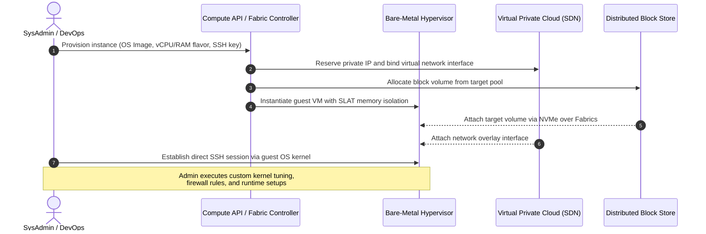
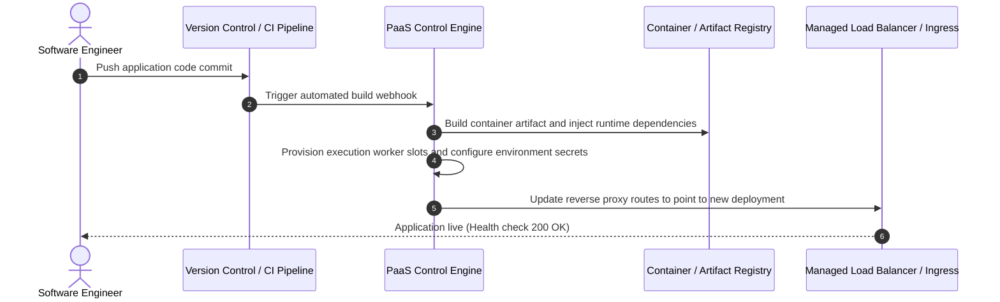

# Migration in progress
# **Lesson 2: Cloud Service Models**

Cloud computing delivers compute, storage, and application capabilities through distinct abstraction layers classified as Infrastructure as a Service (IaaS), Platform as a Service (PaaS), and Software as a Service (SaaS). Each service model delineates a specific division of administrative control, architectural flexibility, and operational responsibility between the cloud consumer and the cloud service provider. Deciding between these tiers requires balancing customization requirements against operational maintenance overhead and developer productivity.

```mermaid
sequenceDiagram
    autonumber
    actor Dev as Application Architect
    participant IaaS as IaaS Layer (Virtual Compute & Network)
    participant PaaS as PaaS Layer (Runtime Engine & Middleware)
    participant FaaS as FaaS Layer (Serverless Event Handler)
    participant SaaS as SaaS Layer (Fully Managed Application)

    Dev->>IaaS: Provision VM, configure Linux kernel, mount block volume
    Note over IaaS: Consumer controls OS, runtime,<br/>patches, and networking stack
    Dev->>PaaS: Deploy compiled container artifact or source code bundle
    Note over PaaS: Provider manages OS and runtime;<br/>Consumer controls application logic
    Dev->>FaaS: Register stateless event handler function (code only)
    Note over FaaS: Provider manages execution lifecycle,<br/>event routing, and scale-to-zero
    Dev->>SaaS: Configure tenant policies, identities, and datasets via API
    Note over SaaS: Provider operates entire stack;<br/>Consumer consumes software interface
```

## **The Cloud Service Abstraction Hierarchy**

Cloud architectures establish functional boundaries by systematically abstracting physical hardware, operating systems, execution runtimes, and user interfaces. The standard service models defined by the National Institute of Standards and Technology (NIST SP 800-145) organize these boundaries into three foundational tiers, complemented by event-driven execution paradigms.

```mermaid
sequenceDiagram
    autonumber
    participant OnPrem as On-Premises Stack
    participant IaaS as Infrastructure as a Service
    participant PaaS as Platform as a Service
    participant SaaS as Software as a Service

    Note over OnPrem: Consumer manages Hardware, Network, OS, Runtime, Data, Application
    OnPrem->>IaaS: Offload hardware, virtualization, and physical networking
    Note over IaaS: Consumer retains OS, Middleware, Runtime, Data, Application
    IaaS->>PaaS: Offload OS, kernel patching, database engines, and runtime
    Note over PaaS: Consumer retains Application Logic and Data
    PaaS->>SaaS: Offload application runtime, code execution, and data storage systems
    Note over SaaS: Provider manages full stack; Consumer manages identity and access
```

### Infrastructure as a Service (IaaS)

- Delivers fundamental computing primitives including virtualized server instances, raw block storage volumes, software-defined network topologies, and firewall rule tables.
- Consumers retain administrative root access over the guest operating system, granting total configuration authority over kernel parameters, local storage file systems, and installed software dependencies.
- Cloud providers maintain the underlying physical data center infrastructure, host virtualization hypervisors, hardware reliability, and physical network switching fabrics.
- Common implementations include Amazon Elastic Compute Cloud (EC2), Google Compute Engine (GCE), and Azure Virtual Machines.

### Platform as a Service (PaaS)

- Exposes pre-configured runtime environments, application engines, and managed middleware layers without requiring consumer administration of the underlying operating system or virtual machine instances.
- Software engineering teams package application code or container images, delegating operating system patch management, language runtime upgrades, and web server clustering to the cloud control plane.
- Eliminates low-level maintenance burdens but limits the execution environment to supported runtime engines, language versions, and configuration frameworks.
- Common implementations include AWS Elastic Beanstalk, Google App Engine, and Azure App Services.

### Software as a Service (SaaS)

- Delivers end-user software applications hosted and operated entirely within the provider infrastructure, accessible over the internet via thin client web browsers or programmatic REST APIs.
- The provider manages every structural layer of the technology stack, spanning data center facilities, hypervisors, server operating systems, application runtime binaries, and patch release cycles.
- Consumers interact with the system strictly through high-level administrative configurations, tenant profile parameters, and role-based access control assignments.
- Common implementations include Microsoft 365, Google Workspace, and Salesforce.

> [!Important]
> **Abstraction versus control trade-off**: As workloads advance from IaaS toward SaaS, the consumer reduces operational management overhead while sacrificing fine-grained control over underlying operating system configurations, execution dependencies, and host architectures.

## **Infrastructure as a Service (IaaS) Mechanics**

IaaS provisions compute resources by packaging isolated virtual instances directly on top of physical host hypervisors. This tier provides maximum architectural flexibility, enabling organizations to replicate bespoke on-premises architectures inside public cloud environments.



### Compute and Storage Orchestration

- **Virtual Machine Flavors**: Compute instances present predefined ratios of virtual CPUs to physical memory, tailored for compute-optimized, memory-optimized, or accelerated graphics processing tasks.
- *Block storage decoupling*: High-performance storage is separated from instance compute nodes, communicating over low-latency storage network fabrics to maintain persistent disk volumes that outlive the lifecycle of individual virtual compute instances.
- **Operating System Control**: Engineers select the exact Linux distribution or Windows Server release, configure system daemons, tune networking parameters, and control file system encryption settings.

### Networking and Security Isolation

- **Virtual Private Clouds (VPC)**: IaaS provides dedicated software-defined virtual networks with private IPv4 and IPv6 subnet ranges, route tables, and internet gateway attachments.
- Security groups function as stateful distributed firewalls at the virtual network interface level, enforcing ingress and egress traffic filtering before packets reach the guest operating system.
- Network Access Control Lists (NACLs) act as stateless subnet-level boundaries to filter malicious network traffic across entire network segments.

> [!Tip]
> **Stateful versus stateless network filtering**: Pair stateful security groups with stateless subnet NACLs to implement defense-in-depth across IaaS instances without incurring guest operating system processing penalties.

## **Platform as a Service (PaaS) and Container Platforms**

PaaS shifts operational focus away from infrastructure administration and redirects engineering resources toward application business logic, continuous integration, and rapid automated delivery.



### Runtime Abstraction and Lifecycle Automation

- *Managed runtimes*: Platforms natively execute standard development environments such as Node.js, Python, Java, Go, and .NET without requiring manual virtual machine provisioning or patch automation.
- Automated horizontal scaling evaluates incoming HTTP request traffic and system metrics to deploy or terminate runtime worker processes dynamically.
- Built-in zero-downtime deployment pipelines support blue-green transitions, canary releases, and instantaneous rollbacks to prior code revisions.

### Container as a Service (CaaS) as Modern PaaS

- Modern cloud platforms frequently expose PaaS capabilities through managed container orche