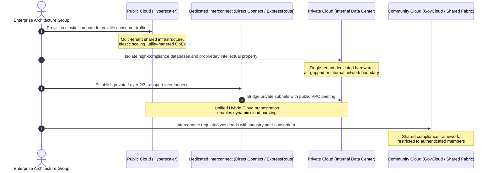
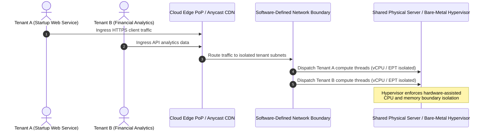
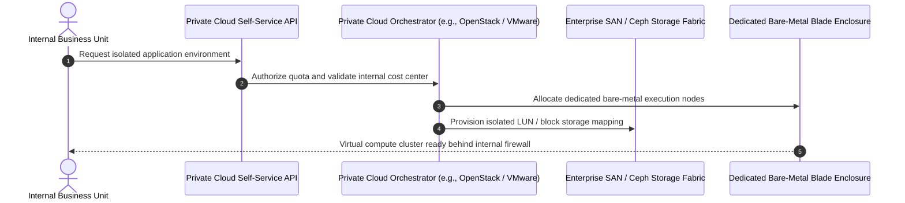

# Migration in progress
# **Lesson 3: Cloud Deployment Models**

Cloud deployment models define the specific environment configurations, tenancy architectures, and physical hosting locations that govern how computing infrastructure is provisioned, accessed, and managed. The primary deployment models categorized by the National Institute of Standards and Technology (NIST SP 800-145) include public, private, hybrid, and community clouds, alongside emerging multi-cloud operational strategies. Selecting the appropriate deployment model requires an analysis of data sovereignty, compliance constraints, network latency parameters, and capital expenditure versus operational cost dynamics.



## **The Public Cloud Deployment Model**

The public cloud model delivers computing infrastructure, runtimes, and services over the public internet or private dedicated links, using shared multi-tenant physical hardware operated entirely by commercial hyperscalers.



### Operational Architecture and Tenancy

- Infrastructure components are owned, administered, and maintained by external cloud service providers across global availability zones and regional data centers.
- Physical compute nodes, hypervisors, and core distribution switches run multi-tenant architectures, isolating workloads via hardware-assisted CPU modes and software-defined network overlays.
- Elasticity handles sudden traffic spikes by dynamically provisioning thousands of virtual compute instances within minutes without requiring upfront capital procurement.

### Economic and Security Characteristics

- Financial modeling relies strictly on operational expenditure (OpEx), replacing hardware capital amortization with pay-as-you-go utility billing.
- Security configurations rely on provider hardware compliance certifications (SOC 2, ISO 27001), while consumers enforce configuration hygiene via cloud access policies.
- Latency and data residency may be subject to regional routing variations and international regulatory jurisdictions.

> [!Important]
> **Data jurisdiction risks**: Public cloud deployments store data across distributed physical facilities, requiring explicit geographic data pinning to prevent cross-border compliance violations under frameworks like GDPR and HIPAA.

## **The Private Cloud Deployment Model**

A private cloud provides dedicated computing, storage, and network infrastructure provisioned for exclusive use by a single organization, consisting of multiple internal business units or subsidiaries.



### Hosting Topologies and Administration

- **On-Premises Private Cloud**: The infrastructure resides within the organization's own corporate data center facilities, managed directly by internal systems administration teams.
- **Hosted (Managed) Private Cloud**: A third-party service provider builds, hosts, and operates dedicated, single-tenant hardware within an external facility, handling hardware lifecycle maintenance while preserving single-tenant isolation.
- Orchestration frameworks such as OpenStack, VMware Cloud Foundation, and Red Hat OpenShift turn internal enterprise servers into an automated utility platform.

### Control and Financial Realities

- Grants engineering teams total authority over hardware selection, customized network topologies, storage fabrics, and physical perimeter access control.
- Satisfies strict regulatory and air-gapped security mandates that prohibit shared physical infrastructure or public internet connectivity.
- Requires substantial initial capital expenditure (CapEx) for physical servers, specialized cooling, backup generators, network switching, and ongoing infrastructure engineering salaries.

> [!Tip]
> **Optimizing private cloud return on investment**: Use private clouds for predictable, high-volume workloads operating with steady-state capacity to avoid hyperscaler resource-reservation premiums and ongoing data egress fees.

## **The Hybrid Cloud Model and Cloud Bursting**

Hybrid cloud integrates at least one private computing environment with one or more public cloud platforms, using standardized management tooling and dedicated network bridges to facilitate workload and data portability.

```mermaid
sequenceDiagram
    autonumber
    actor User as Inbound Customer Traffic
    participant Router as Global Traffic Router / DNS
    participant OnPrem as Private Cloud (Baseline Capacity)
    participant Public as Public Cloud (Burst Compute Capacity)
    participant DirectConnect as Dedicated Hybrid Interconnect (Direct Connect)

    User->>Router: Standard operational HTTP query
    Router->>OnPrem: Route request to steady-state private servers
    Note over OnPrem: Private infrastructure operates<br/>at 85% maximum threshold
    User->>Router: Massive traffic spike (Holiday / Flash Sale)
    Router->>Public: Cloud Burst: Spillover traffic routed to public instances
    Public->>DirectConnect: Secure low-latency database queries
    DirectConnect->>OnPrem