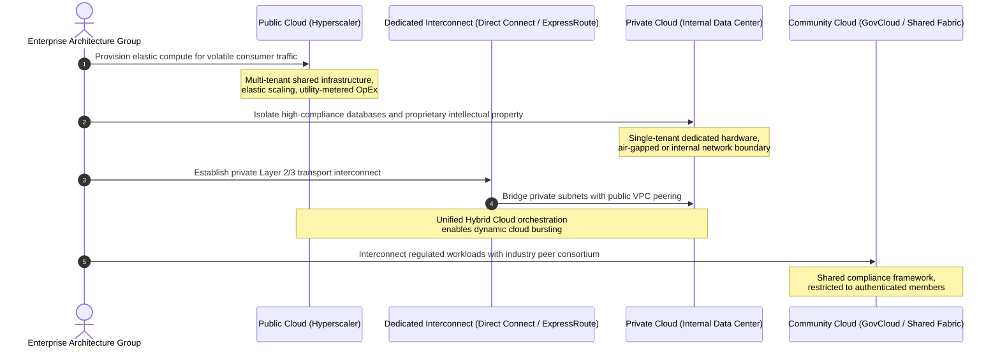
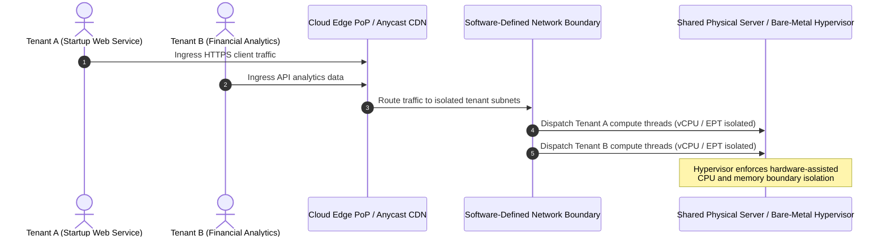
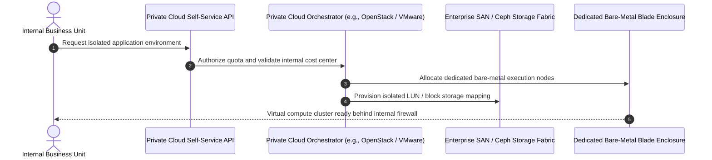
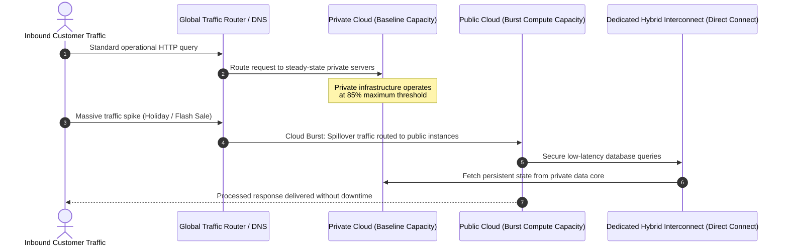
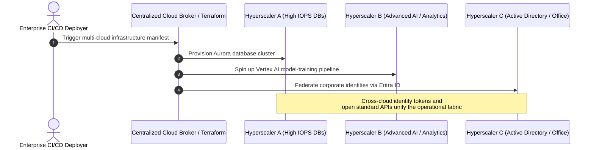

# **Lesson 3: Cloud Deployment Models**

Cloud deployment models define the specific environment configurations, tenancy architectures, and physical hosting locations that govern how computing infrastructure is provisioned, accessed, and managed. The primary deployment models categorized by the National Institute of Standards and Technology (NIST SP 800-145) include public, private, hybrid, and community clouds, alongside emerging multi-cloud operational strategies. Selecting the appropriate deployment model requires an analysis of data sovereignty, compliance constraints, network latency parameters, and capital expenditure versus operational cost dynamics.

## **The Public Cloud Deployment Model**

The public cloud model delivers computing infrastructure, runtimes, and services over the public internet or private dedicated links, using shared multi-tenant physical hardware operated entirely by commercial hyperscalers.

### Operational Architecture and Tenancy

- Infrastructure components are owned, administered, and maintained by external cloud service providers across global availability zones and regional data centers.
- Physical compute nodes, hypervisors, and core distribution switches run multi-tenant architectures, isolating workloads via hardware-assisted CPU modes and software-defined network overlays.
- Elasticity handles sudden traffic spikes by dynamically provisioning thousands of virtual compute instances within minutes without requiring upfront capital procurement.

### Economic and Security Characteristics

- Financial modeling relies strictly on operational expenditure (OpEx), replacing hardware capital amortization with pay-as-you-go utility billing.
- Security configurations rely on provider hardware compliance certifications (SOC 2, ISO 27001), while consumers enforce configuration hygiene via cloud access policies.
- Latency and data residency may be subject to regional routing variations and international regulatory jurisdictions.

> [!Important]
> **Data jurisdiction risks**: Public cloud deployments store data across distributed physical facilities, requiring explicit geographic data pinning to prevent cross-border compliance violations under frameworks like GDPR and HIPAA.

## **The Private Cloud Deployment Model**

A private cloud provides dedicated computing, storage, and network infrastructure provisioned for exclusive use by a single organization, consisting of multiple internal business units or subsidiaries.

### Hosting Topologies and Administration

- **On-Premises Private Cloud**: The infrastructure resides within the organization's own corporate data center facilities, managed directly by internal systems administration teams.
- **Hosted (Managed) Private Cloud**: A third-party service provider builds, hosts, and operates dedicated, single-tenant hardware within an external facility, handling hardware lifecycle maintenance while preserving single-tenant isolation.
- Orchestration frameworks such as OpenStack, VMware Cloud Foundation, and Red Hat OpenShift turn internal enterprise servers into an automated utility platform.

### Control and Financial Realities

- Grants engineering teams total authority over hardware selection, customized network topologies, storage fabrics, and physical perimeter access control.
- Satisfies strict regulatory and air-gapped security mandates that prohibit shared physical infrastructure or public internet connectivity.
- Requires substantial initial capital expenditure (CapEx) for physical servers, specialized cooling, backup generators, network switching, and ongoing infrastructure engineering salaries.

> [!Tip]
> **Optimizing private cloud return on investment**: Use private clouds for predictable, high-volume workloads operating with steady-state capacity to avoid hyperscaler resource-reservation premiums and ongoing data egress fees.

## **The Hybrid Cloud Model and Cloud Bursting**

Hybrid cloud integrates at least one private computing environment with one or more public cloud platforms, using standardized management tooling and dedicated network bridges to facilitate workload and data portability.

### Hybrid Connectivity Topologies

- **Dedicated Physical Interconnects**: Direct fiber links (such as AWS Direct Connect, Azure ExpressRoute, or Google Cloud Interconnect) deliver low-latency Layer 2 and Layer 3 connections that bypass the public internet.
- **IPsec VPN Overlays**: Encrypted software tunnels link private gateways with cloud virtual private gateways, providing an economical alternative to dedicated dark fiber circuits.
- **Hybrid Data Meshes**: Storage caching appliances and object-replication mechanisms synchronize persistent database states across private arrays and cloud storage buckets.

### Cloud Bursting and Disaster Recovery

- *Cloud bursting*: Workloads operate on local private infrastructure during baseline utilization periods, dynamically offloading excess compute tasks to public cloud instances when internal utilization crosses a critical threshold.
- *Disaster recovery architectures*: Private primary environments maintain warm-standby or cold-standby configurations inside public cloud availability zones, minimizing recovery time objectives (RTO) without maintaining duplicate data center real estate.

> [!Important]
> **Egress cost considerations**: Hybrid cloud architectures frequently encounter unexpected operational expenses when high-throughput workloads generate continuous outbound network traffic crossing from public clouds back to private facilities.

## **Community Cloud and Multi-Cloud Frameworks**

Organizations with specialized mission profiles frequently extend beyond standard public or private constructs to deploy specialized community platforms or heterogeneous multi-cloud environments.

### Community Cloud Mechanics

- Shared infrastructure engineered for exclusive use by a specific consortium of organizations with identical security policies, regulatory mandates, or operational missions.
- Managed by participating consortium members or a third-party managed provider, with governance costs divided across participating organizations.
- Examples include federal systems (such as AWS GovCloud or Azure Government for defense compliance) and inter-hospital medical networks sharing health records under specialized privacy controls.

### Multi-Cloud Strategic Drivers

- **Vendor Independence**: Prevents exclusive architectural lock-in to a single hyperscaler API ecosystem, retaining leverage during enterprise contract negotiations.
- **Best-of-Breed Feature Allocation**: Pairs specialized proprietary capabilities from different providers, such as executing complex machine learning pipelines on one platform while hosting core business logic on another.
- **Geographic and Regulatory Coverage**: Fulfills local data residency statutes across diverse international regions where a single cloud provider may lack physical data center availability zones.
- **Complexity Trade-Offs**: Requires engineering teams to maintain proficiency across disparate networking concepts, security models, identity engines, and infrastructure-as-code state files.

> [!Tip]
> **Minimizing multi-cloud complexity**: Rely on open-source, cloud-agnostic abstraction layers such as Kubernetes, OpenTelemetry, and Terraform to standardize deployment mechanics across divergent cloud provider platforms.

## **Comparative Matrix of Cloud Deployment Models**

| Dimension | Public Cloud | Private Cloud | Hybrid Cloud | Community Cloud | Multi-Cloud Strategy |
|---|---|---|---|---|---|
| **Tenancy Type** | Multi-tenant shared infrastructure | Strictly single-tenant dedicated hardware | Mixed (single-tenant private, multi-tenant public) | Multi-tenant restricted to authorized peer group | Heterogeneous across multiple public providers |
| **Financial Profile** | Pure operational cost (OpEx, pay-as-you-go) | Substantial upfront capital expense (CapEx) | Blended CapEx and OpEx cost model | Shared CapEx/OpEx split across members | Complex OpEx across disparate provider bills |
| **Scalability Horizon** | Virtually unbounded, instantaneous | Bound by physical hardware capacity | Scalable via public cloud bursting | Bound by pooled consortium capacity | Massive, combining multiple provider global scales |
| **Deployment Complexity** | Low (instantaneous API provisioning) | High (procurement, cabling, hypervisor setup) | Very High (interconnects, routing, identity sync) | High (multi-party governance agreements) | Extremely High (disparate APIs and IAM models) |
| **Data Sovereignty & Governance** | Provider-managed within regional availability zones | Absolute internal control within own facilities | Segmented (sensitive data kept private) | Shared industry-specific regulatory boundary | Distributed across distinct jurisdictions |
| **Network Architecture** | Public internet and VPC peering endpoints | Isolated internal LAN, SAN, and corporate WAN | Dedicated Layer 2/3 interconnects and IPsec VPNs | Restricted community networks and private VPNs | Inter-cloud WAN meshes and Transit Gateways |
| **Representative Examples** | AWS, Microsoft Azure, Google Cloud Platform | On-premises OpenStack, VMware vSphere datacenter | AWS Direct Connect linked to corporate VMware farm | AWS GovCloud, Healthcare HIE Cloud networks | Workloads split across AWS, GCP, and Azure |

## **Key Takeaways**

- **Deployment models define tenancy boundaries**: Public, private, hybrid, and community models establish where physical computing infrastructure resides, who manages the hardware, and how resources are shared.
- **Public clouds maximize elasticity**: Hyperscale providers eliminate capital hardware procurement cycles and deliver instant horizontal scale through multi-tenant virtualized data centers.
- **Private clouds prioritize sovereignty**: Dedicated single-tenant infrastructure delivers total architectural control, deterministic latency, and compliance isolation at the expense of high capital expenditure.
- **Hybrid clouds bridge environments**: Integrating private platforms with public clouds provides cloud bursting resilience, optimized capacity planning, and flexible data residency.
- **Direct network links stabilize hybrid topologies**: Production hybrid clouds depend on low-latency, private Layer 2 and Layer 3 connections rather than unpredictable public internet routing.
- **Multi-cloud mitigates vendor lock-in**: Deploying across multiple distinct cloud providers provides access to best-of-breed services and regulatory compliance, but increases operational overhead.

> [!Important]
> **Workload characteristics dictate deployment choice**: Match steady-state, highly regulated datasets to private cloud environments, while allocating unpredictable, internet-facing traffic spikes to elastic public cloud platforms.
