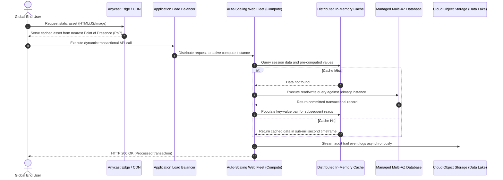
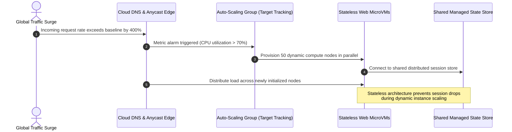
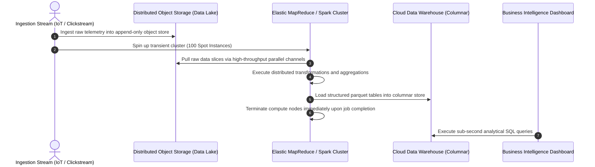
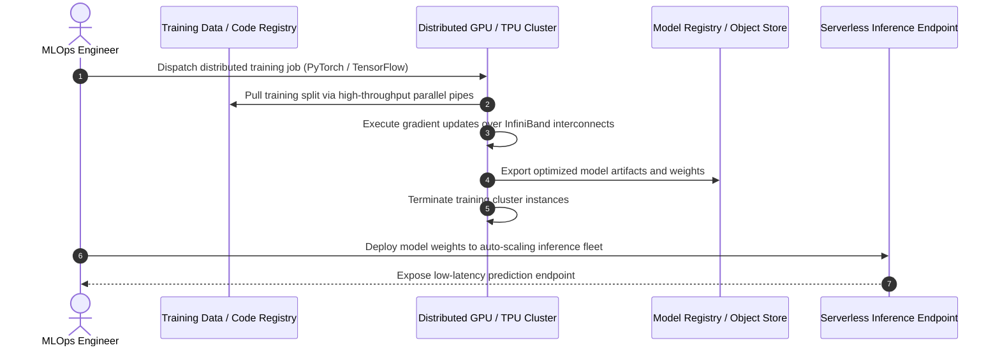

# **Lesson 4: Cloud Computing Use Cases**

Cloud computing enables organizations to transform theoretical operational advantages into production systems across diverse technological domains. Modern enterprises leverage elastic infrastructure to deploy globally distributed web applications, execute petabyte-scale data analytics, automate disaster recovery topologies, and train complex machine learning models. Analyzing these implementation patterns reveals how decoupling compute from persistent storage provides high availability, fault tolerance, and cost efficiency.



## **Cloud-Native Web Applications and Global Content Distribution**

Modern web platforms replace monolithic, single-server designs with distributed, decoupled microservice topologies engineered to survive physical infrastructure failures.



### Elastic Autoscaling and High Availability

- *Stateless compute tiers*: Web servers retain zero client session state locally on instance disks, storing authentication tokens and temporary sessions in centralized, high-throughput caching engines.
- **Horizontal Pod and Instance Scaling**: Metric monitoring systems track incoming request volumes, CPU consumption, or queue depths to add or terminate virtual compute instances automatically.
- Multi-Availability Zone (Multi-AZ) distribution positions duplicate application tiers across geographically distinct data centers, providing automatic failover if a localized facility experiences a power or network interruption.

### Edge Caching and Latency Optimization

- Content Delivery Networks (**CDNs**) position hundreds of Points of Presence (PoPs) at the perimeter of the global internet, caching static images, videos, and scripts physically close to end users.
- Anycast routing protocols direct client DNS queries to the nearest edge location, minimizing round-trip times (RTT) and absorbing distributed denial-of-service (DDoS) traffic surges before requests hit origin servers.
- Dynamic route optimization accelerates API calls back to origin data centers by steering traffic over dedicated provider-owned fiber backbones instead of congested public internet corridors.

> [!Tip]
> **State externalization accelerates scaling**: Extract all user session states into distributed in-memory clusters (such as Redis or Memcached) to allow web instances to scale up or down instantaneously without severing user sessions.

## **Big Data Processing and High-Performance Analytics**

Cloud platforms eliminate the capital burden of purchasing on-premises supercomputers, allowing organizations to assemble massive, temporary computing clusters to execute petabyte-scale analytics jobs.



### Storage and Compute Decoupling

- Traditional big data architectures (such as legacy Hadoop HDFS) coupled physical hard drives directly to local CPUs, requiring expensive overprovisioning of compute to gain disk capacity.
- Modern cloud data lakes store raw unstructured, semi-structured, and structured datasets in durable, highly scalable object storage systems (such as AWS S3, Google Cloud Storage, or Azure Blob Storage).
- Compute frameworks (such as Apache Spark, Trino, and Presto) spin up on-demand to process datasets directly from object storage, tearing down worker nodes immediately after completing the workload.

### Batch and Stream Processing Patterns

- *Batch architectures*: Systems collect transactions over fixed intervals, executing high-throughput analytical transformations across millions of records during scheduled processing windows.
- *Stream processing*: Real-time message streaming brokers (such as Apache Kafka, AWS Kinesis, or Google Pub/Sub) ingest continuous sensor, log, or telemetry events, computing rolling metrics with single-digit millisecond latencies.
- Columnar data warehouses structure data by column rather than row, running vectorized parallel queries that scan petabytes of records without scanning irrelevant fields.

> [!Important]
> **Ephemeral cluster cost optimization**: Deploy transient analytics worker nodes using spot or preemptible instances to run fault-tolerant data transformation pipelines at substantial discounts compared to on-demand pricing.

## **Disaster Recovery and Business Continuity Architectures**

Cloud-based disaster recovery (DR) uses hyperscale global infrastructure to deliver continuous operational continuity without requiring redundant physical data center facilities.

```mermaid
sequenceDiagram
    autonumber
    participant Prod as Primary Production Region
    participant Storage as Cross-Region Data Replication
    participant DR as Disaster Recovery Region (Standby)
    participant DNS as Global Traffic Routing / Failover

    Prod->>Storage: Asynchronously replicate transactional write logs
    Note over DR: Pilot Light: Database running at minimum size;<br/>Application compute fleet remains dormant
    Prod->>Prod: Primary region suffers catastrophic regional outage
    DNS->>DR: Health checks fail; DNS routes traffic to DR endpoints
    DR->>DR: Auto-Scaling group launches full web and compute fleet
    DR->>DR: Scale up database compute capacity to production sizing
    DR-->>DNS: Secondary region fully operational (RTO achieved)
```

### Business Continuity Metrics

- **Recovery Point Objective (RPO)**: The maximum acceptable data loss measured backwards in time from the moment an outage occurs, determining data synchronization frequency.
- **Recovery Time Objective (RTO)**: The maximum acceptable duration of infrastructure downtime before service restoration must be completed.

### Structural Disaster Recovery Tiers

- **Backup and Restore**: Systems regularly compress and encrypt system snapshots and database backups to remote cloud object storage. RPO and RTO span multiple hours or days, delivering the most economical recovery tier.
- **Pilot Light**: The critical core data tier (such as a database cluster) is maintained live and continuously replicated in a standby region. Application and web servers remain dormant as saved images, launching via automation only during an actual disaster event.
- **Warm Standby**: A functional, scaled-down duplicate of the entire infrastructure operates continuously in the secondary region. During failovers, auto-scaling groups rapidly increase instance counts to handle full production traffic.
- **Multi-Region Active-Active**: Fully redundant, production-scaled environments operate concurrently across distinct geographic regions, processing live user requests simultaneously via global Anycast or latency-based DNS routing. RPO and RTO approach near-zero timeframes.

> [!Tip]
> **Automating failover testing**: Implement chaos engineering experiments and periodic automated DNS failover drills to verify that secondary standby infrastructure provisions cleanly before an actual regional outage occurs.

## **Artificial Intelligence and Distributed Machine Learning**

Artificial intelligence and deep learning workflows demand massive, non-linear computing performance, driving cloud providers to deliver hardware architectures built specifically for matrix multiplication.



### High-Performance Hardware Allocation

- **Accelerated Computing**: Cloud environments provide on-demand access to specialized accelerator hardware, including Graphics Processing Units (GPUs) and Tensor Processing Units (TPUs) optimized for deep neural network operations.
- Ultra-low latency network fabrics (such as InfiniBand or custom Elastic Fabric Adapters) connect compute nodes, preventing network throughput bottlenecks during multi-node distributed model training.
- Ephemeral provisioning allows teams to access hundreds of high-performance accelerators for several days during training, terminating the cluster as soon as model weights converge.

### Machine Learning Operations (MLOps) Pipelines

- Automated orchestration pipelines manage data ingestion, feature transformation, hyperparameter optimization, distributed model training, and model evaluation.
- Managed inference endpoints deploy optimized model artifacts behind scalable API gateways, dynamically scaling instances in response to inbound prediction volume.
- Model monitoring tools track operational performance, inference latency, and data drift, triggering automated retraining jobs when real-world data patterns diverge from training baselines.

> [!Important]
> **Decoupling training from inference**: Separate heavy GPU training clusters from lightweight inference endpoints, scaling inference nodes independently on cost-effective CPU or low-power accelerator instances.

## **Enterprise Migration Strategies: The 6 Rs Framework**

Migrating legacy enterprise portfolios to cloud environments requires categorizing each application according to structural architectural complexity and long-term business value.

```mermaid
sequenceDiagram
    autonumber
    actor PMO as Migration Assessment Team
    participant Inventory as Application Portfolio Assessment
    participant Rehost as Rehost (Lift-and-Shift)
    participant Replatform as Replatform (Lift-and-Reshape)
    participant Refactor as Refactor (Cloud-Native Redesign)

    PMO->>Inventory: Analyze application dependencies, OS versions, and compliance
    Inventory->>Rehost: Simple VM export/import; zero code modifications
    Note over Rehost: Fastest migration velocity;<br/>retains technical debt
    Inventory->>Replatform: Migrate local DB to Managed Database; retain code
    Note over Replatform: Reduces OS maintenance;<br/>minimal engineering effort
    Inventory->>Refactor: Decompose monolithic code into microservices/serverless
    Note over Refactor: Maximum agility and scalability;<br/>highest initial time investment
```

### The Six Migration Pathways

- **Rehost (Lift-and-Shift)**: Migrates virtual machines and physical servers directly to cloud IaaS without changing underlying application code or operating system configurations. Delivers the fastest migration velocity while retaining legacy architectural constraints.
- **Replatform (Lift-and-Reshape)**: Introduces minor operational optimizations without altering the core application code, such as swapping self-hosted database engines for cloud-managed equivalents (like Amazon RDS or Cloud SQL).
- **Refactor / Rearchitect**: Re-engineers the application from the ground up to adopt cloud-native features, microservices, containerized runtimes, and serverless execution models. Delivers peak scalability and operational resilience at the cost of high development overhead.
- **Repurchase (Drop-and-Shop)**: Abandons existing internal systems and transitions functionality directly to an off-the-shelf Software as a Service (SaaS) platform (such as migrating on-premises Microsoft Exchange to Microsoft 365).
- **Retire**: Identifies and decommissions obsolete, redundant, or low-value applications that no longer serve strategic enterprise objectives, reducing attack surface and licensing overhead.
- **Retain**: Leaves mission-critical legacy applications on-premises without intervention, typically due to extreme migration risks, recent on-premises hardware investments, or complex regulatory compliance mandates.

> [!Important]
> **Avoid long-term stagnation on lift-and-shift**: Rehosting provides immediate migration velocity to meet data center exit deadlines, but organizations must subsequent modernizations (replatforming or refactoring) to eliminate technical debt and avoid inflated operational costs.

## **Comparative Matrix of Disaster Recovery Strategies**

| Dimension | Backup and Restore | Pilot Light | Warm Standby | Multi-Region Active-Active |
|---|---|---|---|---|
| **Recovery Point Objective (RPO)** | Hours to Days | Minutes to Hours | Seconds to Minutes | Near Zero (Continuous Sync) |
| **Recovery Time Objective (RTO)** | 24+ Hours (Rebuild required) | 1 to 2 Hours (Fleet spin-up) | 10 to 30 Minutes (Scale-up fleet) | Sub-Second / Near Zero |
| **Cost Profile** | Extremely Low (Storage costs only) | Low (Minimal active database) | Moderate (Scaled-down duplicate fleet) | Extremely High (Full redundant infrastructure) |
| **Architectural Complexity** | Minimal (Standard backup scripts) | Moderate (Automated AMI deployment) | High (Continuous auto-scaling logic) | Very High (Bi-directional data synchronization) |
| **Operational State in Standby Region** | Idle; data stored in backup archives | Database live; compute nodes off | Fully operational at minimum capacity | Fully operational at full production capacity |
| **Failover Mechanism** | Manual restore and DNS recreation | Automated orchestration scripts | Automated health-check scale triggers | Automated Anycast or latency-based DNS routing |

## **Comparative Matrix of Enterprise Migration Strategies (The 6 Rs)**

| Strategy | Migration Velocity | Initial Development Effort | Cloud-Native Advantages | Long-Term Operational Cost | Typical Architectural Candidate |
|---|---|---|---|---|---|
| **Rehost** | Rapid | Negligible (Configuration only) | Minimal (Runs as static VM) | Higher (Unoptimized resource allocation) | Legacy enterprise applications, data center exits |
| **Replatform** | Moderate | Low (Database/infrastructure swap) | Moderate (Managed runtime benefits) | Moderate (Reduced administrative overhead) | Core systems with swappable backend dependencies |
| **Refactor** | Slow | Very High (Complete code rewrite) | Maximum (Auto-scaling, serverless) | Lowest (Optimized resource consumption) | Core business systems requiring high scalability |
| **Repurchase** | Fast to Moderate | Low (Data migration only) | High (SaaS provider managed) | Variable (Predictable recurring licensing) | Generic commodity workflows (CRM, Email, HR) |
| **Retire** | Immediate | Zero (Decommission project) | None (Eliminates system entirely) | Zero (Removes infrastructure and licensing) | Obsolete tools with duplicate functionality |
| **Retain** | Zero | Zero (Workload remains unchanged) | None (Remains in private datacenter) | High (Ongoing CapEx and facility upkeep) | Air-gapped mainframes, fresh on-premises hardware |

## **Key Takeaways**

- **Cloud use cases rely on decoupled architectures**: Successful deployments across web apps, analytics, and machine learning separate ephemeral compute capacity from durable, highly available storage layers.
- **Autoscaling and edge caching eliminate traffic bottlenecks**: Modern web architectures pair Anycast CDN networks with horizontally scalable stateless microservices to absorb massive traffic surges without manual intervention.
- **Big data workloads thrive on transient compute**: Decoupling object stores from processing clusters allows organizations to spin up massive distributed analytics jobs on-demand and tear them down immediately upon task completion.
- **Disaster recovery strategies balance cost against downtime**: Choosing between Backup and Restore, Pilot Light, Warm Standby, and Multi-Region Active-Active requires evaluating operational business survival against infrastructure run costs.
- **Accelerated silicon fuels modern machine learning**: Cloud platforms deliver scalable GPU and TPU fabrics interconnected with ultra-low latency networking to execute complex distributed model training without capital investments.
- **The 6 Rs framework guides enterprise migrations**: Systematic application modernization classifies legacy workloads across Rehost, Replatform, Refactor, Repurchase, Retire, and Retain pathways based on operational complexity and strategic business value.

> [!Important]
> **Use case alignment dictates technical design**: Infrastructure choices must stem directly from workload requirements; deploying complex active-active multi-region systems for non-critical workloads creates unnecessary operational complexity and excessive cost.
